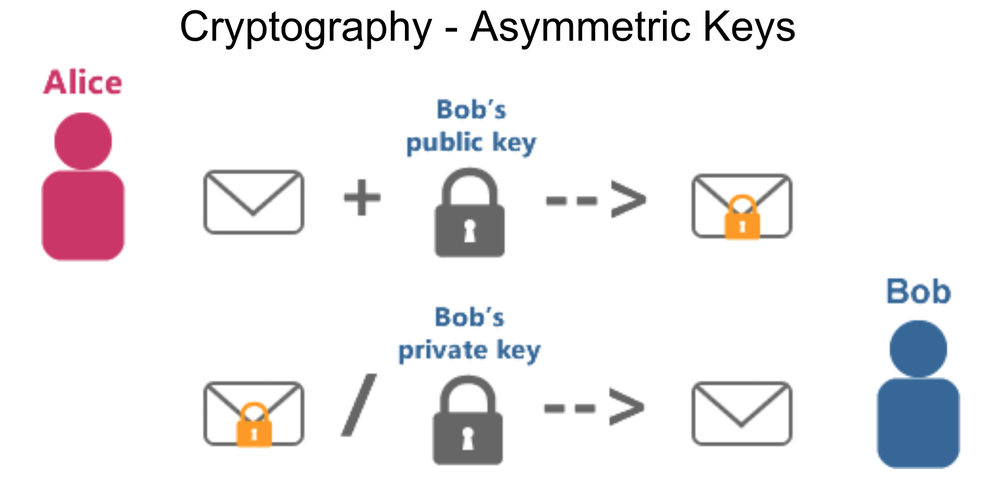
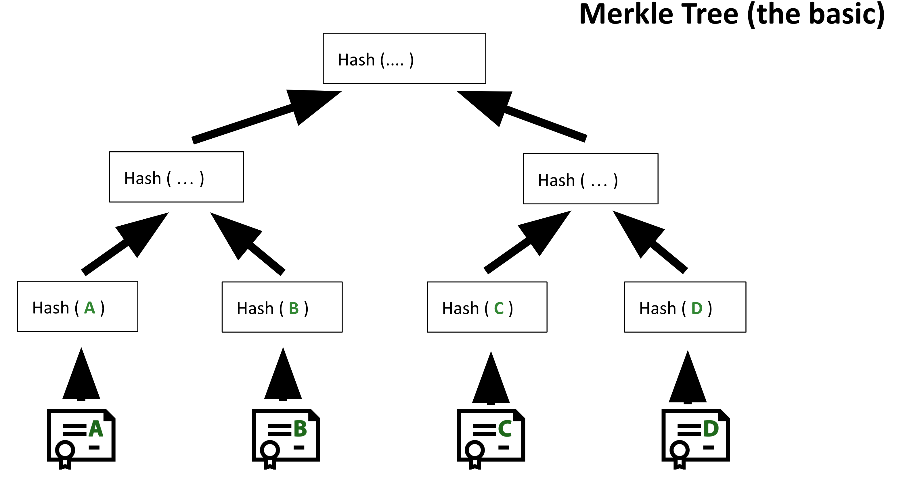
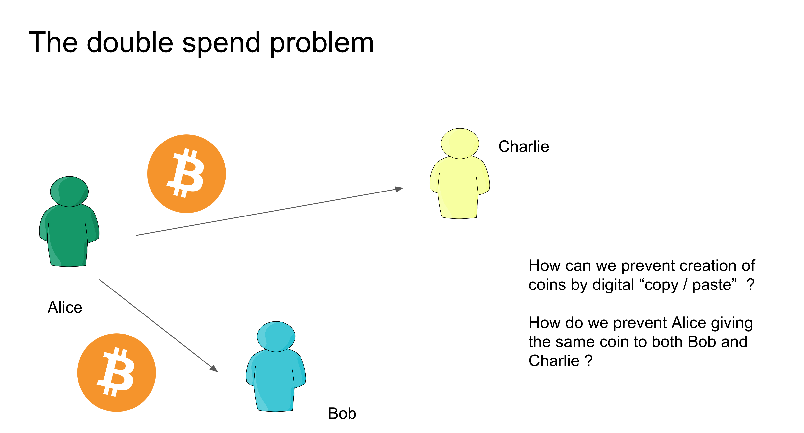
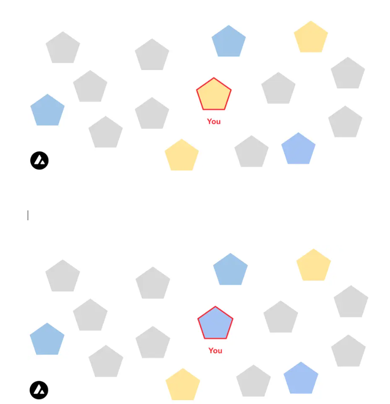

# Decentralised Systems

## Problems with Centralised Systems

Centralised systems, especially in the context of monetary institutions, exhibit several weaknesses that decentralised systems aim to solve.

### Monetary System Issues

- **Bank Closure / Insufficient Capital Reserves**  
  In extreme financial crises, banks may close unexpectedly.  
  _Example:_ During the **Greek debt crisis in 2015**, banks shut down, people lost access to savings, and government-backed insurance schemes failed to provide relief. This catalyzed a rise in **Bitcoin adoption** in Greece.

- **Availability of Banks**  
  Not everyone has consistent or fair access to banking services—especially in underserved or politically unstable regions.


- **Inflation**  
  Central banks control the money supply, often leading to inflation through over-issuance of currency.

- **Merchant Account Censorship**  
  Businesses can have their **merchant accounts arbitrarily shut down**, disrupting livelihoods and operations.

- **Political Control Over Money**  
  Governments can restrict financial access for political reasons.  
  _Example:_ **Wikileaks** experienced funding blockades by major financial services like PayPal, Visa, and Mastercard.

- **Security Through Restriction**  
  Traditional banks rely on **layers of access control** to prevent fraud. This results in a closed and heavily monitored financial network, trading off openness and flexibility.

---

## Goals of Decentralisation

Decentralised systems aim to address the flaws of centralised models by promoting:

- **Participation**  
  Anyone can join and contribute without requiring permission from a central authority.

- **Diversity**  
  A variety of actors and systems reduces the risk of systemic failure and monopoly control.

- **Conflict Resolution**  
  Disputes are handled through transparent protocols and community governance rather than opaque institutional decisions.

- **Flexibility**  
  Adaptability is built in. Decentralised systems evolve with community needs and can fork or upgrade without requiring total system overhauls.

- **Moving Power to the Edge**  
  Decision-making authority is shifted from centralized institutions to **end-users**, empowering individuals over institutions.

---

#  Blockchain Timeline

## 1970s — The Foundations

In the 1970s, the early conceptual groundwork for blockchain technology began to emerge. The key focus during this period was on **security in digital communication**.

### Problem: Security!

Two critical questions defined the era:

**1. How do I ensure that my message has not been modified?**  
   - This is the problem of **integrity**.
   - A solution emerged in the form of **cryptographic hashing** — converting data into a fixed-length string that changes completely with even a small alteration.

     
**2. How do I ensure that the message comes from a legitimate person?**  
   - This is the problem of **authenticity**.
   - It led to the development of **digital signatures** and **public-key cryptography**.
   

### Technologies Developed

- **Hash Functions**  
  E.g., SHA (Secure Hash Algorithm) family — used to verify data integrity.

- **Public-Key Cryptography (Asymmetric Encryption)**  
  Developed by Whitfield Diffie and Martin Hellman in 1976. Allowed secure key exchange over public channels.

- **Digital Signatures**  
  Enabled verification that a message was created by a known sender.

These innovations laid the foundation for future systems like **blockchains**, which rely on cryptographic tools to provide secure, immutable, and verifiable records of data and transactions.

---

# Cryptography Foundations

## Pre-1970s: Symmetric Cryptography

### Symmetric Key Encryption

- **Definition**: Both sender and receiver share a **single secret key**.
- **How it works**:
  - The same key is used for **both encryption and decryption**.
  - Example: Alice and Bob use the same key to encrypt/decrypt messages.

### Problem: Key Management

How can Alice and Bob share a key:

- **Without meeting physically?**
- **Over an insecure or hostile network?**

> Symmetric cryptography assumes a secure way to exchange the key—which was a major limitation before the 1970s.

---

## 1970s Breakthrough: Asymmetric Cryptography

A major step forward came with the invention of **asymmetric cryptography** (also known as **public-key cryptography**).

### Public-Key Cryptography

- Two keys:
  - **Public Key**: Used for **encryption**.
  - **Private Key**: Used for **decryption**.
- Solves the problem of sharing secrets across insecure channels.



---

## Diffie-Hellman Key Exchange

Developed to allow the creation of a **shared secret** between two parties without needing to share any private information.

- **Goal**: Derive a mutual key over a public channel.
- **Analogy**: Mixing colors:
  - Each party chooses a private color and mixes it with a public color.
  - After exchanging the mixes, they both arrive at the same final color—**the shared secret**.

 See this [Guide](https://github.com/archit-p/simplest-oblivious-transfer) for a visual explanation.


---

##  Digital Signatures

**Digital signatures** were invented to prove the **origin and integrity** of a message.

###  Purpose

- To confirm that a message was indeed sent by the **holder of a specific private key**.

### Example

Bob signs a document and sends it to Alice. Using Bob's public key, Alice verifies the signature.

### Key Properties of Digital Signatures

1. **Authenticity**  
   When Alice verifies the message using Bob’s **public key**, she knows **Bob signed it**.

2. **Unforgeable**  
   Only Bob can create the signature because only he knows his **private key**.

3. **Not Reusable**  
   The signature is **bound to the specific document**—it cannot be copied to another.

4. **Unalterable**  
   If the message is **modified**, the signature will **no longer validate** using Bob's public key.

---

# Hash Functions

## What is a Hash Function?

A **hash function** is a mathematical algorithm that transforms an input (or "message") into a fixed-size string of bytes, typically appearing random.

- The output is called a **hash** or **digest**.
- Used in cryptography, data structures, digital signatures, and blockchains.

### Example

Input:
```
"Hello, world!"
```

SHA-256 Output:
```
a591a6d40bf420404a011733cfb7b190
d62c65bf0bcda32b57b277d9ad9f146e
```

---

## Key Properties of Cryptographic Hash Functions

1. **Deterministic**  
   - Same input always gives the same output.

2. **Fast Computation**  
   - Hashing is computationally efficient.

3. **Pre-image Resistance**  
   - Given a hash, it's *computationally infeasible* to find the original input.
   - Prevents reverse-engineering.

4. **Second Pre-image Resistance**  
   - It's hard to find a different input with the same hash as a given input.

5. **Collision Resistance**  
   - It's infeasible to find two different inputs that produce the same hash.

6. **Avalanche Effect**  
   - A small change in input causes a vastly different output.

---


---

## Common Hash Functions

| Name      | Output Size | Common Use Cases                      |
|-----------|-------------|----------------------------------------|
| MD5       | 128 bits    | Legacy systems, checksums (not secure)|
| SHA-1     | 160 bits    | Deprecated for security               |
| SHA-256   | 256 bits    | Blockchain (e.g., Bitcoin), SSL/TLS   |
| SHA-3     | 256 bits    | Modern secure applications            |
| Keccak256 | 256 bits    | Ethereum smart contracts              |

---

## Applications of Hash Functions

- **Digital Signatures**  
  Hash the message before signing for efficiency.

- **Data Integrity**  
  Compare hashes to detect file or message tampering.

- **Password Storage**  
  Store hashes of passwords, not plaintext.

- **Blockchain**  
  Hashes link blocks immutably and securely.

- **Merkle Trees**  
  Use hashes to efficiently verify large data sets.

---

## Hashing ≠ Encryption

| Feature         | Hashing                  | Encryption                |
|------------------|--------------------------|----------------------------|
| Reversible       | ❌ No                    | ✅ Yes                     |
| Purpose          | Integrity check, ID      | Confidentiality           |
| Key Needed       | ❌ No                    | ✅ Yes (public/private key)|

---

# Merkle Tree

## What is a Merkle Tree?

A **Merkle Tree** (or **hash tree**) is a binary tree structure used to efficiently and securely verify the contents of large data structures.

- Each **leaf node** contains the cryptographic hash of a data block.
- Each **non-leaf node** contains the hash of its two child nodes.
- The **root node** (Merkle root) summarizes all the data in the tree.

---

## Structure of a Merkle Tree

```
        Root Hash
        /      \
     HashA     HashB
     /  \       /  \
 H1   H2     H3   H4
```

- H1, H2, H3, H4 are hashes of individual data blocks.
- HashA = hash(H1 + H2)
- HashB = hash(H3 + H4)
- Root = hash(HashA + HashB)

---



---

## Key Properties

1. **Efficient Verification**
   - Only a small number of hashes are needed to verify any leaf node.
   - Useful for lightweight clients in blockchains.

2. **Tamper Detection**
   - Any change to a leaf will change the root hash, revealing tampering.

3. **Compact Proofs (Merkle Proofs)**
   - You can prove the inclusion of a data element without revealing the entire dataset.

4. **Scalability**
   - Supports large data structures and enables parallel verification.

---

## Merkle Proof (Inclusion Proof)

To prove a leaf is part of the tree:
- Provide the leaf hash.
- Provide the **sibling hashes** on the path to the root.

### Example:
To verify H3 in the tree above, you provide:
- H3 (the leaf)
- H4 (sibling)
- HashA (uncle hash from other side)

Then you compute:
- HashB = hash(H3 + H4)
- Root = hash(HashA + HashB)

Compare it to the known Merkle root.

---

## Applications of Merkle Trees

- **Blockchain (Bitcoin, Ethereum)**
  - Transactions in a block are hashed into a Merkle Tree.
  - Only the Merkle root is stored in the block header.

- **Merkle Proofs in Light Clients**
  - Used to verify transactions without downloading full blocks.

- **Distributed Systems**
  - Verify integrity of files and data across nodes.

- **Git Version Control**
  - Git uses Merkle-like trees to manage and verify file versions.

---

## Security Benefits

- **Immutability**
  - A single change in data causes a change in the Merkle root.

- **Integrity**
  - Ensures the data has not been altered.

- **Efficiency**
  - Quick verification with logarithmic complexity.

---

# Blockchain History Timeline

## 1980s — Cryptographic Foundations

### David Chaum
- **Blind Signatures**: Enabled signing of a message without knowing its content—important for digital privacy.
- **DigiCash**: One of the first digital cash implementations based on cryptographic principles.

---

## 1990s — Early Digital Cash Concepts

### Timestamping Records
- Enabled verifiable proof that a document existed at a specific time.

### Key Figures
- **Adam Back** – Invented **HashCash**, a proof-of-work system used for spam prevention, later influencing Bitcoin mining.
- **Wei Dai** – Proposed **b-money**, an early concept for anonymous, distributed digital currency.

---

## 2000s — Peer-to-Peer and Digital Currency Experiments

### P2P Networks
- Examples: **Freenet**, **Gnutella**, **BitTorrent**.
- Enabled decentralized file sharing and laid the groundwork for blockchain's distributed architecture.

### Further Attempts at Digital Cash
> “The one thing that’s missing is a reliable e-cash, whereby on the internet you can transfer funds from A to B without A knowing B or B knowing A.”  
> — *Milton Friedman, 1999*

### Visionaries
- **Wei Dai** – *b-money* (1998)
- **Nick Szabo** – *Bit Gold* (1998)

---

## 2008–2009 — The Birth of Bitcoin

- **August 2008**: Domain **bitcoin.org** registered.
- **October 2008**: Whitepaper *“Bitcoin: A Peer-to-Peer Electronic Cash System”* by **Satoshi Nakamoto** posted to a cryptography mailing list.
- **January 2009**: Bitcoin software released as open-source; Genesis Block mined.


---

## 2010 — First Real-World Bitcoin Use

- **Laszlo Hanyecz** buys two Papa John’s pizzas for **10,000 BTC**.
- Often referred to as the first known commercial Bitcoin transaction.

---

## General Blockchain Milestones (2009–2024)

### 2014 — **Ethereum** launched
- Introduced smart contracts and a Turing-complete blockchain.

---

### 2017 — **ICO Boom**
- Hundreds of Initial Coin Offerings launched; Ethereum became a major fundraising platform.

---

### 2018 — **Crypto Winter**
- Market crash after ICO hype; many projects failed.

---


### 2020 — **DeFi Summer**
- Explosive growth in Decentralized Finance platforms like Uniswap, Aave, Compound.

---


### 2021 — **NFT & Gaming Boom**
- Rise of NFTs (non-fungible tokens), metaverse, and play-to-earn games like Axie Infinity.

---


### 2022 — **Ethereum Merge**
- Ethereum transitioned from Proof-of-Work to **Proof-of-Stake**, reducing energy consumption by over **99%**.

---


### 2022 — **Another Crypto Winter**
- Market downturn triggered by major collapses and global financial uncertainty.

---

## Recent Events (2022–2024)

### May 2022 — **Terra Luna/UST Collapse**
- Algorithmic stablecoin UST lost its peg.
- Over **$60 billion** in value wiped out.

### November 2022 — **FTX Collapse**
- Crypto exchange FTX, run by **Sam Bankman-Fried**, collapsed amid fraud allegations.

### September 2022 — **Ethereum Merge**
- Ethereum officially switched to Proof-of-Stake consensus.

### 2022–2023 — **Layer 2 Scaling Boom**
- Growth of scaling solutions:
  - **Arbitrum**
  - **Optimism**
  - **zkSync**
  - **Polygon**

These reduced gas fees and improved transaction throughput.

### January 2023 — **Bitcoin Ordinals**
- Introduced NFT-like inscriptions on Bitcoin, sparking debate over network congestion and use.

### 2023–2024 — **Regulatory Crackdowns**
- U.S. SEC targeted major exchanges:
  - **Binance**
  - **Coinbase**
- Increasing regulatory scrutiny worldwide.

### January 2024 — **BlackRock Bitcoin ETF Approved**
- SEC approved multiple **spot Bitcoin ETFs**.
- Signaled institutional acceptance and large capital inflow.

### 2024 — **AI + Crypto Convergence**
- Rise of AI-integrated crypto projects and tokens.
- Significant institutional interest and trading volume observed.

---

# Blockchain Fundamentals 

## Introduction to Blockchain — Components

### Gossip Network
- Peer-to-peer communication where nodes spread data by relaying to their neighbors.

### Shared Public Ledger
- A distributed database where every node has a copy of the entire blockchain.

### Cryptography
- Ensures secure transactions and participant authentication.

### Resulting Properties
- **Transparency**: Publicly verifiable state.
- **Consensus-based Verifiability**
- **Resilience**: Tolerant to partial node failures.
- **Censorship Resistance**
- **Tamper-Proof Interactions**

---

## Blockchain Timeline

### 1980s
- **David Chaum**
  - **Blind Signatures**
  - **DigiCash**

### 1990s
- **Timestamping Records**
- **Adam Back** – HashCash
- **Wei Dai** – B-Money

### 2000s
- **P2P Networks**: Freenet, Gnutella, BitTorrent
- Early digital cash concepts:
  - *1998*: b-money – Wei Dai
  - *1998*: Bit Gold – Nick Szabo
> “The one thing that’s missing is a reliable e-cash…” — *Milton Friedman (1999)*
---


---

# Consensus in Distributed Systems

## Why Consensus?
To solve:
- **Double Spending Problem**: Reuse of same digital tokens.
- **Tampering & Ordering Issues** in an open network.


## Byzantine Fault Tolerance (BFT)

- Tolerates malfunctioning/malicious nodes.
- Works even with imperfect network information.


## The double spend problem




## Synchronization Challenges

- No global clock in decentralized systems.
- Bitcoin & Ethereum: Mining gives ordering.
- **Solana**: Uses **Proof of History** to establish a verifiable order.
- **Hedera Hashgraph**: Uses median timestamps.

---

## Consensus Mechanisms

### Two Key Parts:
1. **Sybil Resistance**: Prevents identity forgery.
2. **Consensus Logic**: Reaches agreement on canonical state.


### Common "Proof-of" Mechanisms
- **Proof of Work**
- **Proof of Stake**
- **Proof of Authority**
- **Proof of History**
- **Proof of Burn**
- **Proof of Elapsed Time**
- **Proof of Spacetime**
- **Proof of Kernel Work** (e.g., Extropy)

---

## Block Production & Finality

### Leader Selection
- PoW: Puzzle-solving race.
- PoS: Verifiable Random Functions (VRF) assign slots.
- Must address **liveness**: What if the leader fails?

### Transaction Inclusion
- Producers choose and order transactions in blocks.

---

## Example Consensus Mechanisms

### pBFT — Practical Byzantine Fault Tolerance
- **From Castro & Liskov (1999)**
- **Requires**: `3f + 1` nodes to tolerate `f` faulty nodes.
- Immediate finality: Once accepted, transaction is final.
- Process:
  1. Request → Leader node
  2. Leader broadcasts → Nodes
  3. Nodes reply → Network
  4. Once `2f + 1` matching responses → consensus
  5. Nodes can replace faulty leaders

  

---

## Nakamoto Consensus

- Used in Bitcoin
- Forks resolved by choosing the **heaviest chain** (most PoW)

---

##  Ethereum Proof of Stake (PoS)

###  Validator Eligibility
- Stake required (ETH) to participate.
- Randomized selection weighted by stake.
- Slashing for malicious behavior.

###  Dual-Part Consensus
1. **LMD-GHOST**: Selects head of the chain.
2. **Casper FFG**: Finalizes blocks for chain inclusion.

---

##  Avalanche Consensus

- (Not elaborated in source, but known for probabilistic finality via repeated subsampled voting)
  


---
