#    Etherscan

Etherscan is a block explorer and analytics platform for Ethereum. It provides insights into blocks, transactions, contracts, and more. It's also a tool for developers to interact with smart contracts and verify deployments.


##    Core Features

###    Blocks
- View mined blocks and their details: miner, gas used, timestamp, and included transactions.

###    Transactions
- Inspect individual transactions, including:
  - Sender and recipient
  - Gas fees
  - Contract calls
  - Status (success or failure)

###    Statistics
- Track Ethereum network activity, including:
  - Gas prices
  - Block time
  - Transaction throughput
  - ETH supply and market data

###    Smart Contracts
- View contract source code (if verified)
- Review ABI, bytecode, and compiler version
- Check contract creator and deployment info

###    Testnet Faucets
- Etherscan provides access to faucets for acquiring testnet ETH.
- Example: [Sepolia Faucet](https://sepolia.etherscan.io/)
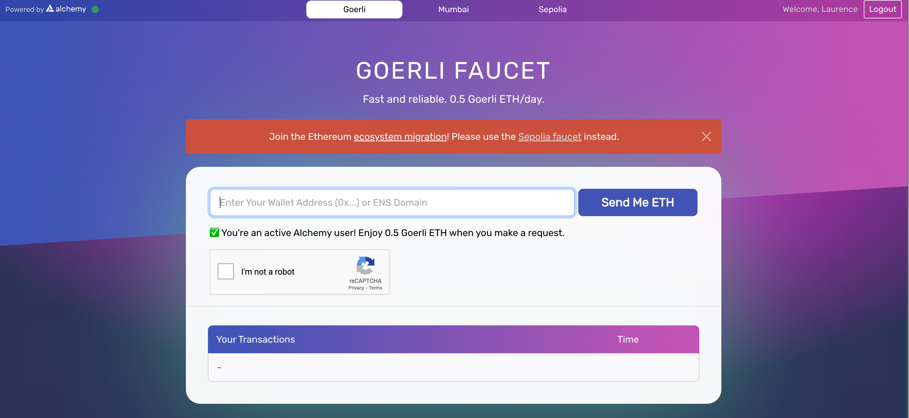

---

##    Interacting with Smart Contracts

###    Web3 Wallet Integration
- Connect a wallet (e.g., MetaMask) directly on Etherscan.
- Allows you to:
  - Read contract data (free)
  - Write to contracts (requires ETH or testnet ETH)

###    Write Functions
- Submit transactions by interacting with public/external contract methods.
- Requires gas and appropriate permissions.
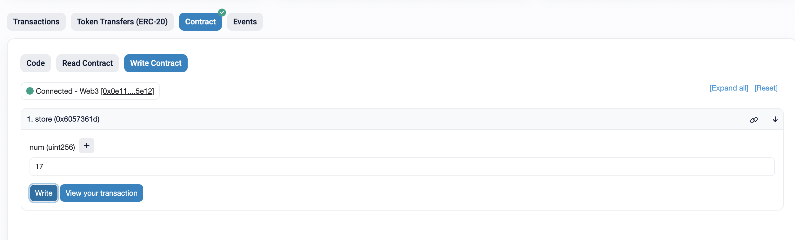

---

## Verifying Smart Contracts

### Why Verify?
- Not required but **highly recommended**:
  - Users trust your contract more.
  - Developers can interact easily via Etherscan.
  - Enables ABI auto-generation and "Write/Read Contract" UI.
  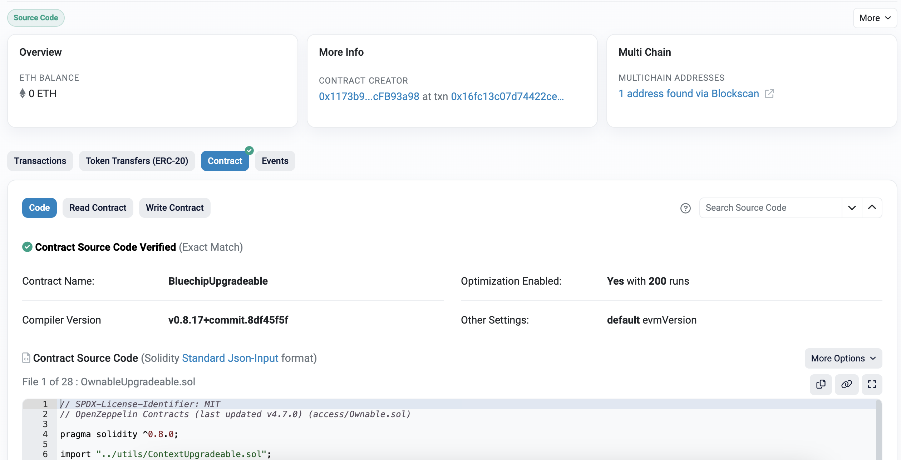

### Verification Options
- **Remix Plugin (Etherscan Plugin)**:
  - Install the Etherscan plugin inside Remix IDE.
  - Generate an **Etherscan API key** (requires account).
  - Use plugin to auto-verify after deployment.
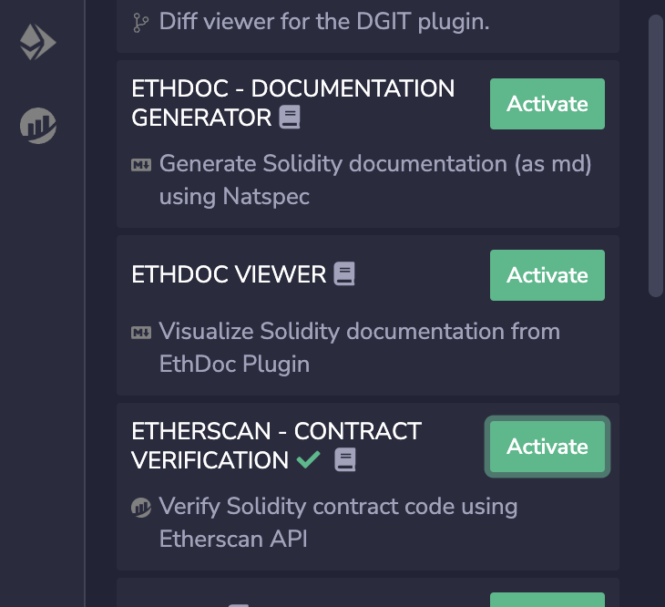
- **Manual Verification**:
  - Navigate to Etherscan → **"Verify and Publish"** section.
  - Enter source code, compiler details, and ABI manually.

---

##  Deployment Workflow Example

1. **Initial Deployment** (e.g., via Remix or Hardhat)
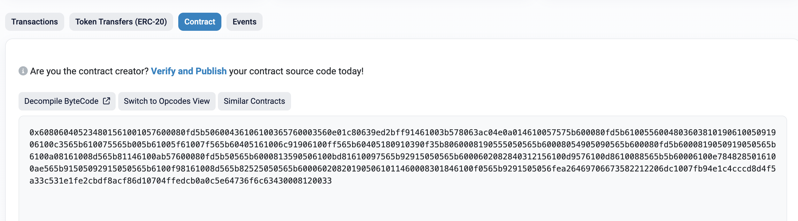
2. **Verification Step**
   - Use Etherscan plugin or manual form.
   - Provide:
     - Contract address
     - Source code
     - Compiler version
     - License type
     - Optimization settings

3. **Post Verification**
   - Contract source becomes visible on Etherscan.
   - Users and tools can interact directly through Etherscan UI.

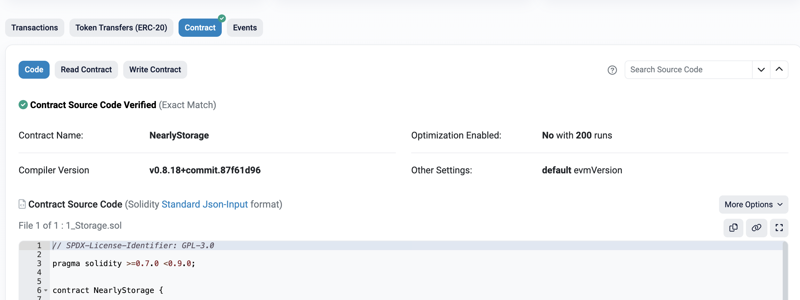

##  Getting an Etherscan API Key

1. Create an account at [etherscan.io](https://etherscan.io)
2. Navigate to **API Key** section in your dashboard.
3. Generate a key (free tier available).
4. Use this key in:
   - Remix Plugin
   - Hardhat/Foundry verification scripts
   - Analytics integrations

---
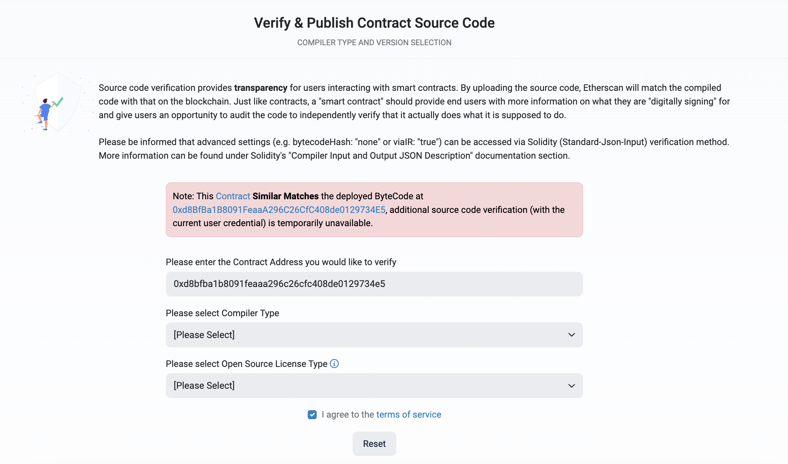

---

#  Vibe Coding 

Vibe Coding is an intuitive and spontaneous style of programming focused on creativity and rapid prototyping, often without strict planning or structure. It's popular among artists, hackers, and learners exploring new ideas quickly.

---

##  Advantages

- **Fast Prototyping**  
  Quickly implement ideas without worrying about structure or architecture.

- **Creative Flow State**  
  Keeps momentum and motivation high during coding sessions.

- **Lower Barrier to Start**  
  Reduces procrastination and eliminates "blank page" paralysis.

- **Exploratory Learning**  
  Encourages discovery through trial-and-error rather than rigid planning.

- **Flexibility**  
  Easy to change directions or try new techniques on the fly.

- **Fun Factor**  
  Makes coding more playful, engaging, and personally rewarding.

---

##  Disadvantages

- **Technical Debt**  
  The resulting code usually requires significant cleanup and refactoring.

- **Poor Scalability**  
  Difficult to scale up or maintain as the project grows in size and complexity.

- **Lack of Documentation**  
  Often misses proper comments and documentation during fast-paced development.

- **Inconsistent Patterns**  
  Style and structure may vary wildly, reducing codebase coherence.

- **Harder Collaboration**  
  Others may find it hard to read, understand, or contribute to the code.

- **Bug-Prone**  
  Lack of systematic testing leads to more frequent bugs and unexpected behaviors.

- **Scope Creep**  
  Without planning, it's easy to drift away from original goals or overbuild.

- **Performance Issues**  
  Often prioritizes "just working" over optimization or best practices.

---

##  Best Use Cases

-  Hackathons and Game Jams  
  Perfect for fast, creative output under time constraints.

-    Personal Projects and Experiments  
  Ideal when exploring ideas for fun or learning.

-  Learning New Technologies  
  Great for rapid, hands-on experimentation without setup overhead.

-  Early-Stage Prototypes  
  Build MVPs to test core ideas before scaling.

-  Creative Coding and Art Projects  
  Encourages expressive, free-form programming in artistic contexts.


---

# Introduction to Remix

Remix is an IDE for Solidity development. It can run in the browser, or on the desktop.

- **Browser**: [https://remix.ethereum.org/](https://remix.ethereum.org/)
- **Desktop**:  
  To install Remix on your local machine, use:

```bash
npm install -g @remix-project/remixd
```
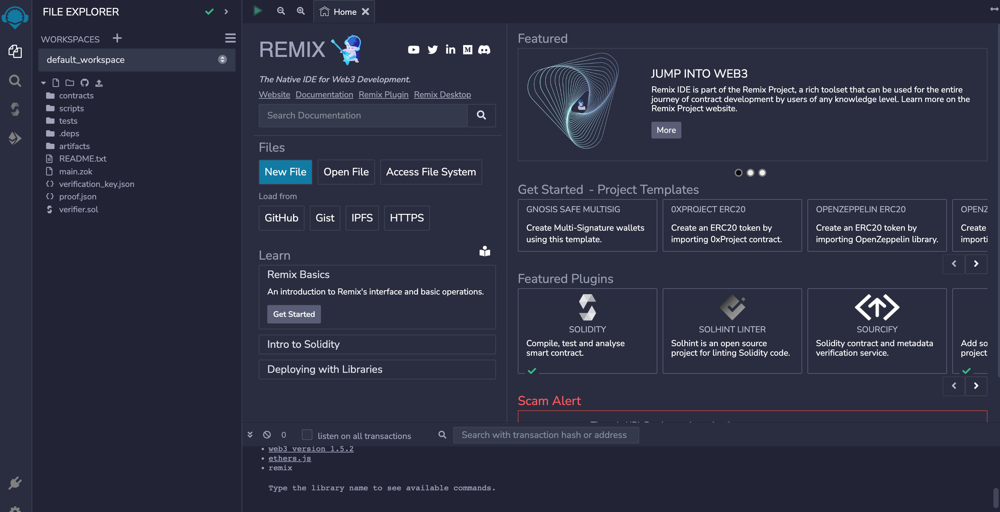

---

## Remix Documentation

Comprehensive documentation is available within the Remix environment, often accessible via the **Help** or **Docs** plugins.

---

## Plugins

The panel on the left allows us to add plugins to extend Remix functionality.

Some useful plugins include:

- **Solidity Compiler**: For compiling smart contracts.
- **Deploy & Run Transactions**: For deploying and interacting with contracts.
- **Solidity Unit Testing**: For writing and executing tests.

The **File Explorer** within this panel also allows us to navigate between the contracts we are working on.

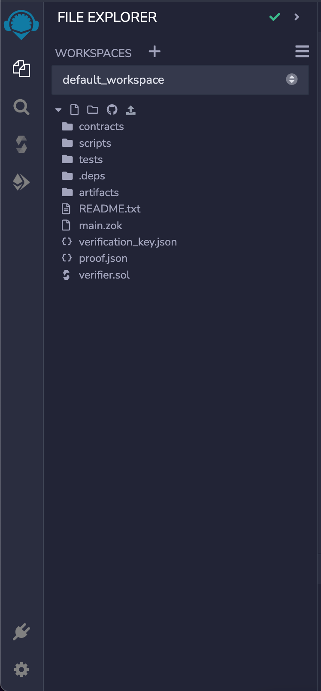
---

## Editor Panel

This is where we edit our smart contracts.

Features include:

- Syntax highlighting for Solidity.
- Error and warning indicators.
- Auto-complete and IntelliSense.
- Support for multiple files and tabs.

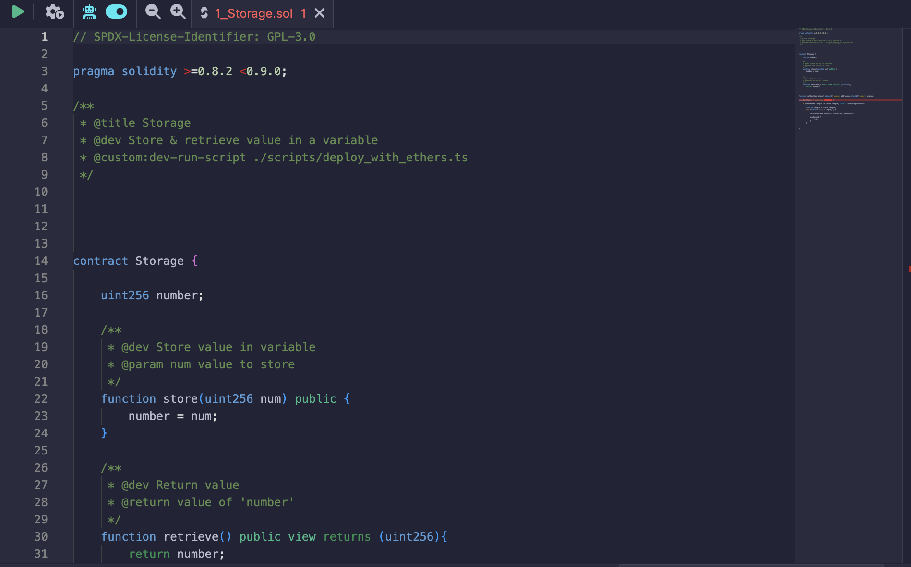

---

## Output Panel

The output panel shows:

- Activity on your local or test blockchain.
- Compilation results.
- Transaction logs.
- Error messages and console outputs.
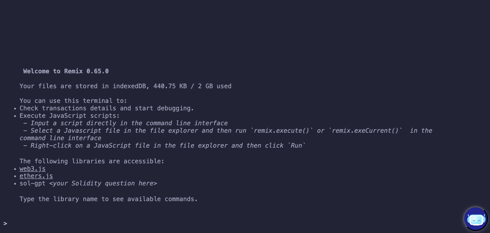
---

## Compiling the Contract

To compile a contract:

1. Click the **Solidity Compiler** icon (represented by a Solidity logo) in the left-hand panel.
2. Choose the appropriate compiler version.
3. Check the auto-compile option if desired.
4. Click the **Compile** button.

If successful, the compilation result will appear in the output panel.
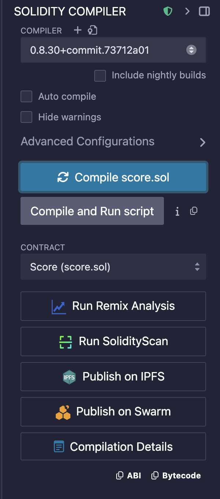
---

## Deploying a Contract

To deploy a compiled contract:

1. Click the **Deploy & Run Transactions** icon in the left-hand panel.
2. In the new panel, choose the correct environment under the **Environment** dropdown.
3. Select the desired contract from the dropdown list.
4. Click the **Deploy** button.
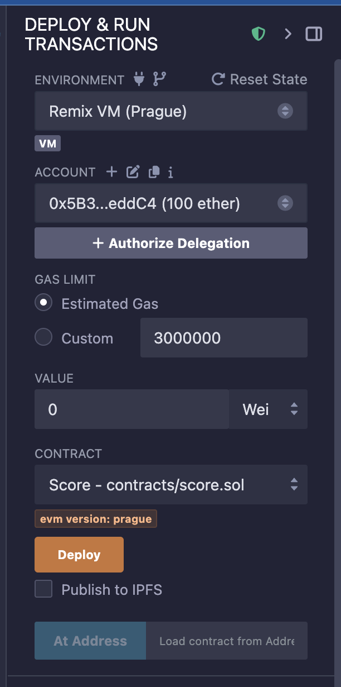

---
# Choosing the Network / Environment

When initially developing contracts, it is recommended to use the simplest environment provided by Remix.

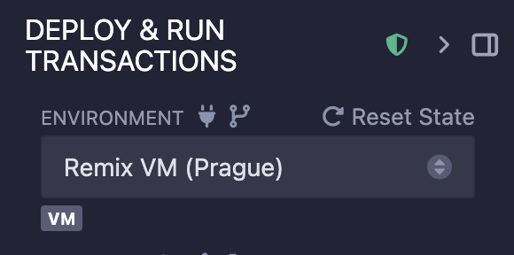

## Steps to Deploy a Contract

1. Select the **Deploy & Run Transactions** plugin from the left panel.
2. In the **Environment** dropdown, choose:
   - **Remix VM (Prague)** – this is the easiest to use and requires no external connections.
3. In the **Contract** dropdown list, select the contract you wish to deploy.
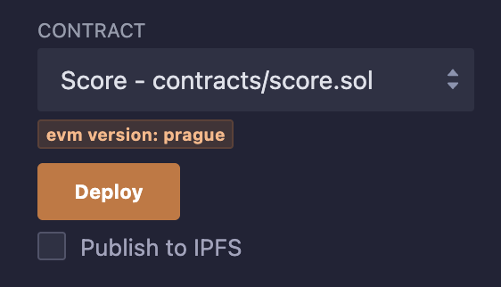

4. Click the **Deploy** button to deploy the selected contract.

## After Deployment

- If the contract deploys correctly, the **Output Window** will display the results of the transaction.
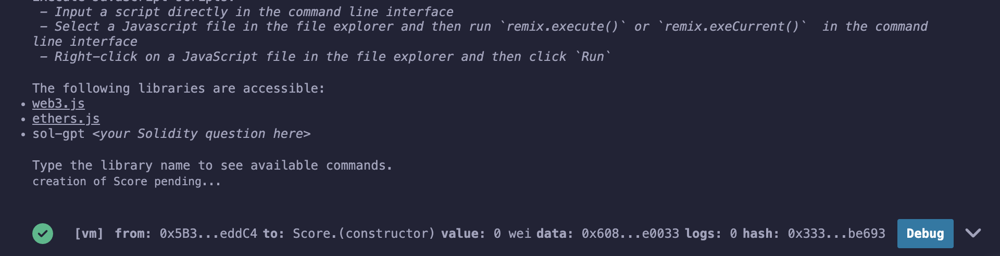
- You will also see the deployed contract listed in the **Deployed Contracts** section of the deploy panel.

From here, you can:

- Interact with your contract by calling its functions.
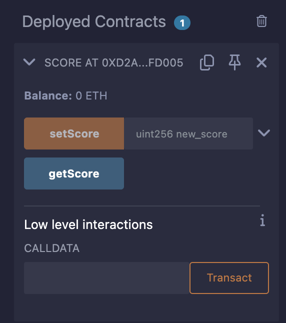
- Send transactions directly from the UI.

> Note: Once deployed, the contract is assigned an address on the blockchain, similar to a wallet address.


---

#  Solidity  – Part 1

This section provides a concise introduction to basic Solidity syntax and structure, perfect for beginners learning smart contract development.

---

##  Introduction

Solidity is a statically-typed, contract-oriented programming language designed for developing smart contracts on Ethereum.

---

##  How to Define the Solidity Compiler Version

You specify the compiler version at the top of your Solidity file using the `pragma` keyword.

```solidity
// Accepts any version from 0.8.0 up to (but not including) 0.9.0
pragma solidity ^0.8.0;
```

```solidity
// Accepts any version greater than 0.7.6 and less than 0.8.4
pragma solidity >0.7.6 <0.8.4;
```

---

##    How to Define a Contract

Solidity uses the `contract` keyword followed by the contract's name and curly braces to encapsulate its logic.

```solidity
contract Score {

    // Your code goes here =)

}
```

---

##    How to Declare a Variable in Solidity

Solidity requires explicit type declaration due to its static typing system.

```solidity
contract Score {

    uint score = 5;

}
```

###  Important Notes:
- Solidity is **statically typed**, so you must declare a variable's type (e.g., `uint`, `address`, `string`) before the variable name.
- All statements must **end with a semicolon** `;`.


---

##  Unsigned Integer Types (`uint`)

By default, `uint` is `uint256`, an unsigned 256-bit integer. You can specify bit length in 8-bit steps.

| Type     | Number Range                     |
|----------|----------------------------------|
| `uint8`  | 0 to 255                          |
| `uint16` | 0 to 65,535                       |
| `uint32` | 0 to 4,294,967,295                |
| `uint64` | 0 to 18,446,744,073,709,551,615   |
| `uint128`| 0 to 2^128                        |
| `uint256`| 0 to 2^256                        |

---

##  Getters and Setters

To **read** and **write** a value from a contract, use getter and setter functions.

```solidity
contract Score {

    uint score = 5;

    function getScore() public view returns (uint) {
        return score;
    }

    function setScore(uint new_score) public {
        score = new_score;
    }
}
```

- `view`: used for reading state (getter)
- `returns`: defines return type
- `return`: sends back a value
- `public`: visibility modifier

---
### Getter function using return
Definiton : In Solidity, a getter is a function that returns a value.

To return a value from a function (here our score), you use the following keywords:

In the function definition: returns + variable type returned between parentheses for example (uint)
In the function body: return followed by what you want to return for example return score; or return 137;
### Setter function: pass parameters to our function
Definition : In Solidity, a setter is a function that modifies the value of a variable (modifies the state of the contract). To creates a setter, you must specify the parameters when you declare your function.

After your function name, specifies between parentheses 1) the variable type (uint) and 2) the variable name (new_score)

---

##  Function Visibility

| Visibility | Contract Itself | Derived Contracts | External Contracts | External Addresses |
|------------|------------------|-------------------|--------------------|--------------------|
| `public`   | ✅               | ✅                | ✅                 | ✅                 |
| `private`  | ✅               | ❌                | ❌                 | ❌                 |
| `internal` | ✅               | ✅                | ❌                 | ❌                 |
| `external` | ❌               | ❌                | ✅                 | ✅                 |

---

##  Mutability: `view` vs `pure`

- `view`: only **reads** state.
- `pure`: **no read** or **write** to state. Used for math/computations only.

---

## Modifiers and Access Control

### Restricting Function Access

```solidity
address owner;

modifier onlyOwner {
    require(msg.sender == owner);
    _;
}

function setScore(uint new_score) public onlyOwner {
    score = new_score;
}
```

### Using `msg`:

- `msg.sender`: caller’s address
- `msg.value`: amount of ETH sent (in wei)

### Modifier with Parameter:

```solidity
modifier Fee(uint fee) {
    require(msg.value == fee);
    _;
}
```

---

##  Constructor

Executed once on deployment.

```solidity
contract Score {

    address owner;

    constructor() {
        owner = msg.sender;
    }
}
```

> Before version 0.4.22, constructors used to match the contract name. This is deprecated in 0.5.0+.

---

##  Mappings

Mappings associate key-value pairs.

```solidity
mapping(address => uint) public score_list;

function getUserScore(address user) public view returns (uint) {
    return score_list[user];
}
```

### Valid Mapping Types

| Type               | Key | Value |
|--------------------|-----|-------|
| `int/uint`         | ✔️  | ✔️    |
| `string`, `bytes`  | ✔️  | ✔️    |
| `address`          | ✔️  | ✔️    |
| `struct`, `mapping`| ❌  | ✔️    |
| `enum`, `contract` | ❌  | ✔️    |
| `array`, `var`     | ➖  | ✔️/❌  |

---

##  Arrays

Two types:

```solidity
uint[] all_possible_numbers;  // Dynamic
uint[9] one_digit_numbers;    // Fixed
```

### Accessing

```solidity
uint score = all_possible_numbers[0];
```

### Methods

- `array.length`: number of elements
- `array.push(value)`: add element

---

##    Structs

Define custom types:

```solidity
struct Funder {
    address addr;
    uint amount;
}
```

Use:

```solidity
Funder giver;
giver.addr = address(0x...);
giver.amount = 2500;
```

---

##    Struct Example with Array

```solidity
pragma solidity ^0.8.0;

contract ListExample {

    struct DataStruct {
        address userAddress;
        uint userID;
    }

    DataStruct[] public records;

    function createRecord1(address _userAddress, uint _userID) public {
        DataStruct memory newRecord;
        newRecord.userAddress = _userAddress;
        newRecord.userID = _userID;
    }

    function createRecord2(address _userAddress, uint _userID) public {
        records.push(DataStruct({userAddress: _userAddress, userID: _userID}));
    }

    function getRecordCount() public view returns (uint recordCount) {
        return records.length;
    }
}
```

---

##  Tips and Best Practices

- Use `public` on variables/mappings for auto-getters
- Always define visibility (`public`, `private`, etc.)
- Use `view` or `pure` to optimize gas and avoid warnings
- Use modifiers for security and access control
- Constructors help set ownership or initialization logic

---

