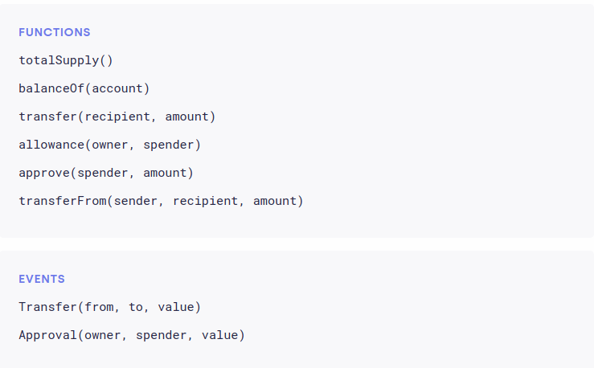

# Guide to Solidity Events and Token Standards

## Events in Solidity

Events are used in Web3 to output return values and display changes made to a smart contract. They function like log statements and are stored in the blockchain's transaction log.

### Declaring Events

Events are declared outside of functions:

event myEvent(type1, type2, ... );

Events are emitted inside functions:

emit myEvent(param1, param2, ... );

### Example: Logging a Score Change

Let’s create an event to display a newly set score. This event will be emitted within the `setScore()` function after updating the score.

event Score_set(uint);

function setScore(uint new_score) public onlyOwner {
    score = new_score;
    emit Score_set(new_score);
}

### Using `indexed`

You can use the `indexed` keyword in the event definition to make parameters searchable in Web3:

event Score_set(uint indexed);

### Notes on Events

- Events can be used with any function type: `public`, `private`, `internal`, `external`.
- Events are only visible **outside** the contract; they are not readable within Solidity code.
- A function cannot read an event emitted by another function.

### Understanding Event Logs

When you emit an event in Solidity, the arguments are stored in the transaction log — a special data structure on the Ethereum blockchain. These logs:

- Are associated with the address of the contract
- Are included in the blockchain permanently (as long as the block is accessible)

---

# Token Standards in Ethereum

Token standards in Ethereum define how tokens behave and interact within the ecosystem. These standards are essential for ensuring interoperability between smart contracts, wallets, exchanges, and dApps.

## What Are Token Standards?

From the OpenZeppelin documentation:

> "Even though the concept of a token is simple, they have a variety of complexities in the implementation. Because everything in Ethereum is just a smart contract, and there are no rules about what smart contracts have to do, the community has developed a variety of standards (called EIPs or ERCs) for documenting how a contract can interoperate with other contracts."

These standards, known as **Ethereum Improvement Proposals (EIPs)** or **Ethereum Request for Comments (ERCs)**, provide common interfaces and expected behaviors for tokens.


---

## Common Ethereum Token Standards
### Common Token Standards

- **ERC20**: The most common token standard for fungible assets. Simple and widely adopted.
- **ERC721**: Used for non-fungible tokens (NFTs). Common in games and collectibles.
- **ERC777**: Backward compatible with ERC20. Adds features like send/receive hooks and operators (authorized third parties).
- **ERC1155**: Multi-token standard. A single contract can manage fungible, non-fungible, or even semi-fungible tokens.


### ERC20 — Fungible Tokens


#### Introduction

**ERC20** is an example of a **fungible token**—meaning each token is interchangeable with another of equal value. It is a widely accepted standard by developers, exchanges, and wallet providers. 

To be an ERC20 token, your smart contract must implement specific functions and events as defined in the official interface. The most commonly used reference is from OpenZeppelin.

#### Required Functions and Events

To comply with the ERC20 standard, a contract must implement the following:

#### Functions

1. `totalSupply()`: Returns the total token supply.
2. `balanceOf(address account)`: Returns the token balance of a given address.
3. `transfer(address to, uint256 amount)`: Transfers tokens to another address.
4. `approve(address spender, uint256 amount)`: Approves another address to spend tokens on your behalf.
5. `allowance(address owner, address spender)`: Returns the remaining number of tokens that the spender can use on behalf of the owner.
6. `transferFrom(address from, address to, uint256 amount)`: Transfers tokens from one address to another, using an allowance.

#### Events

- `Transfer(address indexed from, address indexed to, uint256 value)`
- `Approval(address indexed owner, address indexed spender, uint256 value)`




For a full and secure implementation, it is highly recommended to use the [OpenZeppelin ERC20 interface](https://docs.openzeppelin.com/contracts/latest/api/token/erc20).


#### ERC20 Considerations

When designing an ERC20 token, there are several important considerations to keep in mind to ensure security, utility, and sustainability of the token in the ecosystem.

###### 1. Get Someone Who Understands Token Economics

Tokenomics is critical for the success of any tokenized system. Work with someone who understands:

- Supply and demand mechanics
- Incentive structures
- Inflation vs deflation models
- Vesting schedules
- Use cases for the token (governance, utility, staking, etc.)

###### 2. Think About How the Supply Should Change Over Time

Token supply mechanisms must be planned carefully:

- **Fixed Supply**: No new tokens are minted after the initial creation.
- **Inflationary Supply**: New tokens are minted over time to reward participants.
- **Deflationary Supply**: Tokens are burned or otherwise removed from circulation.
- **Minting Controls**: Decide who (if anyone) can mint new tokens and under what conditions.

Example mint function with restricted access:

```solidity
function mint(address to, uint256 amount) public onlyOwner {
    _mint(to, amount);
}
```

###### 3. Will Your Contract Look Like (or Be) a Rug Pull?

Ensure transparency and security to avoid appearing like a scam or "rug pull". Red flags include:

- Large allocations to team wallets with no vesting
- Functions that allow developers to drain funds or mint infinite tokens
- Lack of public audit or documentation
- Hidden or obfuscated backdoors

Example of a risky function to avoid:

```solidity
function rugPull() public {
    payable(owner).transfer(address(this).balance);
}
```

To build trust:

- Publish your smart contract source code
- Get your contract audited
- Clearly document your token's purpose and logic

###### 4. Do You Need the Extended Functionality Offered by ERC777 / ERC1155 Standards?

Consider whether ERC20 is sufficient for your use case. Alternatives:

- **ERC777**: Advanced token standard with features like hooks for sending/receiving tokens, improved interoperability, and operator-based sending.
- **ERC1155**: Supports multiple token types (fungible and non-fungible) in one contract, often used for games and NFTs.

Choose based on:

- Use case complexity
- Need for batch transfers or richer token interactions
- Compatibility with existing dApps and wallets


---

### ERC721 — Non-Fungible Tokens (NFTs)

- The standard for **non-fungible** tokens.
- Each token has a **unique ID** and is individually distinguishable.
- Commonly used in:
  - Digital art
  - Game items
  - Collectibles

**Example use cases**: CryptoKitties, Bored Ape Yacht Club.

---

### ERC777 — Advanced Fungible Tokens

- **Backwards compatible** with ERC20.
- Adds advanced features such as:
  - **Send/Receive hooks**: Callbacks when tokens are sent or received.
  - **Operators**: Entities that can move tokens on behalf of others.
- Offers a more powerful token interface while maintaining interoperability with ERC20 tools.

**Ideal for**: Applications needing granular token control and extensibility.

---

### ERC1155 — Multi-Token Standard

- Allows a single smart contract to manage:
  - **Fungible tokens**
  - **Non-fungible tokens**
  - **Semi-fungible tokens**
- Introduces efficiency improvements over ERC20 and ERC721 by:
  - Reducing gas costs
  - Allowing batched operations

**Perfect for**: Gaming, marketplaces, and apps that need diverse token types in one contract.

---

## Summary

| Standard   | Token Type     | Features                                                  | Use Cases                         |
|------------|----------------|-----------------------------------------------------------|-----------------------------------|
| ERC20      | Fungible       | Simple interface for basic tokens                        | Currencies, staking, governance   |
| ERC721     | Non-fungible   | Unique token IDs, metadata                               | NFTs, collectibles, game assets   |
| ERC777     | Fungible       | Hooks, operators, backward-compatible with ERC20         | Token control, extensible logic   |
| ERC1155    | Mixed          | Multi-token support in a single contract                 | Games, batch transfers, NFTs      |


---

