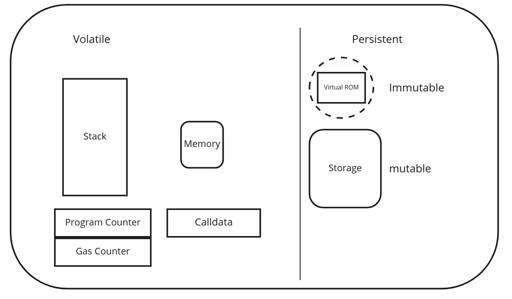
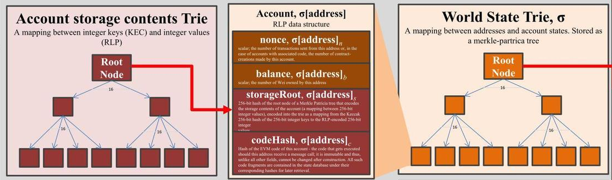
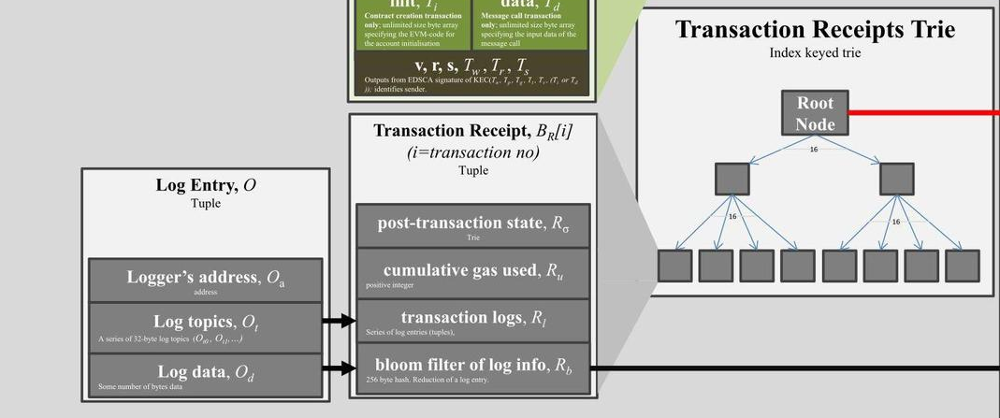

# Arrays
# Simple Examples
## Student Registry Example 

```solidity
// SPDX-License-Identifier: MIT
pragma solidity ^0.8.0;

contract StudentRegistry {
    // Fixed-size array - stores exactly 3 top scores
    uint256[3] public topScores;
    
    // Dynamic array - can grow/shrink as needed
    string[] public studentNames;
    
    // Dynamic array of addresses
    address[] public studentAddresses;
    
    // Mapping to check if a student exists (prevents duplicates)
    mapping(address => bool) public isStudent;
    
    constructor() {
        // Initialize fixed array
        topScores[0] = 95;
        topScores[1] = 92;
        topScores[2] = 90;
    }
    
    // Add a new student
    function addStudent(string memory _name) public {
        require(!isStudent[msg.sender], "Student already registered");
        
        studentNames.push(_name);
        studentAddresses.push(msg.sender);
        isStudent[msg.sender] = true;
    }
    
    // Get total number of students
    function getStudentCount() public view returns (uint256) {
        return studentNames.length;
    }
    
    // Get student details by index
    function getStudent(uint256 _index) public view returns (string memory name, address addr) {
        require(_index < studentNames.length, "Index out of bounds");
        return (studentNames[_index], studentAddresses[_index]);
    }
    
    // Update top score at specific position (0, 1, or 2)
    function updateTopScore(uint256 _position, uint256 _newScore) public {
        require(_position < 3, "Invalid position");
        topScores[_position] = _newScore;
    }
    
    // Get all student names (be careful with gas costs!)
    function getAllStudentNames() public view returns (string[] memory) {
        return studentNames;
    }
    
    // Remove last student (demonstrating pop)
    function removeLastStudent() public {
        require(studentNames.length > 0, "No students to remove");
        
        address lastStudent = studentAddresses[studentAddresses.length - 1];
        
        studentNames.pop();
        studentAddresses.pop();
        isStudent[lastStudent] = false;
    }
}

```


# StudentRegistry Smart Contract – Explanation

---

## Overview

The contract demonstrates:

- Use of fixed-size and dynamic arrays
- Basic use of mappings for tracking unique entries
- Adding and removing student records
- Accessing student data by index
- Simple admin-like functions (like updating top scores)

---

## Contract Structure

### 1. SPDX License and Pragma

```solidity
// SPDX-License-Identifier: MIT
pragma solidity ^0.8.0;
```

- Declares the license type as MIT.
- Specifies the Solidity compiler version.

---

### 2. State Variables

```solidity
uint256[3] public topScores;
string[] public studentNames;
address[] public studentAddresses;
mapping(address => bool) public isStudent;
```

- `topScores`: Fixed-size array that stores the top 3 scores.
- `studentNames`: Dynamic array to store names of students.
- `studentAddresses`: Dynamic array to store addresses of students.
- `isStudent`: A mapping to prevent duplicate registrations.

---

### 3. Constructor

```solidity
constructor() {
    topScores[0] = 95;
    topScores[1] = 92;
    topScores[2] = 90;
}
```

- Initializes the top scores when the contract is deployed.

---

### 4. Add a New Student

```solidity
function addStudent(string memory _name) public {
    require(!isStudent[msg.sender], "Student already registered");

    studentNames.push(_name);
    studentAddresses.push(msg.sender);
    isStudent[msg.sender] = true;
}
```

- Registers a new student if they haven't registered before.

---

### 5. Get Total Number of Students

```solidity
function getStudentCount() public view returns (uint256) {
    return studentNames.length;
}
```

- Returns the number of students registered.

---

### 6. Get Student Details by Index

```solidity
function getStudent(uint256 _index) public view returns (string memory name, address addr) {
    require(_index < studentNames.length, "Index out of bounds");
    return (studentNames[_index], studentAddresses[_index]);
}
```

- Retrieves a student’s name and address using an index.

---

### 7. Update Top Score

```solidity
function updateTopScore(uint256 _position, uint256 _newScore) public {
    require(_position < 3, "Invalid position");
    topScores[_position] = _newScore;
}
```

- Updates a score in the topScores array at a given position (0, 1, or 2).

---

### 8. Get All Student Names

```solidity
function getAllStudentNames() public view returns (string[] memory) {
    return studentNames;
}
```

- Returns all student names (⚠️ gas-intensive if many entries).

---

### 9. Remove the Last Student

```solidity
function removeLastStudent() public {
    require(studentNames.length > 0, "No students to remove");

    address lastStudent = studentAddresses[studentAddresses.length - 1];

    studentNames.pop();
    studentAddresses.pop();
    isStudent[lastStudent] = false;
}
```

- Removes the most recently added student from the lists.
- Resets their `isStudent` mapping to false.

---

## Summary

| Function               | Purpose                                           |
|------------------------|---------------------------------------------------|
| `addStudent()`         | Adds a new student (unique check with mapping)   |
| `getStudentCount()`    | Returns total registered students                |
| `getStudent(index)`    | Retrieves student data by index                  |
| `updateTopScore()`     | Updates one of the top 3 scores                  |
| `getAllStudentNames()` | Returns all names (careful with gas usage)       |
| `removeLastStudent()`  | Removes last student from arrays and mapping     |

--- 

## Notes

- All student data is public and accessible via getter functions.
- You can expand this contract to include roles (e.g. admin only actions), timestamps, or student metadata.


## Voting Example 

```solidity
// SPDX-License-Identifier: MIT
pragma solidity ^0.8.0;

contract VotingSystem {
    struct Proposal {
        string description;
        uint256 voteCount;
        bool executed;
        address proposer;
        address[] voters;  // Array inside struct
    }
    
    // Dynamic array of structs
    Proposal[] public proposals;
    
    // 2D array - stores vote choices per proposal per voter
    // mapping is more gas-efficient, but this demonstrates 2D arrays
    mapping(uint256 => mapping(address => bool)) public hasVoted;
    
    // Array of active proposal IDs (demonstrates filtering)
    uint256[] public activeProposalIds;
    
    event ProposalCreated(uint256 indexed proposalId, address indexed proposer);
    event VoteCast(uint256 indexed proposalId, address indexed voter);
    
    // Create a new proposal
    function createProposal(string memory _description) public returns (uint256) {
        Proposal memory newProposal = Proposal({
            description: _description,
            voteCount: 0,
            executed: false,
            proposer: msg.sender,
            voters: new address[](0)  // Initialize empty array
        });
        
        proposals.push(newProposal);
        uint256 proposalId = proposals.length - 1;
        activeProposalIds.push(proposalId);
        
        emit ProposalCreated(proposalId, msg.sender);
        return proposalId;
    }
    
    // Vote for a proposal
    function vote(uint256 _proposalId) public {
        require(_proposalId < proposals.length, "Invalid proposal ID");
        require(!hasVoted[_proposalId][msg.sender], "Already voted");
        require(!proposals[_proposalId].executed, "Proposal already executed");
        
        // Add voter to the proposal's voters array
        proposals[_proposalId].voters.push(msg.sender);
        proposals[_proposalId].voteCount++;
        hasVoted[_proposalId][msg.sender] = true;
        
        emit VoteCast(_proposalId, msg.sender);
    }
    
    // Get voters for a specific proposal
    function getProposalVoters(uint256 _proposalId) public view returns (address[] memory) {
        require(_proposalId < proposals.length, "Invalid proposal ID");
        return proposals[_proposalId].voters;
    }
    
    // Get number of voters for a proposal
    function getVoterCount(uint256 _proposalId) public view returns (uint256) {
        require(_proposalId < proposals.length, "Invalid proposal ID");
        return proposals[_proposalId].voters.length;
    }
    
    // Mark proposal as executed and remove from active list
    function executeProposal(uint256 _proposalId) public {
        require(_proposalId < proposals.length, "Invalid proposal ID");
        require(proposals[_proposalId].proposer == msg.sender, "Only proposer can execute");
        require(!proposals[_proposalId].executed, "Already executed");
        require(proposals[_proposalId].voteCount >= 3, "Not enough votes");
        
        proposals[_proposalId].executed = true;
        
        // Remove from activeProposalIds array
        _removeFromActiveProposals(_proposalId);
    }
    
    // Helper function to remove proposal from active list
    function _removeFromActiveProposals(uint256 _proposalId) private {
        uint256 length = activeProposalIds.length;
        for (uint256 i = 0; i < length; i++) {
            if (activeProposalIds[i] == _proposalId) {
                // Move last element to this position and pop
                activeProposalIds[i] = activeProposalIds[length - 1];
                activeProposalIds.pop();
                break;
            }
        }
    }
    
    // Get all active proposals (not executed)
    function getActiveProposals() public view returns (uint256[] memory) {
        return activeProposalIds;
    }
    
    // Get proposal details with voter addresses
    function getProposalDetails(uint256 _proposalId) public view returns (
        string memory description,
        uint256 voteCount,
        bool executed,
        address proposer,
        uint256 voterCount
    ) {
        require(_proposalId < proposals.length, "Invalid proposal ID");
        Proposal storage proposal = proposals[_proposalId];
        
        return (
            proposal.description,
            proposal.voteCount,
            proposal.executed,
            proposal.proposer,
            proposal.voters.length
        );
    }
}

```
# VotingSystem Smart Contract – Explanation

---

## Overview

The contract demonstrates:

- Use of structs and dynamic arrays
- Two-dimensional mappings
- Event emission
- Filtering active proposals
- Executing proposals under conditions

---

## Contract Structure

### 1. SPDX License and Pragma

```solidity
// SPDX-License-Identifier: MIT
pragma solidity ^0.8.0;
```

- Specifies the license and the Solidity version.

---

### 2. Proposal Struct

```solidity
struct Proposal {
    string description;
    uint256 voteCount;
    bool executed;
    address proposer;
    address[] voters;
}
```

- Stores the proposal’s details, votes, proposer address, and the list of voters.

---

### 3. State Variables

```solidity
Proposal[] public proposals;
mapping(uint256 => mapping(address => bool)) public hasVoted;
uint256[] public activeProposalIds;
```

- `proposals`: Dynamic array holding all proposals.
- `hasVoted`: 2D mapping to track if a user has voted on a specific proposal.
- `activeProposalIds`: Tracks proposals that are not yet executed.

---

### 4. Events

```solidity
event ProposalCreated(uint256 indexed proposalId, address indexed proposer);
event VoteCast(uint256 indexed proposalId, address indexed voter);
```

- Emit logs when proposals are created or when votes are cast.

---

## Functionality

### 5. Create a New Proposal

```solidity
function createProposal(string memory _description) public returns (uint256)
```

- Initializes a new proposal with an empty voters array.
- Pushes it to the `proposals` array.
- Adds the proposal ID to `activeProposalIds`.

---

### 6. Cast a Vote

```solidity
function vote(uint256 _proposalId) public
```

- Requires that:
  - Proposal exists
  - Voter hasn't already voted
  - Proposal is not yet executed
- Adds the voter's address to the proposal’s `voters` array.
- Increments vote count.
- Marks the voter as having voted.

---

### 7. Get Voters of a Proposal

```solidity
function getProposalVoters(uint256 _proposalId) public view returns (address[] memory)
```

- Returns the list of voters for a given proposal.

---

### 8. Get Number of Voters for a Proposal

```solidity
function getVoterCount(uint256 _proposalId) public view returns (uint256)
```

- Returns the length of the `voters` array for a given proposal.

---

### 9. Execute a Proposal

```solidity
function executeProposal(uint256 _proposalId) public
```

- Requirements:
  - Only the original proposer can execute
  - Proposal must not be already executed
  - Must have received at least 3 votes
- Marks it as executed.
- Removes it from `activeProposalIds`.

---

### 10. Internal Helper to Remove Executed Proposal from Active List

```solidity
function _removeFromActiveProposals(uint256 _proposalId) private
```

- Finds the index of the proposal in the active list.
- Swaps it with the last item and uses `.pop()` to remove it efficiently.

---

### 11. Get All Active Proposal IDs

```solidity
function getActiveProposals() public view returns (uint256[] memory)
```

- Returns the list of active (not executed) proposals.

---

### 12. Get Proposal Details

```solidity
function getProposalDetails(uint256 _proposalId) public view returns (
    string memory description,
    uint256 voteCount,
    bool executed,
    address proposer,
    uint256 voterCount
)
```

- Returns all key information about a proposal, including number of voters.

---

## Summary Table

| Function                   | Purpose                                                 |
|----------------------------|----------------------------------------------------------|
| `createProposal()`         | Adds a new proposal                                      |
| `vote()`                   | Casts a vote for a proposal                              |
| `getProposalVoters()`      | Returns list of addresses who voted                      |
| `getVoterCount()`          | Number of voters for a proposal                          |
| `executeProposal()`        | Finalizes proposal if conditions met                     |
| `getActiveProposals()`     | Lists all currently active (non-executed) proposals      |
| `getProposalDetails()`     | Gets full data of a specific proposal                    |

---

## Notes

- **Minimum 3 votes required** to execute a proposal.
- Proposals must be executed by their original proposer.
- Using arrays inside structs and dynamic filtering is educational but may increase gas costs.
- For efficiency in real applications, mappings are preferred over arrays for large data.


# Ethereum Virtual Machine (EVM)

## Overview
- **EVM**: Virtual machine running on Ethereum node software
- **Environment**: Self-contained, restricted environment for smart contracts
- **Comparison**: Contracts are more environment-dependent than traditional programs (e.g., Python)



## Key Characteristics
- **Type**: Stack machine
- **Stack size**: Maximum 1024 slots
- **Word size**: 256-bit (facilitates cryptographic operations)
  - Enables efficient Keccak256 hashing
  - Supports elliptic-curve computations

## Data Areas
| Location    | Persistence | Scope            | Cost  | Keyword   |
|-------------|-------------|------------------|-------|-----------|
| **Stack**   | Temporary   | Current execution| Low   | -         |
| **Memory**  | Temporary   | Function scope   | Medium| `memory`  |
| **Storage** | Permanent   | Contract-wide    | High  | `storage` |
| **Calldata**| Call-only   | Call scope       | Low   | `calldata`|
| **Code**    | Permanent   | Contract         | N/A   | -         |
| **Logs**    | Permanent   | Blockchain       | High  | -         |

## Storage vs Memory
### Storage
- Permanent part of contract state
- Accessible across all functions
- Expensive to use (modify)
- Use only when necessary
- Example: `uint256 storage myVar;`

### Memory
- Temporary storage
- Function-scoped only
- Discarded after execution
- Used for temporary calculations
- Example: `string memory tempStr;`

## Best Practices
- Minimize storage operations (expensive)
- Use memory for temporary computations
- Be mindful of stack depth limit (1024)
- Optimize for 256-bit word operations


# Complete Guide to EVM Languages

## Overview
Ethereum Virtual Machine (EVM) supports multiple programming languages for smart contract development, each with different design philosophies and capabilities.

## Main EVM Languages

### Solidity
- The most popular programming language for Ethereum contracts
- JavaScript-like syntax
- Supports:
  - Inheritance
  - Libraries
  - Complex user-defined types

### LLL (Low-level Lisp-like Language)
- Minimalist, assembly-like language
- Rarely used today
- Provides direct control over EVM operations

### Vyper
- Python-inspired language focused on security
- Key features:
  - Bounds and overflow checking
  - Support for numeric units
- Explicitly excludes:
  - Modifiers
  - Inheritance
  - Inline assembly
  - Function overloading
  - Operator overloading
  - Recursive calling
  - Infinite-length loops

### Yul/Yul+
- Intermediate language that compiles to bytecode
- Designed to support:
  - EVM 1.0
  - EVM 1.5
  - Ewasm (planned)
- Acts as common denominator across platforms

## Experimental/Alternative Languages

### FE
- Statically typed language inspired by Rust and Python
- Goals:
  - Easy to learn for new Ethereum developers
  - Enhanced safety features
- Current status: Alpha (as of January 2021)
- Features:
  - Bounds and overflow checking
  - Static typing
  - Pure function support
  - Reentrancy restrictions
  - Static looping
  - Module imports
  - Standard library

### Huff
- Low-level assembly-like language
- Provides fine-grained control over EVM operations
- Used for highly optimized contracts

### Pyramid Scheme
- Experimental Scheme compiler for EVM
- Follows SICP compilation approach
- Functional programming paradigm

### Flint
- Security-focused language
- Notable features:
  - Asset types with restricted atomic operations
  - Built-in security patterns

### LLLL
- LLL-like compiler implemented in Isabelle/HOL
- Focus on formal verification

### HAseembly-evm
- EVM assembly implemented as Haskell DSL
- Functional programming approach

### Bamboo
- Experimental language without loops
- Focuses on predictable execution

## Comparison Table

| Language       | Type           | Key Feature                     | Safety Focus |
|----------------|----------------|---------------------------------|--------------|
| Solidity       | High-level     | Most widely used                | Medium       |
| Vyper          | High-level     | Simplicity, auditability       | High         |
| Yul            | Intermediate   | Multi-backend support          | Medium       |
| FE             | High-level     | Rust/Python inspiration        | High         |
| Huff           | Low-level      | EVM optimization               | Low          |
| Flint          | High-level     | Asset-oriented programming     | High         |

## References

1. [DEVCON1: Understanding the Ethereum Blockchain Protocol – Vitalik Buterin](https://www.youtube.com/watch?v=DJEtb5fKmw4)
2. [Mastering Ethereum by Andreas M. Antonopoulos and Gavin Wood](https://github.com/ethereumbook/ethereumbook)
3. [Ethereum White Paper](https://ethereum.org/en/whitepaper/)
4. [Ethereum Yellow Paper (Formal Specification)](https://ethereum.github.io/yellowpaper/paper.pdf)
5. [EVM Specifications and Documentation (ethereum/execution-specs)](https://github.com/ethereum/execution-specs)
6. [Noxx Articles about the EVM on Mirror.xyz](https://mirror.xyz/noxx.eth)


## Best Practices for Language Selection
1. **For production contracts**: Use Solidity or Vyper
2. **For formal verification**: Consider FE or Flint
3. **For optimization**: Consider Yul or Huff
4. **For experimentation**: Try experimental languages
5. Always consider:
   - Auditability
   - Community support
   - Tooling availability
   - Security features


---


# Ethereum State

Ethereum uses a sophisticated state management system that relies on **Merkle Patricia Tries (MPTs)** to efficiently store and verify the blockchain's data. These tries are critical to how Ethereum ensures trustless computation, efficient proof validation, and light client functionality.

## The Three Main Tries

Ethereum maintains three primary tries:

1. **World State Trie**
2. **Transaction Trie**
3. **Transaction Receipt Trie**

Each of these tries serves a specific purpose and is designed for efficient retrieval, cryptographic integrity, and proof generation.


---

### 1. World State Trie

- **Purpose:** Represents the current state of all accounts (EOAs and contracts) on Ethereum.
- **Structure:** A Merkle Patricia Trie where each node maps an account address to an **account object**.
- **Account Object Contains:**
  - `nonce`: Number of transactions sent from this address.
  - `balance`: Amount of ETH held by the address.
  - `storageRoot`: The root of another trie (storage trie) containing the contract's storage.
  - `codeHash`: Hash of the contract bytecode (or empty for EOAs).



**Note:** The `storageRoot` points to a separate trie containing the contract's internal key-value storage.

---

### 2. Transaction Trie

- **Purpose:** Stores all transactions for a given block.
- **Structure:** A Merkle Patricia Trie where:
  - Keys = RLP-encoded index (0, 1, 2, ...)
  - Values = RLP-encoded transaction objects.
- **Usage:** Enables verification of the inclusion of a specific transaction in a block.


---

### 3. Transaction Receipt Trie

- **Purpose:** Stores receipts of each transaction, which include:
  - Gas used
  - Logs generated
  - Status (success or failure)
- **Structure:** Also a Merkle Patricia Trie, keyed by transaction index, storing the RLP-encoded receipts.
- **Usage:** Essential for validating logs, event emissions, and tracking gas usage.

---

## World State and Account State

The **World State** refers to the root trie that tracks all Ethereum accounts.

Each **Account State** (whether EOA or smart contract) includes:
- Nonce
- ETH Balance
- Contract Storage (via `storageRoot`)
- Contract Code (via `codeHash`)

Smart contract accounts point to an additional **Storage Trie**, which itself is a key-value mapping of 32-byte keys and 32-byte values. This is how contract variables are stored and read.

---

## See Also

- [Ethereum State Trie Architecture Explained](https://ethereum.org/en/developers/docs/data-structures-and-encoding/patricia-merkle-trie/)  
  A deep dive into how Ethereum structures its global state, transactions, and receipts using MPTs.

---

## Ethereum Block Fields

### Consensus Layer (Beacon Chain)

| Field               | Description                                          |
|---------------------|------------------------------------------------------|
| `randao_reveal`     | Randomness for validator selection.                 |
| `eth1_data`         | Deposit contract information.                       |
| `graffiti`          | Arbitrary tag data.                                 |
| `proposer_slashings`| Validators penalized for malicious proposals.       |
| `attester_slashings`| Validators penalized for faulty attestations.       |
| `attestations`      | Votes confirming the current block.                 |
| `deposits`          | New validator deposits.                             |
| `voluntary_exits`   | Validators leaving the network.                     |
| `sync_aggregate`    | Sync committee for light clients.                   |
| `execution_payload` | Transactions from execution client.                 |

### Execution Layer (EVM)

| Field               | Description                                          |
|---------------------|------------------------------------------------------|
| `parent_hash`       | Hash of the parent block.                           |
| `fee_recipient`     | Address receiving the transaction fees.             |
| `state_root`        | Root hash of the updated world state.               |
| `receipts_root`     | Root of the receipt trie.                           |
| `logs_bloom`        | Structure for quick log lookup.                     |
| `prev_randao`       | Used for random selection.                          |
| `block_number`      | Current block number.                               |
| `gas_limit`         | Max allowed gas in the block.                       |
| `gas_used`          | Actual gas used.                                    |
| `timestamp`         | Time of block creation.                             |
| `extra_data`        | Raw arbitrary bytes.                                |
| `base_fee_per_gas`  | Base transaction fee.                               |
| `block_hash`        | Hash of the execution block.                        |
| `transactions`      | List of included transactions.                      |


---

## Ethereum Transactions

### Fields
- `recipient`: Address receiving ETH or contract call.
- `signature`: Sender's digital signature.
- `nonce`: Count of transactions sent by the sender.
- `value`: Amount of ETH (in wei) to send.
- `data`: Optional input data (used for contract calls).
- `gasLimit`: Max gas this transaction can consume.
- `maxPriorityFeePerGas`: Tip to incentivize miners/validators.
- `maxFeePerGas`: Total max fee per gas unit (includes base + tip).

### Example Transaction

```json
{
  "from": "0xEA674fdDe714fd979de3EdF0F56AA9716B898ec8",
  "to": "0xac03bb73b6a9e108530aff4df5077c2b3d481e5a",
  "gasLimit": "21000",
  "maxFeePerGas": "300",
  "maxPriorityFeePerGas": "10",
  "nonce": "0",
  "value": "10000000000"
}
```

---
# Transaction Selection and Processing in Ethereum

## Practical Points About Transaction Selection

- **Block producers choose** which transactions to include in a block.
- **Block producers can include their own transactions** in the block.
- **Block producers determine the order** of transactions within a block.
- **Your transaction competes** with other transactions for inclusion, usually based on gas fees (priority fees).

## Transaction Processing

Before a transaction can be executed, it must pass several **validity checks**:

1. **Well-formed RLP Encoding**  
   - The transaction must follow the rules for well-formed RLP (Recursive Length Prefix) encoding.  
   - [Read more on RLP encoding here](https://ethereum.org/en/developers/docs/data-structures-and-encoding/rlp/)

2. **Valid Signature**  
   - The cryptographic signature must be valid and match the sender's address.

3. **Valid Nonce**  
   - The nonce in the transaction must match the current nonce of the sender’s account.  
   - This prevents replay attacks and ensures correct transaction sequencing.

4. **Sufficient Gas Limit**  
   - The `gas_limit` must be **greater than or equal to** the `intrinsic_gas` required for transaction execution.

5. **Sufficient Balance**  
   - The sender must have enough Ether to cover the **up-front cost**, including:
     - `gas_limit * gas_price`
     - Value transferred (if any)

## Summary

| Check                           | Purpose                                                              |
|--------------------------------|----------------------------------------------------------------------|
| RLP Validity                   | Ensures proper encoding and transaction structure                   |
| Signature Validity             | Confirms sender identity                                             |
| Nonce Validity                 | Prevents double spending and enforces order                         |
| Gas Limit Check                | Confirms transaction can afford execution overhead                  |
| Balance Check                  | Ensures sender can pay gas and transfer value (if applicable)       |

> **Note**: Failing any of the above checks results in the transaction being rejected before execution.
