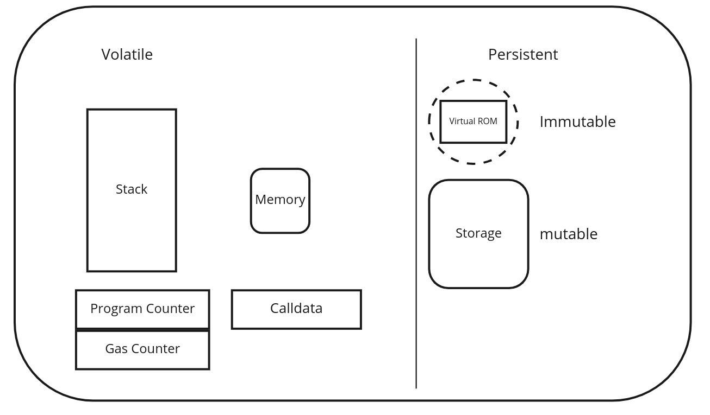
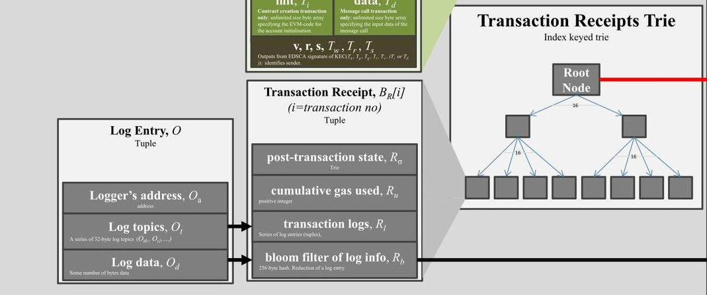

# آرایه‌ها  
# مثال‌های ساده  

## مثال ثبت‌نام دانش‌آموز  

~~~~solidity
// SPDX-License-Identifier: MIT
pragma solidity ^0.8.0;

contract StudentRegistry {
    // آرایه با اندازه ثابت - دقیقاً ۳ نمره برتر را ذخیره می‌کند
    uint256[3] public topScores;
    
    // آرایه پویا - می‌تواند به دلخواه رشد یا کاهش یابد
    string[] public studentNames;
    
    // آرایه پویا از آدرس‌ها
    address[] public studentAddresses;
    
    // مپ برای بررسی وجود دانش‌آموز (جلوگیری از تکرار)
    mapping(address => bool) public isStudent;
    
    constructor() {
        // مقداردهی اولیه آرایه ثابت
        topScores[0] = 95;
        topScores[1] = 92;
        topScores[2] = 90;
    }
    
    // افزودن دانش‌آموز جدید
    function addStudent(string memory _name) public {
        require(!isStudent[msg.sender], "دانش‌آموز قبلاً ثبت شده است");
        
        studentNames.push(_name);
        studentAddresses.push(msg.sender);
        isStudent[msg.sender] = true;
    }
    
    // دریافت تعداد کل دانش‌آموزان
    function getStudentCount() public view returns (uint256) {
        return studentNames.length;
    }
    
    // دریافت اطلاعات دانش‌آموز بر اساس ایندکس
    function getStudent(uint256 _index) public view returns (string memory name, address addr) {
        require(_index < studentNames.length, "ایندکس خارج از محدوده است");
        return (studentNames[_index], studentAddresses[_index]);
    }
    
    // به‌روزرسانی نمره برتر در موقعیت خاص (۰، ۱ یا ۲)
    function updateTopScore(uint256 _position, uint256 _newScore) public {
        require(_position < 3, "موقعیت نامعتبر");
        topScores[_position] = _newScore;
    }
    
    // دریافت تمام نام‌های دانش‌آموزان (⚠️ مصرف گاز بالا)
    function getAllStudentNames() public view returns (string[] memory) {
        return studentNames;
    }
    
    // حذف آخرین دانش‌آموز (مثال استفاده از pop)
    function removeLastStudent() public {
        require(studentNames.length > 0, "دانش‌آموزی برای حذف وجود ندارد");
        
        address lastStudent = studentAddresses[studentAddresses.length - 1];
        
        studentNames.pop();
        studentAddresses.pop();
        isStudent[lastStudent] = false;
    }
}
~~~~

---

# قرارداد هوشمند StudentRegistry – توضیح

---

## مرور کلی

این قرارداد نشان می‌دهد:

- استفاده از آرایه‌های با اندازه ثابت و پویا
- استفاده پایه‌ای از مپ برای بررسی یکتایی
- افزودن و حذف رکوردهای دانش‌آموز
- دسترسی به داده‌های دانش‌آموز بر اساس ایندکس
- توابع ساده مدیریتی مانند به‌روزرسانی نمرات

---

## ساختار قرارداد

### ۱. مجوز و نسخه کامپایلر

~~~~solidity
// SPDX-License-Identifier: MIT
pragma solidity ^0.8.0;
~~~~

- مجوز استفاده از نوع MIT اعلام شده.
- نسخه کامپایلر Solidity مشخص شده است.

---

### ۲. متغیرهای وضعیت

~~~~solidity
uint256[3] public topScores;
string[] public studentNames;
address[] public studentAddresses;
mapping(address => bool) public isStudent;
~~~~

- `topScores`: آرایه‌ای با اندازه ثابت برای ذخیره ۳ نمره برتر.
- `studentNames`: آرایه پویا برای ذخیره نام دانش‌آموزان.
- `studentAddresses`: آرایه پویا برای ذخیره آدرس‌ها.
- `isStudent`: مپ برای جلوگیری از ثبت‌نام تکراری.

---

### ۳. سازنده

~~~~solidity
constructor() {
    topScores[0] = 95;
    topScores[1] = 92;
    topScores[2] = 90;
}
~~~~

- مقداردهی اولیه نمرات برتر در زمان استقرار قرارداد.

---

### ۴. افزودن دانش‌آموز جدید

~~~~solidity
function addStudent(string memory _name) public {
    require(!isStudent[msg.sender], "دانش‌آموز قبلاً ثبت شده است");

    studentNames.push(_name);
    studentAddresses.push(msg.sender);
    isStudent[msg.sender] = true;
}
~~~~

- اگر دانش‌آموز قبلاً ثبت نشده باشد، او را ثبت می‌کند.

---

### ۵. دریافت تعداد کل دانش‌آموزان

~~~~solidity
function getStudentCount() public view returns (uint256) {
    return studentNames.length;
}
~~~~

- تعداد کل دانش‌آموزان ثبت‌شده را برمی‌گرداند.

---

### ۶. دریافت اطلاعات دانش‌آموز بر اساس ایندکس

~~~~solidity
function getStudent(uint256 _index) public view returns (string memory name, address addr) {
    require(_index < studentNames.length, "ایندکس خارج از محدوده است");
    return (studentNames[_index], studentAddresses[_index]);
}
~~~~

- اطلاعات نام و آدرس دانش‌آموز را با استفاده از ایندکس بازمی‌گرداند.

---

### ۷. به‌روزرسانی نمره برتر

~~~~solidity
function updateTopScore(uint256 _position, uint256 _newScore) public {
    require(_position < 3, "موقعیت نامعتبر");
    topScores[_position] = _newScore;
}
~~~~

- نمره‌ای را در آرایه `topScores` در موقعیت مشخص به‌روزرسانی می‌کند.

---

### ۸. دریافت تمام نام‌های دانش‌آموزان

~~~~solidity
function getAllStudentNames() public view returns (string[] memory) {
    return studentNames;
}
~~~~

- تمام نام‌های ثبت‌شده را بازمی‌گرداند (⚠️ ممکن است گران باشد).

---

### ۹. حذف آخرین دانش‌آموز

~~~~solidity
function removeLastStudent() public {
    require(studentNames.length > 0, "دانش‌آموزی برای حذف وجود ندارد");

    address lastStudent = studentAddresses[studentAddresses.length - 1];

    studentNames.pop();
    studentAddresses.pop();
    isStudent[lastStudent] = false;
}
~~~~

- آخرین دانش‌آموز اضافه‌شده را حذف می‌کند و وضعیت ثبت‌نام او را نیز بازنشانی می‌کند.

---

## خلاصه

| تابع                     | هدف                                             |
|--------------------------|--------------------------------------------------|
| `addStudent()`           | افزودن دانش‌آموز جدید (بررسی یکتایی با مپ)     |
| `getStudentCount()`      | بازگرداندن تعداد دانش‌آموزان                   |
| `getStudent(index)`      | دریافت داده دانش‌آموز با ایندکس                |
| `updateTopScore()`       | به‌روزرسانی یکی از ۳ نمره برتر                  |
| `getAllStudentNames()`   | بازگرداندن تمام نام‌ها (هزینه گاز بالا)       |
| `removeLastStudent()`    | حذف آخرین دانش‌آموز از آرایه‌ها و مپ           |

---

## نکات

- تمام داده‌های دانش‌آموز از طریق توابع Getter در دسترس هستند.
- می‌توان این قرارداد را با افزودن نقش‌ها (مثلاً فقط مدیر)، ثبت زمان یا متادیتای دانش‌آموز گسترش داد.

---

## مثال رأی‌گیری  

~~~~solidity
// SPDX-License-Identifier: MIT
pragma solidity ^0.8.0;

contract VotingSystem {
    struct Proposal {
        string description;
        uint256 voteCount;
        bool executed;
        address proposer;
        address[] voters;  // آرایه درون ساختار
    }
    
    // آرایه پویا از ساختارها
    Proposal[] public proposals;
    
    // آرایه دوبعدی - ذخیره انتخاب رأی برای هر رأی‌دهنده در هر پیشنهاد
    // استفاده از مپ بهینه‌تر است اما این برای آموزش است
    mapping(uint256 => mapping(address => bool)) public hasVoted;
    
    // آرایه‌ای از شناسه‌های فعال پیشنهادها
    uint256[] public activeProposalIds;
    
    event ProposalCreated(uint256 indexed proposalId, address indexed proposer);
    event VoteCast(uint256 indexed proposalId, address indexed voter);
    
    // ایجاد یک پیشنهاد جدید
    function createProposal(string memory _description) public returns (uint256) {
        Proposal memory newProposal = Proposal({
            description: _description,
            voteCount: 0,
            executed: false,
            proposer: msg.sender,
            voters: new address   // مقداردهی اولیه آرایه
        });
        
        proposals.push(newProposal);
        uint256 proposalId = proposals.length - 1;
        activeProposalIds.push(proposalId);
        
        emit ProposalCreated(proposalId, msg.sender);
        return proposalId;
    }
    
    // رأی دادن به یک پیشنهاد
    function vote(uint256 _proposalId) public {
        require(_proposalId < proposals.length, "شناسه پیشنهاد نامعتبر است");
        require(!hasVoted[_proposalId][msg.sender], "قبلاً رأی داده‌اید");
        require(!proposals[_proposalId].executed, "پیشنهاد اجرا شده است");
        
        proposals[_proposalId].voters.push(msg.sender);
        proposals[_proposalId].voteCount++;
        hasVoted[_proposalId][msg.sender] = true;
        
        emit VoteCast(_proposalId, msg.sender);
    }
    
    // دریافت رأی‌دهندگان برای یک پیشنهاد خاص
    function getProposalVoters(uint256 _proposalId) public view returns (address[] memory) {
        require(_proposalId < proposals.length, "شناسه پیشنهاد نامعتبر است");
        return proposals[_proposalId].voters;
    }
    
    // تعداد رأی‌دهندگان یک پیشنهاد
    function getVoterCount(uint256 _proposalId) public view returns (uint256) {
        require(_proposalId < proposals.length, "شناسه پیشنهاد نامعتبر است");
        return proposals[_proposalId].voters.length;
    }
    
    // اجرای یک پیشنهاد و حذف آن از فهرست فعال
    function executeProposal(uint256 _proposalId) public {
        require(_proposalId < proposals.length, "شناسه پیشنهاد نامعتبر است");
        require(proposals[_proposalId].proposer == msg.sender, "فقط پیشنهاددهنده می‌تواند اجرا کند");
        require(!proposals[_proposalId].executed, "قبلاً اجرا شده");
        require(proposals[_proposalId].voteCount >= 3, "رأی کافی وجود ندارد");
        
        proposals[_proposalId].executed = true;
        
        _removeFromActiveProposals(_proposalId);
    }
    
    // تابع کمکی برای حذف پیشنهاد از لیست فعال
    function _removeFromActiveProposals(uint256 _proposalId) private {
        uint256 length = activeProposalIds.length;
        for (uint256 i = 0; i < length; i++) {
            if (activeProposalIds[i] == _proposalId) {
                activeProposalIds[i] = activeProposalIds[length - 1];
                activeProposalIds.pop();
                break;
            }
        }
    }
    
    // دریافت پیشنهادهای فعال
    function getActiveProposals() public view returns (uint256[] memory) {
        return activeProposalIds;
    }
    
    // دریافت جزئیات یک پیشنهاد به همراه آدرس رأی‌دهندگان
    function getProposalDetails(uint256 _proposalId) public view returns (
        string memory description,
        uint256 voteCount,
        bool executed,
        address proposer,
        uint256 voterCount
    ) {
        require(_proposalId < proposals.length, "شناسه پیشنهاد نامعتبر است");
        Proposal storage proposal = proposals[_proposalId];
        
        return (
            proposal.description,
            proposal.voteCount,
            proposal.executed,
            proposal.proposer,
            proposal.voters.length
        );
    }
}
~~~~

# قرارداد هوشمند VotingSystem – توضیح

---

## نمای کلی

این قرارداد موارد زیر را نمایش می‌دهد:

- استفاده از ساختارها (struct) و آرایه‌های پویا
- نگاشت‌های دوبعدی
- انتشار رویدادها
- فیلتر کردن پیشنهادهای فعال
- اجرای پیشنهادها تحت شرایط خاص

---

## ساختار قرارداد

### ۱. مجوز SPDX و Pragma

~~~~solidity
// SPDX-License-Identifier: MIT
pragma solidity ^0.8.0;
~~~~

- مشخص‌کننده مجوز و نسخه‌ی Solidity.

---

### ۲. ساختار Proposal

~~~~solidity
struct Proposal {
    string description;
    uint256 voteCount;
    bool executed;
    address proposer;
    address[] voters;
}
~~~~

- جزئیات پیشنهاد، تعداد رأی‌ها، آدرس پیشنهاددهنده و فهرست رأی‌دهندگان را ذخیره می‌کند.

---

### ۳. متغیرهای وضعیت

~~~~solidity
Proposal[] public proposals;
mapping(uint256 => mapping(address => bool)) public hasVoted;
uint256[] public activeProposalIds;
~~~~

- `proposals`: آرایه پویا شامل تمام پیشنهادها.
- `hasVoted`: نگاشت دوبعدی برای پیگیری اینکه آیا یک کاربر به پیشنهاد خاصی رأی داده است.
- `activeProposalIds`: پیگیری پیشنهادهایی که هنوز اجرا نشده‌اند.

---

### ۴. رویدادها

~~~~solidity
event ProposalCreated(uint256 indexed proposalId, address indexed proposer);
event VoteCast(uint256 indexed proposalId, address indexed voter);
~~~~

- انتشار لاگ هنگام ایجاد پیشنهاد یا رأی‌گیری.

---

## قابلیت‌ها

### ۵. ایجاد پیشنهاد جدید

~~~~solidity
function createProposal(string memory _description) public returns (uint256)
~~~~

- یک پیشنهاد جدید با آرایه رأی‌دهندگان خالی ایجاد می‌کند.
- آن را به آرایه `proposals` اضافه می‌کند.
- شناسه پیشنهاد را به `activeProposalIds` اضافه می‌کند.

---

### ۶. ثبت رأی

~~~~solidity
function vote(uint256 _proposalId) public
~~~~

- شرایط لازم:
  - پیشنهاد وجود داشته باشد
  - رأی‌دهنده قبلاً رأی نداده باشد
  - پیشنهاد هنوز اجرا نشده باشد
- آدرس رأی‌دهنده را به آرایه `voters` اضافه می‌کند.
- تعداد رأی‌ها را افزایش می‌دهد.
- رأی‌دهنده را به‌عنوان رأی‌داده‌شده علامت می‌زند.

---

### ۷. دریافت رأی‌دهندگان یک پیشنهاد

~~~~solidity
function getProposalVoters(uint256 _proposalId) public view returns (address[] memory)
~~~~

- لیست رأی‌دهندگان یک پیشنهاد را بازمی‌گرداند.

---

### ۸. تعداد رأی‌دهندگان یک پیشنهاد

~~~~solidity
function getVoterCount(uint256 _proposalId) public view returns (uint256)
~~~~

- طول آرایه `voters` برای یک پیشنهاد خاص را بازمی‌گرداند.

---

### ۹. اجرای یک پیشنهاد

~~~~solidity
function executeProposal(uint256 _proposalId) public
~~~~

- شرایط لازم:
  - فقط پیشنهاددهنده اصلی می‌تواند اجرا کند
  - پیشنهاد هنوز اجرا نشده باشد
  - حداقل ۳ رأی دریافت کرده باشد
- آن را به‌عنوان اجراشده علامت‌گذاری می‌کند.
- از لیست `activeProposalIds` حذف می‌کند.

---

### ۱۰. تابع کمکی داخلی برای حذف پیشنهاد اجراشده

~~~~solidity
function _removeFromActiveProposals(uint256 _proposalId) private
~~~~

- شاخص پیشنهاد را در لیست فعال پیدا می‌کند.
- با آخرین عنصر جایگزین می‌کند و با `.pop()` آن را حذف می‌کند.

---

### ۱۱. دریافت تمام شناسه‌های پیشنهادهای فعال

~~~~solidity
function getActiveProposals() public view returns (uint256[] memory)
~~~~

- لیستی از پیشنهادهای فعال (اجرا نشده) را بازمی‌گرداند.

---

### ۱۲. دریافت جزئیات یک پیشنهاد

~~~~solidity
function getProposalDetails(uint256 _proposalId) public view returns (
    string memory description,
    uint256 voteCount,
    bool executed,
    address proposer,
    uint256 voterCount
)
~~~~

- تمام اطلاعات کلیدی یک پیشنهاد، از جمله تعداد رأی‌دهندگان را بازمی‌گرداند.

---

## جدول خلاصه

| تابع                      | هدف                                                  |
|---------------------------|-------------------------------------------------------|
| `createProposal()`        | اضافه کردن پیشنهاد جدید                              |
| `vote()`                  | رأی دادن به یک پیشنهاد                               |
| `getProposalVoters()`     | بازگرداندن لیست آدرس‌های رأی‌دهنده                   |
| `getVoterCount()`         | تعداد رأی‌دهندگان یک پیشنهاد                         |
| `executeProposal()`       | اجرای نهایی پیشنهاد در صورت تحقق شرایط               |
| `getActiveProposals()`    | فهرست تمام پیشنهادهای فعال (اجرا نشده)               |
| `getProposalDetails()`    | دریافت اطلاعات کامل یک پیشنهاد خاص                  |

---

## نکات

- **حداقل ۳ رأی مورد نیاز است** برای اجرای یک پیشنهاد.
- پیشنهادها باید توسط پیشنهاددهنده اصلی اجرا شوند.
- استفاده از آرایه‌ها در ساختارها و فیلتر پویا آموزشی است اما می‌تواند مصرف گس را افزایش دهد.
- برای بهره‌وری در پروژه‌های واقعی، استفاده از نگاشت‌ها به جای آرایه‌ها ترجیح داده می‌شود.

---

# ماشین مجازی اتریوم (EVM)

## نمای کلی
- **EVM**: ماشین مجازی اجراشده روی نرم‌افزار گره‌های اتریوم
- **محیط**: محیط محدود و مستقل برای اجرای قراردادهای هوشمند
- **مقایسه**: قراردادها وابسته‌تر به محیط هستند نسبت به برنامه‌های سنتی (مثل پایتون)

## ویژگی‌های کلیدی
- **نوع**: ماشین پشته‌ای
- **اندازه پشته**: حداکثر ۱۰۲۴ اسلات
- **اندازه کلمه**: ۲۵۶ بیتی (برای کارایی در رمزنگاری)
  - امکان هش‌کردن سریع با Keccak256
  - پشتیبانی از محاسبات بیضوی

## نواحی داده‌ای

| محل         | ماندگاری    | دامنه              | هزینه | کلیدواژه    |
|-------------|-------------|--------------------|--------|-------------|
| **Stack**   | موقتی       | اجرای جاری         | کم     | -           |
| **Memory**  | موقتی       | تابعی              | متوسط | `memory`    |
| **Storage** | دائمی       | گستره قرارداد      | زیاد  | `storage`   |
| **Calldata**| فقط خواندنی | فراخوانی تابع     | کم     | `calldata`  |
| **Code**    | دائمی       | متن قرارداد        | ندارد | -           |
| **Logs**    | دائمی       | زنجیره بلاک‌چین     | زیاد  | -           |

## Storage در برابر Memory

### Storage

- بخش دائمی وضعیت قرارداد
- در تمام توابع قابل دسترسی
- پرهزینه برای استفاده (تغییر)
- فقط در صورت نیاز استفاده شود
- مثال: `uint256 storage myVar;`

### Memory

- ذخیره‌سازی موقتی
- فقط در محدوده تابعی
- پس از اجرا حذف می‌شود
- برای محاسبات موقتی استفاده می‌شود
- مثال: `string memory tempStr;`

## بهترین شیوه‌ها

- کاهش عملیات در `storage` (پر هزینه)
- استفاده از `memory` برای محاسبات موقت
- رعایت محدودیت عمق پشته (۱۰۲۴)
- بهینه‌سازی برای عملیات ۲۵۶ بیتی

---

# راهنمای کامل زبان‌های EVM

## نمای کلی

ماشین مجازی اتریوم (EVM) از چندین زبان برنامه‌نویسی برای توسعه قراردادهای هوشمند پشتیبانی می‌کند، هرکدام با فلسفه طراحی و توانمندی‌های متفاوت.

## زبان‌های اصلی EVM

### Solidity

- رایج‌ترین زبان برای قراردادهای اتریوم
- نحوی شبیه JavaScript
- پشتیبانی از:
  - وراثت
  - کتابخانه‌ها
  - انواع پیچیده تعریف‌شده توسط کاربر

### LLL (زبان لیسپ سطح پایین)

- زبان حداقلی شبیه اسمبلی
- امروزه به‌ندرت استفاده می‌شود
- کنترل مستقیم روی عملیات EVM فراهم می‌کند

### Vyper

- زبانی مبتنی بر پایتون با تمرکز بر امنیت
- ویژگی‌ها:
  - بررسی محدوده و سرریز
  - پشتیبانی از واحدهای عددی
- حذف موارد زیر برای سادگی و ایمنی:
  - Modifiers
  - وراثت
  - اسمبلی درون‌خطی
  - بارگذاری تابع
  - بارگذاری عملگر
  - بازگشت بازگشتی
  - حلقه‌های بی‌پایان

### Yul/Yul+

- زبان میانی که به بایت‌کد کامپایل می‌شود
- طراحی‌شده برای پشتیبانی از:
  - EVM 1.0
  - EVM 1.5
  - Ewasm (برنامه‌ریزی‌شده)
- به‌عنوان نقطه اشتراک بین پلتفرم‌ها عمل می‌کند

## زبان‌های تجربی / جایگزین

### FE

- زبان ایستا با الهام از Rust و Python
- اهداف:
  - یادگیری آسان برای توسعه‌دهندگان جدید
  - ویژگی‌های ایمنی بالا
- وضعیت فعلی: نسخه آلفا (ژانویه ۲۰۲۱)
- ویژگی‌ها:
  - بررسی سرریز و محدوده
  - تایپ ایستا
  - پشتیبانی از توابع خالص
  - محدودیت در باز-ورودی
  - حلقه‌های ایستا
  - وارد کردن ماژول
  - کتابخانه استاندارد

### Huff

- زبان سطح پایین شبیه اسمبلی
- کنترل دقیق روی عملیات EVM
- برای قراردادهای به‌شدت بهینه‌شده استفاده می‌شود

### Pyramid Scheme

- کامپایلر Scheme تجربی برای EVM
- پیروی از روش SICP برای کامپایل
- پارادایم برنامه‌نویسی تابعی

### Flint

- زبان با تمرکز بر امنیت
- ویژگی‌های قابل توجه:
  - انواع دارایی با عملیات اتمیک محدود
  - الگوهای امنیتی داخلی

### LLLL

- کامپایلر شبیه LLL پیاده‌سازی‌شده در Isabelle/HOL
- تمرکز بر بررسی رسمی

### HAseembly-evm

- اسمبلی EVM به‌صورت DSL در Haskell
- رویکرد برنامه‌نویسی تابعی

### Bamboo

- زبان تجربی بدون حلقه
- تمرکز بر اجرای قابل پیش‌بینی

## جدول مقایسه

| زبان          | نوع            | ویژگی کلیدی                          | تمرکز ایمنی  |
|---------------|----------------|--------------------------------------|--------------|
| Solidity      | سطح بالا       | پرکاربردترین                        | متوسط        |
| Vyper         | سطح بالا       | سادگی، قابلیت ممیزی بالا             | بالا          |
| Yul           | میانی          | پشتیبانی از چند محیط اجرایی        | متوسط        |
| FE            | سطح بالا       | الهام گرفته از Rust/Python         | بالا          |
| Huff          | سطح پایین      | بهینه‌سازی برای EVM                 | پایین         |
| Flint         | سطح بالا       | برنامه‌نویسی مبتنی بر دارایی        | بالا          |

## منابع

1. [DEVCON1: Understanding the Ethereum Blockchain Protocol – Vitalik Buterin](https://www.youtube.com/watch?v=DJEtb5fKmw4)
2. [Mastering Ethereum by Andreas M. Antonopoulos and Gavin Wood](https://github.com/ethereumbook/ethereumbook)
3. [Ethereum White Paper](https://ethereum.org/en/whitepaper/)
4. [Ethereum Yellow Paper (Formal Specification)](https://ethereum.github.io/yellowpaper/paper.pdf)
5. [EVM Specifications and Documentation (ethereum/execution-specs)](https://github.com/ethereum/execution-specs)
6. [Noxx Articles about the EVM on Mirror.xyz](https://mirror.xyz/noxx.eth)

## بهترین روش‌ها برای انتخاب زبان برنامه‌نویسی
1. **برای قراردادهای تولیدی (production)**: از Solidity یا Vyper استفاده کنید  
2. **برای اثبات رسمی (formal verification)**: زبان‌های FE یا Flint را در نظر بگیرید  
3. **برای بهینه‌سازی**: زبان‌های Yul یا Huff را بررسی کنید  
4. **برای آزمایش و نوآوری**: از زبان‌های آزمایشی استفاده کنید  
5. همیشه این موارد را در نظر بگیرید:
   - قابلیت ممیزی (Auditability)
   - پشتیبانی جامعه
   - در دسترس بودن ابزارها
   - ویژگی‌های امنیتی

---

# وضعیت (State) اتریوم

اتریوم از یک سیستم مدیریت وضعیت پیشرفته استفاده می‌کند که بر پایه‌ی **درخت‌های مرکل پاتریشیا (Merkle Patricia Tries - MPTs)** بنا شده است. این درخت‌ها برای ذخیره‌سازی کارآمد داده‌های بلاکچین و تأیید بدون نیاز به اعتماد (trustless verification) بسیار حیاتی هستند و عملکرد کلاینت‌های سبک را نیز ممکن می‌سازند.

## سه درخت اصلی

اتریوم سه درخت اصلی را نگهداری می‌کند:

1. **درخت وضعیت جهانی (World State Trie)**
2. **درخت تراکنش‌ها (Transaction Trie)**
3. **درخت رسید تراکنش (Transaction Receipt Trie)**

هر یک از این درخت‌ها هدف مشخصی دارند و برای بازیابی سریع، یکپارچگی رمزنگاری‌شده و تولید اثبات طراحی شده‌اند.

---

### ۱. درخت وضعیت جهانی (World State Trie)

- **هدف:** نمایش وضعیت فعلی تمام حساب‌ها (چه EOA و چه قرارداد هوشمند)
- **ساختار:** یک درخت مرکل پاتریشیا که هر گره در آن، یک آدرس حساب را به یک **شیء حساب** نگاشت می‌دهد.
- **اجزای شیء حساب:**
  - `nonce`: تعداد تراکنش‌های ارسال‌شده از این آدرس
  - `balance`: میزان ETH موجود در این آدرس
  - `storageRoot`: ریشه‌ی درخت ذخیره‌سازی داخلی قرارداد
  - `codeHash`: هش بایت‌کد قرارداد (برای EOAها خالی است)

**توجه:** مقدار `storageRoot` به یک درخت مجزا اشاره دارد که داده‌های ذخیره‌سازی داخلی قرارداد به صورت کلید-مقدار در آن نگهداری می‌شوند.

---

### ۲. درخت تراکنش‌ها (Transaction Trie)

- **هدف:** ذخیره‌سازی تمام تراکنش‌های یک بلاک خاص
- **ساختار:** درخت مرکل پاتریشیا که در آن:
  - کلیدها = ایندکس RLP شده (۰، ۱، ۲، ...)
  - مقادیر = اشیای تراکنش RLP شده
- **کاربرد:** امکان تأیید وجود یک تراکنش خاص در یک بلاک

---

### ۳. درخت رسید تراکنش (Transaction Receipt Trie)

- **هدف:** ذخیره‌سازی رسیدهای هر تراکنش که شامل موارد زیر است:
  - مقدار گس مصرف‌شده
  - لاگ‌های تولیدشده
  - وضعیت اجرا (موفق یا شکست‌خورده)
- **ساختار:** نیز درخت مرکل پاتریشیا، کلید شده با ایندکس تراکنش، و نگهدارنده‌ی رسیدهای RLP شده.
- **کاربرد:** حیاتی برای اعتبارسنجی لاگ‌ها، رویدادها و پیگیری مصرف گس

---

## وضعیت جهانی و وضعیت حساب

**وضعیت جهانی (World State)** به ریشه‌ی درختی اشاره دارد که وضعیت تمام حساب‌های اتریوم را دنبال می‌کند.

هر **وضعیت حساب** (چه EOA و چه قرارداد هوشمند) شامل موارد زیر است:
- نانس (Nonce)
- موجودی ETH
- فضای ذخیره‌سازی قرارداد (از طریق `storageRoot`)
- کد قرارداد (از طریق `codeHash`)

حساب‌های قرارداد هوشمند به یک **درخت ذخیره‌سازی (Storage Trie)** اشاره دارند که خودش نگاشت کلید-مقدار از کلیدها و مقادیر ۳۲ بایتی است. این روش ذخیره‌سازی و خواندن متغیرهای قرارداد را ممکن می‌سازد.

---

## منابع مرتبط

- [توضیح معماری درخت وضعیت اتریوم](https://ethereum.org/en/developers/docs/data-structures-and-encoding/patricia-merkle-trie/)  
  بررسی دقیق ساختار وضعیت جهانی، تراکنش‌ها و رسیدها در اتریوم با استفاده از درخت‌های مرکل پاتریشیا

---

## فیلدهای بلاک در اتریوم

### لایه اجماع (Beacon Chain)

| فیلد                   | توضیح                                                  |
|------------------------|----------------------------------------------------------|
| `randao_reveal`        | منبع تصادفی برای انتخاب اعتبارسنج                      |
| `eth1_data`            | اطلاعات قرارداد سپرده‌گذاری (Deposit)                   |
| `graffiti`             | داده‌ی دلخواه (تگ‌نویسی شخصی)                          |
| `proposer_slashings`   | جریمه اعتبارسنج‌ها به‌خاطر پیشنهاد مخرب                 |
| `attester_slashings`   | جریمه اعتبارسنج‌ها به‌خاطر رأی‌دهی اشتباه               |
| `attestations`         | رأی‌هایی که بلاک فعلی را تأیید می‌کنند                  |
| `deposits`             | سپرده‌گذاری‌های جدید برای اعتبارسنجی                    |
| `voluntary_exits`      | خروج داوطلبانه اعتبارسنج‌ها                            |
| `sync_aggregate`       | اطلاعات همگام‌سازی برای کلاینت‌های سبک                   |
| `execution_payload`    | تراکنش‌های مربوط به لایه اجرا                           |

### لایه اجرا (EVM)

| فیلد                   | توضیح                                                  |
|------------------------|----------------------------------------------------------|
| `parent_hash`          | هش بلاک والد                                           |
| `fee_recipient`        | آدرس گیرنده‌ی کارمزد تراکنش‌ها                         |
| `state_root`           | هش ریشه‌ی وضعیت جهانی پس از اعمال تراکنش‌ها            |
| `receipts_root`        | ریشه‌ی درخت رسید تراکنش‌ها                             |
| `logs_bloom`           | ساختار سریع برای جستجوی لاگ‌ها                         |
| `prev_randao`          | منبع تصادفی قبلی                                       |
| `block_number`         | شماره بلاک فعلی                                         |
| `gas_limit`            | حداکثر گس مجاز برای این بلاک                            |
| `gas_used`             | مقدار واقعی گس مصرف‌شده                                |
| `timestamp`            | زمان تولید بلاک                                        |
| `extra_data`           | داده‌ی دلخواه خام (بایت)                               |
| `base_fee_per_gas`     | هزینه پایه‌ی هر واحد گس                                 |
| `block_hash`           | هش بلاک اجرا (execution block)                          |
| `transactions`         | لیست تراکنش‌های موجود در بلاک                           |

---

## تراکنش‌های اتریوم

### فیلدها

- `recipient`: آدرس دریافت‌کننده‌ی ETH یا تماس با قرارداد  
- `signature`: امضای دیجیتال فرستنده  
- `nonce`: تعداد تراکنش‌های ارسال‌شده توسط فرستنده  
- `value`: مقدار ETH (بر حسب wei) برای ارسال  
- `data`: داده‌ی ورودی اختیاری (برای فراخوانی قرارداد)  
- `gasLimit`: حداکثر مقدار گس قابل مصرف برای این تراکنش  
- `maxPriorityFeePerGas`: انعام برای تشویق ماینرها/اعتبارسنج‌ها  
- `maxFeePerGas`: حداکثر کل هزینه‌ی هر واحد گس (شامل پایه + انعام)

### نمونه تراکنش

~~~~json
{
  "from": "0xEA674fdDe714fd979de3EdF0F56AA9716B898ec8",
  "to": "0xac03bb73b6a9e108530aff4df5077c2b3d481e5a",
  "gasLimit": "21000",
  "maxFeePerGas": "300",
  "maxPriorityFeePerGas": "10",
  "nonce": "0",
  "value": "10000000000"
}
~~~~

---

# انتخاب و پردازش تراکنش در اتریوم

## نکات عملی درباره انتخاب تراکنش

- **تولیدکنندگان بلاک (Block Producers)** تصمیم می‌گیرند که کدام تراکنش‌ها در بلاک قرار گیرند  
- **تولیدکنندگان می‌توانند تراکنش‌های خودشان را** هم وارد بلاک کنند  
- **تولیدکنندگان ترتیب تراکنش‌ها را** درون بلاک تعیین می‌کنند  
- **تراکنش شما با دیگر تراکنش‌ها رقابت می‌کند**، معمولاً بر اساس کارمزد (priority fee)

## پردازش تراکنش

قبل از اجرای یک تراکنش، باید چندین **بررسی صحت** انجام شود:

1. **رمزگذاری RLP صحیح**
   - تراکنش باید از قوانین رمزگذاری RLP (Recursive Length Prefix) تبعیت کند  
   - [اطلاعات بیشتر درباره RLP](https://ethereum.org/en/developers/docs/data-structures-and-encoding/rlp/)

2. **امضای معتبر**
   - امضای رمزنگاری‌شده باید معتبر بوده و با آدرس فرستنده مطابقت داشته باشد

3. **نانس معتبر**
   - نانس موجود در تراکنش باید با نانس فعلی حساب فرستنده یکسان باشد  
   - از حملات تکراری (Replay Attack) جلوگیری کرده و ترتیب اجرای تراکنش‌ها را تضمین می‌کند

4. **مقدار گس کافی**
   - `gas_limit` باید **بزرگ‌تر یا مساوی** با `intrinsic_gas` مورد نیاز برای اجرای تراکنش باشد

5. **موجودی کافی**
   - فرستنده باید مقدار کافی ETH داشته باشد برای پوشش دادن **هزینه اولیه**، شامل:
     - `gas_limit * gas_price`
     - و هر مقدار ETH ارسالی (در صورت وجود)

## خلاصه

| بررسی                         | هدف                                                        |
|-------------------------------|-------------------------------------------------------------|
| صحت RLP                      | تضمین رمزگذاری صحیح و ساختار معتبر تراکنش                 |
| صحت امضا                     | تأیید هویت فرستنده                                         |
| صحت نانس                     | جلوگیری از دوبار خرج کردن و تضمین ترتیب                    |
| بررسی گس لیمیت               | اطمینان از توان اجرای تراکنش                              |
| بررسی موجودی                 | تضمین اینکه فرستنده توان پرداخت گس و ارزش تراکنش را دارد |

> **توجه:** در صورت شکست در هر یک از بررسی‌های بالا، تراکنش پیش از اجرا رد می‌شود.

