# Scalability Introduction

Scalability is a key concern in blockchain systems, especially when aiming to maintain decentralization and security while increasing transaction throughput. The concept is often discussed in the context of the **scalability trilemma**.

## The Scalability Trilemma
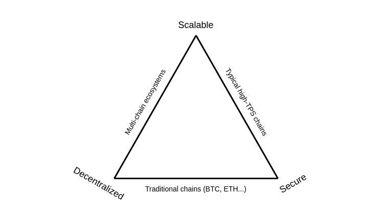

The **scalability trilemma** refers to the challenge of achieving the following three properties simultaneously in a blockchain system:

1. **Scalability** – The ability to handle a high number of transactions per second.
2. **Decentralization** – Ensuring that no single party or small group has control over the system.
3. **Security** – Maintaining integrity, resistance to attacks, and immutability.

Improving one of these aspects often comes at the cost of the others. Designing a blockchain that balances all three remains one of the most important goals in protocol development.

## Decentralization and Node Accessibility

> "The decentralization of a system is determined by the ability of the weakest node in the network to verify the rules of the system."  
> — Georgios Konstantopoulos

This quote highlights the importance of **node accessibility**. A system is only as decentralized as its least capable node's ability to participate in verifying transactions and maintaining the ledger.

> "For a blockchain to be decentralized, it's crucially important for regular users to be able to run a node, and to have a culture where running nodes is a common activity."  
> — Vitalik Buterin

Vitalik emphasizes the cultural and technical importance of **node operation by regular users**. If running a node becomes too expensive or technically challenging, decentralization suffers.

## Ethereum's Scalability Philosophy

On Ethereum, there is a **strong commitment** to maintaining low hardware requirements so that regular users can run full nodes. This is a foundational aspect of Ethereum's approach to decentralization and scalability.

Ethereum's documentation provides a **comprehensive guide** to scalability solutions, covering topics like:

- Layer 2 rollups
- Data sharding
- Statelessness
- Light clients
- Protocol upgrades

These solutions aim to increase throughput without sacrificing decentralization or security.

## Summary

- **Scalability, decentralization, and security** form the blockchain trilemma.
- **Node accessibility** is central to Ethereum’s philosophy of decentralization.
- **Ethereum's roadmap** includes many scalability solutions designed to optimize this balance.
- Developers and users are encouraged to engage with node-running practices to support network decentralization.

---

# Measuring Performance in Blockchains

Understanding how well different blockchains **scale** requires the use of performance metrics. However, comparing blockchain performance is often complex due to differing goals, designs, and trade-offs.

## Why Measuring Performance is Challenging

- Different blockchains prioritize different things:
  - **Security**
  - **Decentralization**
  - **Throughput**
- Performance metrics can be **ill-defined** or **misleading** when taken out of context.
- **Trade-offs** in architecture mean that a higher number does not always indicate a better or more secure system.

## Common Metric: Transactions Per Second (TPS)

- TPS measures how many transactions a blockchain can process every second.
- **Context is critical**: TPS can vary based on transaction complexity, block size, network usage, and consensus design.
- TPS is often used in **marketing** but may not reflect real-world usability or reliability.

## Real-World Comparisons

- **Bitcoin** and **Ethereum** process transactions at significantly lower speeds than centralized systems.
  - Estimated to be **2–3 orders of magnitude** slower than systems like **Visa**.
- **Newer Layer 1 blockchains** (e.g., Avalanche, Solana, Sui) claim performance that approaches centralized systems.
  - These improvements often come with **centralization trade-offs** or **novel architectures** that may not yet be battle-tested.

## Key Takeaways

- Be cautious when interpreting performance metrics.
- TPS alone is not sufficient to evaluate a blockchain's scalability or utility.
- Always consider the **design goals and trade-offs** of the network being evaluated.
- Newer Layer 1s may offer higher performance but often at the cost of **less decentralization** or **reduced security guarantees**.

---
# Approaches to Scalability
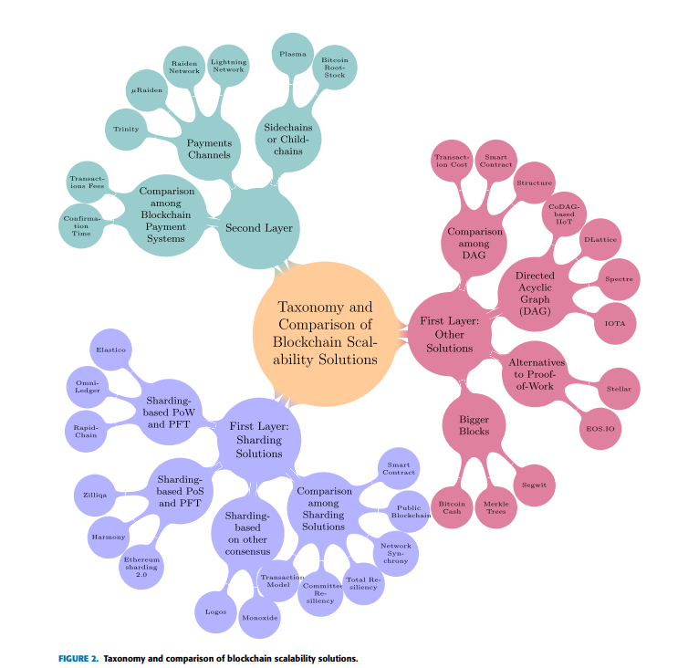

# Layer 1 Solutions

Tackling scalability at the Layer 1 (L1) level involves designing or redesigning the base protocol to improve throughput, latency, and finality. Below are several strategies and technologies being explored and implemented to enhance L1 scalability.

---

## Choice of Consensus Mechanism

Using a voting-based approach such as Byzantine Fault Tolerance (BFT) can negatively affect scalability. This is primarily due to the increase in the number of messages that need to be exchanged as the validator set grows.

- **Ethereum's Approach:** Validators form committees, and votes are aggregated within the committee to reduce overhead.

---

## Reducing Transaction Broadcasts

Some chains have explored new communication patterns to reduce network load.

- **Solana’s Innovation:**
  - Moved away from the gossip protocol.
  - Instead of broadcasting transactions to all nodes, nodes forward them directly to the leader (block producer).
  - Only the leader needs the transaction to include it in a block.

---

## Parallel Processing of Transactions

Traditional blockchains like Ethereum execute transactions sequentially, ordered by the block producer. This model is simple but introduces several limitations:

- **Drawbacks:**
  - Miner Extractable Value (MEV)
  - Poor horizontal scalability

- **Newer Chains (Solana, Aptos, Sui):**
  - Support parallel transaction execution.
  - Rely on identifying the areas of state that will be modified by each transaction.
  - Use this to determine dependencies.
  - Transactions without dependencies can be processed in parallel.

---

## Sharding

Ethereum aims to introduce **64 shard chains** to distribute network load and increase throughput.

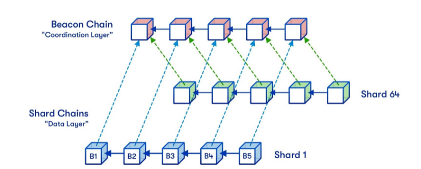

### Vitalik's Overview on Sharding Options:

1. Shards remain as **data depots** (only store data).
2. A **subset of shards** will support **smart contracts**.
3. **Wait for ZKPs** (Zero-Knowledge Proofs) to allow scalable **private transactions**.

---

## Key Limitations to Node Scalability (Vitalik's Notes)

There are three main bottlenecks to a full node’s capacity to process transactions at scale:

1. **Computing Power**
   - What percentage of CPU usage is acceptable to run a node?
   
2. **Bandwidth**
   - How many bytes can a block realistically contain, given typical internet speeds?
   
3. **Storage**
   - How much data can we expect users to store on disk?
   - What are the read speed requirements (HDD vs SSD)?

---

## Scalability Focus Areas

Many L1 scalability solutions focus on reducing the computing burden of running a node, ensuring the following:

- Efficient CPU usage
- Manageable network traffic
- Practical storage and I/O performance

---

> **Conclusion:** Layer 1 scalability is a foundational challenge in blockchain architecture. Innovations such as committee-based voting, transaction routing optimizations, parallel execution, and sharding are essential tools in overcoming these limitations.

---

# Off-Chain Scaling: Layer 2 Solutions for Blockchain Scalability

Off-chain scaling refers to techniques that process transactions outside of the main blockchain (Layer 1), while still relying on it for final settlement and security. These techniques are collectively known as **Layer 2 (L2) solutions**.

---

## Off-Chain Scaling Overview

In off-chain scaling models:

- Transactions are submitted to **Layer 2 nodes** instead of being sent directly to Layer 1 (mainnet).
- In many solutions, L2 **batches transactions** together and **anchors** them to Layer 1 in groups.
- Once anchored, the data is **secured by Layer 1** and **cannot be altered**.
- L2 solutions may be:
  - **Shared** across many applications (public Layer 2s)
  - **Dedicated** to a single project or use case (private or application-specific Layer 2s)

---

## Layer 2 Solutions on Ethereum

According to Vitalik Buterin’s blog, the evolution of Ethereum's Layer 2 protocols can be summarized as:

1. **2015** – State Channels
2. **2017** – Plasma
3. **2019** – Rollups

### The Rollup-Centric Roadmap

Ethereum’s current strategy is called the **rollup-centric roadmap**. It suggests a division of labor between layers:

- **Layer 1 (Ethereum Mainnet)**:
  - Acts as a **robust, decentralized base layer**
  - Ensures security, settlement, and data availability

- **Layer 2s**:
  - Handle **scalability and high-throughput execution**
  - Build faster, more efficient systems on top of Ethereum

> _Analogy_: Just as **courts** provide the secure foundation for enforcing contracts, Ethereum L1 provides the foundation for trust and security. It is up to **entrepreneurs and developers** to build performant applications on Layer 2, much like businesses build on the legal system.

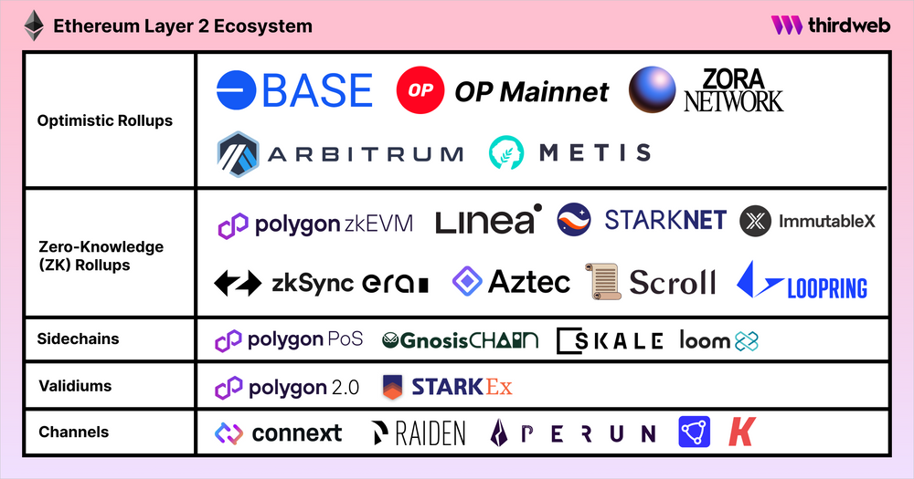

### Recent Progress (as of 2024–2025)

- **EIP-4844** introduced **blobs** to increase L1 data availability for rollups.
- Multiple **EVM-compatible rollups** have reached **stage 1 maturity**.
- Ethereum has become a **pluralistic ecosystem**, where each L2 acts like a **shard** with its own rules and logic.

The challenge now is to **complete this vision** by solving remaining issues while maintaining Ethereum’s **security and decentralization**.

---

## Rollups

Rollups are a key Layer 2 scaling technique.
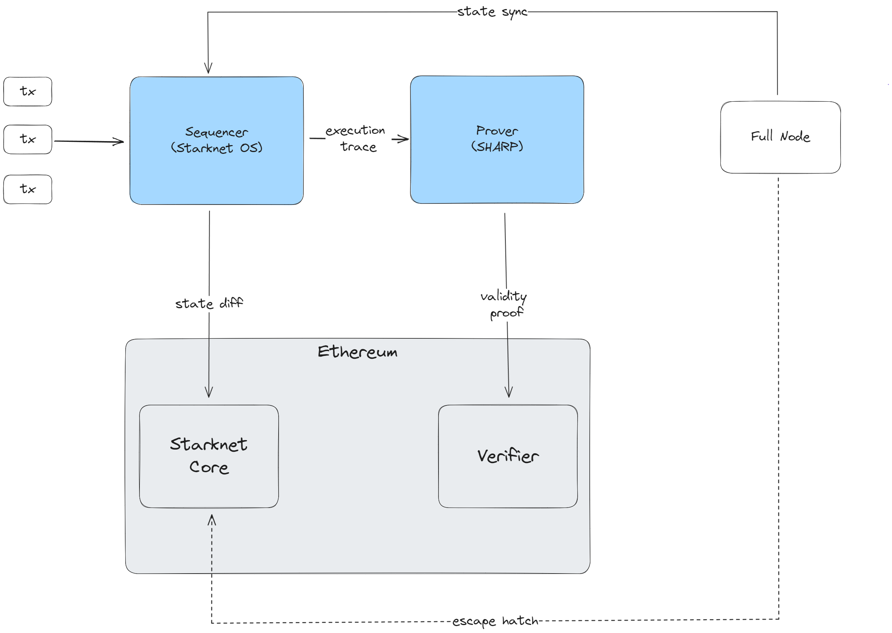

### Key Characteristics of Rollups

- **Transaction execution happens off-chain (on L2)**.
- **Data or proof of those transactions is posted on-chain (on L1)**.
- A **Rollup smart contract on Layer 1** verifies the correctness of Layer 2 execution using the on-chain data.
- **Layer 1** holds the **funds and commitments**.
- **Layer 2** holds the **state and handles execution**.

### Rollup Security Models

Rollups depend on **proofs** to ensure that off-chain transactions are correctly processed. Two main types exist:

1. **Zero Knowledge Proof Rollups (ZK-Rollups)**:
   - Use **validity proofs** (often zero-knowledge-based) to prove correctness.
   - The proof is verified by an L1 contract.
   - If the proof is valid, the transaction is accepted.
   - While the term “zero knowledge” is used, most implementations make the data public—what matters is **verifiable correctness**, not privacy.

### What Are They?

ZKP rollups rely on **cryptographic proofs** that verify the **correctness of execution** for a batch of transactions. This proof is submitted to a **validator smart contract** on Layer 1.

### Key Characteristics

- A **proof of correct state transition** is mandatory for the L1 contract to accept changes from L2.
- The **state transition on Layer 2 is only valid if the proof is verified** on Layer 1.
- Although these systems use **zero-knowledge proofs**, the **privacy aspect is usually ignored**.
  - Inputs and data are often **public**.
  - The focus is on **verifiable correctness**, not secrecy.

### Terminology

- For this reason, many in the community prefer the term **"validity proofs"** instead of zero-knowledge proofs when discussing rollups.

2. **Optimistic Rollups**:
   - Assume transactions are valid by default (“optimistic” assumption).
   - Do **not submit a proof immediately**.
   - Allow a **challenge window**, during which anyone can submit a **fraud proof** if they detect incorrect execution.
   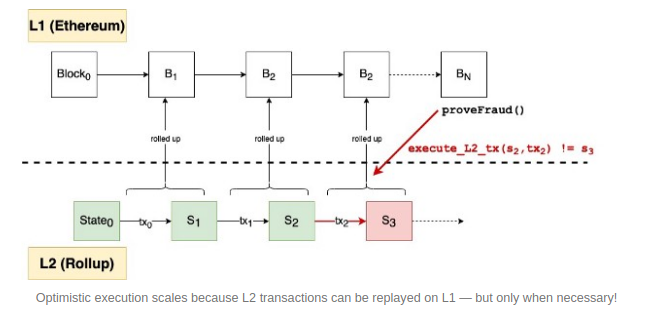

   ### What Are They?

Optimistic rollups take a different approach. The term "optimistic" refers to the fact that the system **assumes transactions are valid by default**, without submitting a proof of correctness upfront.

### Key Characteristics

- Aggregators **publish only minimal transaction data** on Layer 1.
- No proof is provided unless **fraud is suspected**.
- The system includes a **challenge window**, allowing any participant to submit a **fraud proof** if a transaction appears invalid.

### Why the Term "Rollup"?

- Transactions are **bundled together** before being submitted to Layer 1.
- This process of grouping and committing transactions is known as **"rolling up"**.

### Rollup Operators

- Rollups require **operators** to stake a **bond** in the rollup contract.
- This bond incentivizes the operator to act honestly.
- If they publish fraudulent or incorrect data, they may lose their bond through slashing mechanisms.

## Summary

| Feature                    | ZKP (Validity) Rollups               | Optimistic Rollups                    |
|----------------------------|--------------------------------------|----------------------------------------|
| Proof Submitted            | Always                               | Only if fraud is suspected             |
| Assumption Model           | Valid only if proven                 | Assumed valid unless proven fraudulent |
| Proof Type                 | Cryptographic validity proof         | Fraud proof                            |
| Privacy                    | Not a priority (data often public)   | Not a priority                         |
| Finality Time              | Fast (after proof verification)      | Slower (due to challenge window)       |

---

##  Types of Fraud Proof Systems (Kelvin Fichter Classification)

Fraud-proof systems vary in terms of decentralization and trust assumptions:

### Level 1: Centralized Admin

- Only the **admin** can upgrade the system and submit proofs.
- System is **entirely permissioned** during the challenge window.

### Level 2: Permissioned Provers

- Still has an admin, but also allows a **small set of whitelisted entities** to submit fraud proofs.

### Level 3: Permissionless Proofs with Admin Upgrades

- Anyone can submit fraud proofs.
- **Admin can still upgrade** the system during the challenge period.

### Level 4: Fully Permissionless

- **No upgrades allowed** until users have had time to exit.
- Represents the **ideal trustless model** for Optimistic Rollups.

---

##  What Is an Optimistic Rollup?

An **Optimistic Rollup** is a **Layer 2 (L2)** scaling solution that assumes all transactions are valid unless proven otherwise.

- Transactions are **executed off-chain**.
- A summary (or state root) is **posted to Layer 1 (Ethereum)**.
- Includes a **challenge window** (typically ~7 days).
- If fraud is detected, a **fraud proof** is submitted.
- **Malicious actors are penalized** via bond slashing.

---

##  Key Features

- ✅ **High scalability** — greatly reduces L1 congestion and gas fees.
- ✅ **Ethereum-secured** — ultimately settled and validated on L1.
- ✅ **Lower transaction costs** than Ethereum mainnet.
- ❗ **Finality is delayed** due to fraud-proof window.

---

##  Example Optimistic Rollup Projects

### 1. **Optimism**

- One of the earliest and most adopted Optimistic Rollups.
- Fully **EVM-compatible**.
- Uses a system of **sequencers** and **fraud proofs**.
- Widely adopted by DeFi and NFT projects.
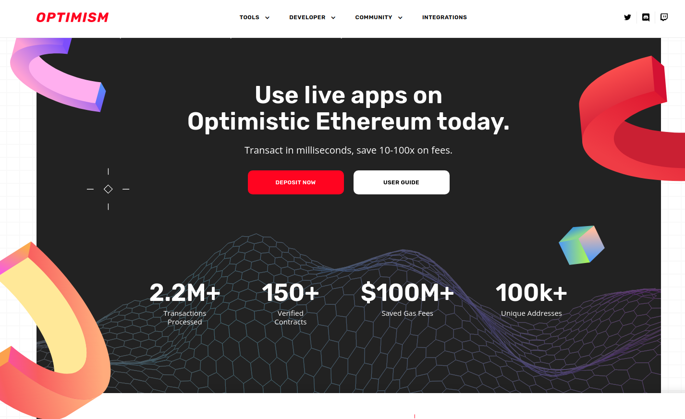

### 2. **Arbitrum**

- Developed by **Offchain Labs**.
- Offers two major networks:
- **Arbitrum One** (general-purpose)
- **Arbitrum Nova** (for gaming/social apps)
- Uses a **custom virtual machine (AVM)** for enhanced performance.
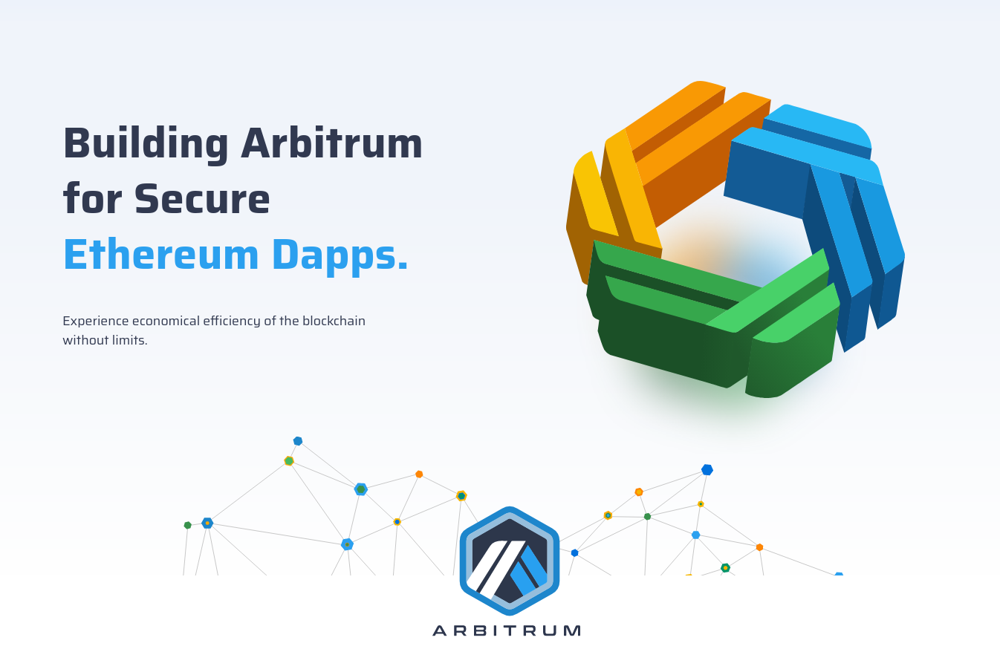

---

##  Comparison Table

| Feature           | Optimism                   | Arbitrum                   |
|-------------------|-----------------------------|-----------------------------|
| Compatibility     | Fully EVM compatible        | Fully EVM compatible        |
| Launch Year       | 2021                        | 2021                        |
| Security Model    | Fraud proofs                | Fraud proofs                |
| Finality Delay    | ~7 days                     | ~7 days                     |
| Use Cases         | DeFi, NFTs, general purpose | DeFi, gaming, general use   |

---

##  Final Thoughts

Optimistic Rollups are a key component of Ethereum’s **scaling strategy**, especially under the **rollup-centric roadmap** proposed by Vitalik Buterin. As infrastructure continues to improve, projects like Optimism and Arbitrum are bringing Ethereum closer to scalable, low-cost mass adoption.

---

# Zero Knowledge Proof Rollups (ZK Rollups)

In the context of blockchain scalability, **ZK Rollups**—often referred to as **validity rollups**—are Layer 2 solutions that execute transactions off-chain and use **zero-knowledge proofs** to verify and enforce correctness on-chain. Although these systems use zero-knowledge proof technology (like SNARKs and STARKs), the **privacy feature of zero-knowledge** is typically unused. Hence, they are more accurately described as **validity proofs**.

---

##  What Is the ZK Rollup Process?

A **ZK Rollup** is a **Layer 2 (L2) scaling solution** that moves transaction execution off the Ethereum mainnet (L1) while using **cryptographic proofs** to ensure the correctness of the off-chain computations. This process enables high throughput, lower transaction costs, and strong security guarantees.

### Step-by-Step Process

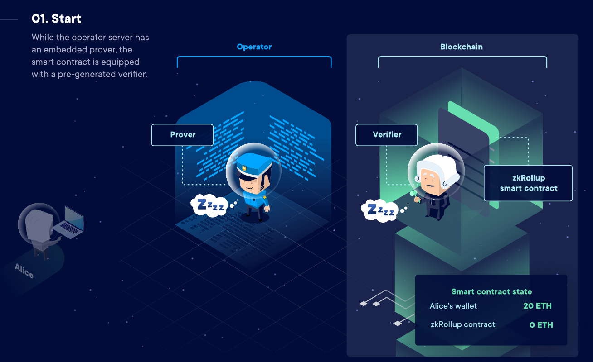
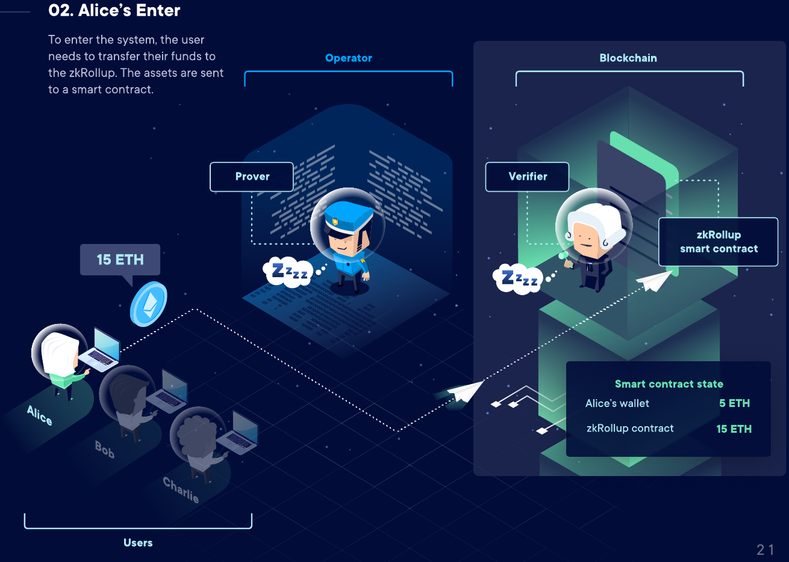
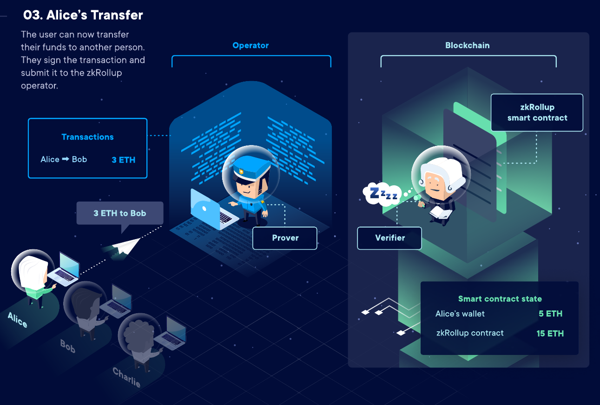
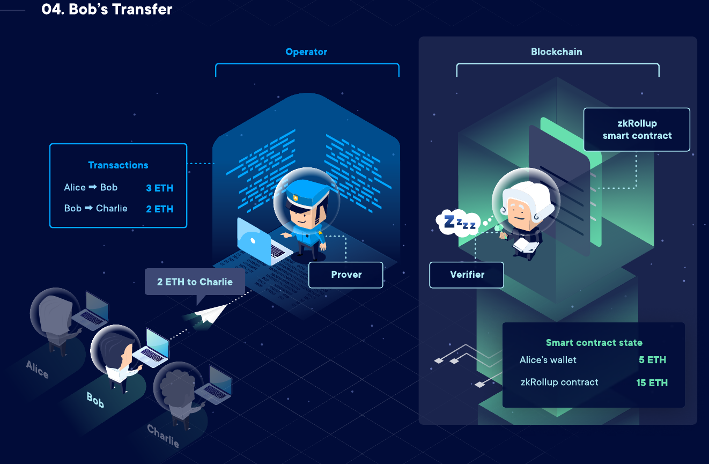
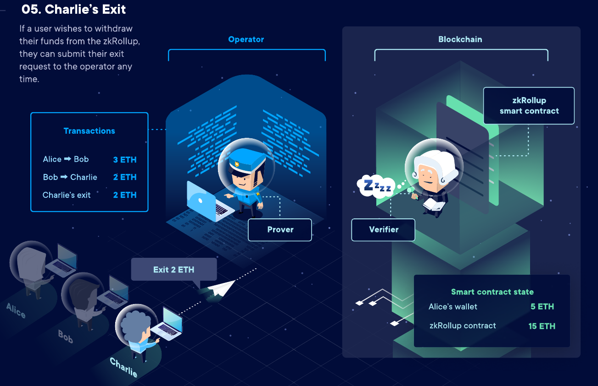
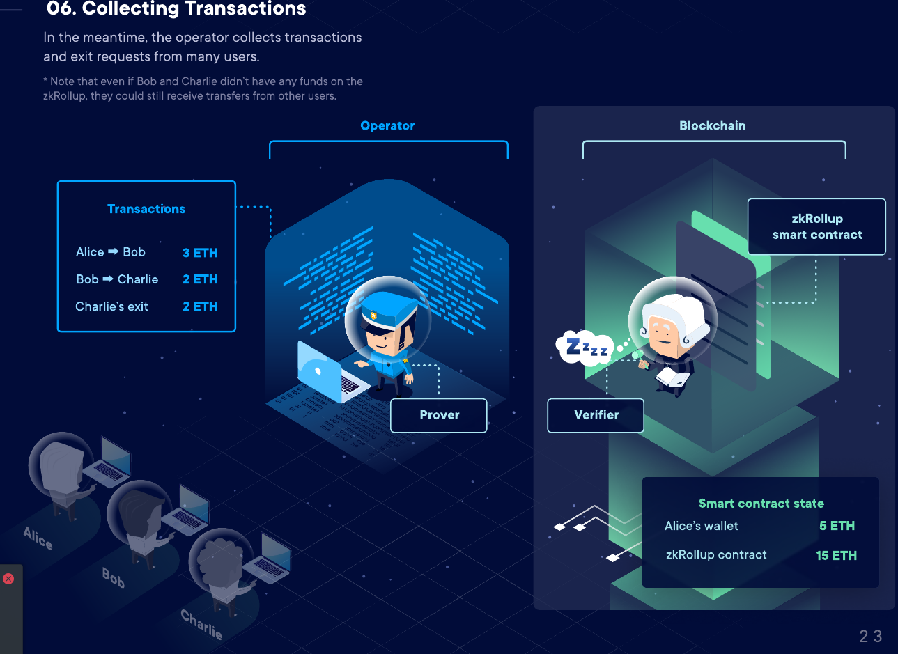
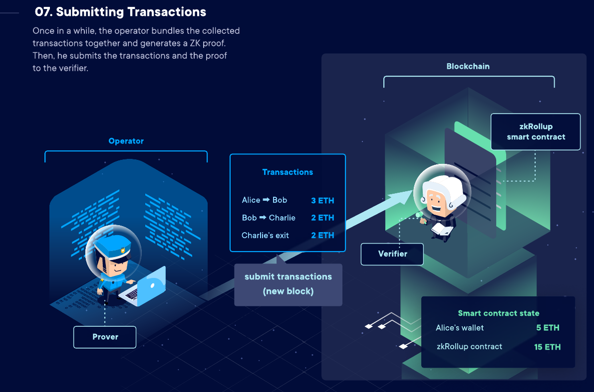
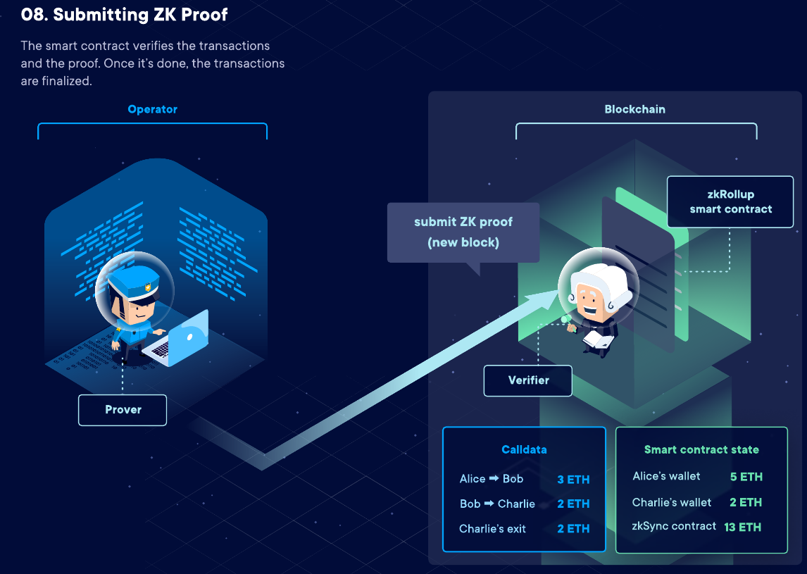

---

#  Data Compression in ZK Rollups

###  What Problem Are We Solving?

As Vitalik explains, each rollup transaction still takes up on-chain data space. For example:
- An ERC-20 transfer takes ~180 bytes.
- With 16 MB blocks, the theoretical cap is:
  

16000000 / 12 / 180 ≈ 7407 transactions per second (TPS)

To scale beyond this, we must **reduce the per-transaction data footprint**.

###  Compression Techniques

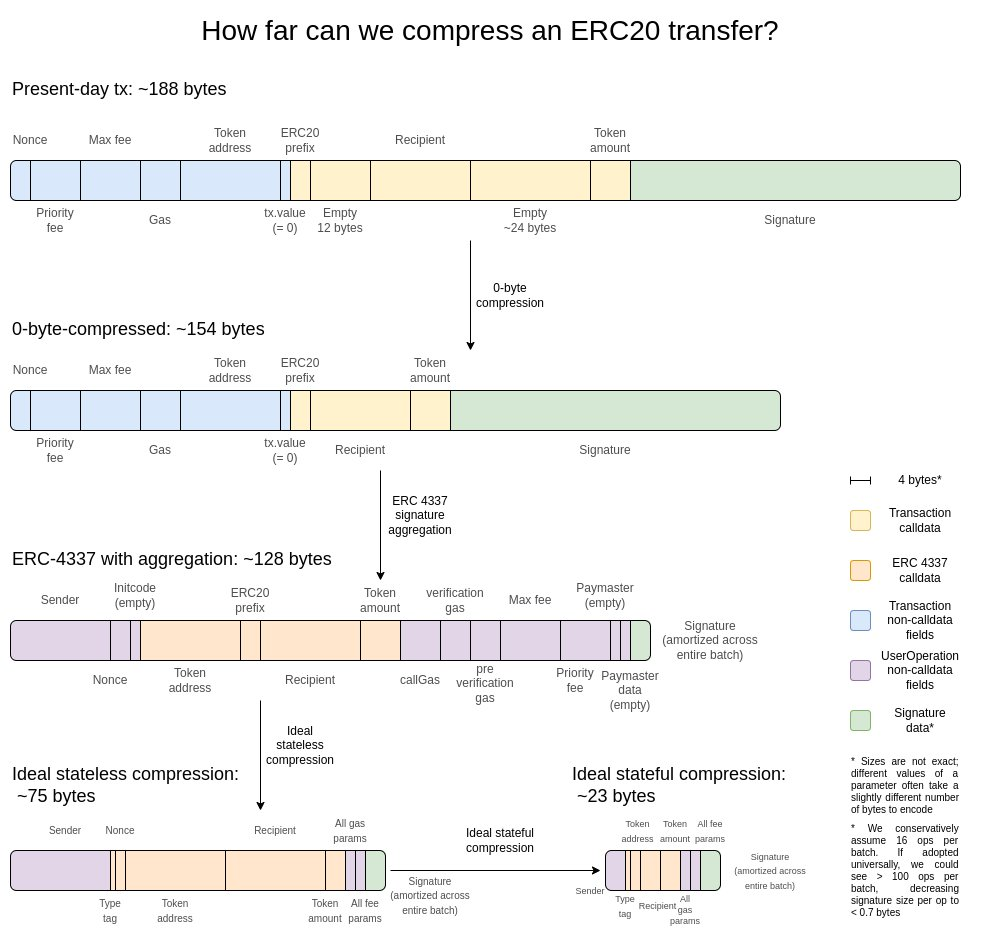

1. **Zero-Byte Compression**
 - Replace long runs of zero bytes with a short code indicating their count.

2. **Signature Aggregation**
 - Use **BLS signatures** to aggregate multiple user signatures into one.
 - Reduces space dramatically but adds computational cost.
 - Suitable for L2s where bandwidth is more valuable than compute.

3. **Address Compression via Pointers**
 - If an address has appeared before, replace it with a **4-byte pointer** to that address in history.
 - Saves 16 bytes per address.
 - Requires a portion of the **historical state to be cached**.

4. **Compact Transaction Values**
 - Most ETH values have few significant digits (e.g., 0.25 ETH = 250,000,000,000,000,000 wei).
 - Use **custom decimal formats or dictionaries** for common values.

---

#  Data Availability

### Why It Matters

To reconstruct the L2 state, participants need access to the **raw transaction data**. The question is **where this data is stored** and **how we ensure its availability**.
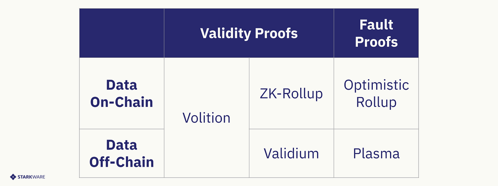

### StarkNet Example

- StarkNet operates in ZK-Rollup mode.
- On every state update:
- The **state diff** is posted to Ethereum as **calldata**.
- Anyone watching Ethereum can reconstruct StarkNet’s current state.

### Important Notes

- Only a **valid ZK proof** is needed to update L1 state.
- However, that **proof alone is not enough** to understand how the state changed.
- Additional **transaction data must be published** to enable independent state tracking and validation.

---

# L2BEAT Overview

**L2BEAT** is an analytics and research platform dedicated to Ethereum Layer 2 (L2) scaling solutions. It provides in-depth comparisons of major L2 protocols, offering insights into their maturity, security, and decentralization.

---

##  What Is L2BEAT?

L2BEAT serves as a comprehensive resource for tracking and analyzing the state of Ethereum's Layer 2 ecosystem. The platform focuses on:

- **Total Value Secured (TVS)**: A metric that encompasses all assets managed by a project, including those that are not actively used in decentralized applications (dApps).
- **Project Maturity**: Evaluating the development stage of each L2 solution, categorized into stages such as Stage 0 (early development) and Stage 1 (more mature with enhanced decentralization).
- **Security and Decentralization**: Assessing the trust assumptions and governance structures of L2 protocols to ensure they align with Ethereum's principles.

---

##  Key Features

### 1. **Project Rankings and Metrics**

L2BEAT ranks L2 projects based on their Total Value Secured (TVS), providing a snapshot of the assets managed by each protocol. For instance:

- **Arbitrum One**: TVS of $14.20 billion, classified as an Optimistic Rollup at Stage 1.
- **Base**: TVS of $12.32 billion, also an Optimistic Rollup at Stage 1.
- **zkSync Era**: TVS of $983.92 million, a ZK Rollup at Stage 0.

These rankings help users understand the scale and adoption of various L2 solutions.

### 2. **Stage Framework**

L2BEAT introduces a "Stage" framework to evaluate the maturity of L2 projects:

- **Stage 0**: Projects are in early development stages with centralized control mechanisms.
- **Stage 1**: Projects have implemented mechanisms to ensure decentralization and security, such as fraud proofs and governance structures.

This framework aids in assessing the readiness and reliability of L2 solutions.

### 3. **Data Availability Risk Framework**

L2BEAT has developed a framework to assess the risks associated with data availability in L2 systems. This includes:

- **DA Layer Security**: Evaluating the economic and reputational security of the data availability layer.
- **DA Bridge Security**: Assessing the security of bridges facilitating data transfer between L1 and L2.

Understanding these risks is crucial for users and developers to ensure the integrity of L2 networks.

---

##  Ecosystem Insights

L2BEAT provides detailed information on various L2 projects, including:

- **Arbitrum One**: A widely adopted Optimistic Rollup offering scalability solutions.
- **zkSync Era**: A ZK Rollup focusing on Ethereum Virtual Machine (EVM) compatibility.
- **Starknet**: A ZK Rollup utilizing STARK proofs for scalability.

Each project's profile includes metrics like TVS, governance structures, and development stages, enabling users to make informed decisions.

---

##  Methodology & Transparency

L2BEAT emphasizes transparency in its assessments:

- **TVS Calculation**: Differentiates between assets locked in DeFi applications and those bridged or minted on L2 but not actively used.
- **Stage Designation**: Provides clear criteria for categorizing projects into different stages based on their decentralization and security features.

This approach ensures that users have access to reliable and consistent information.

---

##  Explore More

For detailed comparisons and analyses of Ethereum Layer 2 scaling solutions, visit [L2BEAT](https://l2beat.com/scaling/summary).

---

*Note: The information provided here is based on publicly available data as of July 2025 and is subject to change as the Ethereum Layer 2 ecosystem evolves.*

---

# Layer 2 Components

Layer 2 chains vary in their specific implementations, but generally follow a similar design pattern consisting of several key components.

---

## Key Components

### 1. Sequencer / Operator
- Acts as the **coordinator** of the Layer 2 chain.
- Accepts incoming transactions from users.
- Passes transactions to a **Virtual Machine (VM)** for execution.
- Batches and compresses transactions.
- Submits the batch along with a **proof** to the Layer 1 (L1) chain.

### 2. Layer 1 Contract
- A smart contract deployed on Ethereum **Layer 1**.
- Receives transaction batches from the Layer 2 sequencer.
- For **validity rollups**, verifies the cryptographic proof to ensure correctness.
- Enforces the finality and security of Layer 2 transactions.

### 3. Proof Aggregation Components (Optional)
- In some designs, the proof generation and verification responsibilities are split.
- Components may handle **aggregation of multiple proofs** before submitting a single proof to L1.
  
### 4. Messaging Between L1 and L2
- Supports communication outside the basic transaction submission path.
- Specialized contracts on both L1 and L2 process messages such as:
  - **Deposits** of funds into the Layer 2 chain.
  - Other **cross-layer interactions** for interoperability and state synchronization.

---

## Example: Arbitrum Design
- Arbitrum’s architecture includes similar components:
  - A sequencer coordinating transactions and batches.
  - Smart contracts on Ethereum L1 to manage batch receipts and proof verification.
  - Messaging mechanisms for user deposits and withdrawals.

---

This modular design allows Layer 2 chains to efficiently scale Ethereum by offloading execution while maintaining security through Layer 1.
