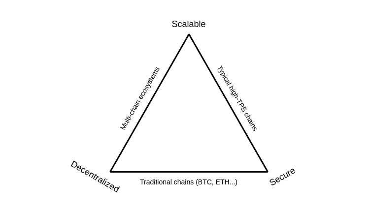
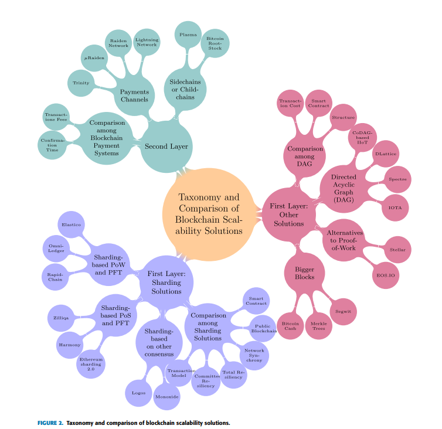
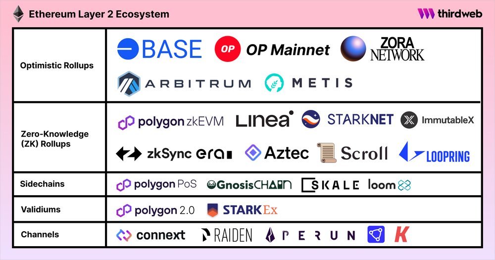
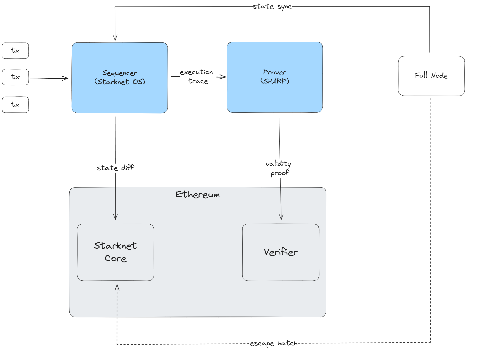
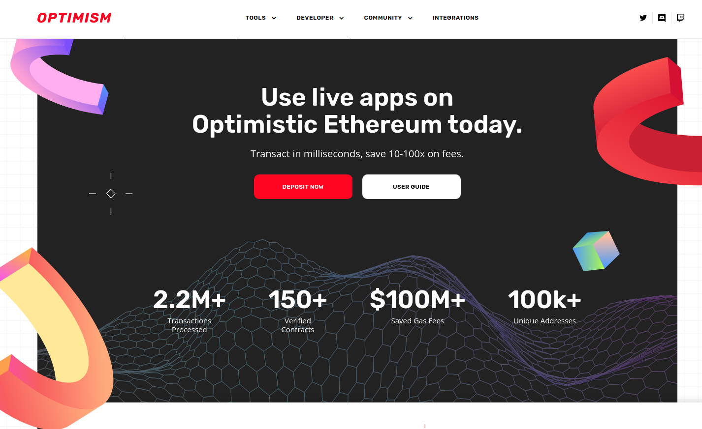
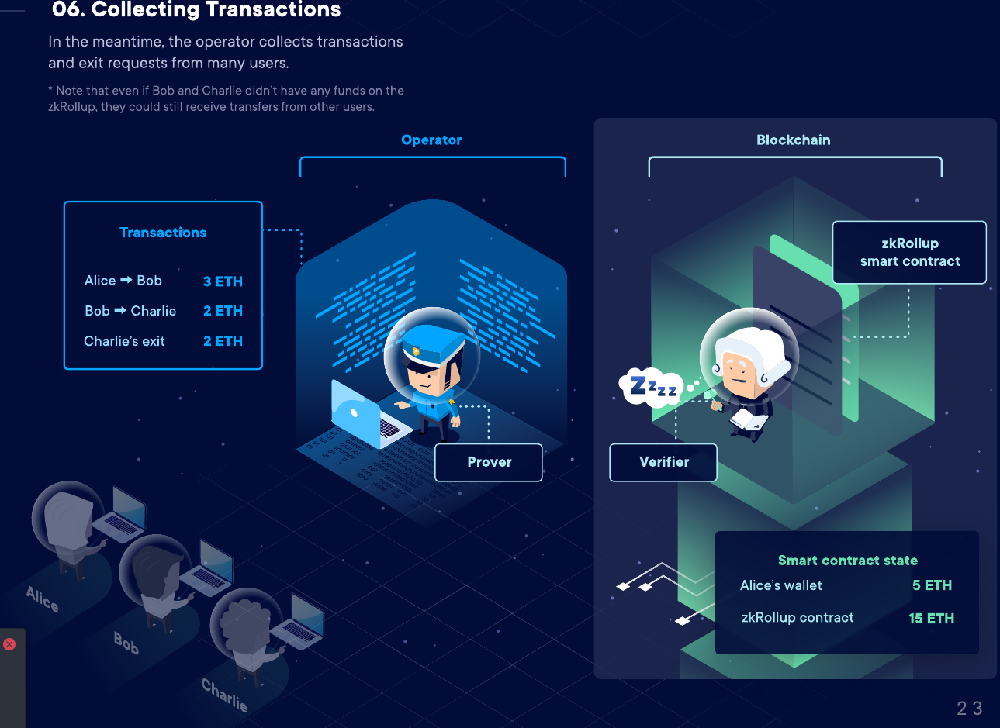
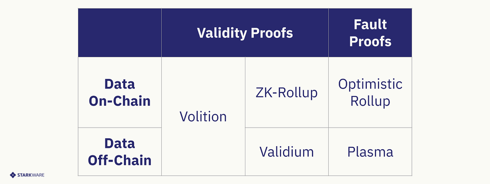

# مقدمه‌ای بر مقیاس‌پذیری

مقیاس‌پذیری یکی از دغدغه‌های کلیدی در سیستم‌های بلاک‌چین است، به‌ویژه زمانی که هدف حفظ عدم تمرکز و امنیت همزمان با افزایش توان تراکنش‌ها باشد. این مفهوم اغلب در زمینه **مثلث مقیاس‌پذیری** مطرح می‌شود.

## مثلث مقیاس‌پذیری

**مثلث مقیاس‌پذیری** به چالش دستیابی همزمان به سه ویژگی زیر در یک سیستم بلاک‌چین اشاره دارد:

1. **مقیاس‌پذیری** – توانایی پردازش تعداد بالایی تراکنش در ثانیه.
2. **عدم تمرکز** – اطمینان از اینکه هیچ فرد یا گروه کوچکی کنترل سیستم را در دست ندارد.
3. **امنیت** – حفظ تمامیت، مقاومت در برابر حملات و تغییرناپذیری.

بهبود یکی از این جنبه‌ها معمولاً به قیمت دیگری تمام می‌شود. طراحی بلاک‌چینی که هر سه را به‌صورت متعادل داشته باشد، یکی از اهداف مهم توسعه پروتکل است.

## عدم تمرکز و دسترسی نودها

> "عدم تمرکز یک سیستم با توانایی ضعیف‌ترین نود در شبکه برای تأیید قوانین سیستم تعیین می‌شود."  
> — جورجیوس کنستانتوپولوس

این جمله اهمیت **دسترسی نودها** را برجسته می‌کند. یک سیستم فقط به اندازه توان نود ضعیف‌ترش در تأیید تراکنش‌ها و نگهداری دفتر کل، غیرمتمرکز است.

> "برای اینکه یک بلاک‌چین غیرمتمرکز باشد، اهمیت حیاتی دارد که کاربران عادی بتوانند نود اجرا کنند و فرهنگی وجود داشته باشد که اجرای نود فعالیتی رایج باشد."  
> — ویتالیک بوترین

ویتالیك اهمیت فرهنگی و فنی **اجرای نود توسط کاربران عادی** را تأکید می‌کند. اگر اجرای نود بسیار پرهزینه یا پیچیده شود، عدم تمرکز آسیب می‌بیند.

## فلسفه مقیاس‌پذیری اتریوم

در اتریوم، تعهد **قوی به حفظ حداقل نیازهای سخت‌افزاری** وجود دارد تا کاربران عادی بتوانند نودهای کامل اجرا کنند. این موضوع پایه‌ای برای رویکرد اتریوم در عدم تمرکز و مقیاس‌پذیری است.

مستندات اتریوم راهنمای **جامعی برای راهکارهای مقیاس‌پذیری** ارائه می‌کند، شامل موضوعاتی مانند:

- رول‌آپ‌های لایه ۲  
- شاردینگ داده  
- بدون حالت (statelessness)  
- کلاینت‌های سبک  
- ارتقاء پروتکل  

این راهکارها هدف افزایش توان عملیاتی بدون قربانی کردن عدم تمرکز یا امنیت را دنبال می‌کنند.

## خلاصه

- **مقیاس‌پذیری، عدم تمرکز و امنیت** مثلث بلاک‌چین را شکل می‌دهند.  
- **دسترسی نود** مرکزی‌ترین بخش فلسفه عدم تمرکز اتریوم است.  
- **نقشه راه اتریوم** شامل راهکارهای متعددی برای بهینه‌سازی این تعادل است.  
- توسعه‌دهندگان و کاربران تشویق می‌شوند که به اجرای نود بپردازند تا از عدم تمرکز شبکه حمایت کنند.

---

# اندازه‌گیری عملکرد در بلاک‌چین‌ها

برای فهمیدن اینکه بلاک‌چین‌های مختلف چقدر خوب **مقیاس‌پذیری** دارند، باید از معیارهای عملکرد استفاده کرد. با این حال، مقایسه عملکرد بلاک‌چین‌ها اغلب پیچیده است به‌خاطر اهداف، طراحی‌ها و مصالحه‌های متفاوت.

## چرا اندازه‌گیری عملکرد چالش‌برانگیز است

- بلاک‌چین‌های مختلف روی چیزهای متفاوت تمرکز دارند:  
  - **امنیت**  
  - **عدم تمرکز**  
  - **توان عملیاتی**  
- معیارهای عملکرد ممکن است در صورت خارج شدن از زمینه، **نامشخص** یا **گمراه‌کننده** باشند.  
- مصالحه‌های معماری به این معناست که عدد بزرگ‌تر همیشه نشان‌دهنده سیستم بهتر یا امن‌تر نیست.

## معیار رایج: تراکنش در ثانیه (TPS)

- TPS اندازه می‌گیرد که یک بلاک‌چین چه تعداد تراکنش را در هر ثانیه می‌تواند پردازش کند.  
- **زمینه مهم است**: TPS می‌تواند بسته به پیچیدگی تراکنش، اندازه بلاک، استفاده شبکه و طراحی اجماع متفاوت باشد.  
- TPS معمولاً در **بازاریابی** استفاده می‌شود اما ممکن است بازتاب‌دهنده قابلیت استفاده یا اطمینان دنیای واقعی نباشد.

## مقایسه‌های دنیای واقعی

- **بیت‌کوین** و **اتریوم** تراکنش‌ها را با سرعتی به مراتب کمتر از سیستم‌های متمرکز پردازش می‌کنند.  
  - تخمین زده می‌شود **۲ تا ۳ مرتبه** کندتر از سیستم‌هایی مانند **ویزا** باشند.  
- بلاک‌چین‌های جدید لایه ۱ (مانند آوالانچ، سولانا، سوئی) عملکردی نزدیک به سیستم‌های متمرکز ادعا می‌کنند.  
  - این پیشرفت‌ها معمولاً همراه با **مصالحه‌های عدم تمرکز** یا معماری‌های جدید هستند که ممکن است هنوز کاملاً آزمایش نشده باشند.

## نکات کلیدی

- در تفسیر معیارهای عملکرد محتاط باشید.  
- TPS به تنهایی برای ارزیابی مقیاس‌پذیری یا کارایی بلاک‌چین کافی نیست.  
- همیشه اهداف طراحی و مصالحه‌های شبکه را در نظر بگیرید.  
- لایه ۱های جدید ممکن است عملکرد بالاتری ارائه دهند اما معمولاً به قیمت **کاهش عدم تمرکز** یا **کاهش تضمین‌های امنیتی**.

---

# رویکردهای مقیاس‌پذیری  

---

# راهکارهای لایه ۱

مقابله با مقیاس‌پذیری در سطح لایه ۱ (L1) شامل طراحی یا بازطراحی پروتکل پایه برای بهبود توان عملیاتی، تأخیر و نهایی شدن تراکنش‌ها است. در ادامه چند استراتژی و فناوری که برای بهبود مقیاس‌پذیری L1 در حال بررسی و پیاده‌سازی هستند آورده شده است.

---

## انتخاب مکانیزم اجماع

استفاده از روش رأی‌گیری مانند تحمل خطای بیزانسی (BFT) می‌تواند مقیاس‌پذیری را تحت تأثیر منفی قرار دهد. این عمدتاً به دلیل افزایش تعداد پیام‌هایی است که باید با افزایش تعداد اعتبارسنج‌ها رد و بدل شود.

- **رویکرد اتریوم:** اعتبارسنج‌ها کمیته تشکیل می‌دهند و رأی‌ها در داخل کمیته جمع‌آوری می‌شوند تا سربار کاهش یابد.

---

## کاهش پخش تراکنش‌ها

برخی زنجیره‌ها الگوهای ارتباطی جدیدی برای کاهش بار شبکه بررسی کرده‌اند.

- **نوآوری سولانا:**
  - از پروتکل گاسپ (gossip) فاصله گرفت.
  - به جای پخش تراکنش‌ها به تمام نودها، نودها تراکنش‌ها را مستقیماً به رهبر (تولیدکننده بلاک) ارسال می‌کنند.
  - تنها رهبر به تراکنش نیاز دارد تا آن را در بلاک قرار دهد.

---

## پردازش موازی تراکنش‌ها

بلاک‌چین‌های سنتی مانند اتریوم تراکنش‌ها را به ترتیب و به صورت متوالی اجرا می‌کنند که مدل ساده‌ای است اما محدودیت‌هایی دارد:

- **معایب:**
  - استخراج ارزش توسط ماینر (MEV)
  - مقیاس‌پذیری افقی ضعیف

- **زنجیره‌های جدیدتر (سولانا، آپتوس، سوئی):**
  - پشتیبانی از اجرای موازی تراکنش‌ها.
  - بر شناسایی بخش‌های حالت که توسط هر تراکنش تغییر می‌یابد تکیه دارند.
  - از این برای تعیین وابستگی‌ها استفاده می‌کنند.
  - تراکنش‌هایی که وابستگی ندارند، می‌توانند به صورت موازی پردازش شوند.

---

## شاردینگ

اتریوم هدف دارد که **۶۴ شارد چین** معرفی کند تا بار شبکه توزیع شود و توان عملیاتی افزایش یابد.

### مرور ویتالیک بر گزینه‌های شاردینگ:

1. شاردها به عنوان **مخازن داده** باقی بمانند (فقط داده ذخیره کنند).  
2. **زیرمجموعه‌ای از شاردها** از **قراردادهای هوشمند** پشتیبانی کنند.  
3. منتظر **اثبات‌های دانش صفر (ZKP)** بمانیم تا امکان **تراکنش‌های خصوصی مقیاس‌پذیر** فراهم شود.

---

## محدودیت‌های کلیدی در مقیاس‌پذیری نود (یادداشت‌های ویتالیک)

سه گلوگاه اصلی در ظرفیت یک نود کامل برای پردازش تراکنش‌ها به صورت گسترده وجود دارد:

1. **توان محاسباتی**  
   - چه درصدی از مصرف CPU برای اجرای نود قابل قبول است؟

2. **پهنای باند**  
   - یک بلاک به طور واقعی چند بایت می‌تواند داشته باشد با توجه به سرعت‌های معمول اینترنت؟

3. **حافظه ذخیره‌سازی**  
   - انتظار داریم کاربران چقدر داده روی دیسک ذخیره کنند؟  
   - نیازمندی‌های سرعت خواندن (HDD در مقابل SSD) چیست؟

---

## حوزه‌های تمرکز مقیاس‌پذیری

بسیاری از راهکارهای مقیاس‌پذیری لایه ۱ بر کاهش بار محاسباتی اجرای نود تمرکز دارند تا موارد زیر را تضمین کنند:

- استفاده بهینه از CPU  
- ترافیک شبکه قابل مدیریت  
- عملکرد عملی ذخیره‌سازی و ورودی/خروجی

---

> **نتیجه‌گیری:** مقیاس‌پذیری لایه ۱ یکی از چالش‌های بنیادی در معماری بلاک‌چین است. نوآوری‌هایی مانند رأی‌گیری مبتنی بر کمیته، بهینه‌سازی مسیر تراکنش، اجرای موازی و شاردینگ ابزارهای ضروری برای غلبه بر این محدودیت‌ها هستند.

---

# مقیاس‌پذیری خارج از زنجیره: راهکارهای لایه ۲ برای مقیاس‌پذیری بلاک‌چین

مقیاس‌پذیری خارج از زنجیره به تکنیک‌هایی گفته می‌شود که تراکنش‌ها را خارج از بلاک‌چین اصلی (لایه ۱) پردازش می‌کنند، در حالی که همچنان برای تسویه نهایی و امنیت به آن متکی هستند. این تکنیک‌ها به طور کلی به عنوان **راهکارهای لایه ۲ (L2)** شناخته می‌شوند.

---

## مرور مقیاس‌پذیری خارج از زنجیره

در مدل‌های مقیاس‌پذیری خارج از زنجیره:

- تراکنش‌ها به **نودهای لایه ۲** ارسال می‌شوند، نه مستقیماً به لایه ۱ (شبکه اصلی).  
- در بسیاری از راهکارها، L2 تراکنش‌ها را **دسته‌بندی (batch)** می‌کند و آنها را به صورت گروهی به لایه ۱ متصل می‌کند.  
- پس از اتصال، داده توسط لایه ۱ **ایمن شده و قابل تغییر نیست**.  
- راهکارهای L2 ممکن است:  
  - **مشترک** بین برنامه‌های مختلف (لایه ۲ عمومی) باشند  
  - **اختصاصی** برای یک پروژه یا کاربرد خاص (لایه ۲ خصوصی یا اختصاصی)

---

## راهکارهای لایه ۲ در اتریوم

طبق وبلاگ ویتالیک بوترین، تکامل پروتکل‌های لایه ۲ اتریوم را می‌توان خلاصه کرد:

1. **۲۰۱۵** – کانال‌های حالت (State Channels)  
2. **۲۰۱۷** – پلاسما (Plasma)  
3. **۲۰۱۹** – رول‌آپ‌ها (Rollups)

### نقشه راه مبتنی بر رول‌آپ‌ها

استراتژی فعلی اتریوم به نام **نقشه راه مبتنی بر رول‌آپ** شناخته می‌شود که تقسیم وظایف بین لایه‌ها را پیشنهاد می‌کند:

- **لایه ۱ (شبکه اصلی اتریوم):**  
  - به عنوان یک لایه پایه **مقاوم و غیرمتمرکز** عمل می‌کند  
  - امنیت، تسویه و در دسترس بودن داده‌ها را تضمین می‌کند

- **لایه ۲ها:**  
  - مسئول **مقیاس‌پذیری و اجرای با توان بالا** هستند  
  - سیستم‌های سریع‌تر و کارآمدتر را روی اتریوم می‌سازند

> _تشبیه_: درست مانند اینکه **دادگاه‌ها** پایه‌ای امن برای اجرای قراردادها فراهم می‌کنند، لایه ۱ اتریوم پایه اعتماد و امنیت است. این وظیفه **کارآفرینان و توسعه‌دهندگان** است که برنامه‌های پرکاربرد را روی لایه ۲ بسازند، درست مثل کسب‌وکارها که روی سیستم حقوقی بنا می‌کنند.

### پیشرفت‌های اخیر (تا سال ۲۰۲۴–۲۰۲۵)

- **EIP-4844** ویژگی **blobها** را معرفی کرد تا قابلیت در دسترس بودن داده‌های لایه ۱ برای رول‌آپ‌ها افزایش یابد.  
- چندین رول‌آپ سازگار با EVM به **مرحله بلوغ ۱** رسیدند.  
- اتریوم به یک **اکوسیستم چندگانگی** تبدیل شده که هر L2 مانند یک **شارد** با قوانین و منطق خاص خود عمل می‌کند.

چالش اکنون این است که **این چشم‌انداز را کامل کنیم** و مسائل باقی‌مانده را حل کنیم در حالی که **امنیت و عدم تمرکز اتریوم** حفظ شود.

---

## رول‌آپ‌ها

رول‌آپ‌ها تکنیک کلیدی مقیاس‌پذیری لایه ۲ هستند.  

### ویژگی‌های کلیدی رول‌آپ‌ها

- **اجرای تراکنش‌ها خارج از زنجیره (روی لایه ۲)** انجام می‌شود.  
- **داده یا اثبات تراکنش‌ها روی زنجیره (لایه ۱) منتشر می‌شود.**  
- یک **قرارداد هوشمند رول‌آپ روی لایه ۱** صحت اجرای لایه ۲ را با استفاده از داده‌های روی زنجیره تأیید می‌کند.  
- **لایه ۱** وجوه و تعهدات را نگه می‌دارد.  
- **لایه ۲** حالت را نگه داشته و اجرای تراکنش‌ها را مدیریت می‌کند.

### مدل‌های امنیتی رول‌آپ‌ها

رول‌آپ‌ها بر اساس **اثبات‌ها** برای تضمین پردازش صحیح تراکنش‌های خارج از زنجیره کار می‌کنند. دو نوع اصلی وجود دارد:

1. **رول‌آپ‌های اثبات دانش صفر (ZK-Rollups):**  
   - از **اثبات‌های اعتبار** (اغلب مبتنی بر دانش صفر) برای اثبات درستی استفاده می‌کنند.  
   - این اثبات توسط قرارداد لایه ۱ تأیید می‌شود.  
   - اگر اثبات معتبر باشد، تراکنش پذیرفته می‌شود.  
   - گرچه اصطلاح «دانش صفر» به کار می‌رود، بیشتر پیاده‌سازی‌ها داده‌ها را عمومی می‌کنند — نکته مهم **درستی قابل اثبات** است نه حفظ حریم خصوصی.

### آنها چیستند؟

رول‌آپ‌های ZKP متکی بر **اثبات‌های رمزنگاری** هستند که صحت اجرای یک دسته تراکنش را تأیید می‌کنند. این اثبات به یک **قرارداد اعتبارسنج روی لایه ۱** ارسال می‌شود.

### ویژگی‌های کلیدی

- اثبات **درستی انتقال حالت** برای قبول تغییرات از لایه ۲ توسط قرارداد لایه ۱ اجباری است.  
- انتقال حالت در لایه ۲ فقط در صورتی معتبر است که اثبات روی لایه ۱ تأیید شود.  
- اگرچه این سیستم‌ها از اثبات دانش صفر استفاده می‌کنند، معمولاً **حریم خصوصی نادیده گرفته می‌شود**.  
  - ورودی‌ها و داده‌ها معمولاً **عمومی** هستند.  
  - تمرکز روی **درستی قابل اثبات** است، نه محرمانگی.

### اصطلاحات

- به همین دلیل، بسیاری در جامعه ترجیح می‌دهند به جای «اثبات دانش صفر» اصطلاح **اثبات‌های اعتبار** را هنگام بحث در مورد رول‌آپ‌ها استفاده کنند.

2. **رول‌آپ‌های خوش‌بینانه (Optimistic Rollups):**  
   - فرض می‌کنند تراکنش‌ها به طور پیش‌فرض معتبر هستند («فرض خوش‌بینانه»).  
   - فوراً اثبات ارسال نمی‌کنند.  
   - پنجره‌ای برای چالش وجود دارد که در آن هر کسی می‌تواند اگر اجرای نادرستی تشخیص داد، **اثبات تقلب** ارسال کند.  
   

### آنها چیستند؟

رول‌آپ‌های خوش‌بینانه رویکرد متفاوتی دارند. واژه «خوش‌بینانه» به این معنا است که سیستم **فرض می‌کند تراکنش‌ها به طور پیش‌فرض معتبرند** بدون اینکه فوراً اثبات درستی ارسال شود.

### ویژگی‌های کلیدی

- گردآورنده‌ها فقط **داده‌های حداقلی تراکنش** را روی لایه ۱ منتشر می‌کنند.  
- مگر اینکه تقلبی رخ دهد، اثباتی ارائه نمی‌شود.  
- سیستم یک **پنجره چالش** دارد که هر شرکت‌کننده می‌تواند **اثبات تقلب** ارائه دهد اگر تراکنش نامعتبری دید.

### چرا اصطلاح "رول‌آپ"؟

- تراکنش‌ها قبل از ارسال به لایه ۱، **دسته‌بندی می‌شوند**.  
- این فرایند گروه‌بندی و تعهد تراکنش‌ها به نام **"رول‌آپ کردن"** شناخته می‌شود.

### اپراتورهای رول‌آپ

- رول‌آپ‌ها نیاز به **اپراتورهایی** دارند که در قرارداد رول‌آپ **وثیقه‌ای** قرار دهند.  
- این وثیقه انگیزه‌ای برای رفتار صادقانه اپراتور است.  
- اگر داده نادرست یا تقلبی منتشر کنند، ممکن است وثیقه‌شان توسط مکانیزم‌های جریمه (slashing) از بین برود.

## خلاصه

| ویژگی                     | رول‌آپ‌های ZKP (اعتباری)              | رول‌آپ‌های خوش‌بینانه                    |
|----------------------------|-------------------------------------|----------------------------------------|
| ارسال اثبات                | همیشه                              | فقط در صورت شک به تقلب                   |
| مدل فرض                   | تنها در صورت اثبات معتبر            | معتبر فرض می‌شود مگر خلافش اثبات شود   |
| نوع اثبات                 | اثبات رمزنگاری اعتبار               | اثبات تقلب                              |
| حفظ حریم خصوصی            | اولویت ندارد (داده‌ها معمولاً عمومی) | اولویت ندارد                           |
| زمان نهایی شدن            | سریع (پس از تأیید اثبات)            | کندتر (به دلیل پنجره چالش)              |

---
## انواع سیستم‌های اثبات تقلب (رده‌بندی کلون فیشتر)

سیستم‌های اثبات تقلب از نظر میزان عدم تمرکز و فرضیات اعتماد متفاوت هستند:

### سطح ۱: مدیر مرکزی

- فقط **مدیر** می‌تواند سیستم را ارتقا دهد و اثبات‌ها را ارسال کند.  
- سیستم در طول پنجره چالش **کاملاً دارای مجوز** است.

### سطح ۲: اثبات‌کنندگان دارای مجوز

- هنوز مدیر وجود دارد، اما اجازه می‌دهد یک **مجموعه کوچک از نهادهای سفیدفهرست شده** اثبات تقلب ارسال کنند.

### سطح ۳: اثبات‌های بدون مجوز با ارتقا توسط مدیر

- هر کسی می‌تواند اثبات تقلب ارسال کند.  
- **مدیر هنوز می‌تواند سیستم را در طول دوره چالش ارتقا دهد.**

### سطح ۴: کاملاً بدون مجوز

- **هیچ ارتقایی مجاز نیست** تا زمانی که کاربران فرصت خروج داشته باشند.  
- نمایانگر **مدل ایده‌آل بدون اعتماد** برای رول‌آپ‌های خوش‌بینانه است.

---

## رول‌آپ خوش‌بینانه چیست؟

**رول‌آپ خوش‌بینانه** یک راهکار مقیاس‌پذیری **لایه ۲ (L2)** است که فرض می‌کند همه تراکنش‌ها معتبرند مگر خلاف آن اثبات شود.

- تراکنش‌ها **خارج از زنجیره اجرا می‌شوند**.  
- خلاصه‌ای (یا ریشه حالت) به **لایه ۱ (اتریوم)** ارسال می‌شود.  
- شامل **پنجره چالش** است (معمولاً حدود ۷ روز).  
- اگر تقلب تشخیص داده شود، یک **اثبات تقلب** ارسال می‌شود.  
- **بازیگران مخرب با کاهش وثیقه جریمه می‌شوند.**

---

## ویژگی‌های کلیدی

- ✅ **مقیاس‌پذیری بالا** — به طور قابل توجهی ازدحام و هزینه‌های گس لایه ۱ را کاهش می‌دهد.  
- ✅ **امنیت مبتنی بر اتریوم** — در نهایت روی لایه ۱ تسویه و تأیید می‌شود.  
- ✅ **هزینه تراکنش پایین‌تر** نسبت به شبکه اصلی اتریوم.  
- ❗ **نهایی شدن تأخیر دارد** به دلیل پنجره اثبات تقلب.

---

## پروژه‌های نمونه رول‌آپ خوش‌بینانه

### ۱. **Optimism**

- یکی از اولین و پرکاربردترین رول‌آپ‌های خوش‌بینانه.  
- کاملاً **سازگار با EVM**.  
- از سیستم **دنباله‌گذاران** و **اثبات‌های تقلب** استفاده می‌کند.  
- به طور گسترده توسط پروژه‌های دیفای و NFT پذیرفته شده است.  

### ۲. **Arbitrum**

- توسعه یافته توسط **Offchain Labs**.  
- دو شبکه اصلی ارائه می‌دهد:  
  - **Arbitrum One** (عمومی)  
  - **Arbitrum Nova** (برای بازی‌ها/برنامه‌های اجتماعی)  
- از یک **ماشین مجازی اختصاصی (AVM)** برای بهبود عملکرد استفاده می‌کند.  

---

## جدول مقایسه

| ویژگی            | Optimism                  | Arbitrum                  |
|------------------|--------------------------|---------------------------|
| سازگاری          | کاملاً سازگار با EVM     | کاملاً سازگار با EVM      |
| سال عرضه         | ۲۰۲۱                     | ۲۰۲۱                      |
| مدل امنیتی       | اثبات‌های تقلب           | اثبات‌های تقلب            |
| تأخیر نهایی شدن  | حدود ۷ روز                | حدود ۷ روز                 |
| موارد استفاده    | دیفای، NFT، کاربرد عمومی | دیفای، بازی، استفاده عمومی|

---

## نکات پایانی

رول‌آپ‌های خوش‌بینانه بخش کلیدی **استراتژی مقیاس‌پذیری اتریوم** هستند، به ویژه در چارچوب **نقشه راه مبتنی بر رول‌آپ** که توسط ویتالیک بوترین پیشنهاد شده است. با پیشرفت زیرساخت‌ها، پروژه‌هایی مانند Optimism و Arbitrum اتریوم را به سمت پذیرش انبوه مقیاس‌پذیر و کم‌هزینه نزدیک‌تر می‌کنند.

---

# رول‌آپ‌های اثبات دانش صفر (ZK Rollups)

در زمینه مقیاس‌پذیری بلاک‌چین، **ZK Rollups** — که اغلب به آنها **رول‌آپ‌های اعتبارسنجی** گفته می‌شود — راهکارهای لایه ۲ هستند که تراکنش‌ها را خارج از زنجیره اجرا می‌کنند و از **اثبات‌های دانش صفر** برای تأیید و اجرای صحت آنها روی زنجیره استفاده می‌کنند. اگرچه این سیستم‌ها از فناوری اثبات دانش صفر (مانند SNARK و STARK) استفاده می‌کنند، ویژگی **حریم خصوصی دانش صفر** معمولاً مورد استفاده قرار نمی‌گیرد و بنابراین دقیق‌تر است که آنها را **اثبات‌های اعتبار** بنامیم.

---

## فرآیند رول‌آپ ZK چیست؟

رول‌آپ ZK یک راهکار مقیاس‌پذیری **لایه ۲ (L2)** است که اجرای تراکنش‌ها را از شبکه اصلی اتریوم (لایه ۱) خارج می‌کند و با استفاده از **اثبات‌های رمزنگاری** صحت محاسبات خارج از زنجیره را تضمین می‌کند. این فرایند توان عملیاتی بالا، هزینه تراکنش پایین‌تر و تضمین‌های امنیتی قوی فراهم می‌کند.

### فرایند گام به گام

  
  
  
  
  
  
  

---

# فشرده‌سازی داده‌ها در ZK Rollups

### چه مشکلی را حل می‌کنیم؟

همانطور که ویتالیک توضیح می‌دهد، هر تراکنش رول‌آپ هنوز فضای داده‌ای روی زنجیره اشغال می‌کند. به عنوان مثال:  
- انتقال ERC-20 حدود ۱۸۰ بایت فضا می‌گیرد.  
- با بلاک‌های ۱۶ مگابایتی، سقف نظری برابر است با:  

16000000 / 12 / 180 ≈ 7407 تراکنش در ثانیه (TPS)

برای فراتر رفتن از این مقدار، باید **حجم داده مصرفی به ازای هر تراکنش را کاهش دهیم**.

### تکنیک‌های فشرده‌سازی

1. **فشرده‌سازی صفر بایت**  
 - جایگزینی رشته‌های طولانی صفر با کدی کوتاه که تعداد آنها را نشان می‌دهد.

2. **تجمع امضاها**  
 - استفاده از **امضاهای BLS** برای جمع‌آوری چندین امضای کاربر در یک امضا.  
 - فضای مصرفی را به طور چشمگیری کاهش می‌دهد اما هزینه محاسباتی اضافه می‌کند.  
 - مناسب لایه ۲هایی که پهنای باند مهم‌تر از محاسبه است.

3. **فشرده‌سازی آدرس از طریق اشاره‌گرها**  
 - اگر آدرسی قبلاً دیده شده، آن را با یک **اشاره‌گر ۴ بایتی** به آدرس در تاریخچه جایگزین کنید.  
 - در هر آدرس ۱۶ بایت صرفه‌جویی می‌شود.  
 - نیازمند کش کردن بخشی از **حالت تاریخی** است.

4. **مقادیر تراکنش فشرده**  
 - بیشتر مقادیر ETH تعداد رقم‌های معنادار کمی دارند (مثلاً ۰.۲۵ ETH = ۲۵۰،۰۰۰،۰۰۰،۰۰۰،۰۰۰،۰۰۰ wei).  
 - استفاده از **فرمت‌های عددی سفارشی یا دیکشنری‌ها** برای مقادیر رایج.

---

# در دسترس بودن داده‌ها

### چرا اهمیت دارد

برای بازسازی حالت لایه ۲، شرکت‌کنندگان نیاز به دسترسی به **داده‌های خام تراکنش‌ها** دارند. سؤال این است که **این داده‌ها کجا ذخیره می‌شوند** و **چگونه اطمینان حاصل کنیم که در دسترس هستند**.  

### مثال StarkNet

- StarkNet در حالت ZK-Rollup عمل می‌کند.  
- در هر به‌روزرسانی حالت:  
- **تفاوت حالت** به عنوان **calldata** به اتریوم ارسال می‌شود.  
- هر کسی که اتریوم را دنبال کند می‌تواند حالت فعلی StarkNet را بازسازی کند.

### نکات مهم

- فقط **اثبات ZK معتبر** برای به‌روزرسانی حالت لایه ۱ نیاز است.  
- اما فقط آن اثبات **کافی نیست** برای درک اینکه چگونه حالت تغییر کرده است.  
- داده‌های تراکنش اضافی باید **منتشر شوند** تا امکان پیگیری و تأیید مستقل حالت فراهم شود.

---

# معرفی L2BEAT

**L2BEAT** یک پلتفرم تحلیل و تحقیق اختصاصی برای راهکارهای مقیاس‌پذیری لایه ۲ اتریوم است. این پلتفرم مقایسه‌های عمیقی از پروتکل‌های اصلی لایه ۲ ارائه می‌دهد و بینش‌هایی درباره بلوغ، امنیت و عدم تمرکز آنها فراهم می‌کند.

---

## L2BEAT چیست؟

L2BEAT منبعی جامع برای رصد و تحلیل وضعیت اکوسیستم لایه ۲ اتریوم است. این پلتفرم تمرکز دارد بر:

- **ارزش کل ایمن شده (TVS)**: معیاری که کل دارایی‌های مدیریت شده توسط پروژه، شامل دارایی‌های غیر فعال در اپلیکیشن‌های غیرمتمرکز (dApps) را در بر می‌گیرد.  
- **بلوغ پروژه**: ارزیابی مرحله توسعه هر راهکار لایه ۲، تقسیم‌بندی به مراحلی مانند مرحله ۰ (توسعه اولیه) و مرحله ۱ (بلوغ بیشتر با افزایش عدم تمرکز).  
- **امنیت و عدم تمرکز**: ارزیابی فرضیات اعتماد و ساختارهای حکمرانی پروتکل‌های لایه ۲ برای اطمینان از هماهنگی با اصول اتریوم.

---

## ویژگی‌های کلیدی

### ۱. رتبه‌بندی پروژه‌ها و معیارها

L2BEAT پروژه‌های لایه ۲ را بر اساس ارزش کل ایمن شده رتبه‌بندی می‌کند و تصویری از دارایی‌های مدیریت شده هر پروتکل ارائه می‌دهد. برای مثال:

- **Arbitrum One**: TVS به ارزش ۱۴.۲۰ میلیارد دلار، دسته‌بندی شده به عنوان رول‌آپ خوش‌بینانه در مرحله ۱.  
- **Base**: TVS به ارزش ۱۲.۳۲ میلیارد دلار، نیز رول‌آپ خوش‌بینانه در مرحله ۱.  
- **zkSync Era**: TVS به ارزش ۹۸۳.۹۲ میلیون دلار، رول‌آپ ZK در مرحله ۰.

این رتبه‌بندی‌ها به کاربران کمک می‌کند تا مقیاس و پذیرش راهکارهای مختلف لایه ۲ را درک کنند.

### ۲. چارچوب مراحل

L2BEAT چارچوبی به نام "مرحله" معرفی کرده برای ارزیابی بلوغ پروژه‌های لایه ۲:

- **مرحله ۰**: پروژه‌ها در مراحل اولیه توسعه با مکانیزم‌های کنترل متمرکز.  
- **مرحله ۱**: پروژه‌ها مکانیزم‌هایی برای تضمین عدم تمرکز و امنیت مانند اثبات تقلب و ساختارهای حکمرانی پیاده کرده‌اند.

این چارچوب در ارزیابی آمادگی و قابلیت اطمینان راهکارهای لایه ۲ کمک می‌کند.

### ۳. چارچوب ریسک دسترسی به داده‌ها

L2BEAT چارچوبی برای ارزیابی ریسک‌های مرتبط با دسترسی به داده‌ها در سیستم‌های لایه ۲ توسعه داده است. این شامل:

- **امنیت لایه دسترسی داده (DA Layer Security)**: ارزیابی امنیت اقتصادی و اعتباری لایه دسترسی داده.  
- **امنیت پل دسترسی داده (DA Bridge Security)**: ارزیابی امنیت پل‌هایی که انتقال داده بین لایه ۱ و ۲ را تسهیل می‌کنند.

درک این ریسک‌ها برای کاربران و توسعه‌دهندگان برای حفظ یکپارچگی شبکه‌های لایه ۲ حیاتی است.

---

## دیدگاه‌های اکوسیستم

L2BEAT اطلاعات دقیق درباره پروژه‌های مختلف لایه ۲ ارائه می‌دهد، از جمله:

- **Arbitrum One**: رول‌آپ خوش‌بینانه پرکاربرد برای مقیاس‌پذیری.  
- **zkSync Era**: رول‌آپ ZK با تمرکز بر سازگاری با ماشین مجازی اتریوم (EVM).  
- **Starknet**: رول‌آپ ZK که از اثبات‌های STARK برای مقیاس‌پذیری استفاده می‌کند.

پروفایل هر پروژه شامل معیارهایی مانند TVS، ساختارهای حکمرانی و مراحل توسعه است که به کاربران امکان تصمیم‌گیری آگاهانه می‌دهد.

---

## روش‌شناسی و شفافیت

L2BEAT به شفافیت در ارزیابی‌های خود تاکید دارد:

- **محاسبه TVS**: تفاوت بین دارایی‌های قفل شده در اپلیکیشن‌های دیفای و دارایی‌هایی که در لایه ۲ بریج شده یا ساخته شده اما فعال نیستند را مشخص می‌کند.  
- **تعیین مرحله**: معیارهای واضحی برای دسته‌بندی پروژه‌ها به مراحل مختلف بر اساس عدم تمرکز و ویژگی‌های امنیتی ارائه می‌دهد.

این رویکرد اطمینان می‌دهد که کاربران به اطلاعات قابل اعتماد و منسجم دسترسی دارند.

---

## اطلاعات بیشتر

برای مقایسه‌ها و تحلیل‌های دقیق‌تر راهکارهای مقیاس‌پذیری لایه ۲ اتریوم به [L2BEAT](https://l2beat.com/scaling/summary) مراجعه کنید.

---

*توجه: اطلاعات ارائه شده بر اساس داده‌های عمومی تا جولای ۲۰۲۵ است و ممکن است با پیشرفت اکوسیستم لایه ۲ اتریوم تغییر کند.*

---

# اجزای لایه ۲

زنجیره‌های لایه ۲ در پیاده‌سازی‌های خاص خود متفاوتند، اما عموماً از الگوی طراحی مشابهی با چند مؤلفه کلیدی پیروی می‌کنند.

---

## مؤلفه‌های کلیدی

### ۱. دنباله‌گذار / اپراتور  
- به عنوان **هماهنگ‌کننده** زنجیره لایه ۲ عمل می‌کند.  
- تراکنش‌های ورودی از کاربران را می‌پذیرد.  
- تراکنش‌ها را برای اجرا به **ماشین مجازی (VM)** ارسال می‌کند.  
- تراکنش‌ها را دسته‌بندی و فشرده می‌کند.  
- دسته را به همراه **اثبات** به زنجیره لایه ۱ (L1) ارسال می‌کند.

### ۲. قرارداد لایه ۱  
- یک قرارداد هوشمند مستقر روی **لایه ۱ اتریوم**.  
- دسته‌های تراکنش را از دنباله‌گذار لایه ۲ دریافت می‌کند.  
- برای **رول‌آپ‌های اعتبارسنجی**، اثبات رمزنگاری را بررسی می‌کند تا صحت را تضمین کند.  
- نهایی بودن و امنیت تراکنش‌های لایه ۲ را اعمال می‌کند.

### ۳. مؤلفه‌های تجمیع اثبات (اختیاری)  
- در برخی طراحی‌ها، مسئولیت تولید و تأیید اثبات تقسیم شده است.  
- ممکن است مؤلفه‌هایی وجود داشته باشند که **چندین اثبات را تجمیع** کنند و سپس یک اثبات واحد به L1 ارسال کنند.

### ۴. پیام‌رسانی بین لایه ۱ و لایه ۲  
- از مسیر ارسال تراکنش پایه فراتر رفته و پشتیبانی می‌کند.  
- قراردادهای خاص روی هر دو لایه پردازش پیام‌هایی مانند:  
  - **سپرده‌گذاری‌ها** در زنجیره لایه ۲  
  - تعاملات **متقابل لایه‌ای** دیگر برای هم‌کاری و هماهنگی حالت.

---

## مثال: طراحی Arbitrum

- معماری Arbitrum شامل مؤلفه‌های مشابه است:  
  - دنباله‌گذاری که تراکنش‌ها و دسته‌ها را هماهنگ می‌کند.  
  - قراردادهای هوشمند در اتریوم لایه ۱ برای مدیریت رسید دسته‌ها و بررسی اثبات‌ها.  
  - مکانیزم‌های پیام‌رسانی برای سپرده‌ها و برداشت‌های کاربران.

---

این طراحی مدولار به زنجیره‌های لایه ۲ اجازه می‌دهد تا با بارگذاری اجرای تراکنش‌ها خارج از زنجیره، اتریوم را به طور مؤثر مقیاس دهند در حالی که امنیت را از طریق لایه ۱ حفظ می‌کنند.

