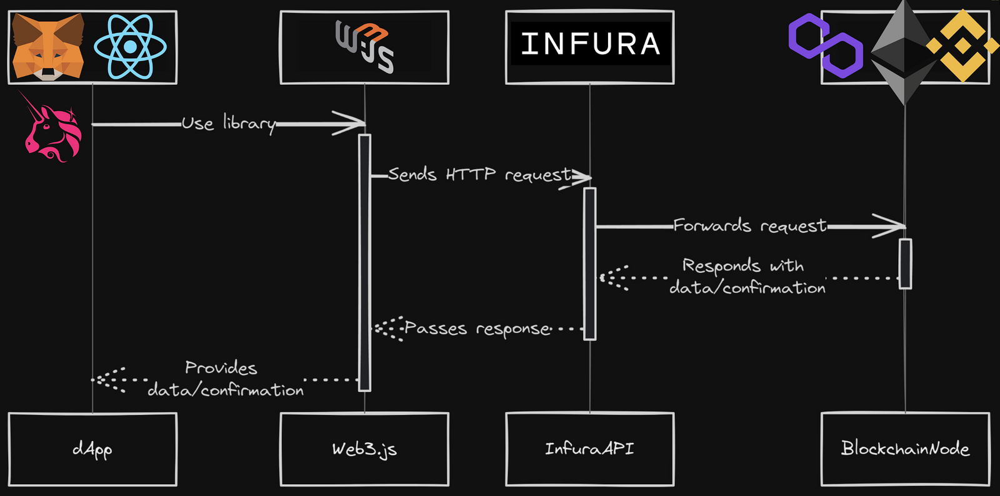
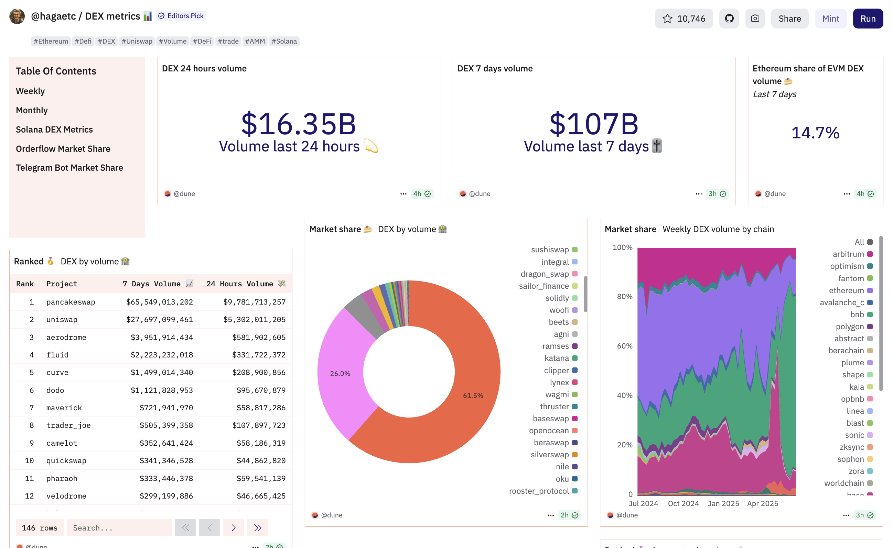
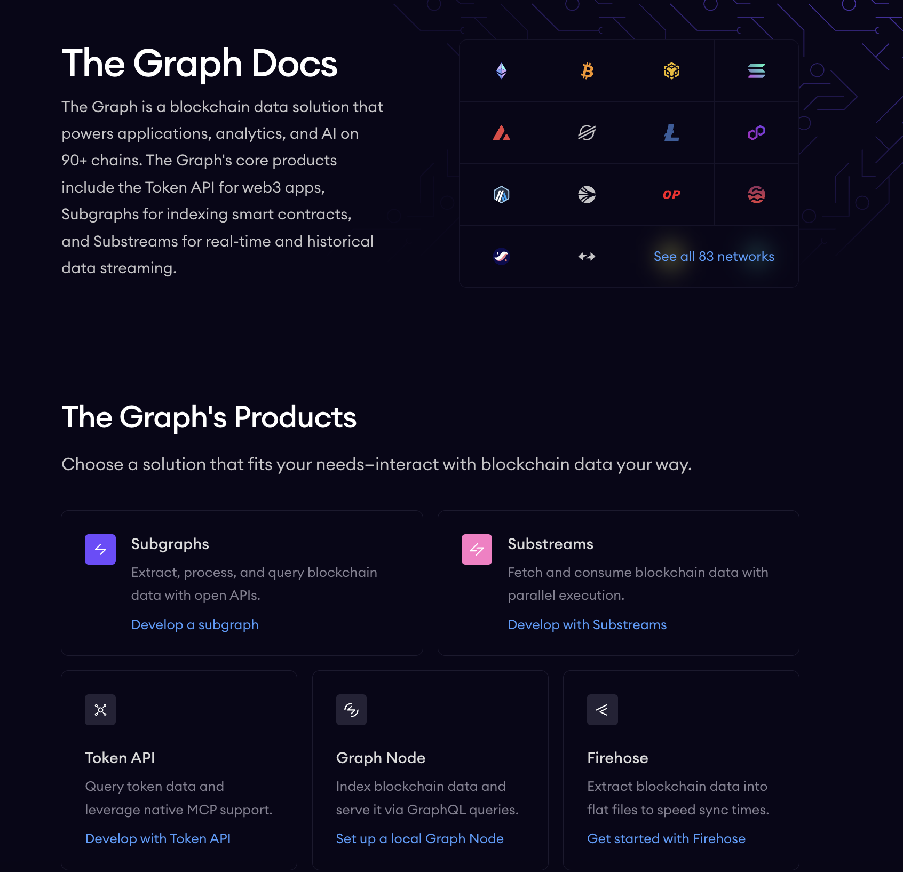

# Introduction to Ethereum Smart Contract Interaction

This guide introduces how developers interact with Ethereum smart contracts using Web3 libraries, such as Web3.js and Ethers.js. It also covers critical components like Ethereum nodes and the Application Binary Interface (ABI).

---

## The Role of Web3 Libraries (Web3.js and Ethers.js)

Web3 libraries are essential tools for developers building decentralized applications (dApps) that interact with the Ethereum blockchain from web environments.


### Purpose and Function

- Act as a **bridge** between web applications and the Ethereum network.
- Enable key operations:
  - Sending and receiving cryptocurrency.
  - Deploying new smart contracts.
  - Interacting with existing contracts (reading/writing data).
- Abstract low-level communication (JSON-RPC) with Ethereum nodes.
- Simplify blockchain interaction, especially for developers from traditional web backgrounds.

### Importance

- Lower technical barriers.
- Accelerate innovation.
- Facilitate broader adoption of decentralized technologies.

---

## Understanding Web3 Libraries

Ethereum developers typically choose between two JavaScript libraries: **Web3.js** and **Ethers.js**.

### Web3.js: The Established Gateway

- A long-standing tool in Ethereum development.
- Offers a **comprehensive feature set** (often compared to a Swiss Army knife).
- Supported by a large community.
- Integrates with multiple blockchain networks (not only Ethereum).
- Uses a **callback-based API**, which may lead to complex nested code (callback hell).
- Automatically converts large numbers to JavaScript types, risking **precision loss**.

### Ethers.js: The Modern Alternative

- Designed for **simplicity and precision**.
- Uses **Promise-based APIs**, allowing cleaner asynchronous code.
- Includes a custom **BigNumber** implementation to handle large integers correctly.
- Better support for wallets and authentication flows.
- Modular and lightweight; well-suited for multi-chain compatibility.
- Increasingly popular among new Ethereum developers.


### Web3.js vs. Ethers.js: A Feature Comparison

| Feature                | Web3.js                                             | Ethers.js                                           |
|------------------------|-----------------------------------------------------|-----------------------------------------------------|
| Design Philosophy      | Comprehensive, versatile                           | Lightweight, user-friendly                         |
| API Design             | Callback-based (risk of callback hell)             | Promise-based (clean, readable code)              |
| Big Number Handling    | Converts to JavaScript numbers (risk of precision) | Uses custom BigNumber for accurate math           |
| Community Support      | Large, established                                 | Active and rapidly growing                        |
| Bundle Size            | Larger                                              | Smaller and more efficient                        |
| Wallet Support         | Versatile, multi-network support                   | Enhanced wallet and auth integration              |
| Maturity               | Older, well-tested                                 | Modern, gaining adoption                          |
| Multi-chain Adaptability | Ethereum-focused but flexible                   | Modular design for easier multi-chain support     |

**Conclusion:**  
Web3.js offers maturity and breadth, while Ethers.js provides better precision, modularity, and modern developer experience. The choice depends on the project’s needs and developer preferences.

---

## Essential Components for Smart Contract Interaction

Successfully interacting with smart contracts requires an understanding of two foundational components: **Ethereum nodes** and the **ABI**.


### Ethereum Nodes: The Network Backbone

Ethereum is powered by a peer-to-peer (P2P) network of **nodes** running Ethereum clients.

#### Node Responsibilities

- Store a full or partial copy of the Ethereum blockchain.
- Validate blocks and transactions based on protocol rules.
- Propagate network data (blocks, txs) to peers.
- Execute smart contracts and verify results.
- Participate in consensus (e.g., Proof of Stake).

Web3 libraries connect to these nodes—either:

- **Locally** (running your own node), or
- **Remotely** (using services like Infura, Alchemy, or QuickNode).

**Without nodes, the Ethereum network and dApps would not function.**

---

### Application Binary Interface (ABI): The Contract's Language

The **Application Binary Interface (ABI)** is the structured way an application understands and communicates with a smart contract.

#### ABI Overview

- A **JSON-formatted** schema that defines:
  - Contract functions and their names
  - Input and output types
  - State mutability (e.g., `view`, `payable`)
  - Event definitions

- Generated during contract compilation from Solidity or Vyper source code.

- Used by Web3 libraries to:
  - Encode function calls
  - Decode returned data
  - Enable event listening

#### Key ABI Fields

Each ABI entry includes:

- `name`: Function or event name
- `inputs`: Types and names of expected parameters
- `outputs`: Return types and names
- `stateMutability`: Whether the function alters state (e.g., `view`, `payable`)
- `type`: Defines function, constructor, fallback, or event

#### Why ABI Matters

- Enables **standardized** and **interoperable** contract interaction.
- Allows dApps and tools to communicate with any smart contract without knowing its source code.
- Facilitates accurate and secure encoding/decoding of data.


#### Summary

Smart contract interaction on Ethereum relies on:

1. **Web3 Libraries** (Web3.js or Ethers.js):
   - Facilitate connection between frontend and blockchain.
   - Provide developer-friendly APIs for blockchain operations.

2. **Ethereum Nodes**:
   - Execute and validate smart contracts.
   - Store and broadcast blockchain data.

3. **Application Binary Interface (ABI)**:
   - Translates between human-readable functions and blockchain-level bytecode.

Together, these components form the foundation of Ethereum dApp development.

---

#### Simple Example

```solidity
[ { "inputs": [], "name": "retrieve", "outputs": [ { "internalType": "uint256", "name": "", "type": "uint256" } ], "stateMutability": "view", "type": "function" }, 
{ "inputs": [ { "internalType": "uint256", "name": "num", "type": "uint256" } ], "name": "store", "outputs": [], "stateMutability": "nonpayable", "type": "function" } ]
```
---

# The Interaction Process: A High-Level Overview

Interacting with an Ethereum smart contract from a web application involves a series of structured steps.



## Connecting to an Ethereum Node (Providers)

- The initial step is establishing a connection to an Ethereum node.

- This connection is typically managed through a **provider**, which facilitates communication between your application and the blockchain.
- Providers offer **read-only access** to data and states on the chain.
- Common providers include public RPC endpoints from services like:**Infura** , **Alchemy** ,  **QuickNode** , Or a local development blockchain like **Ganache**.
- A **web3 library** (e.g., Web3.js or Ethers.js) is instantiated with this provider to send requests to the Ethereum network.

- This connection enables the application to: **Query network information** , **Send transactions** , **Interact with smart contracts**

---

## Instantiating the Smart Contract

- After connecting to an Ethereum node, create a JavaScript representation of the smart contract in your application.

- This is done using the web3 library’s contract instantiation function:`web3.eth.Contract()` in Web3.js ,  `new ethers.Contract()` in Ethers.js

- This function typically requires two key pieces of information:
    1. **The contract's ABI** (Application Binary Interface): The blueprint for interaction with the contract. 
    2. **The contract's address**: The unique identifier of the deployed contract on the blockchain.
- Once instantiated, this **contract object** serves as the primary interface for calling functions on the deployed smart contract.

---

## Calling Read Functions (No Transaction Required)

- Interacting with **read-only** functions is straightforward and does **not** involve submitting a transaction.

- These functions (often marked `view` or `pure` in Solidity) retrieve data or perform computations **without altering** the blockchain state.
- To call a read function: Use the instantiated contract object's `methods` property Call the function by name Use the `.call()` method
- Retrieve a token’s total supply,  Fetch an account’s token balance
- These calls:  **do not consume gas**,  **free of charge**,  **ideal for displaying real-time blockchain data**

---

## Calling Write Functions (Transaction Required, Gas Fees)

- Invoking functions that **modify** the blockchain state (e.g., transferring tokens) requires: Creating a **transaction**,  Paying **gas fees**
- This is similar to sending ETH or deploying a new contract.
- General process:
  1. **Build a Transaction Object**:
   - Includes:
     - `nonce`
     - `gasLimit`
     - `gasPrice`
     - `to` (contract's address)
     - `data` (encoded function call with arguments)

  2. **Sign the Transaction**:
   - Signed by the **sender’s private key**
   - This proves ownership and ensures the transaction’s integrity
   - Wallets like **MetaMask** typically handle this step

  3. **Broadcast the Transaction**:
   - The signed transaction is sent to the Ethereum network via the web3 library
   - Then propagated to validators/miners for inclusion in a block

---

## Digital Signatures and Transaction Broadcasting

- **Digital signatures** are the cryptographic foundation of Ethereum security.

### Key Concepts:

- Every Externally Owned Account (EOA) has:
  - A **private key** (kept secret)
  - A **public key** (used to derive the Ethereum address)

- When a user initiates a transaction:
  - Their **private key** generates a unique **digital signature**
  - Typically using **ECDSA** (Elliptic Curve Digital Signature Algorithm)

### Signature Properties:

- **Authenticates** the sender
- **Ensures data integrity**
- Provides **non-repudiation** (cannot deny sending it)

### Verification Process:

- The signed transaction is **broadcast** to the Ethereum network
- Validators **verify** the signature using the sender’s public address
- If valid, the transaction is **added to the blockchain**

This mechanism ensures:

- Only the rightful owner can send transactions
- All actions are **secure**, **verifiable**, and **tamper-proof**


---


# Transaction Indexing

## Introduction

**Transaction indexing services** transform raw Ethereum blockchain data into structured, queryable formats, making it accessible and usable for decentralized applications (dApps).

Accessing blockchain data directly is challenging due to:

- The vast volume of data
- Sequential and low-level data storage
- The resource-heavy nature of running a full Ethereum node

Indexing solves these problems by offering:

- Reduced data retrieval time
- Enhanced scalability for dApps
- Developer-friendly data formats
- Improved user experience
- Increased transparency

However, the convenience of **centralized indexing services** often leads to their wide adoption, introducing subtle centralization risks within the Web3 ecosystem.

**Advanced indexing capabilities** enable more complex and data-rich applications, expanding the design space for Web3 developers.

---

## The Current Landscape of Ethereum Indexing Services

### Centralised API Providers

#### Infura

- High-throughput access to Ethereum and Layer 2 networks
- Features: Gas API, archive node access
- Pricing: Credit-based model

#### Alchemy

- Scalable infrastructure with enhanced APIs:
  - Build
  - Monitor
  - Notify
- Supports multiple networks
- Pricing: "Compute Units" model

#### Etherscan

- Primarily a blockchain explorer
- Offers APIs for:
  - Token transfer events
  - Account balances
  - Transaction statuses
- Has record limits on queries

#### QuickNode

- Fast JSON-RPC API access to numerous networks
- Tools:
  - WebHooks
  - NFT and ERC20 APIs

#### Space and Time (SXT)

- Indexes Ethereum from genesis block
- Supports:
  - Standard SQL
  - Natural language queries
  - ZK-proven data for verifiability


#### Dune
  -Provides SQL querying and real time data.

## Dune


### Core Functionality

**Dune** enables users to write SQL queries to extract specific data from the blockchain and transform it into visual dashboards.

Use cases include:

- Transaction volume tracking
- Wallet activity monitoring
- Protocol performance analysis

### Key Features

- **SQL Querying**: Advanced Query Editor for precision analysis
- **Dashboards**: Custom and community-shared dashboards
- **Real-Time Data**: Up-to-date data for analysis
- **AI Capabilities**:
  - Dune AI
  - AI Assistant for query support (note: may include inaccuracies)
- **Data Upload**: Integrate custom datasets
- **Contract Decoding**: Tools to decode smart contracts

### Underlying Technology

- Query engine supports interactive queries from GBs to PBs of data
- Based on **DuneSQL**, a modified version of **TrinoSQL** optimized for blockchain analysis

### Supported Data Types in DuneSQL

- `VARBINARY`: Efficient for storing addresses, hashes, calldata, logs
- `UINT256` & `INT256`: For blockchain-specific large numerical data
- Standard SQL types:
  - `BOOLEAN`, `TINYINT`, `SMALLINT`, `INTEGER`, `BIGINT`
  - `DECIMAL`, `VARCHAR`, `TIMESTAMP`, `DATE`, `TIME`, `INTERVAL`

### Use Cases

- **Investment Analysis**: Portfolio tracking, historical prices
- **Market Research**: Transaction and user behavior trends
- **Project Evaluation**: dApp performance metrics
- **Community Engagement**: Token distribution, user analytics

### Centralisation Aspect

While Dune empowers decentralized analysis through user-generated dashboards and queries, the core platform remains **centralized** in data ingestion and processing. This means:

- The infrastructure is managed centrally
- Users rely on Dune’s backend for data availability and accuracy

## Advantages

- High-speed queries
- Fully managed infrastructure
- Minimal operational overhead
- High uptime
- Powerful visualization and query tools

## Limitations

- Potential single points of failure
- Censorship concerns
- Rate limits on free/lower tiers
- Higher costs at scale

---

## Decentralised Indexing Protocols

### The Graph

- Organizes blockchain data into **subgraphs**
- Queryable via **GraphQL**
- Ecosystem roles:
  - **Indexers**
  - **Curators**
  - **Delegators**
- Uses **GRT** token for staking and economic incentives

### SubQuery Network

- Decentralized Web3 indexing protocol
- Supports nearly **300 blockchains**
- Unified Web3 data API
- Designed for **speed**, **flexibility**, and **multi-chain compatibility**

### TrueBlocks

- **"Local-first"** indexing approach
- Index can be fully cached locally
- Benefits:
  - Enhanced privacy
  - Fast access
  - Multi-chain support
  - No rate limits or subscription costs


## Benefits of Decentralised Indexing

- No single entity controls data access
- Greater transparency and censorship resistance
- Community-driven growth and innovation
- Potentially lower costs over time


## Challenges of Decentralised Indexing

- Requires more complex setup and configuration
- Often lacks the developer tooling and ease-of-use found in centralised platforms
- Performance and reliability tied to token-based incentives and economic models

---

## Comparison: Centralised vs Decentralised Indexing

| Feature                      | Centralised Providers         | Decentralised Protocols     |
|-----------------------------|-------------------------------|-----------------------------|
| **Speed & Convenience**     | ✅ High                       | ⚠️ May vary                 |
| **Ease of Integration**     | ✅ Very Easy                  | ⚠️ Requires technical setup |
| **Censorship Resistance**   | ⚠️ Limited                   | ✅ Strong                   |
| **Transparency**            | ⚠️ Limited                   | ✅ Full                     |
| **Data Integrity**          | ⚠️ Relies on provider        | ✅ Verifiable               |
| **Cost Over Time**          | ⚠️ Can be expensive           | ✅ Often more sustainable   |

---

## Hybrid Approaches

Some platforms are exploring **hybrid indexing models**, combining the strengths of both centralized and decentralized systems.

- **Example**: Infura’s **Decentralized Infrastructure Network (DIN)**
- **Goal**: Provide high availability and performance while maintaining decentralization guarantees


## Final Thoughts

Indexing is essential for unlocking the full potential of blockchain-based applications. While centralized services offer ease of use and speed, decentralized indexing protocols better align with the values of Web3: **transparency**, **resilience**, and **permissionless access**.

For serious Web3 development, understanding and selecting the right indexing solution—centralized, decentralized, or hybrid—is crucial.


---

# The Graph Introduction

The Graph is an indexing protocol for querying networks like Ethereum and IPFS. Anyone can build and publish open APIs, called **subgraphs**, making data easily accessible.

🔗 See [The Graph Academy](https://thegraph.academy)



---

## Graph Explorer

A simple way to explore data  
**See [Explorer](https://thegraph.com/explorer)**

---

## Comparison

- **Centralised Providers**
  - ✅ Offer convenience and speed
  - ✅ Suitable for rapid prototyping
  - ❌ Limited transparency
  - ❌ Risk of censorship or downtime

- **Decentralised Protocols**
  - ✅ Prioritise censorship resistance
  - ✅ Transparent and verifiable
  - ✅ Ideal for dApps where data integrity is critical
  - ❌ May have slower performance compared to centralised systems

- **Hybrid Models**
  - Aim to combine benefits of both centralised and decentralised systems
  - Example: Infura's Decentralised Infrastructure Network (DIN)

---
# Interacting with Ethereum Indexing Services

## Understanding Event Logs

- Smart contracts emit **events** as immutable logs to record significant actions on-chain. These logs include:

  - **Event name**
  - **Contract address**
  - **Indexed and non-indexed data**
- Up to **3 indexed parameters** (topics) are allowed for non-anonymous events. These indexed fields are **hashed** and included in a **Bloom Filter** for efficient filtering by nodes and clients.
- **Dynamic types** (e.g., strings, arrays) are hashed when indexed, meaning their human-readable values are lost in the indexed topic. To retain readability:
  - Include them **again as non-indexed** parameters in the event.
  - This dual-inclusion allows both **filtering efficiency** and **data clarity**.

---
# Querying with Ethers.js

The Ethers.js library separates **read-only operations** (via `Provider`) from **write operations** (via `Signer`). To query historical event data from the blockchain, use a `JsonRpcProvider` to connect to a node (either self-hosted or services like Infura).

You can use the `contract.queryFilter()` method in combination with event filters to retrieve specific logs.

---

# Querying with Web3.js

Web3.js is another popular library for dApp development, offering similar functionality for querying past events on the blockchain.

You can use either:
- `web3.eth.getPastLogs()` — for raw log data
- `contract.getPastEvents()` — for decoded event data

These methods allow filtering by topics or indexed parameters.

---

## Leveraging GraphQL with The Graph

**The Graph** indexes and structures blockchain data into **Subgraphs**, which are queryable via **GraphQL**.

### Workflow:

1. Define **entities** (data models) in a GraphQL schema
2. Create **mapping handlers** in AssemblyScript to respond to contract events
3. Deploy to **Subgraph Studio**
4. Optionally publish to the **decentralized Graph Network** (requires GRT staking)
---

## SQL-Based Services

Platforms like **Space and Time (SxT)** and **Dune Analytics** provide **SQL interfaces** for blockchain data.

### Advantages:

- Familiar querying paradigm for data analysts and devs
- Support for **blockchain-specific data types**:
  - `UINT256`, `VARBINARY`, etc.
- Ideal for:
  - Historical analysis
  - Aggregations
  - Trend visualizations

### Challenges of Abstraction

While indexing services simplify access to complex on-chain data, they introduce **new abstraction layers**:

- Developers must learn platform-specific:
  - **GraphQL schemas** (The Graph)
  - **SQL dialects and datatypes** (Dune, SxT)
  - **SDKs and query models**

This requires additional onboarding and tooling literacy.


### Data Type Mapping

Correctly mapping **Solidity data types** to indexing service equivalents is **critical** to avoid misinterpretation.

#### Common Examples:

| Solidity Type | Indexing Type (The Graph) | Indexing Type (Dune)   |
|---------------|----------------------------|-------------------------|
| `uint256`     | `BigInt`                   | `UINT256`               |
| `address`     | `Bytes`                    | `VARBINARY(20)`         |
| `bool`        | `Boolean`                  | `BOOLEAN`               |
| `string`      | `String`                   | `VARCHAR`               |

Failure to map accurately can lead to:

- Query errors
- Data type coercion issues
- Misleading results in analytics

