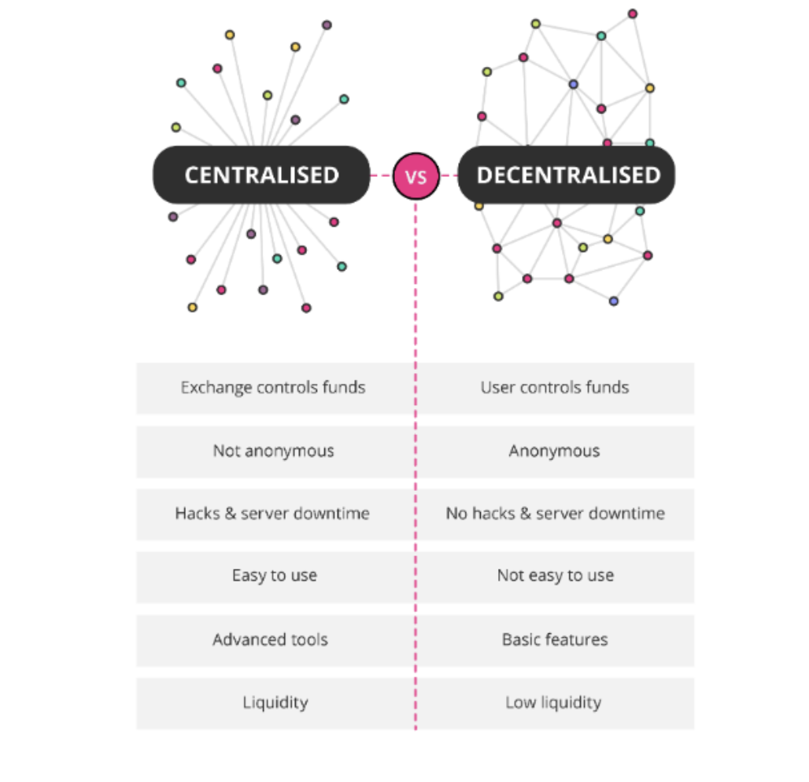
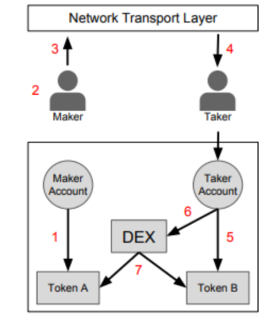
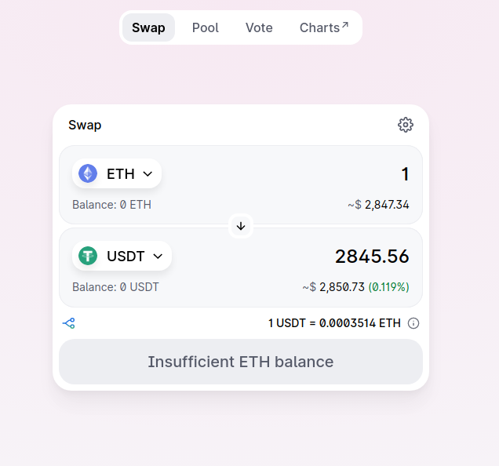

# DeFi: A Complete Introduction

## Overview

**Decentralized Finance (DeFi)** is a financial ecosystem built on blockchain technologies, primarily Ethereum, offering permissionless, transparent, and trustless alternatives to traditional financial services.

### Main Areas of DeFi

- **Exchanges**
- **Asset Management**
- **Stablecoins**
- **Lending / Borrowing**
- **Remittance**

---

## Decentralized Exchanges (DEXs)

**Decentralized Exchanges** allow users to trade tokens without relying on centralized platforms. They remove the need for custodianship, ensuring users retain control of their assets at all times.


### Advantages

- Permissionless token listings
- Enhanced transparency and control
- Lower centralization risk

---

## History of Decentralized Exchanges

### Early Exchanges – 0x Protocol

**0x Protocol** introduced off-chain order relays and on-chain settlements.

#### Process:

1. Maker approves the DEX contract to access Token A.
2. Maker creates and signs an order to exchange Token A for Token B.
3. The signed order is broadcast over any medium (e.g., a public order book).
4. Taker finds the order and decides to fulfill it.
5. Taker approves DEX contract for Token B.
6. Taker submits the signed order to the DEX contract.
7. The contract:
   - Authenticates the maker's signature
   - Verifies order validity (not expired or filled)
   - Executes the token exchange at the agreed rate

### Uniswap

- Originated from ideas shared by **Vitalik Buterin**, **Nick Johnson**, and **Martin Koppelmann** in 2016
- Implemented and launched by **Hayden Adams** in **November 2018**
- Introduced **Automated Market Makers (AMMs)** to solve liquidity incentive problems

---

## Automated Market Makers (AMMs)

AMMs are smart contracts that enable token swaps using liquidity pools instead of order books.

### How It Works

- Users deposit token pairs (e.g., ETH and USDT) into a **liquidity pool**
- These pools enable token swaps or lending/borrowing
- Traders pay **fees**, distributed to **liquidity providers (LPs)**

### Constant Function Market Makers (CFMMs)

- Trades must keep the **product** of token reserves constant:
  
  `X * Y = K`
Where:
- `X` = Reserve of token A
- `Y` = Reserve of token B
- `K` = Constant

This model is often referred to as the **XYK model**, which maintains a consistent ratio between the two tokens in the pool. As traders swap tokens, the balances of `X` and `Y` shift, but their product (`K`) stays unchanged, thereby determining the price algorithmically without the need for an order book.



---

## LP Tokens

When users provide liquidity:

- They receive **LP tokens** representing their share of the pool
- They can redeem LP tokens for the underlying tokens plus accrued fees

### Notes on LP Tokens

- **Uniswap v1 & v2**: LP tokens are standard ERC-20 tokens
- **Uniswap v3**: LP positions are NFTs due to custom price ranges

---

## Price Impact, Slippage, and Impermanent Loss

### Price Impact

Each trade affects the token price in the pool. Large trades can significantly alter prices.

### Slippage

The difference between expected price and actual execution price. Caused by:

- Market volatility
- Competing trades between order and execution

## Impermanent Loss

**Impermanent loss** occurs when the value of your percentage-based share of a liquidity pool is **less at the time of withdrawal** than the value of the amount of tokens you initially deposited, had you simply held those tokens instead of providing liquidity.

In other words, it is the opportunity cost of having provided liquidity instead of holding your assets.

---

### Example Scenario

- You deposit equal values of Token A and Token B into a 50/50 liquidity pool.
- The price of Token A increases significantly while Token B remains stable.
- The pool's algorithm automatically adjusts the token ratio to maintain balance.
- When you withdraw, your share includes fewer Token A and more Token B.
- If you had just held your original tokens outside the pool, they would be worth more.

This difference in value is the **impermanent loss**.

---

### Ways to Mitigate Impermanent Loss

1. **Use stablecoin pairs**  
   - Pools like USDC/DAI experience less price fluctuation, reducing risk.

2. **Take advantage of yield farming**  
   - Rewards or incentives from protocols may offset the loss.

3. **Use non-50/50 pool ratios**  
   - Some AMMs (like Balancer) allow custom ratios such as 80/20 or 95/5, which can reduce exposure to impermanent loss.


---

## Composability

DeFi protocols are **modular** and interoperable—like "Money LEGOs."

### Key Benefits

- Developers can build complex products by combining protocols
- All applications support ETH and ERC-20 tokens
- No third-party intermediaries

### Risks

- **Composability introduces compound risk**: Secure contracts may become vulnerable when integrated with others
- Example: On **March 12, 2020**, ETH crashed, gas prices spiked, and price oracles lagged—triggering mass liquidations across DeFi

---

## Lending and Borrowing

### Compound Protocol

**Compound III** is an EVM-compatible lending protocol.

- Users can **supply crypto** as collateral to borrow the base asset
- Or **supply the base asset** (e.g., USDC) to earn interest
- First deployed on **Ethereum** with **USDC** as base asset

---

## Yield Farming

**Yield Farming** involves depositing tokens to earn rewards or interest.

### Features

- Users provide liquidity and earn token incentives
- Advanced strategies optimize yield across protocols

### History

- Introduced by **Compound** and **yearn.finance**
- **June 2020**: BAT token launch popularized yield farming

---

## Flash Loans

Flash loans allow **borrowing of assets without collateral**, as long as:

- The loan is **repaid within one transaction block**
- Failure to repay reverts the entire transaction

### Key Properties

- **Low fee** (e.g., 0.09%)
- Enables **arbitrage**, **collateral swapping**, **refinancing**
- Powerful but **highly technical** and sometimes **exploited**

### Analogy

> Imagine a smart contract where **line 2** increases your balance by 5… and it all disappears if you don’t repay before **line 10**.

---

## Conclusion

DeFi represents a revolutionary shift in financial infrastructure, enabling:

- Open access to finance
- Transparent, programmable financial contracts
- New economic primitives like AMMs, LP tokens, and flash loans

However, risks around **smart contract bugs**, **composability failures**, and **market volatility** remain critical. Deep understanding and responsible usage are key to safe participation in the DeFi ecosystem.


---


# DEX Aggregators

## Introduction

**DEX Aggregators** are specialized protocols or platforms that source liquidity from multiple **Decentralized Exchanges (DEXs)** to provide users with the **best possible price** for a trade.

Instead of relying on a single liquidity pool or DEX, they scan several sources to optimize the execution of token swaps.

---

## How DEX Aggregators Work

DEX Aggregators utilize a mechanism called **Smart Order Routing**.

### Smart Order Routing

- **Trade Splitting**: A single trade is split into multiple smaller trades.
- **Multiple Routes**: Each portion of the trade is routed to different DEXs or liquidity pools.
- **Price Optimization**: The aggregator calculates the most efficient route to minimize slippage and maximize output.

### Example Workflow

1. User initiates a trade (e.g., swap 1000 USDC for ETH)
2. The aggregator checks prices across multiple DEXs (e.g., Uniswap, SushiSwap, Balancer)
3. It may split the trade like:
   - 400 USDC to Uniswap
   - 300 USDC to SushiSwap
   - 300 USDC to Balancer
4. Executes all sub-trades simultaneously via smart contracts
5. Returns the combined result (ETH) to the user with the **best possible exchange rate**

---

## Benefits of DEX Aggregators

- **Better Prices**: Achieve optimal rates by tapping into multiple liquidity sources
- **Lower Slippage**: Especially beneficial for large trades
- **Time Savings**: Users don’t have to manually compare rates on different DEXs
- **Reduced Gas Costs**: Some aggregators bundle transactions to save on gas fees

---

## Popular DEX Aggregators

- **1inch**
- **Matcha**
- **Paraswap**
- **CowSwap**
- **OpenOcean**

---

## Conclusion

DEX Aggregators are essential tools for maximizing trading efficiency in the DeFi ecosystem. By intelligently routing trades across various liquidity sources, they offer users better prices, reduced slippage, and a more seamless trading experience—without the need to manually interact with multiple exchanges.


---


# Impact of AI on DeFi and NFTs

Artificial Intelligence (AI) is poised to revolutionize the decentralized finance (DeFi) and non-fungible token (NFT) ecosystems. By enhancing decision-making, automating operations, and improving user experiences, AI introduces powerful new capabilities to Web3 technologies.

---

## AI in DeFi

### Key Applications

1. **Enhanced Market Predictions**  
   - AI analyzes vast amounts of historical and real-time data to forecast market trends and user behavior.
   - Enables more informed investment decisions and potentially higher returns.

2. **Automation of Trading Decisions**  
   - AI-powered trading bots can execute trades 24/7.
   - These bots react faster than humans to market changes, increasing potential profitability.

3. **Intelligent Risk Assessment**  
   - AI can assess risks by analyzing protocol performance, user patterns, and market volatility.
   - Helps mitigate losses and protect investors.

4. **Improved Customer Experience**  
   - AI personalizes services by offering:
     - Tailored financial advice
     - Automated customer support
     - Simplified interfaces for complex DeFi operations
   - Broadens accessibility for non-technical users.

5. **Facilitating Regulatory Compliance**  
   - AI can:
     - Detect suspicious transactions
     - Conduct real-time compliance checks
     - Track regulatory changes
   - Builds trust with users and regulators alike.

---

### Projects Using AI in DeFi

- **Numerai**  
  Uses AI to aggregate crowdsourced financial models for hedge fund strategies.

- **Set Protocol**  
  Enables automated asset management through AI-driven investment strategies.

- **Autonio Foundation**  
  Democratizes algorithmic trading with AI-powered tools and analytics.

- **ChainGPT**  
  Offers an AI chatbot capable of:
  - Writing and deploying smart contracts
  - Assisting in algorithmic trading
  - Generating NFTs

- **KAVAAI**  
  Similar to ChainGPT, it provides AI-powered tools for:
  - Smart contract development
  - Trading automation
  - DeFi education and assistance

- **Uniswap**  
  Uses AI models to detect and prevent fraudulent transactions, increasing platform security.

---

## AI in NFTs

### Key Applications

1. **AI-Generated NFTs**  
   - AI algorithms generate unique digital art, disrupting traditional art creation and expanding creative possibilities.

2. **Enhanced User Experience**  
   - AI can:
     - Recommend NFTs
     - Generate personalized collections
     - Create interactive, story-driven assets

3. **Sophisticated NFTs**  
   - AI enables NFTs that evolve over time based on:
     - User behavior
     - External conditions (e.g., market prices, real-world events)

4. **Enhanced Security & Authentication**  
   - AI verifies NFT authenticity
   - Tracks ownership history
   - Detects and prevents fraud

5. **Data-Driven Analytics**  
   - AI analyzes:
     - NFT pricing trends
     - Market demand
     - Collector behavior
   - Offers strategic insights for creators and investors

---

### Projects Using AI in NFTs

- **Alethea AI**  
  Develops "intelligent NFTs" (iNFTs) capable of interactive dialogue and personality evolution.

- **Art AI**  
  Uses machine learning to generate and mint unique pieces of NFT art.

- **DeepArt.io** & **RunwayML**  
  Provide AI-powered design tools for digital artists to create and mint NFT content.

---

## Challenges and Considerations

While AI offers numerous benefits, integrating it into DeFi and NFT ecosystems presents several challenges:

### 1. **Data Privacy and Security**
- AI systems require large datasets, which can raise:
  - Privacy concerns
  - Risks of unauthorized data usage

### 2. **Explainability and Bias**
- AI models often act as "black boxes," making it difficult to:
  - Interpret their decisions
  - Detect or mitigate biases
  - Ensure fairness and accountability

### 3. **Scalability and Sustainability**
- Combining AI with blockchain introduces technical burdens:
  - High computational demands
  - Increased energy consumption
  - Potential network congestion

---

## Conclusion

AI holds transformative potential for DeFi and NFTs by improving efficiency, personalization, and security. However, developers and stakeholders must address the challenges of data ethics, transparency, and sustainability to ensure that these innovations are inclusive, responsible, and scalable.


---

# DeFi Terms

Understanding the key terms in the DeFi (Decentralized Finance) ecosystem is essential for navigating the rapidly evolving world of blockchain-based financial services. Below are some foundational concepts explained with simple definitions and examples.

---

## Liquidity Pools

**Definition:**  
Liquidity pools are collections of tokens locked in a smart contract that facilitate decentralized trading. These pools allow users to trade assets directly without relying on traditional order books, by providing the required liquidity to execute trades.

**Key Features:**

- Power decentralized exchanges (DEXs)
- Enable automatic market making (AMM)
- Support token swaps, lending, and yield farming

**Example:**  
- **Uniswap**: One of the earliest and most popular DEXs using liquidity pools

---

## Staking

**Definition:**  
Staking involves locking up a cryptocurrency to participate in the operation and security of a blockchain network. It is a core component of **proof-of-stake (PoS)** and **delegated proof-of-stake (DPoS)** consensus mechanisms. Stakers are typically rewarded with additional tokens for validating transactions or delegating their stake to validators.

**Key Features:**

- Earn passive income through rewards
- Supports network security and consensus
- May involve slashing penalties for dishonest behavior

**Example:**  
- **Lido**: A liquid staking platform that allows users to stake Ethereum (ETH) while maintaining liquidity through stETH tokens

---

## Lending

**Definition:**  
Lending in DeFi enables users to lend their crypto assets to others via smart contracts. These contracts automatically manage collateralization, interest rates, and repayments, removing the need for intermediaries like banks.

**Key Features:**

- Interest income for lenders
- Collateralized borrowing for users
- Algorithmically managed risk and interest rates

**Example:**  
- **Aave**: A leading DeFi lending protocol that supports a wide range of assets and features like flash loans and variable/fixed interest rates

---


# Account Abstraction in Ethereum

## Introduction

**Account Abstraction (AA)** is a major initiative in Ethereum aimed at enhancing the flexibility, security, and functionality of user accounts. It envisions moving beyond the traditional Externally Owned Accounts (EOAs) by introducing smart contract-based accounts that offer more programmable behavior, modular design, and greater control for users and developers.

---

## Vitalik Buterin on Account Abstraction

> *"MPC-based EOAs are fundamentally flawed because they cannot revoke keys (and no, re-sharing doesn't count; the old holders can still recover the key). Smart contract wallets are the only option."*  
— **Vitalik Buterin**

This quote highlights the inherent limitations of traditional EOAs and even advanced cryptographic schemes like Multi-Party Computation (MPC). Only **smart contract wallets** can provide true flexibility and control, such as **key revocation**, **social recovery**, and **custom authentication logic**.

---

## Motivation Behind Account Abstraction

### Limitations of EOAs

- Fixed signature scheme (ECDSA)
- No native support for multi-signature
- No built-in fee abstraction
- Complex and risky recovery mechanisms

### Benefits of Account Abstraction

- **Custom Authentication:** Replace ECDSA with biometrics, MPC, hardware wallets, or social recovery
- **Gas Abstraction:** Pay gas in ERC-20 tokens or let a third party sponsor the gas
- **Meta-transactions:** Users can sign a message and let someone else submit it to the chain
- **Batch Transactions:** Multiple actions in a single atomic transaction
- **Session Keys:** Temporary keys for specific dApps or time-limited actions

---

## AA Project Landscape

A number of Ethereum projects are building around the idea of Account Abstraction. These projects offer different implementations, standards, and tooling to support the transition from EOAs to smart contract wallets.

### Key Standards

- **ERC-4337 (EntryPoint):** Enables smart accounts without requiring changes to the Ethereum consensus layer. Implements a "bundler" that submits transactions on behalf of users.
- **EIP-3074:** Proposes to introduce new opcodes to allow EOAs to delegate control temporarily
- **EIP-5003:** A simpler approach allowing account upgrades from EOAs to smart contract wallets

---

### Notable Projects and Protocols

| Project              | Description |
|---------------------|-------------|
| **Safe (formerly Gnosis Safe)** | Widely used multisig wallet with account abstraction-like features |
| **Stackup**          | Infrastructure for building and operating smart contract wallets (ERC-4337) |
| **ZeroDev**          | Plug-and-play SDKs for building ERC-4337 wallets |
| **Biconomy**         | Offers AA SDK and Paymasters to sponsor gas |
| **Alchemy AA SDK**   | Developer tools and bundler infrastructure |
| **Candide**          | Lightweight smart accounts for secure web3 UX |
| **Rhinestone**       | Focused on plug-and-play AA tooling for apps |
| **Skandha**          | Full-stack modular AA wallet and ecosystem |

---

## Further Reading

### Extropy Articles

The Extropy team has published detailed explorations on Account Abstraction:

- **[Decoding Account Abstraction in Ethereum – Part 1](https://www.extropy.io/articles/account-abstraction-part-1)**  
  Covers fundamentals of EOAs vs. smart accounts and the history behind AA proposals.

- **[Account Abstraction – Part 2](https://www.extropy.io/articles/account-abstraction-part-2)**  
  Deep dive into ERC-4337, bundlers, user operations, and practical applications.

---

## Conclusion

Account Abstraction is a foundational step toward a more user-friendly and flexible Ethereum ecosystem. By enabling smart contract wallets as the default account type, Ethereum can unlock new UX paradigms, improve security, and foster broader adoption.

Smart contract wallets are **not just an upgrade** — they are the **future** of user interaction on Ethereum.


---


# Introduction to Account Abstraction (EIP-4337)

The paradigm of user accounts on EVM-compatible blockchains is undergoing a significant transformation through the implementation of **Account Abstraction (AA)**.

This shift moves beyond the inherent limitations of Externally Owned Accounts (EOAs) to enable programmable, smart contract-based accounts.

This evolution empowers accounts with custom logic for transaction validation, execution, and gas payment, thereby mirroring the flexibility and extensibility traditionally associated with smart contracts.

The fundamental objective of Account Abstraction is to simplify the user experience within the Web3 ecosystem, making it as intuitive and seamless as Web2 applications. This involves abstracting away complexities such as:

- The management of seed phrases
- Private keys
- The necessity of holding native tokens solely for gas fees

Such advancements are critical for fostering broad adoption among non-technical users, thereby expanding the reach of decentralized applications.

---

## Differences Between EOAs and Smart Accounts

| Feature                        | Externally Owned Accounts (EOAs)                         | Smart Accounts (Smart Contract Wallets)               |
|-------------------------------|---------------------------------------------------------|-------------------------------------------------------|
| Control Mechanism              | Single private key                                       | Programmable smart contract logic                      |
| Signature Verification        | Fixed ECDSA signature scheme                             | Custom authentication and authorization logic         |
| Transaction Rules             | Sequential nonce incrementation                          | Arbitrary execution and validation                      |
| Gas Payment                   | Must pay in native currency (ETH)                        | Can implement alternative payment methods (e.g., ERC-20 tokens) |
| Flexibility                  | Limited                                                 | High (multi-sig, social recovery, custom rules)       |

---

## Why EIP-4337? Addressing EOA Limitations without Consensus Changes

Historically, introducing Account Abstraction into Ethereum required **consensus-layer protocol changes** (e.g., new opcodes or transaction types), which are:

- Slow to coordinate and deploy across the entire Ethereum ecosystem
- Complex due to required network-wide consensus

**EIP-4337** innovatively bypasses these challenges by introducing a **higher-layer "pseudo-transaction" object** called a **UserOperation**, along with a separate mempool and off-chain actors, without any modifications to the Ethereum consensus rules.

---

## Architectural Innovations in EIP-4337

- **UserOperation Object:** A new type of structured data representing user intent.
- **Alternative Mempool:** Separate from the standard Ethereum transaction pool, dedicated to UserOperations.
- **Bundlers:** Off-chain actors that collect, validate, and package UserOperations into standard Ethereum transactions submitted on-chain.
- **EntryPoint Contract:** On-chain smart contract that verifies and executes bundles of UserOperations.

This parallel infrastructure allows smart accounts to function without changing the core protocol or EVM consensus logic.

---

## Core Components of EIP-4337

### 1. UserOperation

- A pseudo-transaction encapsulating a user's intended action.
- Not a native Ethereum transaction, but closely resembles one.
- Contains fields such as:

  - `sender`: Smart contract account address
  - `nonce`: Anti-replay and deterministic creation parameter
  - `initCode`: Optional deployment bytecode if the account isn’t deployed yet
  - `callData`: Execution data passed to the smart account
  - `callGasLimit`: Gas limit for execution phase
  - `verificationGasLimit`: Gas limit for verification phase
  - `preVerificationGas`: Gas to compensate Bundler for off-chain work
  - `maxFeePerGas`, `maxPriorityFeePerGas`: Gas pricing parameters (like EIP-1559)
  - `paymasterAndData`: Optional gas sponsorship data
  - `signature`: UserAccount-defined signature data for validation

- Submitted to an **alternative mempool** monitored by Bundlers, not the standard public mempool.

---

### 2. Bundlers

- Off-chain entities (nodes or services) that:

  - Monitor UserOperation mempool
  - Validate UserOperations’ preliminary correctness
  - Bundle multiple UserOperations into a single Ethereum transaction
  - Submit this transaction to the **EntryPoint contract** on-chain

- Pay Layer 1 gas fees upfront and get compensated by UserOperations included in the bundle.
- Are **not fully trusted**; on-chain validation by EntryPoint ensures security.

---

### 3. EntryPoint Contract

- Singleton on-chain contract deployed at a known address on EVM chains.
- Central orchestrator for processing UserOperation bundles.
- Performs two-phase processing for each UserOperation:

  1. Calls `validateUserOp` on each smart account for verification
  2. Calls `execute` to carry out transaction logic

- Undergoes rigorous auditing and formal verification to ensure security.

---

### 4. Smart Account Contract

- User-controlled programmable wallet implementing the **IAccount interface**.
- Must implement:

  - `validateUserOp`: Checks signature, nonce, and gas prepayment
  - `execute`: Executes the intended transaction logic

- Supports advanced features like:

  - Multi-signature wallets
  - Social recovery
  - Custom signature schemes (e.g., BLS, Schnorr)
  - Spending limits and whitelisting

---

### 5. Account Factory Contract

- Responsible for deploying Smart Account Contracts.
- Uses **CREATE2 opcode** for deterministic addresses.
- Enables accounts to have fixed addresses **before** deployment, allowing users to receive funds prior to on-chain contract creation.

---

### 6. Paymaster Contract

- Optional smart contract enabling gas fee sponsorship.
- Allows users to pay gas fees in ERC-20 tokens or have third parties pay gas.
- Abstracts away native token requirement for gas, improving UX.
- Supports complex fee policies to tailor sponsorship.

---

### 7. Aggregator (ERC-7766)

- Optional helper contract for **signature aggregation**.
- Enables bundling multiple signatures into one to save gas.
- Beneficial for signature schemes that support batch verification (e.g., BLS).
- Bundlers sort UserOperations by Aggregator and call `aggregateSignatures()`.
- EntryPoint contract remains unchanged for compatibility.
- Aggregators are highly trusted and can authorize or reject multiple transactions.

---

## Summary Table of Core Components

| Component             | Role                                                                                              |
|-----------------------|-------------------------------------------------------------------------------------------------|
| **UserOperation**      | Pseudo-transaction object representing user intent; submitted to alternative mempool             |
| **Bundler**           | Off-chain actor that bundles UserOperations and submits standard transactions to EntryPoint       |
| **EntryPoint Contract**| On-chain orchestrator that verifies and executes UserOperation bundles                            |
| **Smart Account Contract** | Programmable wallet implementing validation and execution logic                                  |
| **Account Factory Contract** | Deploys smart accounts with deterministic addresses using CREATE2                               |
| **Paymaster Contract** | Optional contract sponsoring gas fees, enabling ERC-20 payments or third-party gas coverage       |
| **Aggregator (ERC-7766)** | Optional contract for efficient multi-signature aggregation reducing gas costs                  |

---

This architecture enables powerful, customizable user accounts in Ethereum while preserving backward compatibility and avoiding difficult consensus-layer changes.

```


---


# Transaction Flow in EIP-4337

EIP-4337 introduces a novel transaction flow model tailored for smart contract wallets (also known as "smart accounts"). Unlike traditional Ethereum transactions initiated by Externally Owned Accounts (EOAs), this flow decouples signature verification and transaction execution, enabling advanced account functionalities without requiring changes to Ethereum’s core protocol.

---

## Simplified Process Flow

1. **User Creates a UserOperation**  
   The user constructs a `UserOperation` object. This includes transaction details and is signed using a custom method (e.g., multi-sig, biometrics, hardware wallets).

2. **UserOperation Submitted to EntryPoint**  
   The signed `UserOperation` is sent to a specialized contract called `EntryPoint`.

3. **EntryPoint Validates and Relays**  
   The `EntryPoint` performs signature checks and transaction validation logic. If valid, it continues processing.

4. **Paymaster (Optional)**  
   If a Paymaster is used, it covers gas fees and performs its own validation before finalization.

5. **Ethereum Network Processes Transaction**  
   Once relayed and verified, the network executes the transaction and commits changes on-chain.

---

## Step-by-Step Process

### 1. UserOperation Creation

- A `UserOperation` is created on the client-side to represent the user’s intent (e.g., token transfer, interaction with a dApp).
- The object includes fields like:
  - `sender`
  - `nonce`
  - `initCode`
  - `callData`
  - `callGasLimit`
  - `verificationGasLimit`
  - `paymasterAndData`
  - `signature`
- It is submitted to an **alternative mempool**, separate from Ethereum’s standard mempool.

### 2. Bundler Collection

- **Bundlers** (off-chain actors) watch the UserOperation mempool.
- They:
  - Select valid UserOperations
  - Validate them locally
  - Bundle them into a standard Ethereum transaction
- The bundle is then submitted to the **EntryPoint** contract on-chain.

### 3. Verification Phase

- For each `UserOperation` in the bundle:
  - `EntryPoint` calls the `validateUserOp` function on the sender’s smart account.
  - This function checks:
    - Validity of signature
    - Correct nonce (anti-replay)
    - Gas balance or payment via a Paymaster
- If a **Paymaster** is used:
  - The `validatePaymasterUserOp` function is called
  - Confirms whether the Paymaster agrees to sponsor the gas fees

### 4. Execution Phase

- If verification succeeds:
  - `EntryPoint` calls the `execute` function on the smart account
  - Executes the actual user intent (e.g., contract call, token transfer)
- After execution:
  - Unused gas may be refunded to the user
  - If a Paymaster is used, its post-operation settlement is triggered

---

## Clarification of Phases: Verification vs. Execution

### Verification Phase

- **Purpose:** Confirm transaction legitimacy before execution
- **Gas Limit:** Controlled by `verificationGasLimit`
- **Scope:**
  - Signature checks
  - Nonce validation
  - Paymaster checks
- **Security Role:** Prevents Bundler DoS attacks by bounding resource consumption

### Execution Phase

- **Purpose:** Carry out the actual transaction logic
- **Gas Limit:** Controlled by `callGasLimit`
- **Scope:**
  - Transfers
  - dApp interaction
  - Custom logic inside the smart account

---

## Security Considerations: Preventing DoS on Bundlers

Bundlers are vulnerable to **off-chain DoS attacks** if:
- Malicious `UserOperations` exploit computational complexity in the verification logic

EIP-4337 protects Bundlers through:

- **Gas Isolation:** Separate `verificationGasLimit` ensures resource bounds
- **On-chain Filtering:** EntryPoint acts as a validator, rejecting invalid or malicious operations early
- **Economic Incentives:** Bundlers are only compensated for successfully included and validated operations

By enforcing this two-phase design, **EIP-4337 preserves the security and integrity** of the transaction pipeline, even when smart accounts use arbitrary authentication logic.

---

## Conclusion

The transaction flow in EIP-4337 redefines how accounts operate on Ethereum:

- Decoupling transaction signature and execution
- Enabling smart contract wallets to implement custom authorization
- Protecting the off-chain infrastructure (Bundlers) through strict validation rules
- Allowing flexible fee abstraction and user experience improvements

This modular, secure architecture is essential for mainstream Web3 adoption.


---


# Benefits and Use Cases for Solidity Developers: Account Abstraction (EIP-4337)

Account Abstraction (AA), particularly via EIP-4337, introduces a powerful new paradigm for interacting with Ethereum and other EVM-compatible blockchains. It transforms how accounts function, enabling enhanced user experiences, stronger security, and programmable wallets. Solidity developers stand to benefit greatly from these capabilities.

---

## Enhanced User Experience

### Gas Abstraction
- **Paymasters** allow users to pay gas fees in **ERC-20 tokens** instead of native ETH.
- Third-party dApps or wallets can **sponsor** transactions completely.
- Removes barriers for onboarding users without requiring ETH.
- Enables **Web2-like experiences**, such as:
  - No upfront ETH for gas
  - Frictionless wallet usage
  - Onboarding through familiar interfaces

### Web2-Style Onboarding
- **Social logins** (via OAuth, WebAuthn, etc.)
- **Keyless wallets** with abstracted seed phrase management
- Seamless UX more akin to traditional web apps

---

## Improved Security and Recovery

### Multi-Signature Native Support
- Implement natively within smart accounts.
- Require multiple parties or devices to approve transactions.
- Essential for:
  - DAO treasuries
  - Company funds
  - Secure personal wallets

### Social Recovery
- If a user loses access, **guardians** (trusted contacts/devices) can restore control.
- More resilient than traditional seed phrases.

### Flexible Signer Mechanisms
- Allow transactions to be signed by:
  - EOAs
  - Hardware wallets
  - Custodians
  - Multi-Party Computation (MPC)
  - Biometric systems

---

## Programmable Wallet Features

Smart Accounts provide **programmability** not possible with EOAs.

### Transaction Batching (Multi-Call)
- Bundle multiple transactions into a single on-chain call.
- Improves UX and reduces gas costs.
- Use cases:
  - Token approval + swap
  - Claim + stake + transfer flows

### Session Keys
- Temporary access keys with:
  - Limited duration
  - Fixed number of uses
  - Scoped permissions
- Reduces risk from exposed keys (e.g., in games or NFT marketplaces)

### Contract/Address Whitelisting
- Smart accounts can restrict interactions to **pre-approved addresses**.
- Prevents unauthorized contract interactions or fund transfers.

### Tiered Access & Spending Limits
- Assign roles:
  - Admin
  - User
  - Auditor
- Control:
  - Max spend per transaction
  - Spend frequency
  - dApp-specific limits

### Custom Signature Schemes
- Support for:
  - **BLS** (efficient aggregation)
  - **Schnorr**
  - **Quantum-safe** signatures
- Enables:
  - Biometric authentication
  - Mobile secure enclave integration

### Transferable Account Ownership
- Unlike EOAs, smart account ownership can be transferred.
- Users aren’t locked to one device or key forever.

---

## Current Status and Adoption on EVM Chains

EIP-4337 has **graduated from proposal to active implementation**.

### Supported on Major Chains:
- **Ethereum Mainnet**
- **Polygon**
- **Arbitrum**
- **Optimism**
- **Base**

Also available on associated **testnets** for development and experimentation.

---

## Use Case Summary for Solidity Developers

| Feature                  | Description                                                  | Benefit for Developers                      |
|--------------------------|--------------------------------------------------------------|----------------------------------------------|
| Gas Abstraction          | Pay in ERC-20 or via sponsor                                 | Broader UX, no ETH barrier for users         |
| Multi-Sig Support        | Built into wallet logic                                      | DAO-ready account design                     |
| Social Recovery          | Account restoration via guardians                            | User-friendly account security               |
| Batching / Multi-Call    | Combine actions in one transaction                           | Save gas and reduce friction                 |
| Session Keys             | Temporary scoped access                                      | Safer dApp integrations                      |
| Whitelisting             | Only interact with known contracts                           | Prevent misuse and exploits                  |
| Role-Based Permissions   | Fine-grained access control                                  | Business-grade wallet architecture           |
| Transferable Ownership   | Change account ownership logic                               | Recovery and migration flexibility           |
| Custom Signatures        | BLS, Schnorr, biometrics                                     | Better auth options, secure mobile support   |

---

## Resources for Developers

Explore further with these resources:

- 📞 **Ethereum Community Call**: [The Road to Account Abstraction](https://www.youtube.com/watch?v=some_link)
- 📘 **Braavos Overview**: [Braavos Wallet](https://www.braavos.app/)
- 🧾 **ERC-4337 Status**: [EIPs Site](https://eips.ethereum.org/EIPS/eip-4337)
- 🧪 **Alchemy Intro to AA**: [Alchemy Docs](https://www.alchemy.com/account-abstraction)
- 📚 **Introduction Series**: [Another Guide](https://www.someguide.com/account-abstraction)
- 🧠 **Starkware AA Intro**: [Starknet Docs](https://docs.starknet.io/documentation/architecture/AA/)

---

Account Abstraction is unlocking powerful wallet and protocol design tools for Solidity developers. With EIP-4337, developers can create experiences that are secure, flexible, and as user-friendly as Web2—all while maintaining the trustless, decentralized ethos of Web3.


---


