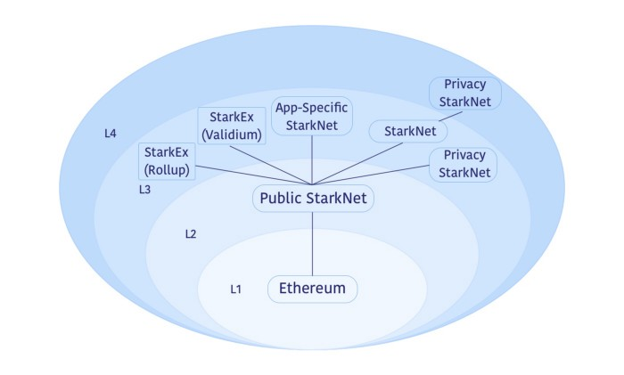

# Fractal Scaling in Ethereum

Fractal scaling is an emerging approach to achieving massive scalability on Ethereum by recursively building layers on top of each other. This guide explores the key concepts, limitations, and use cases associated with Layer 3s (L3s), app chains, and modern rollup infrastructure.

---

## Core Concepts

### How Rollups Scale

- Rollups increase scalability by **executing transactions off Layer 1 (L1)**.
- They compress and post data or proofs to the L1, ensuring **Ethereum-grade security**.
- This approach reduces gas costs and improves throughput.

### The Limits of Stacking Layers

- Stacking layers (e.g., L3 → L2 → L1) doesn't lead to **infinite scalability**.
- Each layer must eventually **post data** or **validity proofs** to the L1.
- These posts incur **non-zero gas costs**, introducing a cost floor.
- An L3 posts to its L2 parent, which posts to L1, creating **cascading data availability requirements**.

### Data Availability is Crucial

- Just as L2s must ensure data availability to L1, L3s must make their state data **available to their parent L2**.
- Without data availability, state integrity cannot be verified.

---

## The Purpose of Layer 3s

There are **three strategic models** for leveraging Layer 3s:

### 1. L3 for Customised Functionality

- **Concept**: L2 offers general-purpose scaling, L3 adds special features.
- **Use Case**: Privacy-focused transactions using ZK-proofs.
- **Example**: Users transfer funds from L2 to a private L3, perform confidential actions, then exit back to L2.

### 2. L3 for Customised Scaling

- **Concept**: Dedicated L3s prevent interference from other applications.
- **Use Case**: High-frequency trading or large-scale gaming requiring low latency.
- **Example**: An L3 with faster block times and unique gas mechanics for one app.

### 3. L3 for Weakly-Trusted Scaling (Validiums)

- **Concept**: Trade some trustlessness for **cost and performance gains**.
- **Use Case**: Validiums with off-chain data managed by a DAC (Data Availability Committee).
- **Risk**: If DAC withholds data, users may lose access to funds.
- **Example**: Validiums using ZK-proofs without on-chain data posting.

---

## Understanding App Chains

### Definition

- An **App Chain** is a blockchain designed **for a single application**.
- It can be an L2 or an L3, depending on its place in the stack.

### Goal

- **Sovereign control** over performance, blockspace, and governance.
- Customizable tokenomics, consensus, and infrastructure.

### Implementation

- Not a strict technical standard — describes **function**, not form.
- Can settle on L1 (as an L2) or on L2 (as an L3).

---

## Layer 3 vs App Chain: A Comparison

| Feature        | Layer 3                                                | App Chain                                                  |
|----------------|--------------------------------------------------------|-------------------------------------------------------------|
| Definition     | Blockchain that settles on a Layer 2                   | Blockchain dedicated to a single application               |
| Primary Goal   | Hyper-scalability or custom features                   | Sovereignty over resources and environment                 |
| Implementation | Can be general-purpose or application-specific         | Can be built as L2 or L3                                    |
| Example        | Gaming L3 settling on Arbitrum                         | Dedicated game chain built as an L3                         |

---

## Current Status: Rollup Frameworks and Implementations

Development of L3s and App Chains is rapidly advancing, thanks to **Rollup-as-a-Service (RaaS)** platforms and **open-source frameworks**.

### Arbitrum Orbit

- Launch custom L3 chains on Arbitrum L2.
- Customize:
  - Gas fees
  - Throughput
  - Permissions

### OP Stack

- Powers the Optimism ecosystem.
- Enables launching L2/L3 chains in the **Superchain** network.
- Used by:
  - **Base**
  - **Zora**

### Polygon CDK (Chain Development Kit)

- Open-source toolkit for launching **ZK-powered L2s**.
- Interoperable via a shared **ZK bridge**.
- Part of the growing **Polygon ecosystem**.

### zkSync Hyperchains

- zkSync’s **fractal scaling** vision.
- Developers launch customizable **L3 Hyperchains**.
- These settle on zkSync Era (an L2) and inherit its ZK-proof security.

---


# DeFi Arbitrage and Liquidation on EVM Chains

This guide provides a comprehensive overview of arbitrage mechanisms and their implementation on Ethereum-compatible (EVM) blockchains, focusing on atomic execution, flash loans, and smart contract strategies.

---

## Arbitrage in DeFi

**Definition**: Arbitrage is the practice of exploiting price differences for an identical asset across different markets to make a profit.

In DeFi, arbitrage typically involves **Decentralised Exchanges (DEXs)** such as Uniswap, SushiSwap, Curve, etc.

---

### Core Concept

- **Buy Low, Sell High**: Purchase an asset at a lower price from one DEX and sell it at a higher price on another DEX — ideally within the same transaction.
- **Single Transaction**: All steps are executed atomically. Either all of them succeed, or the transaction fails and is reverted.

---

### Atomic Execution

- Blockchain transactions are **atomic** by default.
- This property ensures arbitragers do not face the risk of completing only the buy or sell leg, leaving them with unwanted token exposure.
- If any part of the arbitrage operation fails (e.g., slippage, price change), the **entire transaction is rolled back**.

---

### Flash Loans and Flash Swaps

- **Flash Loans**: Provided by protocols like Aave and dYdX, they let users borrow assets without collateral — but the debt must be repaid in the **same transaction**.
- **Flash Swaps**: A feature of Uniswap V2 and V3 that allows token borrowing as part of a swap, repaid by the end of the transaction.

#### Example:
- Borrow 1,000,000 DAI.
- Use it to purchase ETH on Curve.
- Sell ETH for more DAI on Uniswap.
- Repay loan + fee.
- Keep the remaining DAI as **profit**.

---

### Execution Environment

- **Arbitrage Bots**:
  - Continuously monitor DEX prices and the **mempool** for pending transactions.
  - Search for **price discrepancies** and **slippage opportunities**.
- **On-Chain Tools**:
  - Use web3 libraries to interact with DEX smart contracts.
  - Utilize flash loan protocols for capital efficiency.
- **Off-Chain Tools**:
  - Mempool monitoring, private RPC endpoints, or **MEV relays** for frontrunning and backrunning.

---

### Smart Contract Logic for Arbitrage

#### Step-by-Step Flow

1. **Initialization**:
   - The arbitrage contract is called, usually by an externally owned account (EOA).
2. **Flash Loan Initiation**:
   - Contract borrows funds from a flash loan provider or via a DEX’s flash swap.
3. **DEX Swaps Execution**:
   - Execute one or more token swaps across different DEXs.
   - The goal is to end with **more of the borrowed asset** than needed to repay.
4. **Loan Repayment**:
   - Repay the borrowed amount plus the required fee.
5. **Profit Extraction**:
   - Transfer remaining profit to a predefined address or wallet.

---

## Arbitrage Code Example (Conceptual)

Below is a **simplified example** of a Solidity contract that performs a Uniswap V2 flash swap for arbitrage purposes:

```solidity
import "@uniswap/v2-core/contracts/interfaces/IUniswapV2Callee.sol";
import "@uniswap/v2-periphery/contracts/interfaces/IUniswapV2Router02.sol";
import "./interfaces/ISushiSwapRouter.sol"; // Assuming a similar interface for another DEX

// This contract is simplified for conceptual clarity
contract Arbitrageur is IUniswapV2Callee {
    IUniswapV2Router02 public uniswapRouter;
    ISushiSwapRouter public sushiswapRouter;
    address public immutable factory;
    address owner;

    // Set DEX routers and factory addresses in the constructor
    constructor(address _uniswapRouter, address _sushiRouter) {
        uniswapRouter = IUniswapV2Router02(_uniswapRouter);
        sushiswapRouter = ISushiSwapRouter(_sushiRouter);
        factory = IUniswapV2Factory(IUniswapV2Router02(_uniswapRouter).factory()).factory();
        owner = msg.sender;
    }

    // This is the callback function that Uniswap Pair calls
    // It is the entry point for the arbitrage logic after the flash swap is received
    function uniswapV2Call(address sender, uint amount0, uint amount1, bytes calldata data) external override {
        // 1. Decode data to get the second token address
        (address token0, address token1) = abi.decode(data, (address, address));

        // 2. Ensure the caller is a legitimate Uniswap Pair
        require(msg.sender == IUniswapV2Factory(factory).getPair(token0, token1), "Unauthorized call");
        require(sender == address(this), "Invalid initiator");

        // 3. Perform the arbitrage trade on another DEX (e.g., SushiSwap)
        // We received 'amount0' of 'token0' from Uniswap
        IERC20(token0).approve(address(sushiswapRouter), amount0);
        
        address[] memory path = new address[](2);
        path[0] = token0;
        path[1] = token1;

        // Swap the received token0 for token1 on SushiSwap
        uint amountReceived = sushiswapRouter.swapExactTokensForTokens(...)[sushiswapRouter.swapExactTokensForTokens.length -1];

        // 4. Repay the flash loan to the Uniswap Pair
        // The required repayment amount is calculated by the pair's getAmountIn function
        uint amountToRepay = IUniswapV2Pair(msg.sender).getAmountIn(amountReceived, token0);
        
        IERC20(token1).transfer(msg.sender, amountToRepay);

        // 5. Send profit to the owner
        uint profit = IERC20(token1).balanceOf(address(this));
        if (profit > 0) {
            IERC20(token1).transfer(owner, profit);
        }
    }

    // Kicks off the arbitrage
    function startArbitrage(address token0, address token1, uint amount) external {
        // Request a flash swap from Uniswap
        // The 'data' field will be passed to our uniswapV2Call function
        IUniswapV2Pair(IUniswapV2Factory(factory).getPair(token0, token1)).swap(
            amount,
            0,
            address(this),
            abi.encode(token0, token1)
        );
    }
}
```

---

# Liquidation in DeFi Lending Protocols

Liquidation is a critical process in decentralised finance (DeFi) lending platforms. It ensures the solvency of the system by selling a borrower's collateral when their loan becomes under-collateralised.

---

**What Is Liquidation?**

**Definition**: Liquidation is the act of selling off a borrower's collateral to repay their debt when their position becomes unsafe (i.e., the value of their collateral drops too close to or below the value of their borrowed assets).

This mechanism is vital for protecting lending protocols such as **Aave** and **Compound** from bad debt.

---

## Health Factor

The **Health Factor** is a numeric value used to represent how safe a user's loan position is.

- **Formula**:
$$
\frac{
\sum (\text{CollateralValue} \times \text{LiquidationThreshold})
}{
\sum \text{BorrowedValue}
}
$$


- **Interpretation**:
  - If **Health Factor > 1** → The position is healthy.
  - If **Health Factor < 1** → The position is under-collateralised and eligible for liquidation.

---

## Liquidation Threshold

Each asset has a **Liquidation Threshold** — a percentage that determines how much of the collateral can be safely borrowed against.

- **Example**:  
  - If the liquidation threshold for ETH is **80%**, then for every 1 ETH of collateral, you can borrow up to **0.8 ETH** worth of another asset.
  - If the borrowed value exceeds that, liquidation can occur.

---

## Liquidators

- **Liquidators** are users (often bots) who monitor the blockchain for under-collateralised positions.
- They initiate the liquidation process and are **incentivised** through a **liquidation bonus**.

---

## Liquidation Process: Step-by-Step

1. A liquidator detects a user's position with **Health Factor < 1**.
2. The liquidator calls the smart contract function (e.g., `liquidationCall()` in Aave).
3. They specify:
   - The address of the under-collateralised user.
   - The amount of debt they wish to repay.
4. In exchange:
   - The smart contract **transfers** a portion of the user’s collateral to the liquidator.
   - The liquidator receives the collateral at a **discount**, known as the **liquidation bonus**.

---

## Liquidation Bonus

- The **liquidation bonus** is a reward for liquidators.
- It is calculated as a percentage over the amount of debt repaid.
- **Example**: A 5% liquidation bonus means:
  - Repay $1,000 worth of debt.
  - Receive $1,050 worth of collateral.

---

## Smart Contract Interface

Lending protocols expose public functions to allow **permissionless** liquidation.

- **Function Responsibilities**:
  - Validate that the position is eligible for liquidation.
  - Transfer repayment amount from the liquidator.
  - Transfer discounted collateral to the liquidator.
  - Update protocol state accordingly.

---

## Liquidation Code Example (Conceptual)

Below is a **conceptual example** of how a Solidity smart contract might interact with an Aave-like lending protocol to perform a liquidation:

```solidity

import "./interfaces/ILendingPool.sol"; // Simplified Aave interface
import "@openzeppelin/contracts/token/ERC20/IERC20.sol";

// This contract is simplified for conceptual clarity
contract Liquidator {
    ILendingPool lendingPool;
    address owner;

    constructor(address _lendingPoolAddress) {
        lendingPool = ILendingPool(_lendingPoolAddress);
        owner = msg.sender;
    }

    // Function to execute a liquidation
    // Assumes this contract already holds the debt asset (e.g., DAI) needed for repayment
    function executeLiquidation(
        address collateralAsset,
        address debtAsset,
        address userToLiquidate,
        uint debtToCover,
        bool receiveAToken
    ) external {
        // 1. Approve the Lending Pool to pull the debt asset from this contract
        IERC20(debtAsset).approve(address(lendingPool), debtToCover);

        // 2. Call the liquidation function on the Lending Pool contract
        // This function will:
        // - Pull 'debtToCover' amount of 'debtAsset' from this liquidator contract.
        // - In exchange, it sends the liquidator a discounted amount of the 'collateralAsset'.
        // - The 'receiveAToken' boolean determines if you get the raw collateral or the protocol's aToken.
        lendingPool.liquidationCall(
            collateralAsset,
            debtAsset,
            userToLiquidate,
            debtToCover,
            receiveAToken
        );
    }
    
    // Helper function to withdraw profits
    function withdraw(address tokenAddress) external {
        require(msg.sender == owner, "Only owner can withdraw");
        IERC20 token = IERC20(tokenAddress);
        token.transfer(owner, token.balanceOf(address(this)));
    }
}

```

