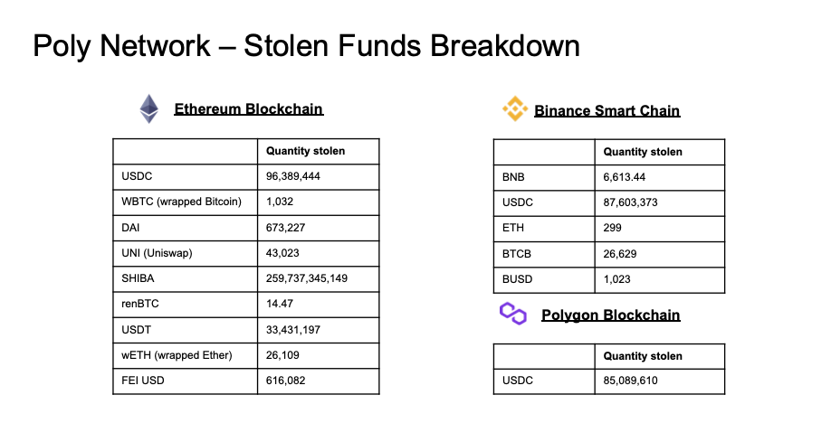
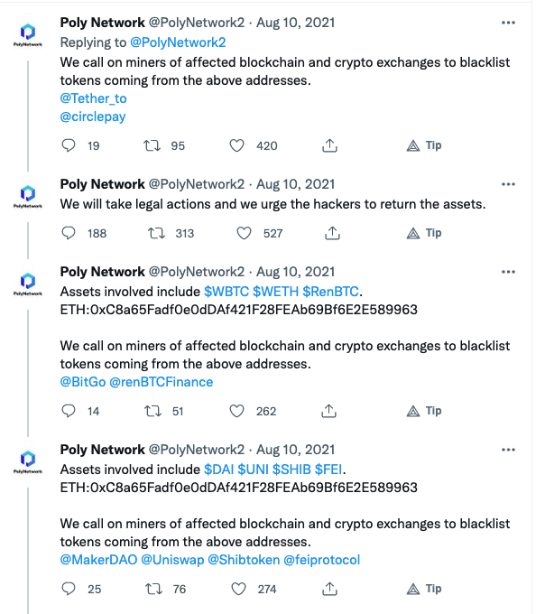
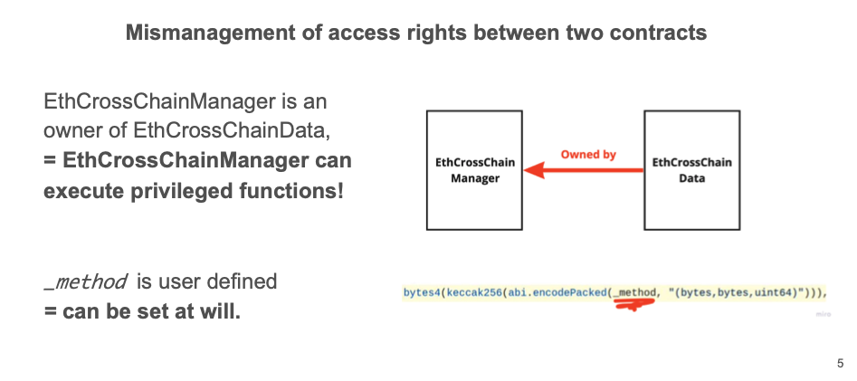
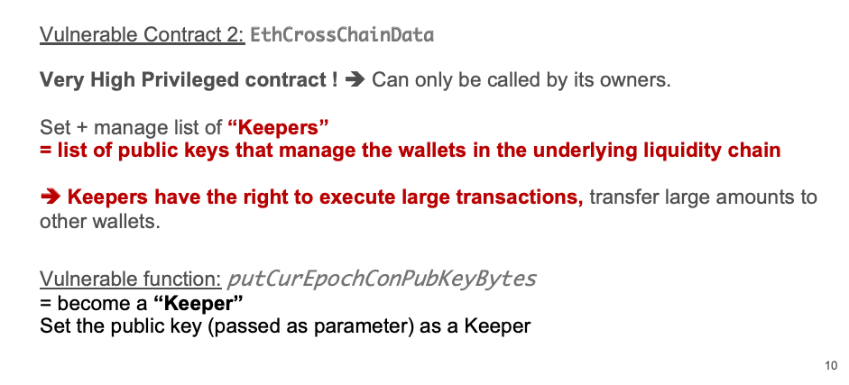

# Basic Security
## Ecosystem


---


# ConsenSys Smart Contract Best Practices

## Table of Contents

- [General](#general)
  - [Prepare for Failure](#prepare-for-failure)
  - [Stay up to Date](#stay-up-to-date)
  - [Keep it Simple](#keep-it-simple)
  - [Rolling Out](#rolling-out)
  - [Blockchain Properties](#blockchain-properties)
  - [Simplicity vs. Complexity](#simplicity-vs-complexity)
- [Precautions](#precautions)
  - [Upgradeability](#upgradeability)
  - [Circuit Breakers](#circuit-breakers)
  - [Speed Bumps](#speed-bumps)
  - [Rate Limiting](#rate-limiting)
  - [Deployment](#deployment)
  - [Safe Haven](#safe-haven)
- [Solidity Specific](#solidity-specific)
  - [Assert, Require, Revert](#assert-require-revert)
  - [Modifiers as Guards](#modifiers-as-guards)
  - [Integer Division](#integer-division)
  - [Abstract vs Interfaces](#abstract-vs-interfaces)
  - [Fallback Functions](#fallback-functions)
  - [Payability](#payability)
  - [Visibility](#visibility)
  - [Locking Pragmas](#locking-pragmas)
  - [Event Monitoring](#event-monitoring)
  - [Shadowing](#shadowing)
  - [tx.origin](#txorigin)
  - [Timestamp Dependence](#timestamp-dependence)
  - [Complex Inheritance](#complex-inheritance)
  - [Interface Types](#interface-types)
  - [EXTCODESIZE Checks](#extcodesize-checks)
- [Token Specific](#token-specific)
  - [Standardization](#standardization)
  - [Frontrunning](#frontrunning)
  - [Zero Address](#zero-address)
  - [Contract Address](#contract-address)
- [Documentation](#documentation)
  - [Specification](#specification)
  - [Status](#status)
  - [Procedures](#procedures)
  - [Known Issues](#known-issues)
  - [History](#history)
  - [Contact](#contact)
- [Attacks](#attacks)
  - [Reentrancy](#reentrancy)
  - [Oracle Manipulation](#oracle-manipulation)
  - [Frontrunning](#frontrunning-1)
  - [Timestamp Dependence](#timestamp-dependence-1)
  - [Insecure Arithmetic](#insecure-arithmetic)
  - [Denial of Service](#denial-of-service)
  - [Griefing](#griefing)
  - [Force Feeding](#force-feeding)

---

## General

### Prepare for Failure

Expect bugs, plan fail-safes, have recovery processes.

### Stay up to Date

Keep up with compiler changes, Solidity releases, and library updates.

### Keep it Simple

Minimize contract size and complexity.

### Rolling Out

Use phased rollouts, monitor on-chain behavior before full release.

### Blockchain Properties

Immutable, transparent, and append-only—code once deployed cannot be altered.

### Simplicity vs. Complexity

Prefer understandable, maintainable logic over over-engineered solutions.

---

## Precautions

### Upgradeability

Use proxy patterns for upgradeable contracts.

### Circuit Breakers

Add emergency stop mechanisms:

```solidity
bool public stopped = false;

modifier stopInEmergency { require(!stopped); _; }

function toggleContractActive() external onlyOwner {
    stopped = !stopped;
}
```

### Speed Bumps

Delay actions to allow time for detection of anomalies.

### Rate Limiting

Restrict frequency of sensitive operations:

```solidity
mapping(address => uint256) public lastAccess;

modifier rateLimited() {
    require(block.timestamp > lastAccess[msg.sender] + 1 minutes);
    _;
    lastAccess[msg.sender] = block.timestamp;
}
```

### Deployment

Double-check constructor logic and ownership settings.

### Safe Haven

Ensure there is a way to recover control or pause activity in emergencies.

---

## Solidity Specific

### Assert, Require, Revert

Use `require` for input validation, `assert` for invariants, and `revert` for custom errors.

### Modifiers as Guards

Use for access control and validation.

```solidity
modifier onlyOwner() {
    require(msg.sender == owner, "Not owner");
    _;
}
```

### Integer Division

Be aware Solidity truncates division results.

### Abstract vs Interfaces

Use interfaces to define external contract behavior.

### Fallback Functions

Use `receive()` for ETH transfers, fallback only for data-less calls.

### Payability

Use `payable` to accept ETH.

### Visibility

Explicitly set visibility: `public`, `external`, `internal`, `private`.

### Locking Pragmas

Use fixed pragma versions to prevent compiler inconsistency.

```solidity
pragma solidity ^0.8.20;
```

### Event Monitoring

Emit events for critical actions.

```solidity
event Transfer(address indexed from, address indexed to, uint256 value);
```

### Shadowing

Avoid reusing variable names in nested scopes.

### tx.origin

Do **not** use `tx.origin` for authentication.

### Timestamp Dependence

Avoid logic reliant on `block.timestamp` for critical decisions.

### Complex Inheritance

Flatten contract hierarchies when possible to avoid ambiguity.

### Interface Types

Use correct external interfaces to interact with other contracts.

### EXTCODESIZE Checks

Don’t rely solely on `extcodesize` to determine contract type.

---

## Token Specific

### Standardization

Follow ERC standards (ERC20, ERC721, etc.) and include safe transfer checks.

### Frontrunning

Design transactions to minimize MEV/frontrunning vectors.

### Zero Address

Reject transfers to `address(0)`.

### Contract Address

Check whether the recipient is a contract when appropriate:

```solidity
function isContract(address _addr) internal view returns (bool) {
    uint32 size;
    assembly { size := extcodesize(_addr) }
    return (size > 0);
}
```

---

## Documentation

### Specification

Include clear interface and behavioral specifications.

### Status

Document audit and test coverage.

### Procedures

Define upgrade, migration, and pause procedures.

### Known Issues

Track bugs, limitations, and workarounds.

### History

Keep track of deployments, versions, and changes.

### Contact

Include points of contact for incident response.

---

## Attacks

### Reentrancy

Use `checks-effects-interactions` pattern and reentrancy guards.

```solidity
bool internal locked;

modifier noReentrancy() {
    require(!locked, "No reentrancy");
    locked = true;
    _;
    locked = false;
}
```

### Oracle Manipulation

Use TWAPs or medianized prices to reduce manipulation.

### Frontrunning

Batch or commit-reveal transactions to mitigate MEV.

### Timestamp Dependence

Avoid using block timestamps for lottery or randomness.

### Insecure Arithmetic

Use SafeMath (pre-0.8) or built-in overflow checks (0.8+).

### Denial of Service

Avoid unbounded loops and user-controlled callbacks.

### Griefing

Prevent attackers from exploiting gas or control logic to harm others.

### Force Feeding

Don't assume contracts will only get ETH via `receive()` or `fallback()`. ETH can be sent via `selfdestruct`.


---

# Access Control in Solidity

## Overview

Access control is a mechanism to restrict who can execute specific functions in smart contracts. It determines which addresses can call particular methods or modify the contract’s state. This is crucial to prevent unauthorized users from performing privileged operations.

---

## Why Access Control is Critical for Security

### Prevents Unauthorised Fund Withdrawal
- Stops malicious actors from draining contract balances.
- Protects user deposits and protocol reserves.

### Maintains Contract Integrity
- Ensures only authorized parties can modify critical parameters.
- Prevents tampering with contract logic or state variables.

### Protects Against Privilege Escalation
- Stops regular users from gaining administrative rights.
- Maintains proper separation of roles and responsibilities.

### Reduces Attack Surface
- Limits exposure to potential exploits.
- Minimizes functions accessible to external actors.

---

## Common Access Control Patterns

### Owner-Only Access
- Single address with administrative privileges.
- Simple but centralized approach.
- Uses `onlyOwner` modifier pattern.

```solidity
contract Owned {
    address public owner;

    constructor() {
        owner = msg.sender;
    }

    modifier onlyOwner() {
        require(msg.sender == owner, "Not the owner");
        _;
    }

    function withdraw() public onlyOwner {
        // privileged action
    }
}
```

### Role-Based Access Control (RBAC)
- Multiple roles with different permission levels.
- More flexible than single-owner approach.
- Allows granular permission management.

```solidity
contract RBAC {
    mapping(address => bool) public admins;

    modifier onlyAdmin() {
        require(admins[msg.sender], "Not admin");
        _;
    }

    function addAdmin(address _admin) public {
        admins[_admin] = true;
    }

    function restrictedAction() public onlyAdmin {
        // admin logic
    }
}
```

### Multi-Signature Requirements
- Requires multiple approvals for critical operations.
- Reduces single point of failure.

```solidity
// Example pseudocode - not secure for production
mapping(address => bool) public signers;
uint256 public approvals;

function execute() public {
    require(signers[msg.sender], "Not signer");
    approvals++;
    if (approvals >= 2) {
        // execute action
        approvals = 0;
    }
}
```

### Time-Based Restrictions
- Functions only callable during specific time windows.
- Useful for ICOs, voting, or maintenance windows.

```solidity
uint256 public startTime;
uint256 public endTime;

modifier onlyDuringSale() {
    require(block.timestamp >= startTime && block.timestamp <= endTime, "Not in sale window");
    _;
}
```

---

## Implementation Techniques

### Modifiers
- Reusable logic for access control.
- Clean code structure.

```solidity
modifier onlyOwner() {
    require(msg.sender == owner, "Access denied");
    _;
}
```

### Require Statements
- Direct conditional checks inside functions.
- Reverts with clear error messages.

```solidity
function secure() public {
    require(msg.sender == owner, "Not authorized");
}
```

### Mapping-Based Permissions
- Track authorized addresses using mappings.
- Efficient for large permission sets.

```solidity
mapping(address => bool) public whitelist;

function access() public {
    require(whitelist[msg.sender], "Not whitelisted");
}
```

---

## Security Best Practices

### Principle of Least Privilege
- Grant only the minimum permissions needed.
- Review permissions regularly.

### Input Validation
- Validate parameters like addresses and amounts.
- Ensure correct state before executing.

### Event Logging
- Emit events for role changes and sensitive actions.
- Helps in audit and monitoring.

```solidity
event RoleGranted(address indexed user);

function grantRole(address _user) public onlyOwner {
    whitelist[_user] = true;
    emit RoleGranted(_user);
}
```

### Emergency Controls
- Add `pause()` and `unpause()` functions for crisis management.

```solidity
bool public paused = false;

modifier whenNotPaused() {
    require(!paused, "Paused");
    _;
}
```

---

## Common Vulnerabilities

### Missing Access Controls
- Public functions left unrestricted.
- Often leads to full contract compromise.

### Incorrect Permission Logic
- Flawed conditionals in access checks.
- Inconsistent application of modifiers.

### Centralisation Risks
- Relying on one key for critical operations.
- No backup in case of key loss.

### Front-Running Attacks
- Transaction ordering to gain unauthorized access.
- Relevant for ownership or role transfers.

---

## Testing and Auditing

### Comprehensive Unit Tests
- Test both valid and invalid access scenarios.
- Include boundary cases.

### Integration Testing
- Check access flow across interacting contracts.
- Prevent privilege escalation through chains.

### Professional Security Audits
- Engage trusted auditors.
- Use automated tools to detect access issues.

---

**Access control is foundational to smart contract security. Applying layered, well-tested, and clearly defined permission structures helps protect users and maintain protocol integrity.**


---


# Poly Network Hack: ABI Encoding and Function Selectors

## Overview

The Poly Network Hack was one of the largest DeFi exploits in history, resulting in over $600M being stolen. A key aspect of understanding how such exploits are possible lies in grasping low-level Ethereum mechanics such as **function selectors** and **ABI encoding**.

This guide provides a step-by-step explanation of how Solidity functions are encoded for execution, using a real Solidity contract and the `baz(uint32,bool)` example from the Poly exploit.

---

## Function Selectors Recap

In Solidity, each function has a **selector** derived from its signature. This selector is a 4-byte identifier used by the Ethereum Virtual Machine (EVM) to determine which function to invoke in a smart contract.

### 🔹 How It's Calculated

1. Write the function signature as a string:  
   `baz(uint32,bool)`

2. Hash it using Keccak-256:  
   `keccak256("baz(uint32,bool") = 0xcdcd77c0...`

3. The first 4 bytes are the **function selector**:  
   `0xcdcd77c0`

---

## Encoding Function Signatures and Parameters

When calling a function on a smart contract, the data sent includes:

- 4 bytes: **Function selector**
- 32 bytes per parameter: **ABI-encoded input values**

These are concatenated to form the final transaction payload.

---

## Solidity Example

```solidity
pragma solidity ^0.8.0;

contract MyContract {
    
  Foo otherContract;
  
  function callOtherContract() public view returns (bool) {
      bool answer = otherContract.baz(69, true);
      return answer;
  }
}

contract Foo {
    function bar(bytes3[2] memory) public pure {}
    
    function baz(uint32 x, bool y) public pure returns (bool r) {
        r = x > 32 || y; 
    }

    function sam(bytes memory, bool, uint[] memory) public pure {}
}
```


## Breakdown of Encoded Call Data
To call `baz(69, true)` via a low-level EVM call:

### Step 1: Function Selector
Signature: `baz(uint32,bool)`

Keccak-256 hash: **0xcdcd77c0...**

Selector:**0xcdcd77c0**

### Step 2: Parameter 1 - uint32 (69)
69 in hex: `0x45`

Left-padded to 32 bytes:
**0x0000000000000000000000000000000000000000000000000000000000000045**
### Step 3: Parameter 2 - bool (true)
true in hex: `0x01`

Left-padded to 32 bytes:

**0x0000000000000000000000000000000000000000000000000000000000000001**


---


## Visual ABI Diagram


| Offset | Length | Description                        |
|--------|--------|------------------------------------|
| 0x00   | 4 B    | Function Selector (0xcdcd77c0)     |
| 0x04   | 32 B   | uint32 value 69                    |
| 0x24   | 32 B   | bool value true                    |

---

## Final ABI-encoded call:
**0xcdcd77c0000000000000000000000000000000000000000000000000000000000000450000000000000000000000000000000000000000000000000000000000000001**
Total length: `68 bytes`


---

## Poly Network Hack Exploit Details
**$600M Stolen**
The Poly Network hack involved abusing cross-chain smart contract logic by manipulating signatures and trusted inputs.




## Core of the Exploit
The attacker aimed to find a value X such that:
```Solidity 

Hash(X, bytes, bytes, uint64) = Hash(putCurEpochConPubKeyBytes, bytes)

```
The resulting hash had to match a predefined constant:

**Expected Hash: 0x41973cd9**
By brute-forcing the correct input X, the attacker found:
**X = f1121318093**
This allowed bypassing signature validation and unauthorized fund transfers.





## Summary
- Function selectors are 4-byte identifiers derived from function signatures using Keccak-256.

- ABI encoding pads each parameter to 32 bytes.

- Understanding this encoding allows low-level manipulation of smart contracts.

- In the Poly Network hack, such knowledge enabled an attacker to forge trusted messages and extract $600M across multiple chains.