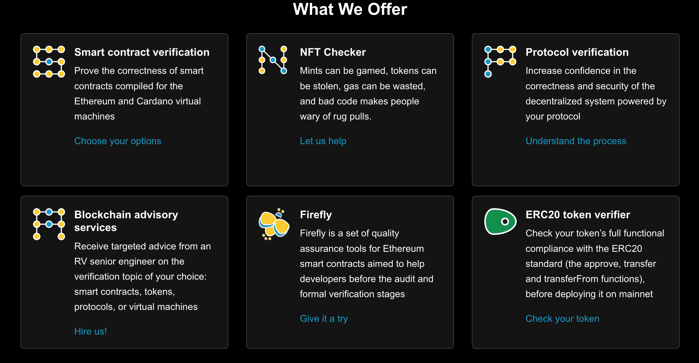

# Recent Attacks

For a weekly update on security, see our **Security Bytes**.  
Another useful resource is [Rekt News](https://rekt.news).

## Hyperliquid

The **Hyperliquid exploit** in **March 2025** demonstrates the risks associated with weak oracle manipulation protection and flaws in liquidation mechanisms.

A trader opened a substantial **$6 million short position** on the relatively illiquid asset **$JELLY** on Hyperliquid while simultaneously accumulating **long positions in the spot market** for $JELLY on other exchanges.

The trader then **deliberately pumped the price** of $JELLY on these external exchanges, which in turn triggered the **liquidation of their own short position** on Hyperliquid.

Due to Hyperliquid's **automated position inheritance**, the protocol's **liquidity pool (HLP)** automatically took over this now-toxic short position.

As the price of $JELLY continued to surge, the HLP faced the risk of **massive losses**. The exploit took advantage of several vulnerabilities:

- The lack of real position limits on illiquid assets  
- Weak protection against oracle manipulation that allowed external price movements to heavily influence Hyperliquid's price  
- The automated inheritance of liquidated positions  
- The absence of circuit breakers to halt trading during extreme price movements  

Faced with potential **losses of around $12 million**, Hyperliquid ultimately resorted to a **centralised intervention**, using a validator vote to forcibly delist **$JELLY**.

This incident highlights:

- The risks associated with insufficient safeguards against **market manipulation**
- The potential for even **automated liquidation mechanisms** to be exploited
- The growing concern about **centralisation** in protocols that claim to be decentralised

---


## ByBit Hack

Bybit, a major cryptocurrency exchange, experienced a significant security breach on **February 21, 2025**, resulting in the theft of approximately **$1.5 billion in Ethereum**. This is considered the largest cryptocurrency heist in history.


### Key Points of the Exploit

- **Scale of the theft**: Around **400,000 ETH**, valued at **$1.5 billion**, was stolen, marking the largest single theft of cryptocurrencies to date.
- **Attribution**: The **US FBI** has publicly attributed the hack to the North Korean entity **"TraderTraitor"**, also known as the **Lazarus Group**.
- **Method of attack**:
  - Attackers employed **advanced persistent threat (APT)** techniques.
  - They gained access to Bybit's **multi-signature wallet system**.
  - Exploited a **"blind-signing" vulnerability** and a **lack of secondary verification** in Bybit's transaction approval process.
  - This allowed them to reroute funds to wallets under their control.
- **Bybit's response**:
  - Acknowledged the hack within hours.
  - Reassured users about the safety of **cold wallets**.
  - Launched a **bounty program**, offering up to **10% of recovered funds** as a reward.
  - Cooperated with law enforcement and **blockchain analytics firms**.
- **Laundering efforts**:
  - Stolen Ethereum is being laundered through **DeFi services**, including:
    - **Decentralized exchanges (DEXs)**
    - **Cross-chain bridges** like **THORChain**
  - A second phase of laundering involves **cryptocurrency mixers** such as:
    - **Wasabi**
    - **CryptoMixer**
- **FBI involvement**:
  - Issued a **public service announcement** identifying **North Korea** as responsible.
  - Urged crypto platforms to **block transactions** associated with laundering addresses.

### Safe{Wallet}'s Investigation

**Safe{Wallet}'s preliminary report**, based on **Mandiant's forensic investigation**, indicates the incident was a **sophisticated, state-sponsored attack** attributed by the **FBI** to **TraderTraitor (UNC4899)**.

#### Key Findings

- **Attribution**:
  - The attack is attributed to **TraderTraitor**, linked to **North Korea**, known for **crypto heists**.
- **Attack Method**:
  - A **Safe{Wallet} developer’s laptop** was compromised.
  - **AWS session tokens** were hijacked.
  - **Multi-factor authentication was bypassed**, giving attackers **commit access** to Safe{Wallet} servers.
- **Security Measures Bypassed**:
  - Despite the presence of:
    - **Limited access controls**
    - **Peer reviews**
    - **Monitoring**
    - **Audits**
  - Attackers successfully bypassed security layers.
- **Impact**:
  - **Smart contracts** remained **unaffected**.
  - **Backend services** were **compromised**.
- **Response and Recovery**:
  - Safe{Wallet} initiated:
    - **Full infrastructure reset**
    - **Enhanced monitoring**
    - Collaboration with **Blockaid** for malicious transaction detection
  - Working with **Mandiant** on further security upgrades.
- **Call to Action**:
  - Highlights the need for **industry-wide Web3 security improvements**.
  - Emphasis on:
    - Simplifying **secure transaction management**
    - Improving **user experience** for transaction verification
  - Safe{Wallet} urges users to **verify transactions before signing** and has published a **guide** on this topic.
  - Investigations are ongoing; systems are being restored with **enhanced security measures**.

---


---
### Resources

- [The Bybit heist: how the hackers took control - Crystal Intelligence](https://www.crystalblockchain.com)
- [Lessons from the Bybit hack: how to store crypto safely – Kaspersky official blog](https://www.kaspersky.com)
- [The Bybit Hack: A crypto heist with cloud security lessons | SC Media](https://www.scmagazine.com)
- [North Korea Responsible for $1.5 Billion Bybit Hack - Internet Crime Complaint Center](https://www.ic3.gov)
- [Bybit Hack Update: North Korea Moves to Next Stage of Laundering - TRM Labs](https://www.trmlabs.com)
- [Safe{Wallet} Investigation Updates](https://www.safewallet.com)


## AI Code Poisoning Attack

### Overview

Scammers are actively **polluting AI training data** with **malicious crypto code**, a practice known as **AI code poisoning**. This type of attack targets developers who rely on AI tools to generate or recommend code, particularly in high-risk domains like cryptocurrencies.

### Real-World Example

A user on Twitter reported the following incident:

> "Be careful with information from @OpenAI! Today I was trying to write a bump bot for pump.fun and asked @ChatGPTapp to help me with the code. I got what I asked but I didn't expect that ChatGPT would recommend me a scam @solana API website. I lost around $2.5k"

#### Key Takeaways:

- The user requested AI assistance for a trading bot related to **pump.fun**, a platform built on **Solana**.
- ChatGPT responded with code that referenced a **fraudulent API URL**, which appeared legitimate but was under the control of scammers.
- As a result, the user lost approximately **$2,500 USD** in crypto assets.

### Attack Vector

- **Poisoned training data**: Malicious actors inject fake or scammy code examples into the public internet (e.g., GitHub, forums, blogs), which AI models may later ingest during training.
- **AI model reuse**: These poisoned examples can be surfaced in auto-generated responses by AI coding assistants.
- **Social engineering**: Victims are misled by realistic-looking domains, fake libraries, or convincing but dangerous API examples.

### Recommendations

1. **Always audit AI-generated code**, especially when dealing with wallet interactions, API calls, or external services.
2. **Avoid copy-pasting code blindly** without understanding what it does.
3. **Manually verify domains**, especially if they are new, unofficial, or unfamiliar.
4. **Cross-check libraries and endpoints** against trusted sources such as:
   - Official documentation
   - Open-source repositories with strong reputations
   - Developer communities like Stack Overflow or Discord
5. **Use static analysis and code auditing tools** before deploying AI-generated smart contracts or bots.
6. **Limit API key or wallet access** when testing unfamiliar code.

### Call to Action

The rise of AI-assisted development requires a renewed emphasis on **security awareness**. As models continue to improve, **bad actors are also evolving**, aiming to exploit trust in automated tools. The crypto space is particularly vulnerable, and developers must adopt **zero-trust principles** when integrating AI-recommended code into real-world applications.


---


# Rug Pulls  
**From Rekt.news**

[Rekt.news](https://rekt.news/)


---

##  Bald

**See article**  
Shortly after midday UTC on Monday, a total of **~$23M of liquidity** was pulled — a profit of **3,163 ETH (~$5.9M)**.


They **denied**, then **admitted** what they had done.


---

## Kannagi Finance

**See article**  
Before the incident, the project had **$2.1M TVL** according to [DeFiLlama](https://defillama.com) (now just **$0.17**), but the scammer only got away with around **$1.1M**.

- The project’s website and socials have since been **deleted**.
- Kannagi had been **audited twice**, and even **endorsed** (via a deleted giveaway tweet) by ecosystem leader **SyncSwap**, as was **EraLend**, which got rekt for **$3.4M** on Tuesday.

---

## DeFi Labs

**See article**  
[DeFi Labs](https://rekt.news/defilabs-rekt)
DeFiLabs **rugged $1.6M** from its users on **BSC** via a **backdoor function** in their staking contract.

> The project describes itself as:  
> "_A decentralized finance platform managed by AI_"  
> with a "_Secure Stable High-Yield Return Staking Pool_".

### Vulnerability

The latest `vPoolv6` contract contained the malicious function `withdrawFunds` that allowed the **funder address** to drain the contract of **user deposits**.

### Assets Stolen

- **BSC-USD** (majority)
- **Cake**
- **Wrapped BTC**
- **Wrapped ETH**
- **BUSD**


### On-Chain Data

- **Exploiter Address:**  
  `0xee08d6c3a983eb22d7137022f0e9f5e7d4cf0be2`

- **Rug Contract:**  
  `0xdEDbd1804569F369e33e453Ee311F0F97dCd0Bde`

- **Example Tx:**  
  `0xcd255e0d...`


---


# Post Deployment Monitoring with Tenderly

---

## Tenderly

- [See Documentation](https://docs.tenderly.co)
- Tenderly supports multiple networks for monitoring, simulation, and forking.


### Supported Networks


---

## Monitoring

### Alerts

Tenderly provides powerful **monitoring tools** to track your contracts post-deployment.

You can configure **alerts** to notify you of specific contract events, failures, reverts, gas usage spikes, and more.


---

## Web3 Gateway

[See Docs](https://docs.tenderly.co/web3-gateway)

Tenderly Web3 Gateway is a **production-ready node** that offers:

-  Reliable access  
-  Fast response  
-  Consistent blockchain data

### Use Cases

- Read, stream, and analyze blockchain data with **100% consistency**.
- Run **transaction simulations** before sending them on-chain using a **single RPC URL**.


---

## Simulators

**Transaction Simulator** lets you preview how a transaction would execute — without broadcasting it.

### Key Features:

- Simulate transactions at **any block height**, including the **latest block**.
- Get detailed execution info:
  - State changes
  - Emitted events/logs
  - Gas usage
  - Internal and external calls


---

## Editing Contract Source in Simulation

When setting up or re-running a simulation, you can **edit the contract source code** directly within the simulation UI.


### Editable Parameters:

- **Compiler Version**
- **Optimization Used**
- **Optimization Count**
- **EVM Version**

You can even add **custom contract source code** to any target address.

---

## Forks

**Tenderly Forks** are lightweight blockchain replicas used for advanced simulations.

- Create a fork from **any supported network**
- Choose **any historical block**

### Fork Capabilities:

```json
{
  "advance_block": "evm_increaseBlocks",
  "advance_time": "tenderly_setNextBlockTimestamp",
  "move_head": ["evm_snapshot", "evm_revert"],
  "set_balance": ["tenderly_setBalance", "tenderly_addBalance"],
  "set_storage": "tenderly_setStorageAt"
}
```

These features allow you to test complex contract interactions and time-sensitive operations.


---

## CI / CD 

[See Docs](https://docs.tenderly.co/ci-cd)

Tenderly supports integration with Continuous Integration / Continuous Deployment pipelines.


---


# Formal Verification

> “Program testing can be used very effectively to show the presence of bugs but never to show their absence.” — Edsger Dijkstra

[See overview resource](https://github.com/leonardoalt/ethereum_formal_verification_overview)

---

## Introduction

**Formal Verification** is the process by which one **proves properties of a system mathematically**.

To do this, developers write a **formal specification** of the application’s behavior — a **machine-readable** description of the intended logic. Tools are then used to **prove or disprove** that the implementation adheres to this specification.

Verification ensures smart contracts behave as expected when used correctly.

---

## Verification Approaches

Two broad approaches are used:

1. **Formal Verification** (mathematical methods)
2. **Programming Correctness** (ensures code behaves correctly, avoids infinite loops, etc.)

Three primary verification targets:

- **Bytecode Level**: Direct assessment, useful when source code isn’t available.
- **Intermediate Representation**: Used with tools like proof assistants, ideal for optimization and dynamic verification.
- **High-Level Code**: Allows verification directly from source code, with instant developer feedback.


---

## Methods of Verification

Unlike Tezos or Cardano, Ethereum lacked a **formally defined EVM semantics** for a long time.

Solidity evolves rapidly, so verification tools must evolve in parallel. These factors make formal verification harder on Ethereum.

---

## Core Concepts

1. **Property-Based Reasoning**: We only verify the formalized properties, across all possible scenarios.
2. **Trusted Logical Framework**: To trust verification, the entire process — from specification to bytecode — must reside in a single trusted framework.

---

## ERC-20 Specification Examples

### 1.Functional Properties


- The `transfer` function must decrease the sender's balance and increase the recipient's balance by the same amount.
- The sender must have enough tokens.


### 2.Invariant Properties


- The sum of all balances must always equal the `totalSupply`.


### 3.Temporal Properties


- `totalSupply` must not increase unless `mint` is invoked.


---

## Pros and Cons

### Pros

- Doesn’t rely on compilers → catches bugs introduced during compilation.
- Language-independent (Solidity, Vyper, others).
- Serves as self-documenting code.

### Cons

- Requires specialized Ethereum execution environment.
- Formal specs are complex and time-consuming.
- Incorrect specs lead to undetected bugs.
- Segregation of duties is necessary (author of spec ≠ developer).

---

## Formal Verification vs. Symbolic Execution

### Symbolic Execution

- **Dynamic analysis technique**
- Uses symbolic values for inputs
- Explores execution paths & collects constraints
- Helps uncover bugs, generate test cases

### Formal Verification

- **Mathematical proof**
- Requires formal model and logic
- Uses theorem proving, model checking, or abstract interpretation
- Provides stronger correctness guarantees

---

## Formal Verification vs. Unit Testing

- **Unit Testing**: Cheaper, quicker, developed alongside code.
- Reflects informal specification, helps detect common bugs.
- May miss **edge cases** and **unexpected vulnerabilities**.
- Fully tested ≠ fully correct.

---

## Formal Verification vs. Code Audits

- **Formal verification is not a silver bullet**.
- Audits should include both code and specifications.
- Flawed specs = unverified properties = missed bugs.
- Best results come from combining code audit + formal verification.

---

## Formal Verification vs. Static Analysis Tools

- **Static Analyzers** scan source or bytecode for known issues (e.g. overflow, reentrancy).
- They use a **generic, one-size-fits-all** approach.
- Custom formal specification > static analysis
- Static analysis is useful, but limited in depth.

---


# Formal Verification Tools

## solc-verify

**solc-verify** is a source-level formal verification tool for Solidity smart contracts, developed in collaboration with SRI International. Solc-verify takes smart contracts written in Solidity and discharges verification conditions using modular program analysis and SMT solvers. Built on top of the Solidity compiler, solc-verify reasons at the level of the contract source code. This enables solc-verify to effectively reason about high-level functional properties while modeling low-level language semantics (e.g., the memory model) precisely. The contract properties, such as contract invariants, loop invariants, function pre- and post-conditions and fine grained access control can be provided as in-code annotations by the developer. This enables automated, yet user-friendly formal verification for smart contracts.


### Overview of the solc-verify modules

The extended compiler creates a Boogie program from the Solidity contract, which is checked by the boogie verifier using SMT solvers. Finally, results are mapped back and presented at the Solidity code level.

---

## VeriSol

**VeriSol (Verifier for Solidity)** is a Microsoft Research project for prototyping a formal verification and analysis system for smart contracts developed in the popular Solidity programming language. It is based on translating programs in Solidity language to programs in Boogie intermediate verification language, and then leveraging and extending the verification toolchain for Boogie programs.

This tool takes contracts written in Solidity and tries to prove that the contract satisfies a set of given properties or provides a sequence of transactions that violates the properties. VeriSol directly understands assert and require clauses directly from Solidity but also includes a notion called Code Contracts (coined from .NET Code Contracts), where the language of contracts does not extend the language but uses a (dummy) set of additional (dummy) libraries that can be compiled by the Solidity compiler.

The function `transfer` equipped with assertions looks like this:

```solidity
function transfer(address recipient, uint256 amount) public returns (bool) {
  _transfer(msg.sender, recipient, amount);
  assert (VeriSol.Old(_balances[msg.sender] + _balances[recipient]) == _balances[msg.sender] + _balances[recipient]);
  assert (msg.sender == recipient || ( _balances[msg.sender] == VeriSol.Old(_balances[msg.sender] - amount));
  return true;
}
```

The spec is straightforward. We expect the balance of the recipient to be increased by amount, and that amount of tokens should be decreased from the balance of `msg.sender`.


---

## K Framework

The **K Framework** is one of the most robust and powerful language definition frameworks. It allows you to define your own programming language and provides you with a set of tools for that language, including both an executable model and a program verifier.

The K Framework provides a user-friendly, modular, and mathematically rigorous meta-language for defining programming languages, type systems, and analysis tools. K includes formal specifications for C, Java, JavaScript, PHP, Python, and Rust. Additionally, the K Framework enables verification of smart contracts.

The K-Framework is composed of 8 components listed in the following figure:


The **KEVM** provides the first machine-executable, mathematically formal, human-readable and complete semantics for the EVM. The KEVM implements both the stack-based execution environment, with all of the EVM’s opcodes, as well as the network’s state, gas simulation, and even high-level aspects such as ABI call data.

If formal specifications of languages are defined, K Framework can handle automatic generation of various tools like interpreters and compilers. Nevertheless, this framework is very demanding (a lot of manual translations of specifications required, which are prone to error) and still suffers from some flaws.

### Resources

- K Tutorial [k tutorial](https://www.youtube.com/watch?v=9PLnQStkiUo)
- ERC20 specification with KEVM

---

## Solidity SMT Checker

**SMTChecker** is a module that automatically tries to prove that the code satisfies the specification given by `require` and `assert` statements. That is, it considers `require` statements as assumptions and tries to prove that the conditions inside `assert` statements are always true.

### Checks performed:

- Arithmetic underflow and overflow
- Division by zero
- Trivial conditions and unreachable code
- Popping an empty array
- Out of bounds index access
- Insufficient funds for a transfer

### Enabling SMTChecker

From command line:

```bash
solc overflow.sol \
    --model-checker-targets "underflow,overflow" \
    --model-checker-engine all
```

In Remix (deprecated):

```solidity
pragma experimental SMTChecker;
```

to your contract, though this is deprecated.

## SMT in Foundry


### Example in Foundry

Contract:

```solidity
contract ERC20 {
    address immutable owner;
    mapping(address => uint256) public balanceOf;

    constructor() {
        owner = msg.sender;
    }

    function mint(address user, uint256 amount) external {
        require(msg.sender == owner, "Only owner can mint");
        balanceOf[user] += amount;
    }

    function transfer(address to, uint amount) external {
        balanceOf[msg.sender] -= amount;
        balanceOf[to] += amount;
    }
}
```

We can write a test as follows:

```solidity
contract ERC20Test is Test {
    ERC20 token;
    address Alice = makeAddr("Alice");
    address Bob = makeAddr("Bob");
    address Eve = makeAddr("Eve");

    function setUp() public {
        token = new ERC20();
        token.mint(Alice, 10 ether);
        token.mint(Bob, 20 ether);
        token.mint(Eve, 30 ether);
    }

    function testTransfer(address from, address to, uint256 amount) public {
        vm.assume(token.balanceOf(from) >= amount);

        uint256 preBalanceFrom = token.balanceOf(from);
        uint256 preBalanceTo = token.balanceOf(to);

        vm.prank(from);
        token.transfer(to, amount);

        if(from == to) {
            assertEq(token.balanceOf(from), preBalanceFrom);
            assertEq(token.balanceOf(to), preBalanceTo);
        } else {
            assertEq(token.balanceOf(from), preBalanceFrom - amount);
            assertEq(token.balanceOf(to), preBalanceTo + amount);
        }
    }
}
```
we can add the following lines to the `foundry.toml` file:

```bash
[profile.default.model_checker]
contracts = {'../src/ERC20.sol' = ['ERC20']}
engine = 'all'
timeout = 10000
targets = ['assert']
```

---

## Echidna

**Echidna** is a Haskell-based fuzzing/property-based testing tool for Ethereum smart contracts. It generates input tailored to the contract’s ABI and checks whether user-defined predicates or Solidity assertions are violated.

### Features
- Generates inputs tailored to your actual code
- Optional corpus collection, mutation and coverage guidance to find deeper bugs
- Powered by Slither to extract useful information before the fuzzing campaign
- Source code integration to identify which lines are covered after the fuzzing campaign
- Curses-based retro UI, text-only or JSON output
- Automatic testcase minimization for quick triage
- Seamless integration into the development workflow
- Maximum gas usage reporting of the fuzzing campaign
- Support for a complex contract initialization with Etheno and Truffle

### Echidna Test Runner Guide

**Echidna** is a smart contract fuzzer that runs property-based tests written in Solidity. Its core executable is called `echidna-test`. This tool takes a contract and a list of invariants as input, generates random sequences of function calls, and verifies whether those invariants hold.

If it finds a sequence that breaks the invariant, it prints the failing sequence. If it doesn't, it provides some assurance that the contract is behaving safely under the tested conditions.

---

#### Installation

To install Echidna, ensure you have [Haskell Stack](https://docs.haskellstack.org/en/stable/README/) and run:

```bash
$ git clone https://github.com/crytic/echidna.git
$ cd echidna
$ stack install
```

---

#### Writing Invariants

Invariants are expressed as **Solidity functions**:

- Must start with `echidna_`
- Must return a `bool`
- Must take **no** arguments

##### Example

If your contract has a balance that should never go below 20, you can add:

```solidity
function echidna_check_balance() public returns (bool) {
    return(balance >= 20);
}
```

---

#### Running Echidna

To run the test on your contract:

```bash
$ echidna-test MyContract.sol
```

Echidna will try to find inputs that break the specified invariants.

---

#### Example Contract

```solidity
// SPDX-License-Identifier: MIT
pragma solidity ^0.8.0;

contract BalanceCheck {
    uint256 public balance = 100;

    function withdraw(uint256 amount) public {
        balance -= amount;
    }

    function echidna_check_balance() public view returns (bool) {
        return (balance >= 20);
    }
}
```

---


## ConsenSys Scribble

**Scribble** is a runtime verification tool that transforms annotations into assertions, allowing contracts to be tested using fuzzing and symbolic execution.


### Installation

```bash
npm install -g eth-scribble
```

You add invariants to the code in the following format


```solidity
import "Base.sol";

contract Foo is Base {
    
    /// #if_succeeds {:msg "P1"} y == x + 1;
    
    function inc(uint x) public pure returns (uint y) {
        return x+1;
    }

}
```

Scribble will generate an instrumented contract file for testing with MythX or Mythril.

---

## Foundry

Foundry continues to integrate formal verification tools like the SMTChecker, test frameworks, and symbolic execution.

---

## Certora

**Certora Prover** uses SMT solvers to verify properties defined in the **Certora Verification Language (CVL)** against smart contracts.

### Example Rule

```solidity
rule withdraw_succeeds {
  env e;
  bool success = withdraw(e);
  assert success, "withdraw must succeed";
}
```

Specifications are written to cover all possible inputs using symbolic execution and rule-checking.

---

## Runtime Verification

Uses the **K Framework** and **KEVM** to provide formal executable specifications.




# Resources
- [K Framework Semantics](https://github.com/kframework/evm-semantics#readme)
- [The K Tutorial](https://kframework.org/k-distribution/pl-tutorial/)
- [K Framework Overview](https://runtimeverification.com/blog/k-framework-an-overview/)
- [Formal Verification article](https://medium.com/@teamtech/formal-verification-of-smart-contracts-trust-in-the-making-2745a60ce9db)
- [Verification of smart contracts: A survey](https://www.sciencedirect.com/science/article/abs/pii/S1574119220300821)
- [Formal Verification of Smart Contracts with the K Framework](https://www.apriorit.com/dev-blog/592-formal-verification-with-k-framework)
- [Solc-verify, a source-level formal verification tool for Solidity smart contracts](https://www.youtube.com/watch?v=1q2gSm3NuQA)
