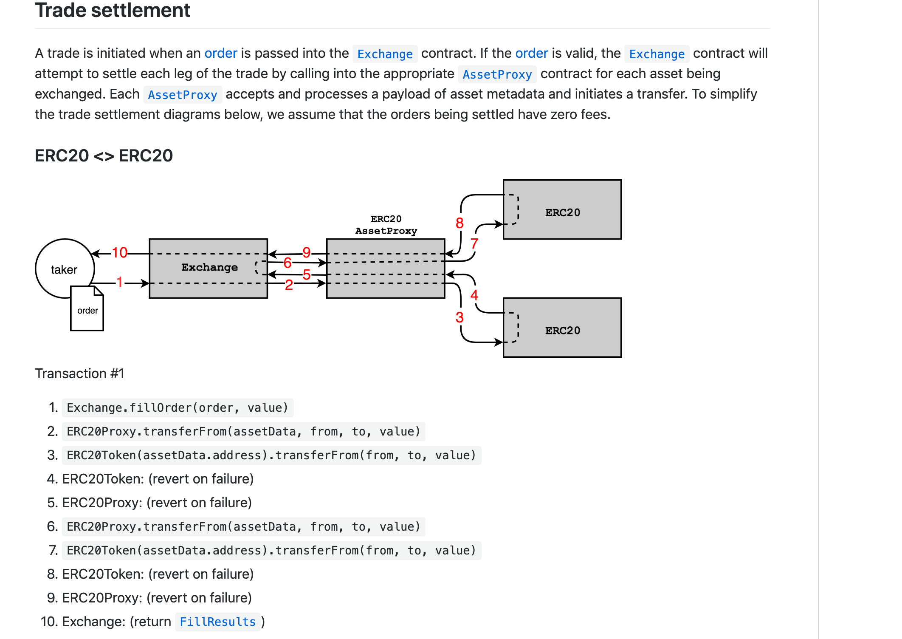
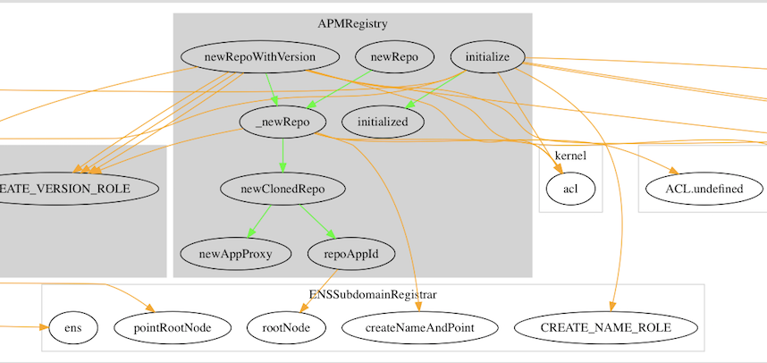
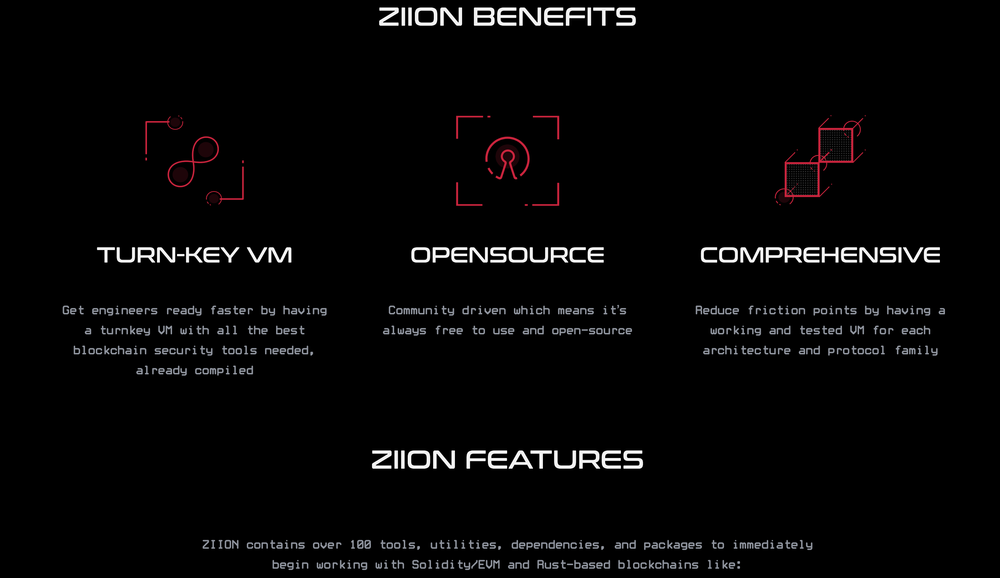

# Audit Process and Reporting

## Overview

The audit process varies greatly from company to company, and between individuals, as there is, as yet, no generally-accepted industry standard process.

Smart contract auditging is a niche information security service. It arose out of necessity.

Smart contract audits aim to prevent the pain entrepreneurs, developers, and users experience when Ethereum contracts are hacked or otherwise fail. Immutability implies that repair may be difficult and costly, or impossible. Immutability also implies a requirement for debut production releases to be free of defects, but errors and oversights are likely to remain commonplace as new developers enter the space. The EVM is an unfamiliar platform, blockchain is, at first, an unfamiliar paradigm, and Solidity is, at first, an unfamiliar language. It is not reasonable to expect perfection from new developers.

Observin projects getting killed by preventable problems increased general awareness of the importance of preventative quality assurance. Two approaches shaped the formative Ethereum code security industry.

## Bug Bounties

The first of these is **Bug Bounties**. Bug bounties are a time-tested approach to reinforcing information security. Organizations such as **HackerOne** organize bug bounties for corporate clients. Bug bounties are a way of reaching out to large numbers of qualified developers to possibly discover critical issues.

## Formal Verification

**Formal verification** is the process by which one proves properties of a system mathematically. In order to do that, one writes a **formal specification** of the application behavior. The formal specification is analogous to a Statement of Intended Behavior, but it is written in a machine-readable language. The formal specification is later proved (or not) using one of the available tools.

## What is an Audit

An audit is:

- An assessment of your secure development process.  
- The best option available to identify subtle vulnerabilities.  
- A systematic method for assessing the quality and security of code.  

An opportunity to:

- Learn from experts  
- Identify gaps in your process  
- Identify underspecified areas of your system  

An audit cannot:

- Replace internal quality assurance  
- Overcome excessive complexity or poor architecture  
- Guarantee no bugs or vulnerabilities  


# Audit Companies

- OpenZeppelin  
- CertiK  
- PeckShield  
- Extropy  

When choosing a company, you might want to look at the **Rekt News LeaderBoard**.

# The Audit Process

Auditing a smart contract entails a methodical review of the in-scope source code, in order to provide reasonable assurance that the code behaves as expected, and contains no vulnerabilities.

**Reasonable assurance** is important because it is impossible to ensure a piece of code contains no bugs. Beware of this when wording reports. Declaring a code base is bug free is irresponsible and can lead to liability problems.

The company receives a **defense against possible liability**. The auditor accepts **reputational risk**.

For emphasis, auditors should apply care to all forms of communication to avoid a situation in which the auditor appears to take on, perhaps unwittingly, **liability for the project**.

# How Will They All Fit Together?

The best processes will **mix and layer a number of approaches**, increasing the probability of finding a bug, if one exists.

A recent example is **MakerDAO's Multi Collateral DAI** set of smart contracts. Most of the smart contracts were formally verified and an audit was conducted. This was the start of an excellent process. 

Even so, a **USD $50,000 critical bug** was awarded by their **Bug Bounty program**, demonstrating the value of a Bug Bounty even after audits and formal verification.

The process we recommend is:

1. One or more **audits**
2. Followed by a **well-funded bug bounty**
3. The bounty should be:
   - **Open for sufficient time** to build confidence
   - Offer **significant rewards** for finding critical bugs


---


# Estimating and Price Quotes for Smart Contract Audits

## Goal of an Estimate

The goal of an estimate is to efficiently assess the key factors that tend to affect actual effort and hours.  
In this context, “efficiently” means limiting the assessment to a superficial perusal of the code that won’t take too long.  
The key is to know what to look for.

> Many companies quote based on lines of code.  
> In our experience, **line count** (quantity) is a very poor indicator.  
> **Complexity** is a better indicator of the actual time required for the audit process.  
> A very large, monolithic smart contract will often be easier to audit than a handful of very small smart contracts that interact in multiple ways.

---

## Good Indicators to Note

### 1. Count of External Calls

- The number of external calls is a strong complexity indicator.
- External calls impact the codebase in multiple ways.
- Example: even simple implementations such as ERC20 tokens can behave unexpectedly.
  - **USDT** and **OMG** tokens do not return `true` for successful transfers.
  - Calling **untrusted contracts** must be evaluated for malicious behavior.
  - **SpankChain Hack**: an attacker used a rogue ERC20 token that implemented the standard interface, but on `transfer`, it re-entered SpankChain’s contract.

### 2. Count of Public / External Functions

- These are the **points of entry** for execution.
- They determine the number of execution paths and interactions.
  
### 3. Use of Solidity Assembly

- Solidity Assembly is harder to read and understand.
- More opcodes are available and none of Solidity’s safeguards apply.
- Auditing such code takes significantly more time.

### 4. Code Smell

- Look for signs of:
  - Overly clever solutions
  - Novel or experimental approaches
  - Anything **not idiomatic** to standard Solidity practices

---

## When the Client Proposes the Scope

### 1. To Audit Only Certain Files

- Clients may want only specific files reviewed in a larger codebase.
- **Important Rule**: Treat all **out-of-scope contracts as untrusted**.
  - Even if the client trusts them, **you did not review them**.
  - Especially pay attention to **calls from in-scope contracts to out-of-scope contracts**.

### 2. To Audit an Amended Version Previously Audited by Others

- Treat it as a **full audit**.
- Even if “just a few lines were changed,” verify the entire logic holistically.
- You are responsible for **your audit team’s reputation**, not others’.

---

## Responsibility of the Auditor

- Guide the client to understand the **risks** of leaving parts of the code out-of-scope.
- Help them recognize that every interaction between in-scope and out-of-scope contracts **may introduce vulnerabilities**.
- Always communicate clearly in the final report which code was **in-scope** and which was **not**.
- The client and readers of the report **depend on you** to raise concerns and act as guardians of code integrity.


---


# The Audit Process Guide

## The Process

Extropy uses a very particular process, ideal for auditing smart contracts.

- **Team Composition**: All audits include **three auditors**, except for very low-complexity audits which may use teams of two.
- **Debrief Meeting**: Scheduled close to the delivery date.
  - Vulnerabilities are sometimes found by only some auditors.
  - This layered process leverages diverse experience and unique workflows.
- **Audit Methodology**:
  - Auditors are **not required to follow a prescribed process**.
  - Auditors use tools and workflows they trust.
  - In the debrief meeting, individual reports are **merged** into the final Extropy audit report.

## Remediation Period

After the report delivery:

1. The client can submit **fixes**.
2. The audit team **verifies** and **documents** the effectiveness of these fixes.
3. Commits in which issues were fixed are included.
4. A **last-reviewed version** is noted in the summary and conclusion.

> Reports may be made public, depending on client preference.

## After the Audit

Clients are encouraged to:

- Launch a **bug bounty program** with **significant rewards**.

Benefits:

- Bug hunters look for critical bugs, but often report others too.
- Hunters focus on **high-risk areas**, complementing the audit.
- Combined with the audit, the **entire codebase is secured**:
  - The audit secures all code.
  - Bug bounty adds extra eyes on risky segments.

## Audit Report

The **Audit Report** is the final deliverable.

### Standard Sections

- **Client Identification**
- **Date**
- **Scope** (list of files)
- **Commit hash and repository**
- **Bugs**
- **Audit Methodology**
- **Conclusion**

### Notes

- Document **who requested** the audit. If anonymous, say so explicitly.
- Include:
  - Date of publication
  - Files reviewed
  - Bugs and concerns
  - Overall health conclusion

### Audience Consideration

- Reports may be read by non-technical stakeholders (e.g. VCs).
- Tailor tone and content appropriately.
- For technical audiences:
  - Be concise.
  - Make bugs understandable to developers and Ethereum-literate users.

> Describe **potential impact** clearly.
> Ensure **precise technical explanations** for developers.

## Reporting Bugs

Bug reports are the core product of audits and bug bounties.

### Key Characteristics

- **Clarity**: The report should provoke **understanding**.
- **Audience**: Often the people who wrote or audited the code.
- **Tone**: Matter-of-fact, non-accusatory.
- **Support**: Include **enough info** to justify claims.

### Bug Report Must Include:

1. **Problem Description**
2. **Consequences**
3. **Steps to Reproduce**
4. **Impact**
5. **Severity**
6. **(Optional)** Suggestion for fix

> Bugs are subjective and can be debated.

Examples of subtle bugs:

- A theoretical but unlikely vulnerability with **severe consequences**.
- A common-case oddity with **no serious effect**.

### Example: ERC20 Approval Attack

Although the format was unusual, it contained:

- **Context**
- **Exploit Steps**
- **Analysis**
- **Possible Workaround**

### Example: CryptoKitties Empty Fallback

Discovered by **Nick Johnson**.

- Follows typical bug bounty format.
- Includes:
  - Concise explanation
  - Consequences


---


# Categorization of Severity

Risk ratings and classification processes vary greatly between organizations. Even when common categories such as **Critical**, **Major**, and **Minor** are used, definitions can differ widely.

This is a reflection of how the space lacks unified standards. When a bug is found, it’s crucial to categorize it according to the standards of the **local audit team** or **bug bounty program**.

Be ready to **defend your classification** and **clearly describe** the bug.

## Industry Standards

Two well-known standards in the wider security industry include:

- **OWASP** (Open Web Application Security Project) — used by the Ethereum Foundation.
- **CVSS** (Common Vulnerability Scoring System)

---

# OWASP Risk Classification

**Formula:**  
`Risk = Likelihood × Impact`

Risk is the product of:

- The **Likelihood** of the bug being exploited
- The **Impact** it causes when exploited

OWASP provides a framework for quantifying both dimensions.

---

## Likelihood

Likelihood is broken into two sets of factors:

### Threat Agent Factors

Estimate how likely it is that an attacker will exploit the vulnerability.

- **Skills**: How technically skilled is the attacker?
- **Motive**: How motivated are they to exploit this?
- **Opportunity**: Do they have the necessary access/resources?
- **Size**: How many attackers might exist?

### Vulnerability Factors

Estimate how likely it is that the vulnerability can be found and used.

- **Ease of discovery**: How easy is it to find?
- **Ease of exploit**: How easy is it to exploit?
- **Awareness**: Is this vulnerability widely known?
- **Intrusion detection**: Can the exploit be detected?

---

## Impact

Impact is estimated in both technical and business dimensions.

### Technical Impact Factors

How does the bug affect traditional security aspects?

- **Loss of confidentiality**
- **Loss of integrity**
- **Loss of availability**
- **Loss of accountability**

### Business Impact Factors

These are highly organization-specific:

- **Financial damage**
- **Reputation damage**
- **Non-compliance**
- **Privacy violation**

OWASP provides a spreadsheet to help with these evaluations.

---

# Simplified Severity Model for Smart Contracts

This model is commonly used in Ethereum bug bounty programs:

- **Critical**: Stealing user funds or freezing funds.
- **Major**: User gains unfair advantage.
- **Minor**: No fund risk, but causes friction or UI bugs.
- **Informational**: Optimizations or non-critical suggestions.

---

# Auditing Techniques in More Detail

These are general auditing principles—not strict rules. Each auditor will develop their own style with experience.

---

## High-Level Understanding

First, aim to build a **mental model** of the system:

1. **Skim** all files.
2. Read **function names** and **signatures**.
3. Pay attention to **inheritance** schemes.

Avoid focusing too much on bugs during the first pass—understand how components connect.

---

## Read the Specification… or Not?

Some auditors read the specification first to understand the intended behavior.

Others argue this causes **confirmation bias** because specs are usually written by the developers themselves.

Choose based on your approach.

---

## Detailed Inspection

You can:

- Go **file by file**, or
- Follow a **functionality** like a deposit or withdraw, mapping its full flow.

Each method gives different insights, so ideally use both.

### Tips

- **Run the code**:
  - Compile it
  - Run existing tests
  - Load it in **Remix** and interact with it
- These steps help build familiarity with the codebase.


---


# Auditing - The Client Perspective

## Preparing for an Audit

Following these steps to prepare for an audit will go a long way to helping you get the best results.

- Documentation
- Clean code
- Testing
- Automated Analysis
- Frozen code
- Use a checklist

We have a finite amount of time to audit your code.  
Preparation will help you get the most value from us.  
We must first understand your code, before we can identify subtle vulnerabilities.  
Imagine we’re a new developer hired to join your team, but we only have a few days to ramp up.

---

## 1. Documentation

The less time we spend trying to understand your system, the faster we can get deep into your code, and the more time we can spend finding bugs. This is why the number one thing you can do to improve the quality of your audit is provide good documentation.

Good documentation starts with a plain English description of what you are building, and why you are building it. It should do this both for the overall system and for each unique contract within the system.

Another marker of good documentation is that it includes a specification of your system’s intended functionality. For each contract, it should describe the most important properties or behaviors that should be maintained. It should also describe the actions and states that should not be possible.

One of the best examples we’ve seen is the protocol spec for the 0xProject. In particular, their use of flow charts nicely illustrates how the system fits together.




Good documentation requires a lot of effort. It can be useful for the auditors to document the code. Writing our own documentation of the code’s behavior is an excellent way to understand it. It can even lead us to discover vulnerabilities and unexpected edge cases.

What about a pseudocode spec?  
We emphasize “plain English” over rigid/formal English because plain English more clearly expresses what you want the code to do. By contrast, the actual code is often so similar to the pseudocode specification that it can be hard to see when they both describe something you do not actually want.

Pseudocode can be especially helpful for describing complex mathematics, but it should always be accompanied by some English about what the math is meant to achieve.

> The less time we spend trying to understand your system, the more time we can spend finding bugs.

### Good Documentation Checklist:

- Describes the overall system and its objectives
- Describes what should not be possible
- Lists which contracts are derived/deployed, and how they interact with one another

Documenting your code will also help you to improve it.

**Example of good documentation:**
- 0x Protocol Specifications
- Example from Polymath

---

## 2. Clean Up the Code

Polished, well-formatted code is easier to read, which reduces the cognitive overhead needed to review it. A little bit of cleanup will go a long way towards allowing us to focus our energy on finding bugs.

### Recommended Practices:

- Run a linter on your code. Fix any errors or warnings unless you have a good reason not to.
  - For Solidity, use tools like `Ethlint` or the integrated linter in Remix.
  - The Solidity Template bundles together some useful tools.
- Address all compiler warnings.
- Remove any comments that indicate unfinished work (e.g., `TODO` or `FIXME`)—especially if this is a final audit before mainnet.
- Remove any commented-out or unused code.
- Add helpful comments to explain intent—what are you trying to do?

### NatSpec Comments

Use NatSpec (Natural Specification) comments to clearly describe the function's behavior and expectations.

---

## 3. Testing

Write tests! A good goal is a test suite with **100% code coverage**.

### Things to Check:

- Review the list of test cases for gaps.
- Don't just test the "happy path." Write tests that:
  - Ensure undesirable actions are prevented.
  - Ensure the contract fails safely instead of landing in an undesired state.

**Important:**  
Your `README.md` should give clear instructions for running the test suite.

- If any dependencies (e.g., Truffle) are not packaged with your code, list them and their exact versions.

---

## 4. Automated Analysis

Ethereum has many good security analysis tools to help find common issues. We use some of these during audits, and you can run them in advance.

### Recommended Tools:

- **MythX**: Suite for multiple types of analysis. Usable via:
  - CLI tools (JavaScript and Python)
  - Plugins for Remix and Truffle
- **VSCode Plugins**:
  - Solidity Metrics
  - MythX for Remix
- **Solidity UML tool** for visualization

> Note: You might get false positives, but running these tools is still helpful.

More tools can be found at: [Smart Contract Best Practices](https://consensys.github.io/smart-contract-best-practices/)

---

## 5. Freeze the Code

**We can't audit a moving target.**

An audit is an investment in the security of your smart contract system. To get the most out of your investment:

- At the start of the audit, confirm that you’ve “frozen the code” (i.e., halted development).
- Provide a specific **Git commit hash** that is the target of the audit.

If a change occurs during the audit:

- Auditors waste time on outdated code.
- Auditors must incorporate the change, which can affect the entire threat model and interactions.

**If your code won’t be ready by the start date:**  
It’s better to **delay the audit** than to proceed with unfinished development.

---

## 6. Use a Checklist

Use the following checklist to make sure you’re ready for the audit.

### Audit Preparation Checklist
This checklist outlines the essential steps to prepare your smart contract project for a security audit.

## ✅ Documentation

- [ ] Provide a **plain English description** of what you are building and why.
- [ ] Specify **desired actions and states**.
- [ ] Specify **prohibited actions and states**.
- [ ] Include documentation for:
  - [ ] The **overall system**.
  - [ ] **Each unique contract** within the system.

## ✅ Clean Code

- [ ] Run a linter such as **EthLint**.
- [ ] Fix all **compiler warnings**.
- [ ] Remove all `TODO` and `FIXME` comments.
- [ ] Delete **unused or commented-out code**.

## ✅ Testing

- [ ] Ensure `README.md` includes **clear instructions** for running tests.
- [ ] Ensure all **testing dependencies**:
  - [ ] Are packaged with the code, **OR**
  - [ ] Are listed in documentation with **exact versions**.

## ✅ Automated Analysis

- [ ] Run static analysis tools:
  - [ ] **MythX**
  - [ ] Other available tools or plugins (e.g. Remix, VSCode, Truffle).

## ✅ Frozen Code

- [ ] **Halt development** of the contract code during the audit.
- [ ] Provide a **specific commit hash** to be the target of the audit.


---


# Static Analysis and Visualisation Tools

## Visualisation

- **EVM Lab**
- **Surya**

- **Piet**
- **Solidity Metrics**
- **Solidity 2 UML Tool**

## Static and Dynamic Analysis

- [MythX](https://mythx.io/) - also available as a Remix plugin
- **Slither**
  - **List of Detectors**
- **Echidna**
- **Vertigo** - Mutation testing framework
- **Manticore**

---

## Introduction to Slither

See repository for full documentation.

**Slither** performs static analysis on Solidity source code using "detectors" to identify known vulnerabilities and patterns. It also includes tools for visualizing and understanding contracts and program flows.

### Features

- Detects vulnerable Solidity code with low false positives (see the list of trophies)
- Identifies where error conditions occur in the source code
- Integrates easily into CI pipelines and Truffle builds
- Built-in "printers" report crucial contract information quickly
- Detector API available for writing custom analyses in Python
- Supports Solidity >= 0.4
- Intermediate representation (SlithIR) allows high-precision analysis
- Parses 99.9% of all public Solidity code
- Average execution time < 1 second per contract

### Capabilities

Slither can:

- Produce Markdown reports
- Display inheritance hierarchies
- Generate call graphs
- Show updatable variables and function authorisation
- Check updatability
- Flatten code
- Read contract storage

### Installation

```bash
pip3 install slither-analyzer
```

---

## Checklists

- **SWC Registry**
- **SCSVS** (Smart Contract Security Verification Standard): 14-part checklist to standardize smart contract security
- **Example Token Checklist**
### Example Token Checklist

#### Transfer Behavior

- Returns `bool` after `transfer()`.
- Prevent transferring tokens to the `0x0` address.
- Prevent transferring tokens to the contract address.
- Override `_beforeTokenTransfer` hook, including a check that prevents transferring tokens to the contract itself `address(this)`.  
  See the docs for implementation example.

#### Pausability

- Pausable tokens: An admin-controlled pause feature opens users of the token to risk from a malicious or compromised token owner.

#### Reentrancy

- Reentrant Calls (ERC777): Ensure the token is **not** an ERC777 token and has **no external function calls** in `transfer` and `transferFrom`.  
  External calls in the transfer functions can lead to reentrancies.

#### Transfer Fees

- Fee on transfer: `transfer` and `transferFrom` **should not** take a fee.  
  Deflationary tokens can lead to unexpected behavior.

#### Balance Changes Outside of Transfers

- Balance Modifications Outside of Transfers (rebasing / airdrops):  
  Potential interest earned from the token is taken into account.  
  Some tokens distribute interest to token holders.  
  This interest might be trapped in the contract if not handled properly.

#### Upgradeability

- Upgradable tokens: A change to the token semantics can break any smart contract that depends on the past behavior.

#### Flash Minting

- Flash Mintable tokens: Consider the implications and possible exploits due to instant mint/burn mechanics.

#### Blocklists

- Tokens with Blocklists: Malicious or compromised token owners can trap funds in a contract by adding the contract address to the blocklist.

#### Approval Race Protection

- Approval Race Protections:  
  Some tokens like USDT do not allow approving an amount `M > 0` when an existing amount `N > 0` is already approved.  
  This [PR](https://github.com/d-xo/weird-erc20s/pull/1) shows some in-the-wild problems caused by this issue.  
  To prevent the issue:
  - Clients **SHOULD** create UIs that set the allowance first to 0 before setting it to another value for the same spender.
  - **BUT** the contract itself **shouldn’t** enforce it to allow backward compatibility.

#### Zero Value Transfers

- Revert on Zero Value Transfers:  
  Some tokens (e.g., LEND) revert when transferring a zero value amount.
- Override `_beforeTokenTransfer` hook to prevent transferring zero value amounts.

#### Decimal Precision

- Low decimals: May result in larger than expected precision loss.
- High decimals: May trigger unexpected reverts due to overflow, posing a **liveness risk**.
- `decimals` should return a `uint8`.

#### TransferFrom Behavior

- `transferFrom` with `src == msg.sender`:  
  Some implementations (e.g., OpenZeppelin, Uniswap-v2) attempt to decrease the caller’s allowance from the sender even if the caller and sender are the same address.  
  This causes `transfer(dst, amt)` and `transferFrom(address(this), dst, amt)` to have different semantics.

#### Metadata Format

- Non-string metadata:  
  Some tokens (e.g., MKR) have metadata fields (`name`, `symbol`) encoded as `bytes32` instead of the `string` type prescribed by ERC20.

#### Burning Tokens

- Revert on Transfer to the Zero Address:  
  May break systems that expect to burn tokens by transferring them to `address(0)`.

#### Revert Behavior

- No Revert on Failure:  
  Contracts should revert on failure instead of just returning `false`.

- Revert on Large Approvals & Transfers.

#### Injection Attacks

- Code Injection via Token Name:  
  Validate metadata properly to avoid code injection or formatting issues.

#### Simplicity

- Avoid unneeded complexity:  
  - Token should be a simple contract.  
  - Complex code requires a higher standard of review.
  - Use Slither’s `human-summary` printer to identify complex logic.

#### Non–Token-Related Functions

- Keep minimal:  
  - The contract should only have a few non-token-related functions.  
  - Use Slither’s `contract-summary` printer to audit non-token logic.

#### Token Addresses

- The token only has one address:  
  - Some proxied tokens (e.g., TUSD) have multiple addresses.  
  - Multiple entry points for balance updates can break internal bookkeeping:

    ```solidity
    balances[token_address][msg.sender] might not reflect actual balance
    ```

#### Distribution

- No user owns most of the supply:  
  - A few users owning most of the tokens can influence token operations or governance outcomes.


---

#### ConsenSys Known Attacks

- Reentrancy
- Oracle Manipulation
- Frontrunning
- Timestamp Dependence
- Insecure Arithmetic
- Denial of Service
- Griefing
- Force Feeding

---

## Ethereum Security Toolbox (Trail of Bits)

Includes:

- **Echidna**: Property-based fuzz tester
- **Etheno**: Integration tool and differential tester
- **Manticore**: Symbolic analyzer and formal contract verifier
- **Slither**: Static analysis tool
- **Rattle**: EVM lifter
- **Not So Smart Contracts** repository

### Install in Docker

```bash
docker pull trailofbits/eth-security-toolbox
docker run -it trailofbits/eth-security-toolbox
```

---

## ZIION by Halborn

- See Docs [Docs](https://docs.ziion.org/)
- Download Available



### Blockchains Targeted

- Ethereum (EVM)
- Bitcoin
- Solana
- Polygon
- BSC
- Substrate
- Near

---

## Solodit

Catalogues issues found in the **Code4rena** and **Sherlock** platforms.

---

## zkPoEX

See repository.

**zkPoEX** (zk Proof of Exploit) is a proof-of-concept developed at ETHDenver Hackathon. It enables secure disclosure of live vulnerabilities by white-hat hackers in DeFi smart contracts using zero-knowledge proofs, maintaining exploit confidentiality.

---

## Audit Competitions

You can submit your code to platforms such as:

- **Code Arena**
- **Sherlock**  
  - See Docs

Or practice your auditing skills by entering their competitions.

---

## Example Audits

### ERC20 Approval Attack

Describes the original ERC20 approval exploit. Although the format is unusual, it includes:

- Context
- Steps to the exploit
- Brief analysis
- Possible workaround

### CryptoKitties Empty Fallback

Found by **Nick Johnson** during the initial CryptoKitties bug bounty. This example uses a concise format common in bug bounty and audit reports, describing:

- Explanation
- Exploit steps
- Consequences

---

## Projects Mentioned

- **Freeverse**
- **Celo**
- **1Inch**
