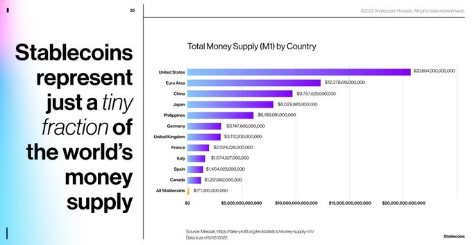
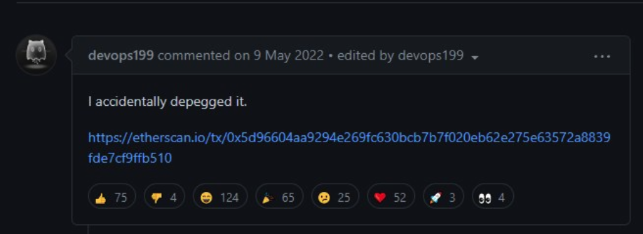
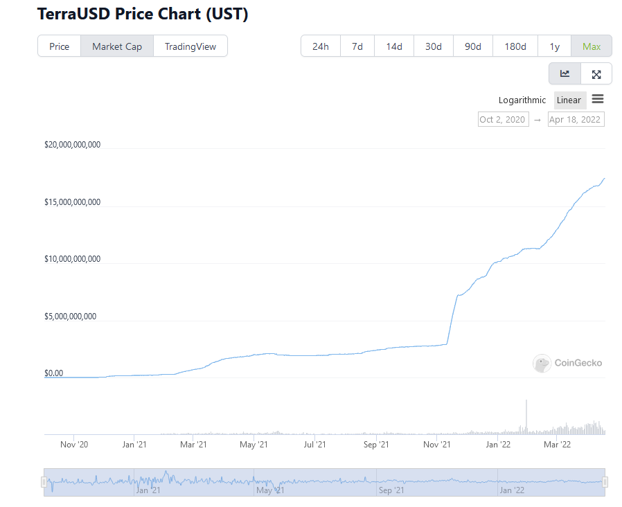
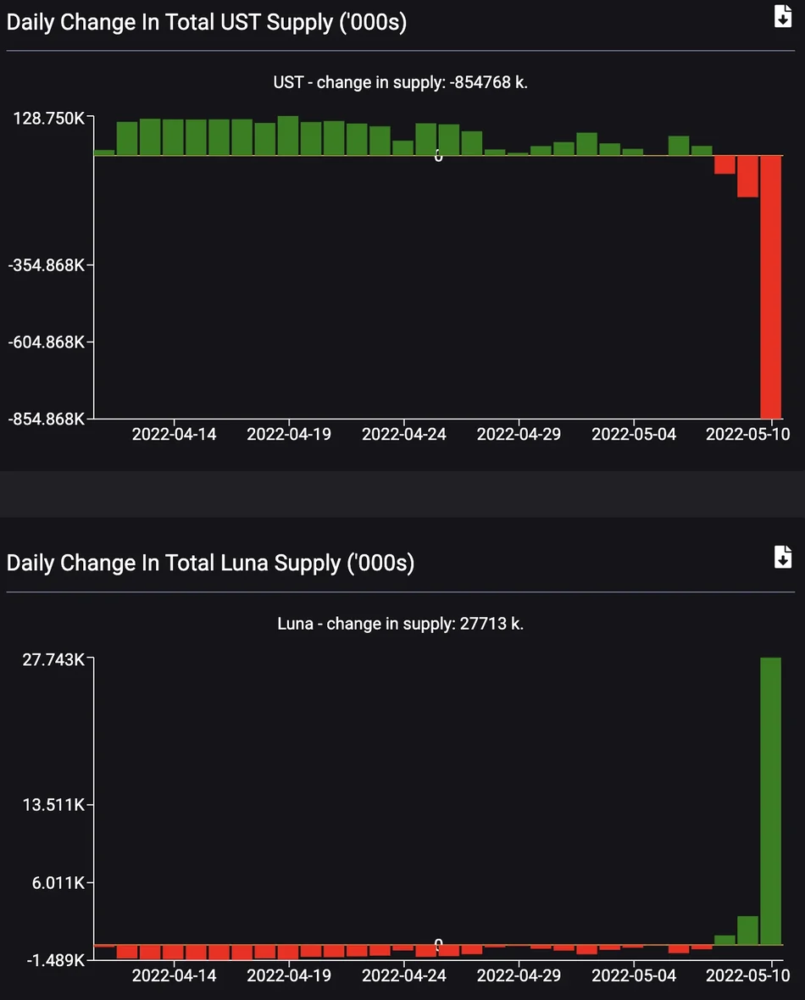
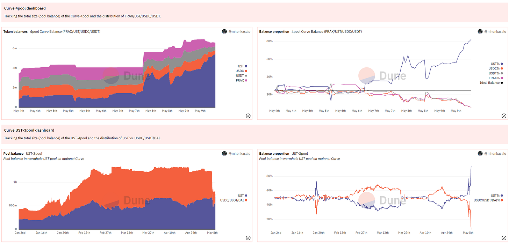
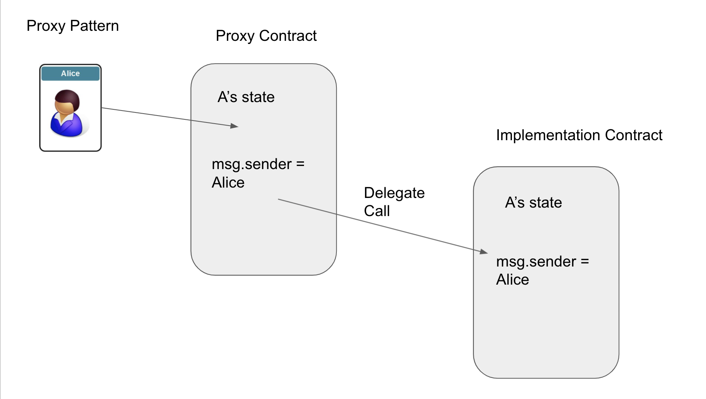

# GMX V1 Reentrancy Exploit - July 9th Incident Overview

## Summary

On **July 9th**, the decentralized finance (DeFi) protocol **GMX V1** on **Arbitrum** experienced what appeared to be a catastrophic exploit. Around **$42 million** was drained from its **GLP liquidity pool**.

The vulnerability exploited was a **classic cross-contract reentrancy** issue — a flaw that had existed in the protocol for **over two years**, despite its high reputation and prior audits.

---

## The Exploit Mechanism

The exploit took advantage of a vulnerability in the **`executeDecreaseOrder()`** function, which was typically used by an automated "order-keeper".

### 1. **Tricking the Order-Keeper**
The attacker passed a **malicious contract address** to the `executeDecreaseOrder()` function. This allowed them to **hijack the execution flow** of the protocol.

### 2. **Re-Entering the Contract**
When the keeper called this function, it triggered a **callback to the attacker's contract**. This enabled **reentrancy** — the attacker could re-enter GMX's **Vault** and **Reward Router** contracts **before the original call completed**.

### 3. **Manipulating Prices**
By re-entering and opening **large short positions**, the attacker manipulated:
- `globalShortAveragePrices`
- The value of **Assets Under Management (AUM)**

They tricked the system into reporting a **BTC short price** drop from **$109,000** to **$1,900**, and thereby:

- Artificially inflated the **GLP token price** from **$1.45** to over **$27**

### 4. **Draining Liquidity**
Using the **inflated GLP token price**, the attacker **minted and redeemed** tokens — draining millions of dollars in **real assets** from the liquidity pool.

---

## Root Cause and Systemic Failures

### Flawed Patch (2022)
Ironically, the vulnerability **wasn't part of the original design** — it was introduced in **2022** during a patch for another bug (for which a $1M bounty was paid).  
The **patch itself created** conditions for this reentrancy exploit.

### Outdated and Insufficient Audits
- A 2021 audit covered only a **pre-GMX version** of the code.
- A 2022 audit **missed critical interactions** and was conducted **before major code changes** to vulnerable functions.

This reflects a **misconception** that audits are **one-time guarantees**, rather than part of an **ongoing security lifecycle**.

### Slow Centralized Response
- Stablecoin issuer **Circle** was slow to freeze **$9M in USDC** that the attacker bridged to Ethereum.
- This delay was criticized by the community and highlights risks in **centralized asset controls**.

---

## The Plot Twist: A White-Hat Rescue

### The Truth Revealed
Two days later, GMX announced that the event was **not a malicious exploit**, but a **white-hat security operation**.

The attacker:
- Discovered the vulnerability.
- Used it to **drain funds before malicious actors** could.
- Returned **$37M** to the **GMX security multisig**.

### Bounty Paid
- The white-hat was awarded a **$5M bounty** for their responsible disclosure and protective action.

---

## Key Takeaways

- **Security is continuous**: One-time audits are not enough.
- **Code changes = new risks**: Even patches can create vulnerabilities.
- **Reentrancy remains dangerous**, even in mature, blue-chip protocols.
- **White-hat actions** can save protocols from worse outcomes.
- **Cross-contract interactions** must be treated with extreme caution.

---

## Exploit Summary

| Element                     | Details                            |
|----------------------------|------------------------------------|
| **Date**                   | July 9, 2025                        |
| **Protocol**               | GMX V1                              |
| **Network**                | Arbitrum                            |
| **Exploit Type**           | Cross-contract Reentrancy           |
| **Funds at Risk**          | $42 Million                         |
| **Funds Returned**         | $37 Million                         |
| **Bounty Paid**            | $5 Million                          |
| **Token Affected**         | GLP (inflated from $1.45 to $27)    |
| **Root Cause**             | Reentrancy from flawed 2022 patch   |

---

## References

- [REKT Article on GMX Incident](https://rekt.news/gmx-rekt/)
- [GMX Twitter Statement](https://twitter.com/GMX_IO)
- [Etherscan Transaction Logs](https://etherscan.io)

---

# Stablecoins

A **stablecoin** is a type of cryptocurrency designed to maintain a **stable value**, typically pegged to a **real-world asset** like the **US dollar**, **euro**, or **gold**.

**Goal**: Reduce volatility compared to regular cryptocurrencies like Bitcoin or Ethereum.

**Types:**

- **Fiat-backed**: e.g., USDT, USDC (backed 1:1 by real dollars in a bank)

- **Crypto-backed**: e.g., DAI (backed by other crypto, overcollateralized)

- **Algorithmic**: e.g., the failed UST (uses smart contracts and supply/demand to keep price stable)

**Use Cases**: Trading, payments, DeFi lending/borrowing, cross-border transfers.

**In short: Stablecoins offer the stability of traditional currencies with the efficiency of blockchain.**

**This screenshot from May 12th shows that the problems of maintaining a peg is widespread**

## UST Crash Snapshot

From Decrypt article: LUNA, formerly a top 10 coin by market cap, fell 100% to a fraction of a cent, and UST, designed to stay pegged at $1, bottomed out at $0.13.

### Before the Crash
- April 18: UST surpassed Binance USD to become the third-largest stablecoin by market cap.

## Background
UST is a fully algorithmic stablecoin meant to maintain its peg through a 1:1 mint-redeem mechanism with LUNA:

- **Mint UST**: Burn LUNA ($1 LUNA = 1 UST)
- **Redeem UST**: Mint LUNA ($1 UST = $1 LUNA)

### Peg Mechanism
- When UST > $1: Burn LUNA → Mint UST → Increase UST supply → Lower price
- When UST < $1: Burn UST → Mint LUNA → Decrease UST supply → Raise price

## Anchor Protocol
- May 07: $16.7B TVL
- Offered 19.46% APY for UST deposits
- >72% of UST was deposited in Anchor

From Nov to April:
- UST market cap: $2.73B → $17.8B
- LUNA price: ~$50 → doubled

### Interest Rate Policy
- Interest drops 1.5%/month if lenders > borrowers
- May 6–8: $14B → $11.7B in Anchor (UST outflows)

## Exit Options for UST
### 1. Burn-and-Mint
- Swap 1 UST for $1 LUNA → burn UST
- Arbitrage when UST < $1 → profit from minting $1 LUNA

### 2. Curve Finance Stablecoin Pool
- Swap UST for DAI/USDT/USDC in Curve
- Arbitrage traders restore peg through trades

## Real-World Outcomes
### Burn and Mint Side Effects
- Minting more LUNA dilutes supply
- As LUNA drops, more tokens needed to redeem $1 → hyperinflation

---

# The Collapse of UST Using Curve

## What Happened?

UST (TerraUSD), an algorithmic stablecoin, was paired with DAI, USDT, and USDC in a **Curve Finance pool** known as the **UST + 3Crv pool**.

---

## Initial Depeg

- Over the weekend, UST **depegged** by **~$0.02**.
- Users leaving Anchor Protocol rapidly **swapped UST for other stablecoins** like USDT and USDC via Curve.
- These trades **unbalanced the pool**, leaving it with **too much UST**.

---

## How Curve Works

- Curve incentivizes balance.
- If one asset (e.g., UST) floods the pool, it **offers UST at a discount** to encourage **arbitragers** to buy it and rebalance the pool.
- **But no one wanted UST**, even at a discount—Anchor’s allure had faded.

---

## Whale Dump & Spiral Begins

- A whale **swapped 85M UST for 84.5M USDC**.
- This intensified pressure on UST’s peg.
- Curve kept offering bigger discounts, but **no arbitragers stepped in**.
- By Tuesday, the depeg had worsened to **$0.32**.
- LUNA fell from **$64 → <$30**.

---

## Death Spiral Triggered

- As UST’s market cap approached LUNA’s, the system risked collapse.
- **Luna Foundation Guard (LFG)** intervened:
  - Injected **$216M in stablecoins** from Jump Crypto into Curve.
  - Attempted to deploy **BTC reserves** to market makers to defend the peg.
- UST briefly recovered to **$0.93**, but **liquidity was exhausted quickly**.

---

## Second Collapse Phase

- Constant ~$300k swaps drained liquidity again.
- LUNA holders began dumping as panic spread.
- LUNA’s supply exploded:
  - May 8: **343 million**
  - May 12: **32.3 billion**

---

## Final Desperation Moves

- Terra community tried emergency measures:
  1. **Burn UST**
  2. **Avoid minting more LUNA**
- It was too late.
- The blockchain was eventually **halted** to prevent governance attacks.

---

## Aftermath

- Over **$200 billion** in crypto value was lost in **24 hours**.
- This event became one of **crypto’s most catastrophic collapses**.

---

## Key Lessons

- **Algorithmic stablecoins** are vulnerable to **confidence loss**.
- **Curve’s mechanics** work—**if market demand exists**.
- Without trust, **no arbitrage opportunity is safe**.
- Liquidity alone can’t **sustain a broken peg**.

---

# Upgradability Background

## Why Upgradability Matters

The great advantage to smart contracts is that **they're immutable** — no one can hack them or change their terms once they are deployed.

The great drawback to smart contracts is that **they're immutable** — you can't fix them once they're deployed.

---

## Problems to Solve

- How to **change the functionality** in the contract.
- How to **migrate data** if necessary.

We will look at some of the patterns used to allow upgradability. Examples are taken from various guides and apply to **Truffle** or **Hardhat** environments. See _State of upgrades_ for detailed context.

---

## Digression - Message Calls

Contracts can call each other using **message calls**.

- A message call has:
  - Source: this contract
  - Target: another contract
  - Payload: data
  - Ether: optional amount
  - Gas: for execution
  - Return data: returned from the target

The target contract runs in a **fresh context**, with its **own storage** and environment.

---

## Delegate Call

There's a special variant of message call: `delegatecall`.

- `delegatecall` runs **code from another contract** (target), but:
  - **Storage, sender, and value** are from the **calling** contract.
  - **Execution context** is **not fresh** — it uses the caller's storage.

This is a key building block for **proxy patterns**.

---

## Proxy Patterns

See: [EIP-897](https://eips.ethereum.org/EIPS/eip-897)

A **proxy contract** delegates calls to an **implementation contract**.

- Users interact with the **proxy contract** only.
- Proxy can **forward logic execution** to the implementation.
- Implementation can be **swapped out** for an upgrade.
- Multiple proxies can share the same implementation (see [EIP-1167](https://eips.ethereum.org/EIPS/eip-1167)).

---

## OpenZeppelin Clones Library

We can **cheaply clone** contracts using OpenZeppelin's Clones library.

This is useful when you want to deploy many lightweight proxies pointing to the same implementation.

## Summary

| Concept         | Description                                                       |
|-----------------|-------------------------------------------------------------------|
| Immutability    | Smart contracts can't be changed once deployed.                   |
| Message Call    | Normal call between contracts with isolated storage.              |
| Delegate Call   | Executes other contract's code using caller’s storage.            |
| Proxy Pattern   | Proxy forwards calls to an implementation; allows upgrades.       |
| Clones          | Lightweight proxies for efficient deployments.                    |

---
