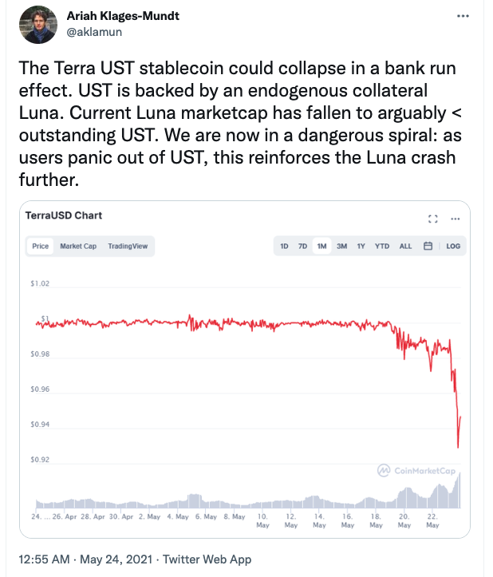
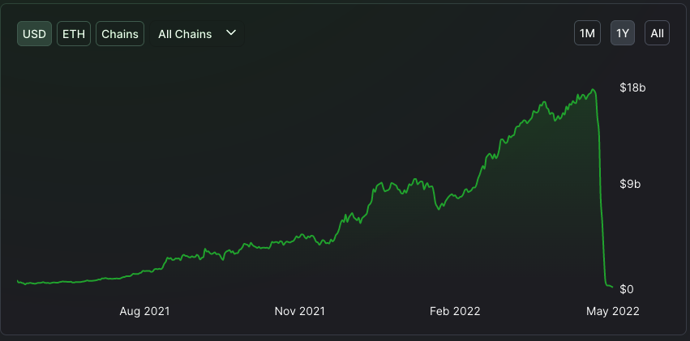
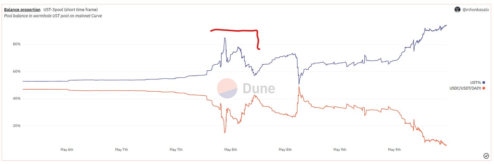
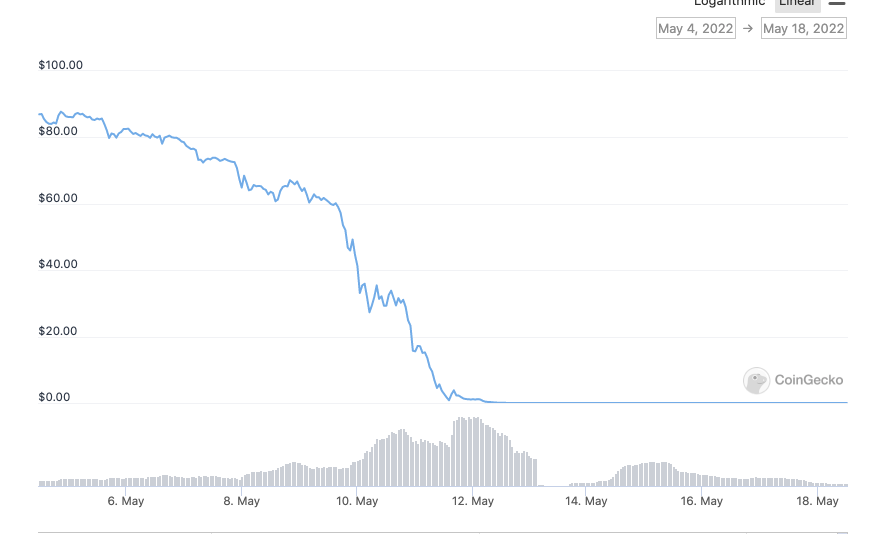
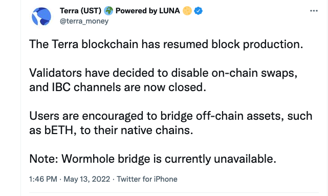
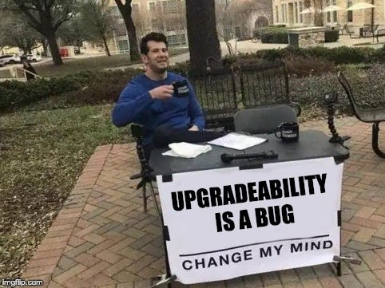
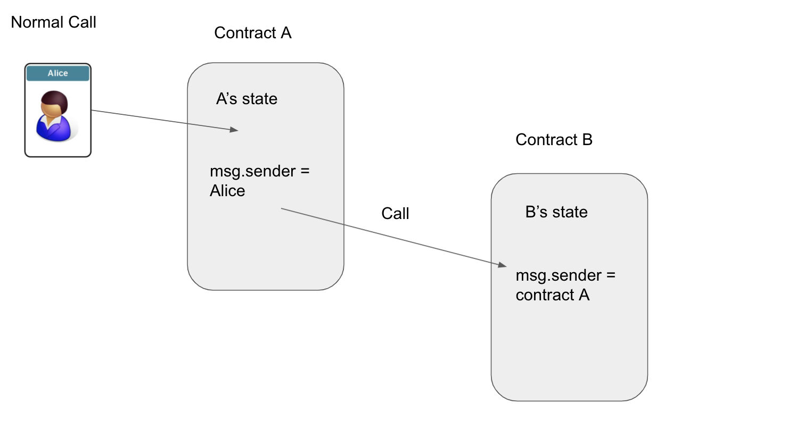
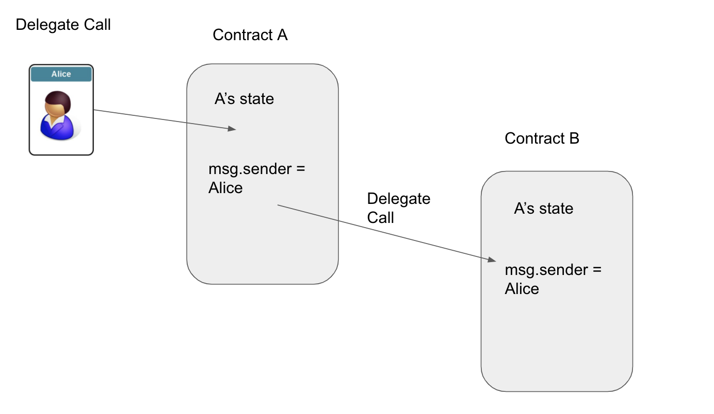
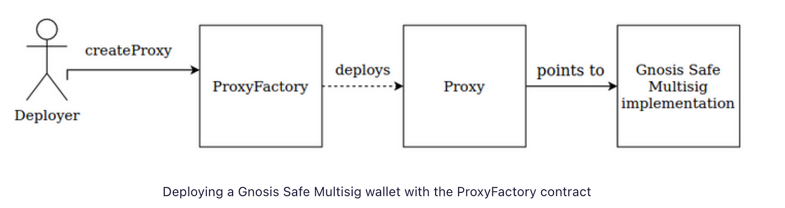
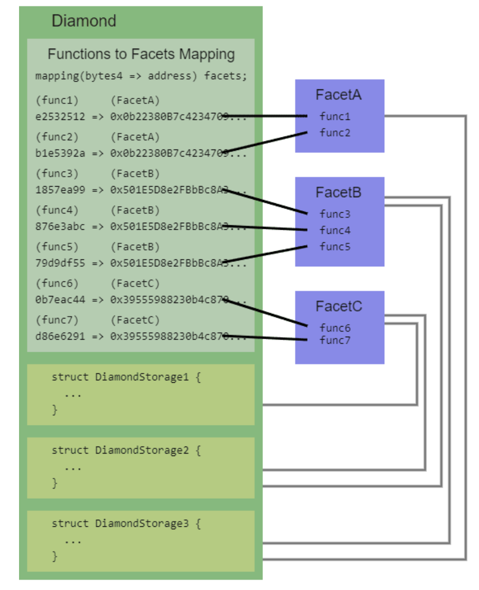

# GMX V1 Reentrancy Exploit - July 9th Incident Overview

## Summary

On **July 9th**, the decentralized finance (DeFi) protocol **GMX V1** on **Arbitrum** experienced what appeared to be a catastrophic exploit. Around **$42 million** was drained from its **GLP liquidity pool**.

The vulnerability exploited was a **classic cross-contract reentrancy** issue — a flaw that had existed in the protocol for **over two years**, despite its high reputation and prior audits.

---

## The Exploit Mechanism

The exploit took advantage of a vulnerability in the **`executeDecreaseOrder()`** function, which was typically used by an automated "order-keeper".

### 1. **Tricking the Order-Keeper**
The attacker passed a **malicious contract address** to the `executeDecreaseOrder()` function. This allowed them to **hijack the execution flow** of the protocol.

### 2. **Re-Entering the Contract**
When the keeper called this function, it triggered a **callback to the attacker's contract**. This enabled **reentrancy** — the attacker could re-enter GMX's **Vault** and **Reward Router** contracts **before the original call completed**.

### 3. **Manipulating Prices**
By re-entering and opening **large short positions**, the attacker manipulated:
- `globalShortAveragePrices`
- The value of **Assets Under Management (AUM)**

They tricked the system into reporting a **BTC short price** drop from **$109,000** to **$1,900**, and thereby:

- Artificially inflated the **GLP token price** from **$1.45** to over **$27**

### 4. **Draining Liquidity**
Using the **inflated GLP token price**, the attacker **minted and redeemed** tokens — draining millions of dollars in **real assets** from the liquidity pool.

---

## Root Cause and Systemic Failures

### Flawed Patch (2022)
Ironically, the vulnerability **wasn't part of the original design** — it was introduced in **2022** during a patch for another bug (for which a $1M bounty was paid).  
The **patch itself created** conditions for this reentrancy exploit.

### Outdated and Insufficient Audits
- A 2021 audit covered only a **pre-GMX version** of the code.
- A 2022 audit **missed critical interactions** and was conducted **before major code changes** to vulnerable functions.

This reflects a **misconception** that audits are **one-time guarantees**, rather than part of an **ongoing security lifecycle**.

### Slow Centralized Response
- Stablecoin issuer **Circle** was slow to freeze **$9M in USDC** that the attacker bridged to Ethereum.
- This delay was criticized by the community and highlights risks in **centralized asset controls**.

---

## The Plot Twist: A White-Hat Rescue

### The Truth Revealed
Two days later, GMX announced that the event was **not a malicious exploit**, but a **white-hat security operation**.

The attacker:
- Discovered the vulnerability.
- Used it to **drain funds before malicious actors** could.
- Returned **$37M** to the **GMX security multisig**.

### Bounty Paid
- The white-hat was awarded a **$5M bounty** for their responsible disclosure and protective action.

---

## Key Takeaways

- **Security is continuous**: One-time audits are not enough.
- **Code changes = new risks**: Even patches can create vulnerabilities.
- **Reentrancy remains dangerous**, even in mature, blue-chip protocols.
- **White-hat actions** can save protocols from worse outcomes.
- **Cross-contract interactions** must be treated with extreme caution.

---

## Exploit Summary

| Element                     | Details                            |
|----------------------------|------------------------------------|
| **Date**                   | July 9, 2025                        |
| **Protocol**               | GMX V1                              |
| **Network**                | Arbitrum                            |
| **Exploit Type**           | Cross-contract Reentrancy           |
| **Funds at Risk**          | $42 Million                         |
| **Funds Returned**         | $37 Million                         |
| **Bounty Paid**            | $5 Million                          |
| **Token Affected**         | GLP (inflated from $1.45 to $27)    |
| **Root Cause**             | Reentrancy from flawed 2022 patch   |

---

## References

- [REKT Article on GMX Incident](https://rekt.news/gmx-rekt/)
- [GMX Twitter Statement](https://twitter.com/GMX_IO)
- [Etherscan Transaction Logs](https://etherscan.io)


---

# Stablecoins

A **stablecoin** is a type of cryptocurrency designed to maintain a **stable value**, typically pegged to a **real-world asset** like the **US dollar**, **euro**, or **gold**.

**Goal**: Reduce volatility compared to regular cryptocurrencies like Bitcoin or Ethereum.

**Types:**

- **Fiat-backed**: e.g., USDT, USDC (backed 1:1 by real dollars in a bank)

- **Crypto-backed**: e.g., DAI (backed by other crypto, overcollateralized)

- **Algorithmic**: e.g., the failed UST (uses smart contracts and supply/demand to keep price stable)

**Use Cases**: Trading, payments, DeFi lending/borrowing, cross-border transfers.

**In short: Stablecoins offer the stability of traditional currencies with the efficiency of blockchain.**


**This screenshot from May 12th shows that the problems of maintaining a peg is widespread**


## UST Crash Snapshot



From Decrypt article: LUNA, formerly a top 10 coin by market cap, fell 100% to a fraction of a cent, and UST, designed to stay pegged at $1, bottomed out at $0.13.

### Before the Crash
- April 18: UST surpassed Binance USD to become the third-largest stablecoin by market cap.


## Background
UST is a fully algorithmic stablecoin meant to maintain its peg through a 1:1 mint-redeem mechanism with LUNA:

- **Mint UST**: Burn LUNA ($1 LUNA = 1 UST)
- **Redeem UST**: Mint LUNA ($1 UST = $1 LUNA)

### Peg Mechanism
- When UST > $1: Burn LUNA → Mint UST → Increase UST supply → Lower price
- When UST < $1: Burn UST → Mint LUNA → Decrease UST supply → Raise price

## Anchor Protocol
- May 07: $16.7B TVL
- Offered 19.46% APY for UST deposits
- >72% of UST was deposited in Anchor

From Nov to April:
- UST market cap: $2.73B → $17.8B
- LUNA price: ~$50 → doubled



### Interest Rate Policy
- Interest drops 1.5%/month if lenders > borrowers
- May 6–8: $14B → $11.7B in Anchor (UST outflows)

## Exit Options for UST
### 1. Burn-and-Mint
- Swap 1 UST for $1 LUNA → burn UST
- Arbitrage when UST < $1 → profit from minting $1 LUNA

### 2. Curve Finance Stablecoin Pool
- Swap UST for DAI/USDT/USDC in Curve
- Arbitrage traders restore peg through trades

## Real-World Outcomes
### Burn and Mint Side Effects
- Minting more LUNA dilutes supply
- As LUNA drops, more tokens needed to redeem $1 → hyperinflation


---

# The Collapse of UST Using Curve

## What Happened?

UST (TerraUSD), an algorithmic stablecoin, was paired with DAI, USDT, and USDC in a **Curve Finance pool** known as the **UST + 3Crv pool**.


---

## Initial Depeg

- Over the weekend, UST **depegged** by **~$0.02**.
- Users leaving Anchor Protocol rapidly **swapped UST for other stablecoins** like USDT and USDC via Curve.
- These trades **unbalanced the pool**, leaving it with **too much UST**.


---

## How Curve Works

- Curve incentivizes balance.
- If one asset (e.g., UST) floods the pool, it **offers UST at a discount** to encourage **arbitragers** to buy it and rebalance the pool.
- **But no one wanted UST**, even at a discount—Anchor’s allure had faded.

---

## Whale Dump & Spiral Begins

- A whale **swapped 85M UST for 84.5M USDC**.
- This intensified pressure on UST’s peg.
- Curve kept offering bigger discounts, but **no arbitragers stepped in**.
- By Tuesday, the depeg had worsened to **$0.32**.
- LUNA fell from **$64 → <$30**.

---

## Death Spiral Triggered

- As UST’s market cap approached LUNA’s, the system risked collapse.
- **Luna Foundation Guard (LFG)** intervened:
  - Injected **$216M in stablecoins** from Jump Crypto into Curve.
  - Attempted to deploy **BTC reserves** to market makers to defend the peg.
- UST briefly recovered to **$0.93**, but **liquidity was exhausted quickly**.




---

## Second Collapse Phase

- Constant ~$300k swaps drained liquidity again.
- LUNA holders began dumping as panic spread.
- LUNA’s supply exploded:
  - May 8: **343 million**
  - May 12: **32.3 billion**


---

## Final Desperation Moves

- Terra community tried emergency measures:
  1. **Burn UST**
  2. **Avoid minting more LUNA**
- It was too late.
- The blockchain was eventually **halted** to prevent governance attacks.






---

## Aftermath

- Over **$200 billion** in crypto value was lost in **24 hours**.
- This event became one of **crypto’s most catastrophic collapses**.

---

## Key Lessons

- **Algorithmic stablecoins** are vulnerable to **confidence loss**.
- **Curve’s mechanics** work—**if market demand exists**.
- Without trust, **no arbitrage opportunity is safe**.
- Liquidity alone can’t **sustain a broken peg**.

---


# Upgradability Background

## Why Upgradability Matters

The great advantage to smart contracts is that **they're immutable** — no one can hack them or change their terms once they are deployed.

The great drawback to smart contracts is that **they're immutable** — you can't fix them once they're deployed.



---

## Problems to Solve

- How to **change the functionality** in the contract.
- How to **migrate data** if necessary.

We will look at some of the patterns used to allow upgradability. Examples are taken from various guides and apply to **Truffle** or **Hardhat** environments. See _State of upgrades_ for detailed context.

---

## Digression - Message Calls

Contracts can call each other using **message calls**.

- A message call has:
  - Source: this contract
  - Target: another contract
  - Payload: data
  - Ether: optional amount
  - Gas: for execution
  - Return data: returned from the target

The target contract runs in a **fresh context**, with its **own storage** and environment.


---

## Delegate Call

There's a special variant of message call: `delegatecall`.

- `delegatecall` runs **code from another contract** (target), but:
  - **Storage, sender, and value** are from the **calling** contract.
  - **Execution context** is **not fresh** — it uses the caller's storage.

This is a key building block for **proxy patterns**.



---

## Proxy Patterns

See: [EIP-897](https://eips.ethereum.org/EIPS/eip-897)

A **proxy contract** delegates calls to an **implementation contract**.

- Users interact with the **proxy contract** only.
- Proxy can **forward logic execution** to the implementation.
- Implementation can be **swapped out** for an upgrade.
- Multiple proxies can share the same implementation (see [EIP-1167](https://eips.ethereum.org/EIPS/eip-1167)).


---

## OpenZeppelin Clones Library

We can **cheaply clone** contracts using OpenZeppelin's Clones library.

This is useful when you want to deploy many lightweight proxies pointing to the same implementation.



## Summary

| Concept         | Description                                                       |
|-----------------|-------------------------------------------------------------------|
| Immutability    | Smart contracts can't be changed once deployed.                   |
| Message Call    | Normal call between contracts with isolated storage.              |
| Delegate Call   | Executes other contract's code using caller’s storage.            |
| Proxy Pattern   | Proxy forwards calls to an implementation; allows upgrades.       |
| Clones          | Lightweight proxies for efficient deployments.                    |


---


# Approaches to Upgradability

## Upgrading is an anti pattern - don't do it

There is an argument for this approach, it favours decentralisation. See [Upgradability is a bug](https://mirror.xyz/trustlessness.eth/fXGZVbmYbBQC9UbS77Y9AbAe3j6fC6GVFEfV4fMJsew)

Smart contracts are useful because they’re trustless.  
Immutability is a critical feature to achieve trustlessness.  
Upgradeability undermines a contract’s immutability.  
Therefore, **upgradeability is a bug**.

> From the article:
>
> "We strongly advise against the use of these patterns for upgradable smart contracts.  
> Both strategies have the potential for flaws, significantly increase complexity, and introduce bugs,  
> and ultimately decrease trust in your smart contract.  
> Strive for simple, immutable, and secure contracts rather than importing a significant amount of code to postpone feature and security issues."

It may be sufficient to **parameterise your contract** and adjust those parameters instead of upgrading.  
For example:
- MakerDAO's stability fee
- A farming reward rate that can be adjusted by an administrator (or a DAO, or some governance mechanism)

---

## Migrate the data manually

Deploy your V2 contract, and **migrate manually** any existing data.

### Advantages

- Conceptually simple.
- No reliance on libraries.

### Disadvantages

- Can be difficult and costly (gas and time) in practice.
- If the amount of data to migrate is large, it may hit gas limits when migrating.

**Example:**

```solidity
contract V1 {
    mapping(address => uint256) public balances;

    function store(uint256 amount) public {
        balances[msg.sender] = amount;
    }
}

contract V2 {
    mapping(address => uint256) public balances;

    function store(uint256 amount) public {
        balances[msg.sender] = amount;
    }

    function migrateFromV1(address user, address oldContract) public {
        uint256 oldBalance = V1(oldContract).balances(user);
        balances[user] = oldBalance;
    }
}
```

---

## Use a Registry contract

A **registry** (similar to ENS) holds the address of the latest version of the contract.  
DApps should read this registry to get the correct address.

### Advantages

- Simple to implement.

### Disadvantages

- We rely on the DApp code to choose the correct contract.
- There is trust involved in the developers, not to switch out a contract with reasonable terms for an unfavourable one.

> "Keep in mind that users of your smart contract don’t trust you, and that’s why you wrote a smart contract in the first place."

- This doesn't solve the **data migration** problem.

**Example:**

```solidity
contract Registry {
    address public latest;

    function update(address _new) public {
        latest = _new;
    }

    function getLatest() external view returns (address) {
        return latest;
    }
}
```

```solidity
contract MyContractV1 {
    function doSomething() public pure returns (string memory) {
        return "V1";
    }
}

contract MyContractV2 {
    function doSomething() public pure returns (string memory) {
        return "V2";
    }
}
```

In the front end:

```javascript
const registry = new ethers.Contract(registryAddress, registryAbi, provider);
const latestAddress = await registry.getLatest();
const contract = new ethers.Contract(latestAddress, myContractAbi, signer);
```


---


# Choose a function at runtime in other contracts or libraries

This is moving towards the Proxy patterns and the Diamond pattern.  
Essentially the **Strategy Pattern**. Compound uses this approach with their interest rate model.  
A variant of this is the use of **pluggable modules** such as in Gnosis Safe.  
The module approach is additive — if there is a bug in the core code, this approach won't fix it.

---

# Using Proxy contracts to upgrade

## Upgrade Process


```solidity
contract AdminUpgradeableProxy {
    address implementation;
    address admin;

    fallback() external payable {
        // delegate here
    }

    function upgrade(address newImplementation) external {
        require(msg.sender == admin);
        implementation = newImplementation;
    }
}
```

This can be open to vulnerabilities, instead the **Transparent Proxy Contract** can be used:

```solidity
contract TransparentAdminUpgradeableProxy {
    address implementation;
    address admin;

    fallback() external payable {
        require(msg.sender != admin);
        // delegate here
    }

    function upgrade(address newImplementation) external {
        if (msg.sender != admin) fallback();
        implementation = newImplementation;
    }
}
```

This pattern is widely used, but comes at a cost because of the additional lookup of the implementation address and admin address.

---

# Universal Upgradeable Proxy Standard (UUPS)

A cheaper and more recent alternative is the **UUPS** proxy.  
In this pattern, the upgrade logic is placed in the implementation contract.

```solidity
contract UUPSProxy {
    address implementation;

    fallback() external payable {
        // delegate here
    }
}
```

```solidity
abstract contract UUPSProxiable {
    address implementation;
    address admin;

    function upgrade(address newImplementation) external {
        require(msg.sender == admin);
        implementation = newImplementation;
    }
}
```

---

## Cost Comparison

---

# Overwriting data

### Is there a possibility of overwriting data in our proxy contract unintentionally?

---

## Layout of variables in storage

From Solidity Documentation:

> State variables of contracts are stored in storage in a compact way such that multiple values sometimes use the same storage slot.  
> Except for dynamically-sized arrays and mappings, data is stored contiguously item after item starting with the first state variable, which is stored in slot 0.  
> For each variable, a size in bytes is determined according to its type.

---

## Mappings and dynamic arrays

Due to their unpredictable size, mappings and dynamically-sized array types cannot be stored “in between” the state variables preceding and following them.  
Instead, they are considered to occupy only 32 bytes with regards to the rules above, and the elements they contain are stored starting at a different storage slot that is computed using a **Keccak-256** hash.


---

## Problem Example

If we have our proxy and implementation like this:

```solidity
contract UUPSProxy {
    address implementation;

    fallback() external payable {
       // delegate here
    }
}
```

```solidity
abstract contract UUPSProxiable {
    uint256 counter;
    address implementation;
    address admin;

    function foo() public {
        counter++;
    }

    function upgrade(address newImplementation) external {
        require(msg.sender == admin);
        implementation = newImplementation;
    }
}
```

If our implementation contract writes to the slot that it sees as `counter`, then it will overwrite the `implementation` variable.

---

# Unstructured Storage

To prevent this, we use **Unstructured Storage**.  
OpenZeppelin puts the implementation address at a 'random' address in storage:

```solidity
bytes32 private constant implementationPosition = bytes32(
    uint256(keccak256("eip1967.proxy.implementation")) - 1
);
```

This solves the problem for the `implementation` variable, but what about our **other values in storage**?

---

## Storage Collision

Say our versions of the implementation contracts look like this:

| Implementation_v0       | Implementation_v1       |
|-------------------------|-------------------------|
| address owner           | address lastContributor |
| mapping balances        | address owner           |
| uint256 supply          | mapping balances        |
| ...                     | uint256 supply          |
| ...                     | ...                     |

Then we will have a storage collision when writing to `lastContributor`.

---

## Correct Upgrade Approach

The correct approach is only to **append to the storage** when we upgrade:

| Implementation_v0       | Implementation_v1       |
|-------------------------|-------------------------|
| address owner           | address owner           |
| mapping balances        | mapping balances        |
| uint256 supply          | uint256 supply          |
| ...                     | address lastContributor |
| ...                     | ...                     |

---

# Constructor in the implementation contract?

For upgradeable contracts, we use an **initializer function** rather than the constructor.

---

# Eternal Storage

An alternative to the above is to **split up our data types and store them in mappings**.

**Sample code, do not use in production!**

```solidity
contract EternalStorage {
    mapping(bytes32 => uint256) internal uintStorage;
    mapping(bytes32 => string) internal stringStorage;
    mapping(bytes32 => address) internal addressStorage;
    mapping(bytes32 => bytes) internal bytesStorage;
    mapping(bytes32 => bool) internal boolStorage;
    mapping(bytes32 => int256) internal intStorage;
}

contract Box is EternalStorage {
    function setValue(uint256 newValue) public {
        uintStorage["value"] = newValue;
    }
}
```

I include this for completeness but **do not recommend it**.


---


# Using the UUPS Plugin

## What the Plugins Do

Both plugins provide two main functions, `deployProxy` and `upgradeProxy`, which take care of managing upgradeable deployments of your contracts.

### `deployProxy` does the following:

- Validate that the implementation is upgrade safe.
- Deploy a proxy admin for your project.
- Deploy the implementation contract.
- Create and initialize the proxy contract.

### `upgradeProxy` does the following:

- Validate that the new implementation is upgrade safe and is compatible with the previous one.
- Check if there is an implementation contract deployed with the same bytecode, and deploy one if not.
- Upgrade the proxy to use the new implementation contract.

---

## Writing Your Contract

You need to include an initializing function and ensure it is called only once. OpenZeppelin provides a base contract to do this for you; you just need to inherit from it.

```solidity
// contracts/MyContract.sol
// SPDX-License-Identifier: MIT
pragma solidity ^0.6.0;

import "@openzeppelin/contracts-upgradeable/proxy/utils/Initializable.sol";

contract MyContract is Initializable, UUPSUpgradeable {
    uint256 public x;

    function initialize(uint256 _x) public initializer {
        x = _x;
    }
}
```

Since this is not a constructor, the constructors of parent contracts will not be called—you will need to do this manually.

This also applies to initial values applied to variables (but `constant` is ok), e.g.

```solidity
contract MyContract {
    uint256 public hasInitialValue = 42; 
    // equivalent to setting in the constructor
}
```

If you are using standard OpenZeppelin libraries, you need to switch to their upgradeable versions. It is recommended that your new version of the implementation contract inherits from your previous version.

---

## Use the Plugins to Deploy and Upgrade

### Hardhat

```js
// In Hardhat config
require('@openzeppelin/hardhat-upgrades');
```

```js
// scripts/create-box.js
const { ethers, upgrades } = require("hardhat");

async function main() {
  const Box = await ethers.getContractFactory("Box");
  const box = await upgrades.deployProxy(Box, [42]);
  await box.deployed();
  console.log("Box deployed to:", box.address);
}

main();
```

The `deployProxy` function has a number of options:

```ts
async function deployProxy(
  Contract: ContractClass,
  args: unknown[] = [],
  opts: {
    deployer: Deployer,
    initializer: string | false,
    unsafeAllow: ValidationError[],
    kind: 'uups' | 'transparent',
  } = {},
): Promise<ContractInstance>
```

---

## Performing the Upgrade

See documentation:

```js
const { upgradeProxy } = require('@openzeppelin/truffle-upgrades');

const Box = artifacts.require('Box');
const BoxV2 = artifacts.require('BoxV2');

module.exports = async function (deployer) {
  const existing = await Box.deployed();
  const instance = await upgradeProxy(existing.address, BoxV2, { kind: 'uups' });
  console.log("Upgraded", instance.address);
};
```

---

## Testing the Upgrade Process

You can add the upgrade process to a unit test.

```js
const { deployProxy, upgradeProxy } = require('@openzeppelin/truffle-upgrades');

const Box = artifacts.require('Box');
const BoxV2 = artifacts.require('BoxV2');

describe('upgrades', () => {
  it('works', async () => {
    const box = await deployProxy(Box, [42], { kind: 'uups' });
    const box2 = await upgradeProxy(box.address, BoxV2);

    const value = await box2.value();
    assert.equal(value.toString(), '42');
  });
});
```

---

## Other Functions

### `prepareUpgrade`

Use this to allow the plugin to check that your contracts are upgrade safe and deploy a new implementation contract.

### `admin.changeAdminForProxy`

Use this to change the administrator of the proxy contract.

---

## Security Considerations

- Always initialize your contract.
- Do not allow `selfdestruct` or `delegatecall` in your implementation contracts.

---

## Foundry Support

There is a useful article from Rare Skills. See repo.

The plugin can use UUPS, Transparent, and Beacon proxy patterns as well as the Diamond pattern.

### Import the Plugin

```solidity
import { Upgrades } from "openzeppelin-foundry-upgrades/Upgrades.sol";
```

### Install the OZ Upgradable Libraries

```bash
forge install OpenZeppelin/openzeppelin-contracts-upgradeable --no-commit
forge install OpenZeppelin/openzeppelin-foundry-upgrades --no-commit
```

---

## Workflow

### Deploy a UUPS Proxy

```solidity
address proxy = Upgrades.deployUUPSProxy(
    "MyContract.sol",
    abi.encodeCall(MyContract.initialize, ("arguments for the initialize function"))
);
```

Once deployed the contract's functions can be called as normal:

```solidity
MyContract instance = MyContract(proxy);
instance.myFunction();
```

### Upgrade the Contract

```solidity
Upgrades.upgradeProxy(
    transparentProxy,
    "MyContractV2.sol",
    abi.encodeCall(MyContractV2.foo, ("arguments for foo"))
);
```

---

## Diamond Pattern

### Based on EIP 2535

From Aavegotchi: https://docs.aavegotchi.com/overview/diamond-standard

The diamond pattern is a contract that uses a fallback function to delegate function calls to multiple other contracts called facets.

A diamond:

- Has four standard functions (the loupe) to report what functions and facets it has.
- Has a DiamondCut event for all upgrades.
- Allows fine-grained upgrades.
- Provides a single Ethereum address for a lot of functionality.
- Shares state variables between facets.
- Avoids the 24KB max contract size limitation.

Facets can be deployed once and reused by any number of diamonds.


### Example from Trail of Bits Audit

```solidity
bytes32 constant POSITION = keccak256("some_string");

struct MyStruct {
    uint var1;
    uint var2;
}

function get_struct() internal pure returns(MyStruct storage ds) {
    bytes32 position = POSITION;
    assembly { ds.slot := position }
}
```

> The `_slot` suffix gives the storage address.



### Trail of Bits Audit

- Blog: https://blog.trailofbits.com/2020/10/30/good-idea-bad-design-how-the-diamond-standard-falls-short/
- Verdict: “The code is over-engineered, with lots of unnecessary complexities, and we can’t recommend it at this time.”

### But Projects Are Using It

> “AavegotchiDiamond provides a single Ethereum address for Aavegotchi functionality.”

From Nick Mudge article, diamonds solve:

- Contract size limits.
- Spaghetti code mess in large systems.
- Bulk upgrade limitations.
- Integration simplicity.

---

## Question: How is this different to using a library?

---

## Metamorphic Contracts

### `CREATE` and `CREATE2` and `selfdestruct`

#### `CREATE`

```text
keccak256(rlp.encode(deployingAddress, nonce))[12:]
```

#### `CREATE2`

Introduced in Feb 2019:

```text
keccak256(0xff + deployingAddr + salt + keccak256(bytecode))[12:]
```

Contracts can be deleted from the blockchain by calling `selfdestruct`.

`selfdestruct` sends all remaining Ether stored in the contract to a designated address.

This can be used to preserve the contract address among upgrades, but not its state.  
It relies on the contract calling `selfdestruct` then being redeployed via `CREATE2`.

Seen as "an abomination" by some.  
See:

- [Metamorphic Contracts](https://fravoll.github.io/solidity-patterns/metamorphic/)
- [Abusing CREATE2](https://hackmd.io/@gnidan/SyU2JjzO8)
- [Efficient Storage](https://medium.com/@rbkhmrcr/precompiles-soliditys-dark-magic-63d4fda0efeb)
