<div dir="rtl">

# سیستم‌های غیرمتمرکز

## مشکلات سیستم‌های متمرکز

سیستم‌های متمرکز، به‌ویژه در زمینه نهادهای مالی، دارای ضعف‌هایی هستند که سیستم‌های غیرمتمرکز تلاش دارند آن‌ها را برطرف کنند.

### مشکلات سیستم پولی

 **تعطیلی بانک / ذخایر سرمایه ناکافی**  
  در بحران‌های مالی شدید، ممکن است بانک‌ها به‌طور غیرمنتظره تعطیل شوند.  
  _مثال:_ در جریان **بحران بدهی یونان در سال ۲۰۱۵**، بانک‌ها تعطیل شدند، مردم دسترسی به پس‌انداز خود را از دست دادند، و طرح‌های بیمه دولتی نتوانستند کمکی ارائه دهند. این امر موجب افزایش **استفاده از بیت‌کوین** در یونان شد.

 **دسترس‌پذیری بانک‌ها**  
  همه افراد به خدمات بانکی دسترسی پایدار یا عادلانه ندارند—به‌ویژه در مناطق کم‌خدمت‌رسانی شده یا ناپایدار سیاسی.

 **تورم**  
  بانک‌های مرکزی عرضه پول را کنترل می‌کنند، که اغلب با چاپ بیش از حد پول منجر به تورم می‌شود.

 **سانسور حساب‌های تجاری**  
  ممکن است حساب‌های تجاری **به‌صورت خودسرانه بسته شوند**، که معیشت و کسب‌و‌کارها را مختل می‌کند.

 **کنترل سیاسی بر پول**  
  دولت‌ها می‌توانند به دلایل سیاسی دسترسی مالی افراد را محدود کنند.  
  _مثال:_ **ویکی‌لیکس** با محاصره مالی توسط سرویس‌های بزرگی مانند پی‌پال، ویزا و مسترکارت مواجه شد.

 **امنیت از طریق محدودسازی**  
  بانک‌های سنتی برای جلوگیری از کلاهبرداری به **لایه‌های متعدد کنترل دسترسی** متکی هستند. این امر منجر به شبکه‌ای بسته و به‌شدت نظارت‌شده می‌شود که در آن باز بودن و انعطاف قربانی امنیت می‌گردد.

---

## اهداف غیرمتمرکزسازی

سیستم‌های غیرمتمرکز با اهداف زیر تلاش دارند نواقص مدل‌های متمرکز را برطرف کنند:

 **مشارکت**  
  هر کسی می‌تواند بدون نیاز به اجازه از یک مرجع مرکزی، وارد سیستم شده و مشارکت کند.

 **تنوع**  
  وجود بازیگران و سیستم‌های متنوع، ریسک شکست سیستماتیک و انحصار را کاهش می‌دهد.

 **حل تعارض**  
  اختلافات از طریق پروتکل‌های شفاف و حاکمیت جامعه حل می‌شوند، نه با تصمیمات مبهم نهادی.

 **انعطاف‌پذیری**  
  سیستم‌های غیرمتمرکز با نیازهای جامعه تکامل پیدا می‌کنند و می‌توانند بدون نیاز به بازسازی کامل، منشعب یا ارتقا یابند.

 **انتقال قدرت به لبه‌ها**  
  قدرت تصمیم‌گیری از نهادهای مرکزی به **کاربران نهایی** منتقل می‌شود، و افراد را توانمندتر از نهادها می‌سازد.

---

# خط زمانی بلاک‌چین

## دهه ۱۹۷۰ — بنیان‌ها

در دهه ۱۹۷۰، زیرساخت‌های مفهومی اولیه برای فناوری بلاک‌چین آغاز به شکل‌گیری کردند. تمرکز اصلی در این دوره بر **امنیت در ارتباطات دیجیتال** بود.

### مشکل: امنیت!

دو پرسش کلیدی این دوران را تعریف کردند:

**۱. چگونه مطمئن شوم پیام من تغییر نکرده است؟**  
    این مسئله مربوط به **تمامیت (integrity)** است.  
    راه‌حل به‌صورت **هش رمزنگاری‌شده** ارائه شد—تبدیل داده به رشته‌ای با طول ثابت که حتی با تغییر کوچک، کاملاً تغییر می‌کند.

   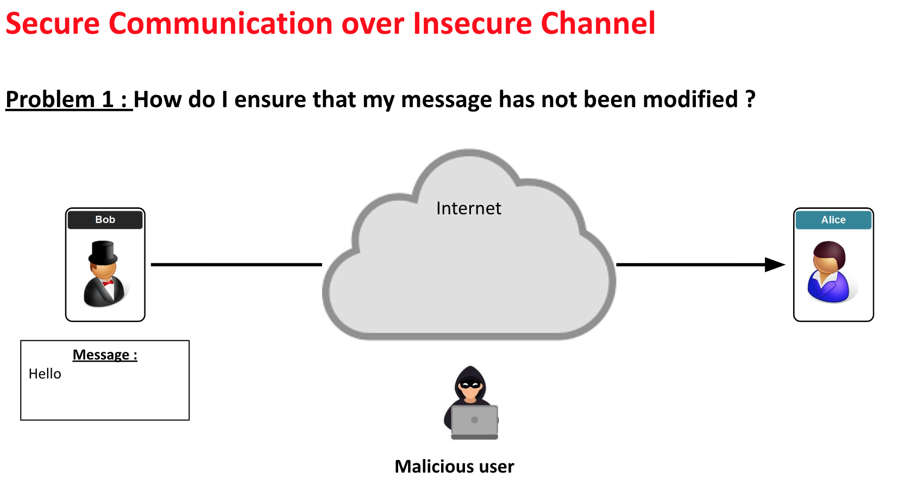

**۲. چگونه مطمئن شوم پیام از شخص معتبر آمده است؟**  
    این مسئله مربوط به **اصالت (authenticity)** است.  
    منجر به توسعه **امضاهای دیجیتال** و **رمزنگاری کلید عمومی** شد.
   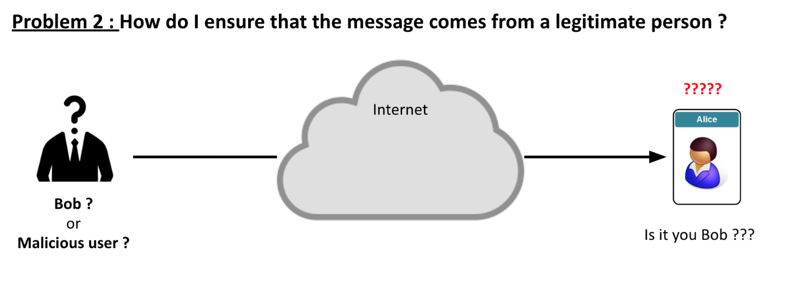

### فناوری‌های توسعه‌یافته

 **تابع‌های هش**  
  مانند خانواده‌ی SHA (الگوریتم هش امن) — برای بررسی تمامیت داده استفاده می‌شوند.

 **رمزنگاری کلید عمومی (رمزنگاری نامتقارن)**  
  توسط ویتفیلد دیفی و مارتین هلمن در سال ۱۹۷۶ توسعه یافت. امکان تبادل کلید امن از طریق کانال‌های عمومی را فراهم کرد.

 **امضاهای دیجیتال**  
  امکان تأیید اینکه پیام توسط فرستنده‌ای شناخته‌شده ایجاد شده را فراهم می‌کردند.

این نوآوری‌ها بنیان‌گذار سیستم‌های آینده مانند **بلاک‌چین** بودند که به ابزارهای رمزنگاری برای ارائه داده‌ها و تراکنش‌های امن، تغییرناپذیر و قابل‌راستی‌آزمایی متکی هستند.

---

# بنیان‌های رمزنگاری

## پیش از دهه ۱۹۷۰: رمزنگاری متقارن

### رمزنگاری کلید متقارن

 **تعریف**: فرستنده و گیرنده از **یک کلید مخفی مشترک** استفاده می‌کنند.
 **نحوه عملکرد**:
   همان کلید برای **رمزگذاری و رمزگشایی** استفاده می‌شود.
   مثال: آلیس و باب از یک کلید مشترک برای رمزگذاری/رمزگشایی پیام‌ها استفاده می‌کنند.

### مشکل: مدیریت کلید

چگونه آلیس و باب می‌توانند کلید را:

 **بدون دیدار حضوری به اشتراک بگذارند؟**
 **در شبکه‌ای ناامن یا خصمانه منتقل کنند؟**

> رمزنگاری متقارن فرض می‌کند که یک روش امن برای تبادل کلید وجود دارد—که این یک محدودیت بزرگ پیش از دهه ۱۹۷۰ بود.

---

## پیشرفت دهه ۱۹۷۰: رمزنگاری نامتقارن

گامی بزرگ به جلو با اختراع **رمزنگاری نامتقارن** (همچنین به‌عنوان **رمزنگاری کلید عمومی** شناخته می‌شود) برداشته شد.

### رمزنگاری کلید عمومی

 شامل دو کلید:
   **کلید عمومی**: برای **رمزگذاری** استفاده می‌شود.
   **کلید خصوصی**: برای **رمزگشایی** استفاده می‌شود.
 مشکل تبادل امن اطلاعات از طریق کانال‌های ناامن را حل می‌کند.

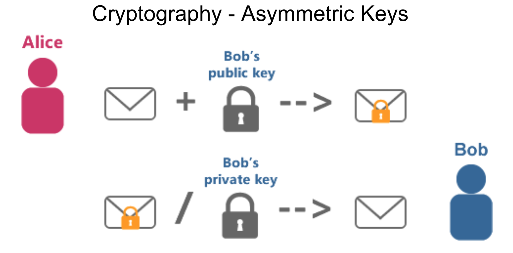

---

## تبادل کلید دیفی-هلمن

برای ایجاد یک **کلید مشترک** بین دو طرف بدون نیاز به اشتراک‌گذاری هیچ اطلاعات خصوصی توسعه یافت.

 **هدف**: به‌دست آوردن یک کلید مشترک از طریق یک کانال عمومی.
 **تشبیه**: ترکیب رنگ‌ها:
   هر طرف یک رنگ خصوصی انتخاب می‌کند و آن را با یک رنگ عمومی ترکیب می‌کند.
   پس از تبادل ترکیب‌ها، هر دو طرف به یک رنگ نهایی یکسان می‌رسند—**کلید مشترک**.

برای توضیح تصویری، این [راهنما](https://github.com/archit-p/simplest-oblivious-transfer) را ببینید.

  
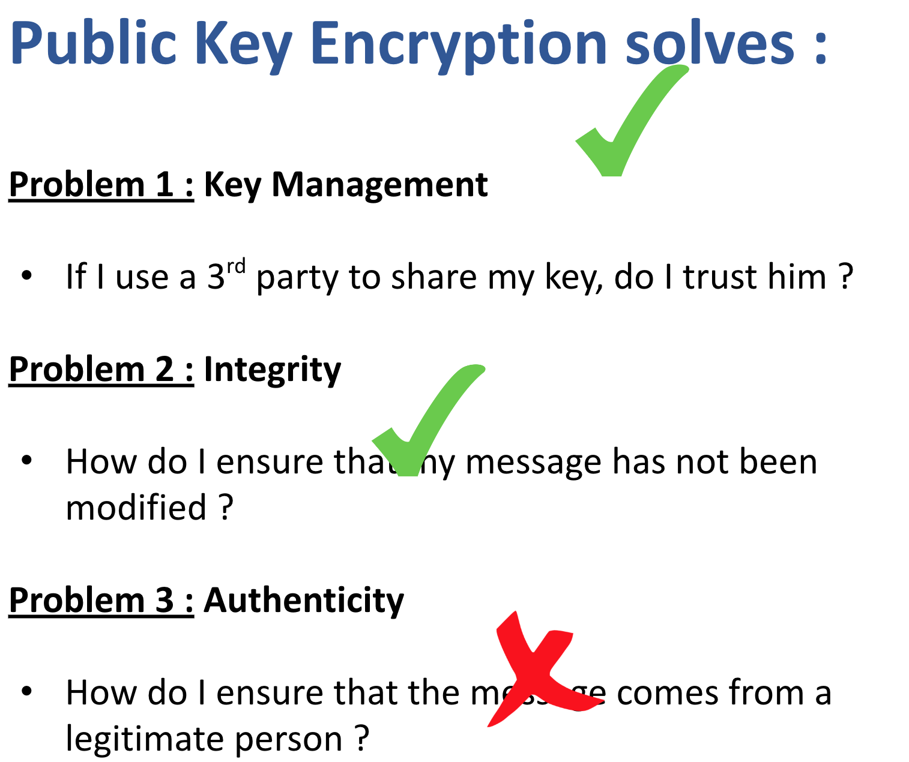

---

## امضاهای دیجیتال

**امضاهای دیجیتال** برای اثبات **منشأ و تمامیت** پیام‌ها اختراع شدند.

### هدف

 تأیید اینکه پیام واقعاً توسط **دارنده‌ی یک کلید خصوصی خاص** ارسال شده است.

### مثال

باب یک سند را امضا کرده و برای آلیس می‌فرستد. آلیس با استفاده از کلید عمومی باب، امضا را تأیید می‌کند.

### ویژگی‌های کلیدی امضاهای دیجیتال

1. **اصالت**  
   زمانی‌که آلیس پیام را با کلید عمومی باب بررسی می‌کند، می‌فهمد که **باب آن را امضا کرده است**.

2. **غیرقابل جعل**  
   فقط باب می‌تواند امضا را ایجاد کند، زیرا تنها او کلید خصوصی‌اش را دارد.

3. **غیرقابل استفاده مجدد**  
   امضا به **سند خاصی وابسته است**—نمی‌توان آن را برای سند دیگری استفاده کرد.

4. **غیرقابل تغییر**  
   اگر پیام **تغییر کند**، امضا دیگر با کلید عمومی باب **اعتبار نخواهد داشت**.

---

---

# تابع‌های هش

## تابع هش چیست؟

یک **تابع هش** الگوریتمی ریاضی است که ورودی (یا "پیام") را به یک رشته با اندازه‌ی ثابت از بایت‌ها تبدیل می‌کند که معمولاً به‌صورت تصادفی به نظر می‌رسد.

 خروجی آن **هش** یا **چکیده** نامیده می‌شود.
 در رمزنگاری، ساختارهای داده، امضاهای دیجیتال و بلاک‌چین‌ها کاربرد دارد.

### مثال

ورودی:
```
"Hello, world!"
```

خروجی SHA-256:
```
a591a6d40bf420404a011733cfb7b190
d62c65bf0bcda32b57b277d9ad9f146e
```

---

## ویژگی‌های کلیدی تابع‌های هش رمزنگاری‌شده

1. **قطعی بودن (Deterministic)**  
    ورودی یکسان همیشه خروجی یکسان تولید می‌کند.

2. **محاسبه سریع**  
    انجام هش‌کردن از نظر محاسباتی سریع است.

3. **مقاومت در برابر پیش‌تصویر (Pre-image Resistance)**  
    با داشتن هش، پیدا کردن ورودی اصلی *از نظر محاسباتی غیرممکن* است.
    مانع مهندسی معکوس می‌شود.

4. **مقاومت در برابر پیش‌تصویر دوم**  
    سخت است که ورودی متفاوتی پیدا شود که همان هش را تولید کند.

5. **مقاومت در برابر تصادم (Collision Resistance)**  
    پیدا کردن دو ورودی متفاوت با هش یکسان از نظر محاسباتی غیرممکن است.

6. **اثر بهمن (Avalanche Effect)**  
    یک تغییر کوچک در ورودی، خروجی را به شدت تغییر می‌دهد.

---

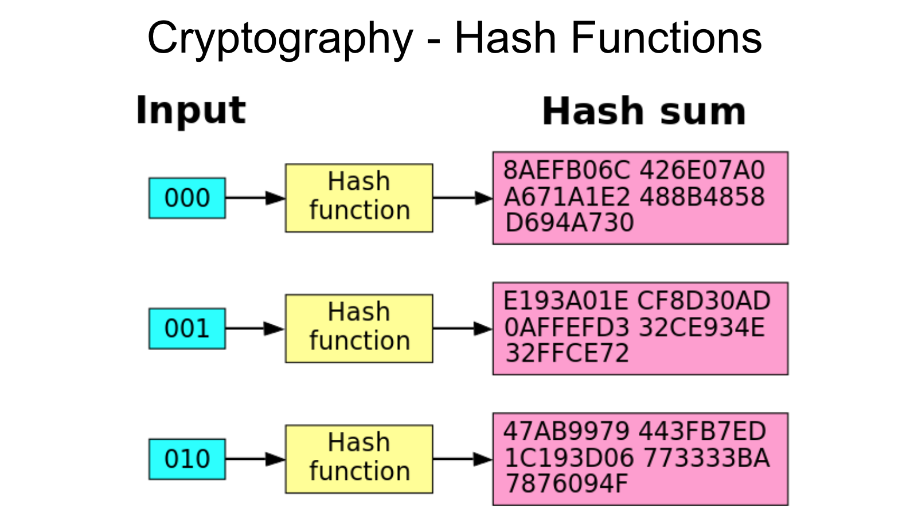

---

## تابع‌های هش رایج

| نام        | اندازه خروجی | موارد استفاده رایج                        |
|------------|---------------|---------------------------------------------|
| MD5        | ۱۲۸ بیت       | سیستم‌های قدیمی، چک‌سام‌ها (امن نیست)     |
| SHA-1      | ۱۶۰ بیت       | منسوخ به‌دلیل ضعف امنیتی                   |
| SHA-256    | ۲۵۶ بیت       | بلاک‌چین (مثلاً بیت‌کوین)، SSL/TLS         |
| SHA-3      | ۲۵۶ بیت       | کاربردهای امن مدرن                         |
| Keccak256  | ۲۵۶ بیت       | قراردادهای هوشمند اتریوم                   |

---

## کاربردهای تابع‌های هش

 **امضاهای دیجیتال**  
  هش کردن پیام پیش از امضا برای افزایش سرعت.

 **تمامیت داده**  
  مقایسه هش‌ها برای تشخیص تغییر در فایل یا پیام.

 **ذخیره‌سازی گذرواژه‌ها**  
  فقط هش گذرواژه ذخیره می‌شود، نه متن اصلی.

 **بلاک‌چین**  
  هش‌ها باعث پیوند امن و تغییرناپذیر بین بلوک‌ها می‌شوند.

 **درخت مرکل**  
  استفاده از هش‌ها برای بررسی کارآمد مجموعه‌های داده بزرگ.

---

## هش ≠ رمزنگاری

| ویژگی              | هش‌کردن                    | رمزنگاری                         |
|--------------------|-----------------------------|-----------------------------------|
| قابل برگشت؟         | ❌ خیر                     | ✅ بله                            |
| هدف                | بررسی تمامیت، شناسه        | محرمانگی                         |
| نیاز به کلید؟       | ❌ خیر                     | ✅ بله (کلید عمومی/خصوصی)        |

---

# درخت مرکل

## درخت مرکل چیست؟

**درخت مرکل** (یا **درخت هش**) ساختاری دودویی است که برای بررسی کارآمد و امن محتوای مجموعه‌های داده بزرگ استفاده می‌شود.

 هر **گره برگ** شامل هش رمزنگاری‌شده‌ی یک بلوک داده است.
 هر **گره غیر‌برگ** شامل هش ترکیب دو گره فرزند خود است.
 **گره ریشه (Merkle Root)** خلاصه‌ای از تمام داده‌های درون درخت است.

---

## ساختار یک درخت مرکل


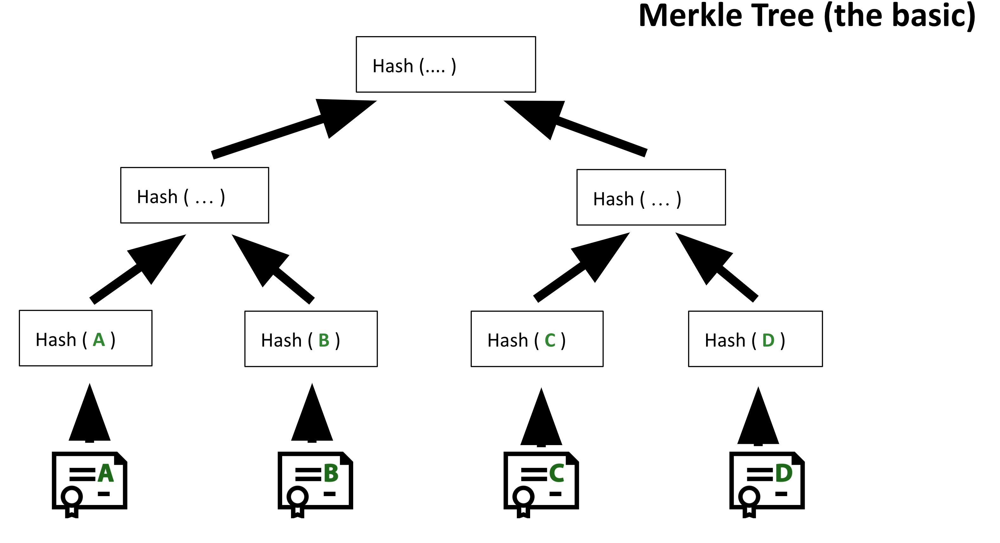  
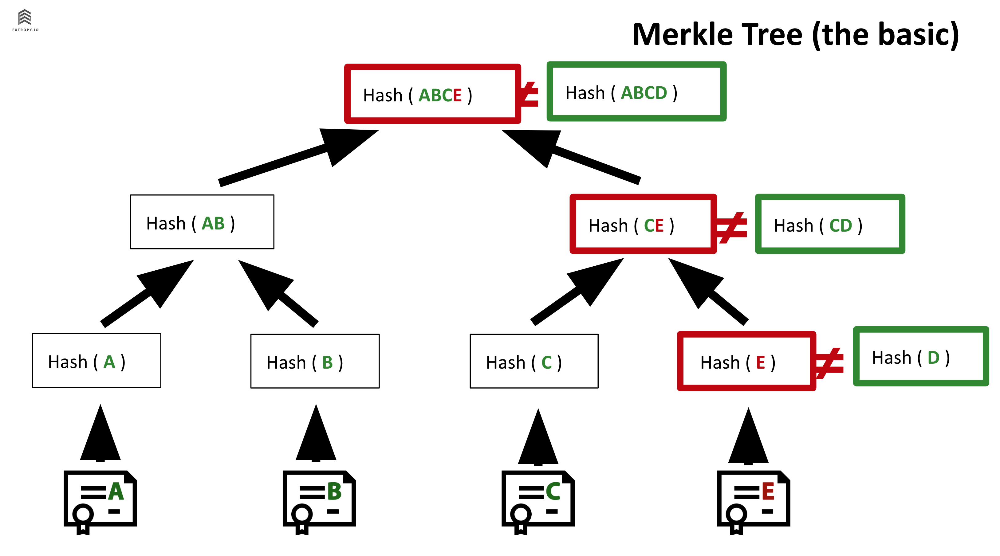

---

## ویژگی‌های کلیدی

1. **بررسی کارآمد**  
    برای تأیید هر گره برگ فقط تعداد کمی هش نیاز است.  
    مناسب برای کلاینت‌های سبک در بلاک‌چین.

2. **کشف دستکاری**  
    هر تغییر در یک برگ باعث تغییر در هش ریشه می‌شود، و این دستکاری را فاش می‌کند.

3. **اثبات‌های فشرده (Merkle Proofs)**  
    می‌توان گنجاندن یک داده را بدون نمایش کل مجموعه اثبات کرد.

4. **مقیاس‌پذیری**  
    مناسب برای مجموعه‌های داده بزرگ و بررسی موازی.

---

## اثبات مرکل (اثبات گنجایش)

برای اثبات اینکه یک برگ در درخت وجود دارد:
 هش برگ را ارائه می‌دهید.
 **هش گره‌های همسایه** در مسیر تا ریشه را ارائه می‌دهید.

### مثال:
برای تأیید H3 در درخت بالا، موارد زیر را ارائه می‌دهید:
 H3 (برگ)
 H4 (همسایه)
 HashA (هش گره از شاخه‌ی دیگر)

سپس محاسبه می‌کنید:
 HashB = hash(H3 + H4)
 Root = hash(HashA + HashB)

و با Merkle root اصلی مقایسه می‌کنید.

---

## کاربردهای درخت مرکل

 **بلاک‌چین (بیت‌کوین، اتریوم)**  
   تراکنش‌ها در یک بلاک در قالب درخت مرکل هش می‌شوند.  
   فقط ریشه مرکل در هدر بلاک ذخیره می‌شود.

 **اثبات‌های مرکل در کلاینت‌های سبک**  
   برای بررسی تراکنش بدون دانلود کل بلاک استفاده می‌شود.

 **سیستم‌های توزیع‌شده**  
   بررسی تمامیت داده‌ها و فایل‌ها بین نودها.

 **کنترل نسخه Git**  
   گیت از ساختارهایی شبیه درخت مرکل برای مدیریت و بررسی نسخه فایل‌ها استفاده می‌کند.

---

## مزایای امنیتی

 **تغییرناپذیری (Immutability)**  
   یک تغییر کوچک در داده باعث تغییر در ریشه مرکل می‌شود.

 **تمامیت (Integrity)**  
   تضمین می‌کند که داده‌ها دستکاری نشده‌اند.

 **کارایی**  
   تأیید سریع با پیچیدگی لگاریتمی.

---
# خط زمانی تاریخچه بلاک‌چین

## دهه ۱۹۸۰ — پایه‌های رمزنگاری

### دیوید چام
 **امضاهای کور (Blind Signatures)**: امکان امضای پیام بدون دانستن محتوای آن — مهم برای حفظ حریم خصوصی دیجیتال.
 **دیجی‌کش (DigiCash)**: یکی از نخستین پیاده‌سازی‌های پول دیجیتال مبتنی بر اصول رمزنگاری.

---

## دهه ۱۹۹۰ — مفاهیم اولیه پول دیجیتال

### ثبت زمان اسناد
 فراهم کردن اثبات قابل‌اعتماد از وجود سند در زمان خاصی.

### چهره‌های کلیدی
 **آدام بک** – مخترع **هش‌کش (HashCash)**، سیستمی مبتنی بر اثبات کار برای جلوگیری از اسپم که بعدها بر ماینینگ بیت‌کوین تأثیر گذاشت.
 **وی دای** – پیشنهاددهنده **بی‌مانی (b-money)**، مفهومی اولیه برای ارز دیجیتال توزیع‌شده و ناشناس.

---

## دهه ۲۰۰۰ — آزمایش‌های همتا-به-همتا و ارز دیجیتال

### شبکه‌های P2P
 نمونه‌ها: **Freenet**، **Gnutella**، **BitTorrent**.
 امکان اشتراک‌گذاری فایل به‌صورت غیرمتمرکز و پایه‌گذاری معماری توزیع‌شده بلاک‌چین.

### تلاش‌های بیشتر برای پول دیجیتال
> «تنها چیزی که کم است، یک پول الکترونیکی قابل‌اعتماد است که بتوان با آن در اینترنت، پول را از A به B منتقل کرد بدون اینکه A، B را بشناسد یا بالعکس.»  
> — *میلتون فریدمن، ۱۹۹۹*

### پیشگامان
 **وی دای** – *b-money* (۱۹۹۸)
 **نیک سابو** – *Bit Gold* (۱۹۹۸)

---

## ۲۰۰۸–۲۰۰۹ — تولد بیت‌کوین

 **اوت ۲۰۰۸**: دامنه **bitcoin.org** ثبت شد.
 **اکتبر ۲۰۰۸**: انتشار وایت‌پیپر *«بیت‌کوین: سیستم پول الکترونیکی همتا-به-همتا»* توسط **ساتوشی ناکاموتو** در یک لیست پستی رمزنگاری.
 **ژانویه ۲۰۰۹**: نرم‌افزار بیت‌کوین به‌صورت متن‌باز منتشر شد؛ بلاک پیدایش (Genesis Block) استخراج شد.

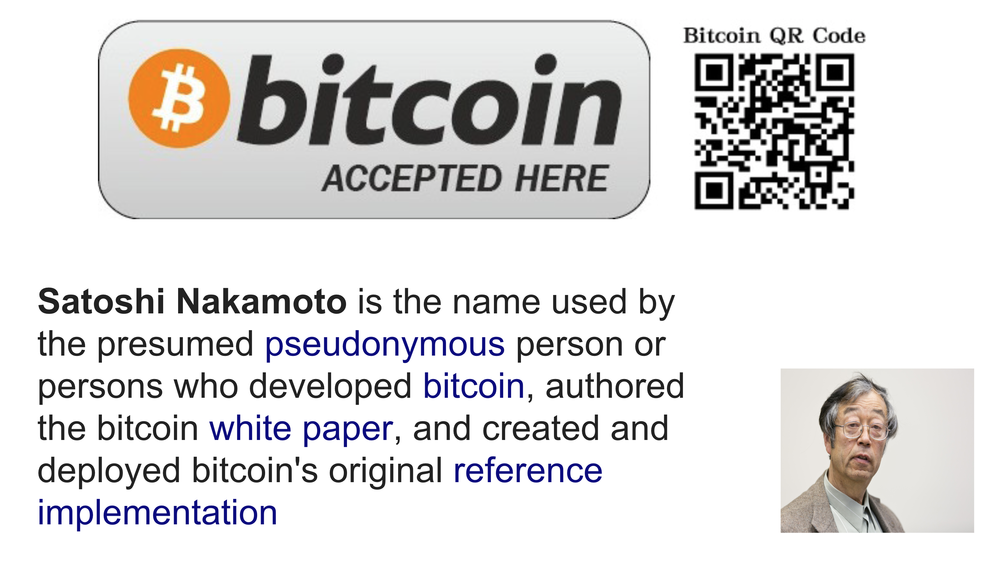

---

## ۲۰۱۰ — نخستین استفاده واقعی از بیت‌کوین

 **لاسزلو هانیتز** دو عدد پیتزای Papa John’s را با **۱۰٬۰۰۰ بیت‌کوین** خرید.
 اغلب به‌عنوان نخستین تراکنش تجاری شناخته‌شده با بیت‌کوین شناخته می‌شود.

---

## نقاط عطف عمومی بلاک‌چین (۲۰۰۹–۲۰۲۴)

### ۲۰۱۴ — راه‌اندازی **اتریوم**
 معرفی قراردادهای هوشمند و بلاک‌چینی تورینگ‌کامل.

---

### ۲۰۱۷ — رونق **ICO**
 صدها عرضه اولیه کوین راه‌اندازی شدند؛ اتریوم تبدیل به پلتفرم اصلی جذب سرمایه شد.

---

### ۲۰۱۸ — **زمستان کریپتو**
 سقوط بازار پس از هیاهوی ICO؛ بسیاری از پروژه‌ها شکست خوردند.

---

### ۲۰۲۰ — **تابستان DeFi**
 رشد انفجاری پلتفرم‌های مالی غیرمتمرکز مانند Uniswap، Aave و Compound.

---

### ۲۰۲۱ — رونق **NFT و بازی‌ها**
 افزایش محبوبیت توکن‌های غیرمثلی (NFT)، متاورس و بازی‌های کسب درآمد مانند Axie Infinity.

---

### ۲۰۲۲ — **ادغام اتریوم (Merge)**
 اتریوم از اثبات کار به **اثبات سهام** منتقل شد و بیش از **۹۹٪** در مصرف انرژی صرفه‌جویی شد.

---

### ۲۰۲۲ — **زمستان دیگر کریپتو**
 رکود بازار در پی سقوط‌های بزرگ و عدم اطمینان اقتصادی جهانی.

---

## رویدادهای اخیر (۲۰۲۲–۲۰۲۴)

### مه ۲۰۲۲ — سقوط **Terra Luna / UST**
 استیبل‌کوین الگوریتمی UST قیمت خود را از دست داد.
 بیش از **۶۰ میلیارد دلار** ارزش از بین رفت.

### نوامبر ۲۰۲۲ — سقوط **FTX**
 صرافی رمزارز FTX به رهبری **سم بنکمن-فرید** در پی اتهامات کلاهبرداری سقوط کرد.

### سپتامبر ۲۰۲۲ — **ادغام اتریوم**
 اتریوم به‌طور رسمی به مکانیزم اجماع اثبات سهام منتقل شد.

### ۲۰۲۲–۲۰۲۳ — رونق **مقیاس‌پذیری لایه ۲**
 رشد راه‌کارهای مقیاس‌پذیری:
   **Arbitrum**
   **Optimism**
   **zkSync**
   **Polygon**

  این‌ها هزینه گس را کاهش داده و سرعت تراکنش را افزایش دادند.

### ژانویه ۲۰۲۳ — **Bitcoin Ordinals**
 درج‌های مشابه NFT روی بیت‌کوین معرفی شدند که باعث بحث در مورد ازدحام شبکه و استفاده آن شد.

### ۲۰۲۳–۲۰۲۴ — **افزایش فشارهای نظارتی**
 کمیسیون بورس و اوراق بهادار آمریکا (SEC) صرافی‌های بزرگی چون:
   **Binance**
   **Coinbase**
  را هدف قرار داد.
 نظارت‌های قانونی در سراسر جهان افزایش یافت.

### ژانویه ۲۰۲۴ — **تأیید ETF بیت‌کوین بلک‌راک**
 SEC چند **ETF بیت‌کوین اسپات** را تأیید کرد.
 نشانه‌ای از پذیرش نهادی و ورود سرمایه عظیم بود.

### ۲۰۲۴ — **همگرایی هوش مصنوعی و کریپتو**
 ظهور پروژه‌ها و توکن‌های ترکیبی از AI و کریپتو.
 علاقه نهادی و حجم معاملات بالا به‌وضوح مشهود است.

---

# اصول بلاک‌چین

## مقدمه‌ای بر بلاک‌چین — اجزا

### شبکه Gossip
 ارتباط همتا-به-همتا که در آن نودها داده را به نودهای همسایه خود منتقل می‌کنند.

### دفتر کل عمومی مشترک
 پایگاه داده توزیع‌شده‌ای که هر نود نسخه‌ای از کل بلاک‌چین را دارد.

### رمزنگاری
 امنیت تراکنش‌ها و احراز هویت شرکت‌کنندگان را تضمین می‌کند.

### ویژگی‌های حاصل
 **شفافیت**: وضعیت قابل تأیید به‌صورت عمومی.
 **تأییدپذیری مبتنی بر اجماع**
 **تاب‌آوری**: مقاوم در برابر خرابی برخی نودها.
 **مقاومت در برابر سانسور**
 **تعاملات غیرقابل‌دستکاری**

---

## خط زمانی بلاک‌چین

### دهه ۱۹۸۰
 **دیوید چام**
   **امضاهای کور**
   **دیجی‌کش**

### دهه ۱۹۹۰
 **ثبت زمان اسناد**
 **آدام بک** – هش‌کش
 **وی دای** – بی‌مانی

### دهه ۲۰۰۰
 **شبکه‌های P2P**: Freenet، Gnutella، BitTorrent
 مفاهیم اولیه پول دیجیتال:
   *۱۹۹۸*: b-money – وی دای
   *۱۹۹۸*: Bit Gold – نیک سابو  
> «تنها چیزی که کم است، یک پول الکترونیکی قابل‌اعتماد است...» — *میلتون فریدمن (۱۹۹۹)*

---

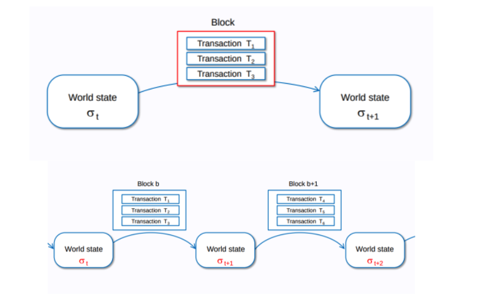

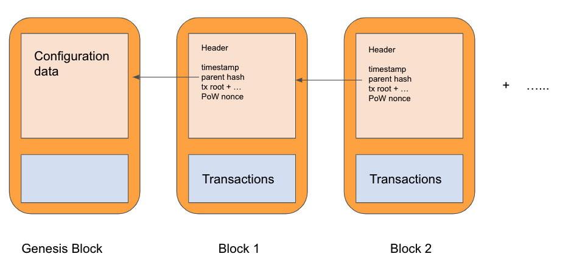

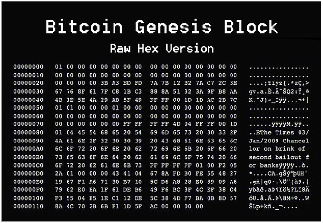

---

# اجماع در سیستم‌های توزیع‌شده

## چرا اجماع؟

برای حل:
 **مشکل دوباره خرج کردن (Double Spending)**: استفاده مجدد از توکن‌های دیجیتال.
 **دستکاری و مشکلات ترتیب** در یک شبکه باز.

## تحمل خطای بیزانسی (BFT)

 تاب‌آوری در برابر نودهای خراب‌کار یا ناقص.
 کارکرد حتی با اطلاعات ناقص شبکه.  
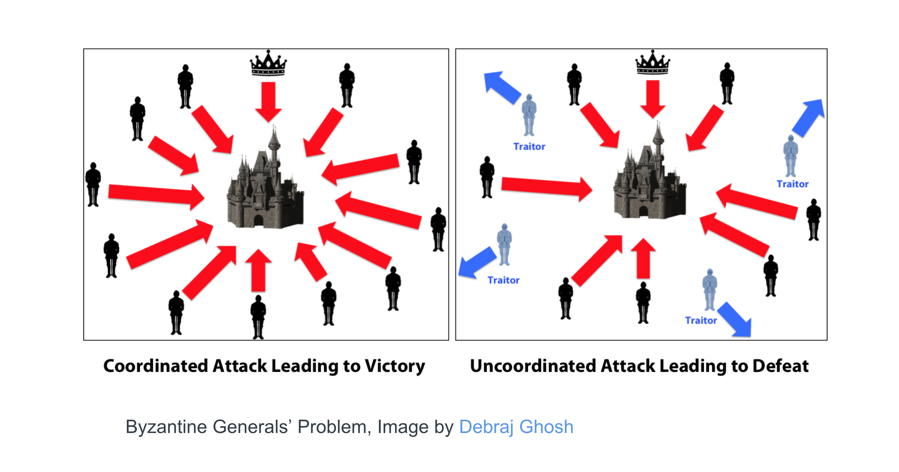

## مشکل دوباره خرج کردن

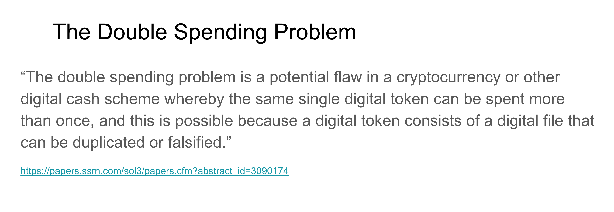

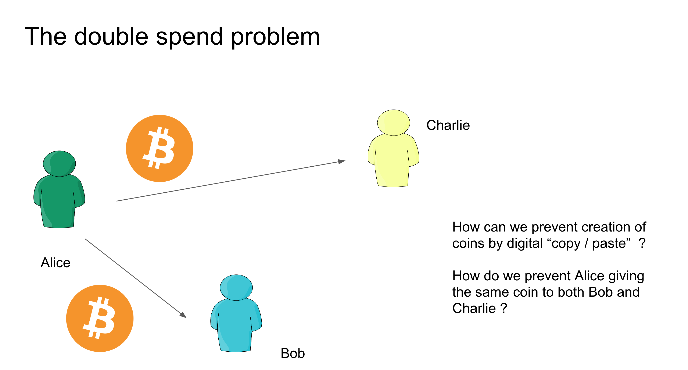

## چالش‌های هم‌زمان‌سازی

 بدون ساعت جهانی در سیستم‌های غیرمتمرکز.
 بیت‌کوین و اتریوم: ماینینگ ترتیب‌دهی را فراهم می‌کند.
 **Solana**: از **اثبات تاریخ (Proof of History)** برای ترتیب‌گذاری استفاده می‌کند.
 **Hedera Hashgraph**: از میانگین زمانی نودها استفاده می‌کند.

---

## مکانیزم‌های اجماع

### دو بخش کلیدی:
1. **مقاومت در برابر Sybil**: جلوگیری از جعل هویت.
2. **منطق اجماع**: دستیابی به توافق روی وضعیت رسمی شبکه.

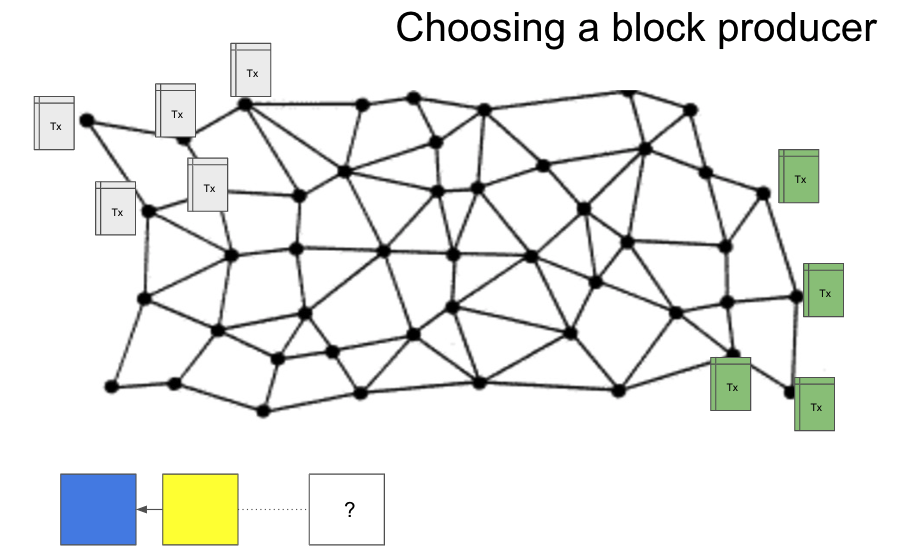

### مکانیزم‌های رایج "اثبات"
 **اثبات کار (Proof of Work)**
 **اثبات سهام (Proof of Stake)**
 **اثبات اعتبار (Proof of Authority)**
 **اثبات تاریخ (Proof of History)**
 **اثبات سوختن (Proof of Burn)**
 **اثبات زمان سپری‌شده (Proof of Elapsed Time)**
 **اثبات فضا-زمان (Proof of Spacetime)**
 **اثبات کار هسته‌ای (Proof of Kernel Work)** (مثلاً در Extropy)

---

## تولید بلاک و نهایی‌سازی

### انتخاب رهبر
 PoW: رقابت در حل معما.
 PoS: توابع تصادفی قابل تأیید (VRF) برای تخصیص اسلات‌ها.
 باید به **زنده‌ماندن (liveness)** رسیدگی کند: اگر رهبر شکست خورد، چه می‌شود؟

### گنجاندن تراکنش
 تولیدکنندگان، تراکنش‌ها را انتخاب و ترتیب می‌دهند.

---

## نمونه‌هایی از مکانیزم‌های اجماع

### pBFT — تحمل خطای بیزانسی عملی

 **توسط کاسترو و لیسکوف (۱۹۹۹)**
 **نیازمند**: `۳f + ۱` نود برای تحمل `f` نود خراب.
 نهایی‌سازی فوری: پس از پذیرش، تراکنش نهایی است.
 فرآیند:
  1. درخواست ← گره رهبر
  2. رهبر پیام را به نودها پخش می‌کند
  3. نودها پاسخ می‌دهند ← شبکه
  4. پس از دریافت `۲f + ۱` پاسخ مشابه ← اجماع حاصل
  5. امکان تعویض رهبر خراب وجود دارد

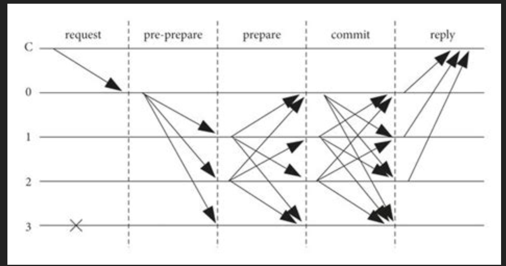

---

## اجماع ناکاموتو

 مورد استفاده در بیت‌کوین
 فورک‌ها با انتخاب **زنجیره سنگین‌تر** (بیشترین PoW) حل می‌شوند

---

## اثبات سهام اتریوم (PoS)

### صلاحیت اعتبارسنجی
 نیاز به سهام‌گذاری (ETH) برای شرکت.
 انتخاب تصادفی با وزن‌دهی بر اساس سهام.
 جریمه برای رفتار خراب‌کارانه (Slashing).

### اجماع دو بخشی
1. **LMD-GHOST**: انتخاب سر زنجیره.
2. **Casper FFG**: نهایی‌سازی بلاک‌ها برای گنجاندن در زنجیره.

---

## اجماع Avalanche

 (در منبع توضیح داده نشده، اما شناخته‌شده برای نهایی‌سازی احتمالاتی از طریق رأی‌گیری نمونه‌برداری‌شده مکرر)

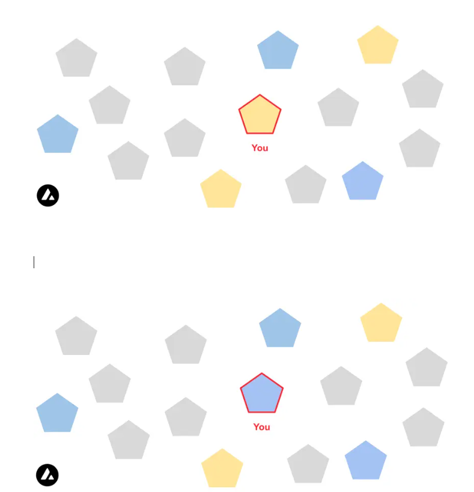

---


</div>
