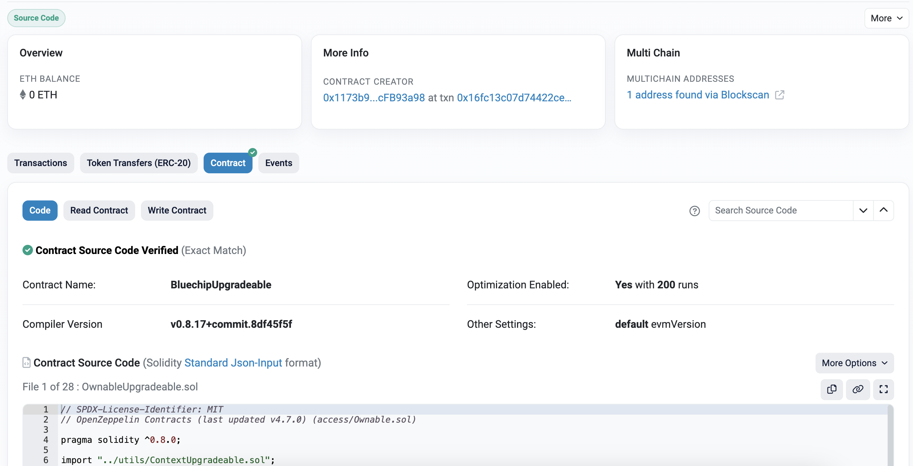
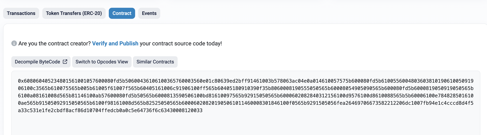
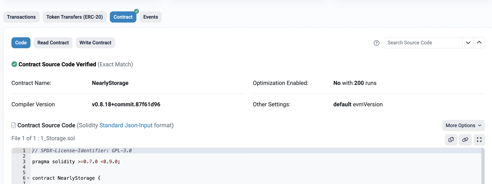
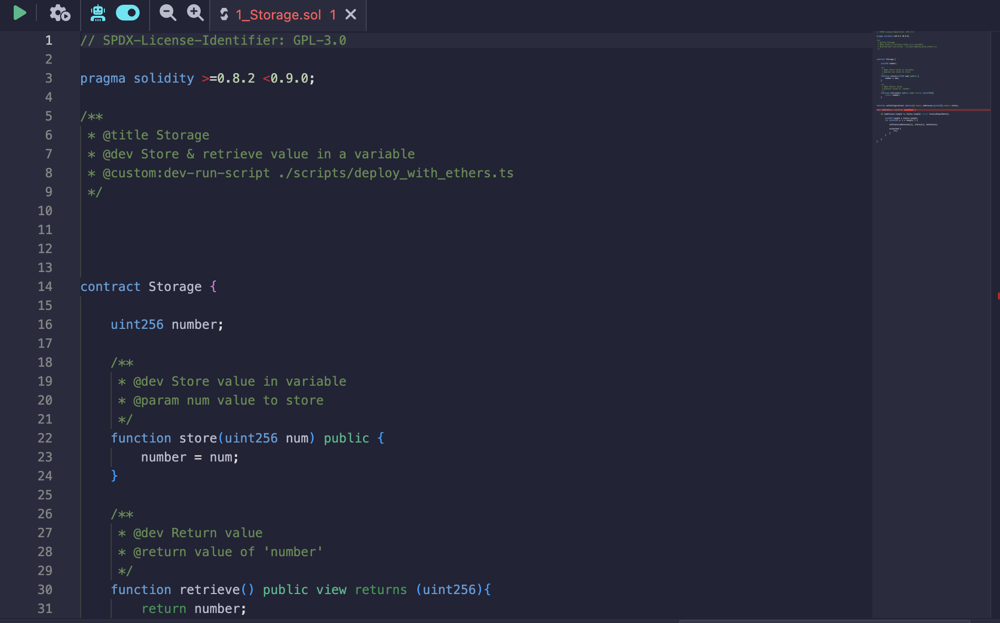
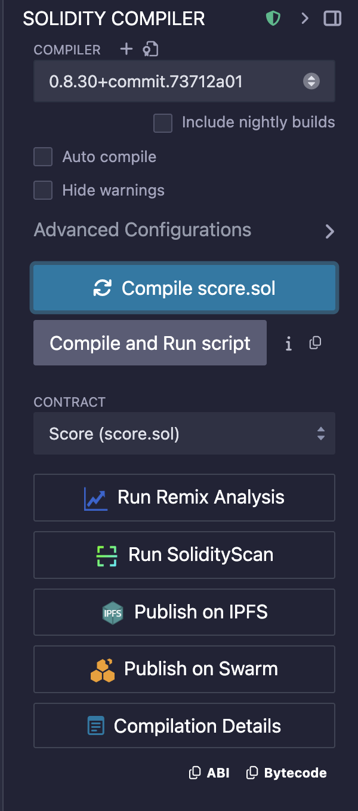
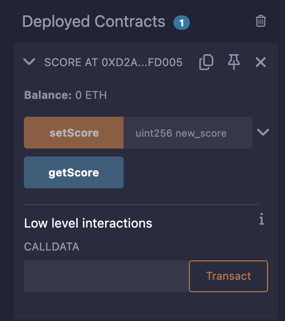

#    اتر‌اسکن (Etherscan)

اتر‌اسکن یک مرورگر بلاک و پلتفرم تحلیل برای اتریوم است. این ابزار اطلاعاتی درباره بلاک‌ها، تراکنش‌ها، قراردادها و موارد دیگر ارائه می‌دهد. همچنین ابزاری برای توسعه‌دهندگان است تا با قراردادهای هوشمند تعامل کرده و استقرار آن‌ها را تأیید کنند.

##    ویژگی‌های اصلی

###    بلاک‌ها
- مشاهده بلاک‌های استخراج‌شده و جزئیات آن‌ها: ماینر، گاز مصرف‌شده، زمان استخراج و تراکنش‌های موجود.

###    تراکنش‌ها
- بررسی جزئیات هر تراکنش، شامل:
  - فرستنده و گیرنده
  - کارمزد گاز
  - فراخوانی قرارداد
  - وضعیت (موفق یا ناموفق)

###    آمار
- پیگیری فعالیت شبکه اتریوم، از جمله:
  - قیمت گاز
  - زمان تولید بلاک
  - نرخ تراکنش‌ها
  - عرضه ETH و داده‌های بازار

###    قراردادهای هوشمند
- مشاهده کد منبع قرارداد (در صورت تأییدشده بودن)
- بررسی ABI، بایت‌کد و نسخه کامپایلر
- بررسی اطلاعات سازنده قرارداد و نحوه استقرار آن

###    فاست‌های تست‌نت
- اتر‌اسکن دسترسی به فاست‌هایی برای دریافت ETH تست‌نت را فراهم می‌کند.
- مثال: [فاست سپولیا](https://sepolia.etherscan.io/)

---

##    تعامل با قراردادهای هوشمند

###    اتصال کیف‌پول Web3
- اتصال کیف‌پول (مثل متامسک) به طور مستقیم از طریق اتر‌اسکن.
- امکان:
  - خواندن داده‌های قرارداد (رایگان)
  - نوشتن روی قراردادها (نیازمند ETH یا ETH تست‌نت)

###    توابع نوشتنی
- ارسال تراکنش با تعامل با توابع عمومی/خارجی قرارداد.
- نیاز به گاز و مجوزهای مناسب دارد.

---

## تأیید قراردادهای هوشمند

### چرا تأیید کنیم؟
- اجباری نیست اما **شدیداً توصیه می‌شود**:
  - کاربران به قرارداد شما اعتماد بیشتری خواهند کرد.
  - توسعه‌دهندگان راحت‌تر از طریق اتر‌اسکن تعامل می‌کنند.
  - رابط "خواندن/نوشتن قرارداد" و تولید خودکار ABI فعال می‌شود.
  

### گزینه‌های تأیید
- **افزونه Remix (افزونه اتر‌اسکن)**:
  - نصب افزونه Etherscan در محیط Remix IDE.
  - تولید **کلید API اتر‌اسکن** (نیازمند حساب کاربری).
  - استفاده از افزونه برای تأیید خودکار پس از استقرار.

- **تأیید دستی**:
  - رفتن به بخش **"Verify and Publish"** در اتر‌اسکن.
  - وارد کردن دستی کد منبع، اطلاعات کامپایلر و ABI.

---

## مثال فرآیند استقرار

1. **استقرار اولیه** (مثلاً با Remix یا Hardhat)

2. **مرحله تأیید**
   - استفاده از افزونه اتر‌اسکن یا فرم دستی.
   - ارائه:
     - آدرس قرارداد
     - کد منبع
     - نسخه کامپایلر
     - نوع مجوز
     - تنظیمات بهینه‌سازی

3. **پس از تأیید**
   - کد منبع قرارداد در اتر‌اسکن قابل مشاهده می‌شود.
   - کاربران و ابزارها می‌توانند مستقیماً از طریق رابط اتر‌اسکن تعامل داشته باشند.

## دریافت کلید API اتر‌اسکن

1. ایجاد حساب در [etherscan.io](https://etherscan.io)
2. رفتن به بخش **API Key** در داشبورد.
3. ایجاد یک کلید جدید (نسخه رایگان موجود است).
4. استفاده از این کلید در:
   - افزونه Remix
   - اسکریپت‌های تأیید در Hardhat/Foundry
   - یکپارچه‌سازی با ابزارهای تحلیلی

---

---

#  برنامه‌نویسی Vibe

برنامه‌نویسی Vibe یک سبک شهودی و خودجوش از کدنویسی است که بر خلاقیت و نمونه‌سازی سریع تمرکز دارد و اغلب بدون برنامه‌ریزی دقیق یا ساختار مشخص انجام می‌شود. این سبک بین هنرمندان، هکرها و علاقه‌مندان به یادگیری ایده‌های جدید رایج است.

---

##  مزایا

- **نمونه‌سازی سریع**  
  پیاده‌سازی سریع ایده‌ها بدون نگرانی از ساختار یا معماری.

- **حالت روان خلاقانه**  
  حفظ انرژی و انگیزه بالا در جلسات کدنویسی.

- **ورود آسان‌تر**  
  کاهش اهمال‌کاری و حذف ترس از شروع.

- **یادگیری اکتشافی**  
  تشویق به کشف از طریق آزمون‌وخطا به‌جای برنامه‌ریزی خشک.

- **انعطاف‌پذیری**  
  امکان تغییر مسیر یا آزمایش تکنیک‌های جدید به‌سرعت.

- **جنبه سرگرم‌کننده**  
  تبدیل کدنویسی به فعالیتی لذت‌بخش، جذاب و پاداش‌آور.

---

##  معایب

- **بدهی فنی**  
  کدی که تولید می‌شود معمولاً نیاز به بازنویسی و تمیزکاری زیادی دارد.

- **مقیاس‌پذیری ضعیف**  
  نگهداری یا گسترش پروژه با رشد پیچیدگی دشوار می‌شود.

- **نبود مستندسازی**  
  مستندات و توضیحات معمولاً هنگام توسعه سریع نادیده گرفته می‌شوند.

- **الگوهای ناسازگار**  
  سبک و ساختار ممکن است متغیر باشد و انسجام کد را کاهش دهد.

- **همکاری دشوارتر**  
  دیگران ممکن است فهمیدن یا مشارکت در کد را سخت بدانند.

- **اشتباهات بیشتر**  
  نبود تست سیستماتیک منجر به باگ‌ها و رفتارهای غیرمنتظره می‌شود.

- **انحراف از هدف**  
  بدون برنامه، احتمال انحراف از اهداف اولیه یا افراط در توسعه وجود دارد.

- **مشکلات عملکردی**  
  تمرکز بیشتر بر "کارکردن ساده" تا بهینه‌سازی یا پیروی از بهترین روش‌ها.

---

## بهترین کاربردها

- هکاتون‌ها و گیم جم‌ها  
  عالی برای خروجی سریع و خلاقانه در محدودیت زمانی.

- پروژه‌ها و آزمایش‌های شخصی  
  مناسب برای کشف ایده‌ها برای سرگرمی یا یادگیری.

- یادگیری فناوری‌های جدید  
  مناسب برای آزمایش سریع و عملی بدون نیاز به تنظیمات پیچیده.

- نمونه‌های اولیه در مراحل ابتدایی  
  ساخت MVP برای آزمون ایده‌های اصلی قبل از مقیاس‌گذاری.

- برنامه‌نویسی خلاقانه و پروژه‌های هنری  
  تشویق به برنامه‌نویسی بی‌قید و آزاد در زمینه‌های هنری.

---

# مقدمه‌ای بر Remix

Remix یک محیط توسعه یکپارچه (IDE) برای برنامه‌نویسی Solidity است. می‌توان آن را در مرورگر یا روی دسکتاپ اجرا کرد.

- **مرورگر**: [https://remix.ethereum.org/](https://remix.ethereum.org/)
- **دسکتاپ**:  
  برای نصب Remix روی کامپیوتر شخصی، از دستور زیر استفاده کنید:

~~~~bash
npm install -g @remix-project/remixd
~~~~

---

## مستندات Remix

مستندات جامع در محیط Remix موجود است و معمولاً از طریق افزونه‌های **Help** یا **Docs** قابل دسترسی است.

---

## افزونه‌ها

پنل سمت چپ اجازه می‌دهد افزونه‌هایی برای گسترش قابلیت‌های Remix اضافه کنیم.

برخی افزونه‌های مفید عبارتند از:

- **کامپایلر Solidity**: برای کامپایل قراردادهای هوشمند.
- **استقرار و اجرای تراکنش‌ها**: برای استقرار و تعامل با قراردادها.
- **تست واحد Solidity**: برای نوشتن و اجرای تست‌ها.

همچنین بخش **File Explorer** در این پنل به ما امکان می‌دهد بین قراردادهای در حال کار حرکت کنیم.

---

## پنل ویرایشگر

اینجا جایی است که قراردادهای هوشمند خود را ویرایش می‌کنیم.

ویژگی‌ها شامل:

- برجسته‌سازی سینتکس برای Solidity.
- نمایش خطاها و هشدارها.
- تکمیل خودکار و IntelliSense.
- پشتیبانی از چند فایل و تب.

---

## پنل خروجی

پنل خروجی موارد زیر را نشان می‌دهد:

- فعالیت روی بلاک‌چین محلی یا تستی شما.
- نتایج کامپایل.
- لاگ‌های تراکنش.
- پیام‌های خطا و خروجی کنسول.

---

## کامپایل قرارداد

برای کامپایل یک قرارداد:

1. روی آیکون **Solidity Compiler** (با لوگوی Solidity) در پنل سمت چپ کلیک کنید.
2. نسخه مناسب کامپایلر را انتخاب کنید.
3. گزینه کامپایل خودکار را در صورت تمایل فعال کنید.
4. روی دکمه **Compile** کلیک کنید.

اگر موفقیت‌آمیز باشد، نتیجه کامپایل در پنل خروجی ظاهر می‌شود.

---

## استقرار قرارداد

برای استقرار یک قرارداد کامپایل شده:

1. روی آیکون **Deploy & Run Transactions** در پنل سمت چپ کلیک کنید.
2. در پنل جدید، محیط مناسب را از منوی کشویی **Environment** انتخاب کنید.
3. قرارداد مورد نظر را از لیست کشویی انتخاب کنید.
4. روی دکمه **Deploy** کلیک کنید.

---
# انتخاب شبکه / محیط

وقتی قراردادها را تازه توسعه می‌دهید، پیشنهاد می‌شود از ساده‌ترین محیط ارائه شده توسط Remix استفاده کنید.

## مراحل استقرار قرارداد

1. افزونه **Deploy & Run Transactions** را از پنل سمت چپ انتخاب کنید.
2. در منوی کشویی **Environment**، یکی از موارد زیر را انتخاب کنید:  
   - **Remix VM (Prague)** – ساده‌ترین و بدون نیاز به اتصال خارجی است.
3. در لیست کشویی **Contract**، قراردادی که می‌خواهید استقرار دهید را انتخاب کنید.

4. برای استقرار قرارداد انتخاب شده، روی دکمه **Deploy** کلیک کنید.

## پس از استقرار

- اگر قرارداد به درستی استقرار یابد، **پنجره خروجی** نتایج تراکنش را نمایش می‌دهد.

- همچنین قرارداد استقرار یافته در بخش **Deployed Contracts** پنل استقرار نمایش داده می‌شود.

از اینجا می‌توانید:

- با فراخوانی توابع قرارداد، با آن تعامل کنید.

- تراکنش‌ها را مستقیماً از رابط کاربری ارسال کنید.

> نکته: پس از استقرار، به قرارداد یک آدرس در بلاک‌چین اختصاص داده می‌شود، مشابه آدرس کیف پول.

---

# Solidity

این بخش معرفی مختصری از سینتکس و ساختار پایه‌ای Solidity است، مناسب برای مبتدیانی که یادگیری توسعه قراردادهای هوشمند را شروع می‌کنند.

---

## معرفی

Solidity یک زبان برنامه‌نویسی قراردادی و دارای نوع‌بندی ایستا است که برای توسعه قراردادهای هوشمند روی اتریوم طراحی شده است.

---

## نحوه تعریف نسخه کامپایلر Solidity

نسخه کامپایلر را در بالای فایل Solidity خود با کلیدواژه `pragma` مشخص می‌کنید.

~~~~solidity
// نسخه‌های ۰.۸.۰ به بالا تا قبل از ۰.۹.۰ را قبول می‌کند
pragma solidity ^0.8.0;
~~~~

~~~~solidity
// نسخه‌های بزرگتر از ۰.۷.۶ و کمتر از ۰.۸.۴ را قبول می‌کند
pragma solidity >0.7.6 <0.8.4;
~~~~

---

## نحوه تعریف یک قرارداد

Solidity با استفاده از کلیدواژه `contract` و نام قرارداد به همراه آکولادها، منطق قرارداد را محصور می‌کند.

~~~~solidity
contract Score {

    // کد شما اینجا قرار می‌گیرد =)

}
~~~~

---

## نحوه اعلان متغیر در Solidity

به دلیل نوع‌بندی ایستا، Solidity نیازمند اعلان صریح نوع متغیر است.

~~~~solidity
contract Score {

    uint score = 5;

}
~~~~

### نکات مهم:
- Solidity به صورت **نوع‌بندی ایستا** است، بنابراین باید نوع متغیر (مثلاً `uint`، `address`، `string`) قبل از نام متغیر اعلام شود.
- تمام دستورات باید با **سمی‌کالن** `;` پایان یابند.

---
##  انواع عدد صحیح بدون علامت (`uint`)

به طور پیش‌فرض، `uint` برابر با `uint256` است، یعنی عدد صحیح ۲۵۶ بیتی بدون علامت. می‌توانید طول بیت را در گام‌های ۸ بیتی مشخص کنید.

| نوع      | بازه عددی                           |
|----------|------------------------------------|
| `uint8`  | از ۰ تا ۲۵۵                        |
| `uint16` | از ۰ تا ۶۵,۵۳۵                    |
| `uint32` | از ۰ تا ۴,۲۹۴,۹۶۷,۲۹۵              |
| `uint64` | از ۰ تا ۱۸,۴۴۶,۷۴۴,۰۷۳,۷۰۹,۵۵۱,۶۱۵ |
| `uint128`| از ۰ تا ۲^۱۲۸                      |
| `uint256`| از ۰ تا ۲^۲۵۶                      |

---

##  خواندن و نوشتن مقادیر (Getters and Setters)

برای **خواندن** و **نوشتن** یک مقدار در قرارداد، از توابع getter و setter استفاده کنید.

~~~~solidity
contract Score {

    uint score = 5;

    function getScore() public view returns (uint) {
        return score;
    }

    function setScore(uint new_score) public {
        score = new_score;
    }
}
~~~~

- `view`: برای خواندن وضعیت (getter)
- `returns`: نوع مقدار بازگشتی را تعریف می‌کند
- `return`: مقدار را برمی‌گرداند
- `public`: تعیین‌کننده سطح دسترسی

---
### تابع Getter با استفاده از return
تعریف: در Solidity، getter تابعی است که مقدار را برمی‌گرداند.

برای برگرداندن مقدار از تابع (مثلاً مقدار score)، از کلمات کلیدی زیر استفاده کنید:

در تعریف تابع: `returns` + نوع متغیر بازگشتی در پرانتز (مثلاً `uint`)  
در بدنه تابع: `return` به همراه مقداری که می‌خواهید برگردانید، مثل `return score;` یا `return 137;`

### تابع Setter: ارسال پارامتر به تابع
تعریف: در Solidity، setter تابعی است که مقدار یک متغیر را تغییر می‌دهد (وضعیت قرارداد را تغییر می‌دهد). برای ساخت setter باید پارامترها را هنگام تعریف تابع مشخص کنید.

بعد از نام تابع، در پرانتزها ۱) نوع متغیر (مثل `uint`) و ۲) نام متغیر (مثل `new_score`) را می‌نویسید.

---

##  دید توابع (Function Visibility)

| دید           | قرارداد خودش | قراردادهای مشتق شده | قراردادهای خارجی | آدرس‌های خارجی |
|---------------|--------------|--------------------|------------------|----------------|
| `public`      | ✅           | ✅                 | ✅               | ✅             |
| `private`     | ✅           | ❌                 | ❌               | ❌             |
| `internal`    | ✅           | ✅                 | ❌               | ❌             |
| `external`    | ❌           | ❌                 | ✅               | ✅             |

---

##  تغییرناپذیری: `view` در مقابل `pure`

- `view`: فقط **وضعیت را می‌خواند**.  
- `pure`: **نه می‌خواند و نه می‌نویسد**. فقط برای محاسبات و ریاضیات استفاده می‌شود.

---

## اصلاح‌کننده‌ها و کنترل دسترسی

# افزودن امنیت با اصلاح‌کننده‌ها

قرارداد ما یک مشکل امنیتی دارد: **هر کسی می‌تواند مقدار score را تغییر دهد**.

Solidity متغیر سراسری `msg` را فراهم کرده که به آدرسی که با توابع قرارداد تعامل دارد اشاره می‌کند. متغیر `msg` دو فیلد مرتبط دارد:

- `msg.sender`: آدرس فراخوان تابع را برمی‌گرداند.  
- `msg.value`: مقدار Wei اتر ارسال شده به تابع را برمی‌گرداند.

## چگونه یک تابع را به فراخوان خاص محدود کنیم؟

باید ویژگی‌ای داشته باشیم که فقط آدرس‌های خاصی بتوانند مقدار score را تغییر دهند (مثلاً آدرس شما). برای این کار از مفهوم **اصلاح‌کننده‌ها (modifiers)** استفاده می‌کنیم.

### اصلاح‌کننده چیست؟

**تعریف**: اصلاح‌کننده تابع ویژه‌ای است که اجازه می‌دهد رفتار توابع در Solidity را تغییر دهیم. معمولاً برای بررسی خودکار یک شرط قبل از اجرای تابع استفاده می‌شود.

ما از اصلاح‌کننده زیر استفاده می‌کنیم تا تابع فقط برای مالک قرارداد قابل اجرا باشد.

~~~~solidity
address owner;

modifier onlyOwner {
    if (msg.sender == owner) {
       _;
    }
}

function setScore(uint new_score) public onlyOwner {
    score = new_score;
}
~~~~

### نحوه کار اصلاح‌کننده

اصلاح‌کننده به این صورت عمل می‌کند:

1. بررسی می‌کند که آدرس فراخوان (`msg.sender`) برابر آدرس `owner` باشد.  
2. اگر شرط برقرار بود، بررسی قبول شده و `_` با بدنه تابع جایگزین می‌شود.

### اصلاح‌کننده با آرگومان‌ها

اصلاح‌کننده می‌تواند مانند توابع آرگومان بگیرد. مثلاً:

~~~~solidity
modifier Fee(uint fee) {
    if (msg.value == fee) {
        _;
    }
}
~~~~

### تعیین مالک

با این حال، هنوز مالک را تعریف نکرده‌ایم. این کار را در سازنده انجام می‌دهیم.

~~~~solidity
constructor() {
    owner = msg.sender;
}
~~~~

---

##  سازنده (Constructor)

یکبار هنگام استقرار اجرا می‌شود.

~~~~solidity
contract Score {

    address owner;

    constructor() {
        owner = msg.sender;
    }
}
~~~~

> پیش از نسخه 0.4.22، سازنده نامش باید با نام قرارداد یکی می‌بود. این روش از 0.5.0 به بعد منسوخ شده است.

---

##  مپینگ‌ها (Mappings)

مپینگ‌ها کلید-مقدار را به هم مرتبط می‌کنند.  
برای دسترسی به مقدار مربوط به کلید در مپینگ، نام کلید را داخل براکت [] می‌گذاریم: **mapping_name[key]**.  
قرارداد ما مپینگی از آدرس کاربران و مقدار score آنها ذخیره می‌کند. تابع **getUserScore(address _user)** مقدار score مربوط به آدرس خاص را برمی‌گرداند.

~~~~solidity
mapping(address => uint) public score_list;

function getUserScore(address user) public view returns (uint) {
    return score_list[user];
}
~~~~

### انواع معتبر مپینگ‌ها

| نوع                | کلید | مقدار |
|---------------------|------|-------|
| `int/uint`          | ✔️   | ✔️    |
| `string`, `bytes`   | ✔️   | ✔️    |
| `address`           | ✔️   | ✔️    |
| `struct`, `mapping` | ❌   | ✔️    |
| `enum`, `contract`  | ❌   | ✔️    |
| آرایه با اندازه ثابت | ✔️   | ✔️    |
| آرایه با اندازه متغیر | ❌   | ✔️    |
| `var`               | ❌   | ❌    |

---

##  آرایه‌ها (Arrays)

دو نوع:

~~~~solidity
uint[] all_possible_numbers;  // داینامیک  
uint[9] one_digit_numbers;    // ثابت
~~~~

### دسترسی

~~~~solidity
uint score = all_possible_numbers[0];
~~~~

### متدها

- `array.length`: تعداد عناصر  
- `array.push(value)`: افزودن عنصر

---

##  ساختارها (Structs)

تعریف انواع سفارشی:

~~~~solidity
struct Funder {
    address addr;
    uint amount;
}
~~~~

استفاده:

~~~~solidity
Funder giver;
giver.addr = address(0x...);
giver.amount = 2500;
~~~~

---

##  مثال ساختار به همراه آرایه

~~~~solidity
pragma solidity ^0.8.0;

contract ListExample {

    struct DataStruct {
        address userAddress;
        uint userID;
    }

    DataStruct[] public records;

    function createRecord1(address _userAddress, uint _userID) public {
        DataStruct memory newRecord;
        newRecord.userAddress = _userAddress;
        newRecord.userID = _userID;
    }

    function createRecord2(address _userAddress, uint _userID) public {
        records.push(DataStruct({userAddress: _userAddress, userID: _userID}));
    }

    function getRecordCount() public view returns (uint recordCount) {
        return records.length;
    }
}
~~~~

---

##  نکات و بهترین شیوه‌ها

- از `public` روی متغیرها و مپینگ‌ها برای ساخت خودکار getter استفاده کنید  
- همیشه دید تابع یا متغیر را مشخص کنید (`public`, `private` و غیره)  
- برای بهینه‌سازی گس و جلوگیری از هشدار، از `view` یا `pure` استفاده کنید  
- برای امنیت و کنترل دسترسی از اصلاح‌کننده‌ها بهره ببرید  
- سازنده‌ها به تنظیم مالکیت یا منطق مقداردهی اولیه کمک می‌کنند

---

