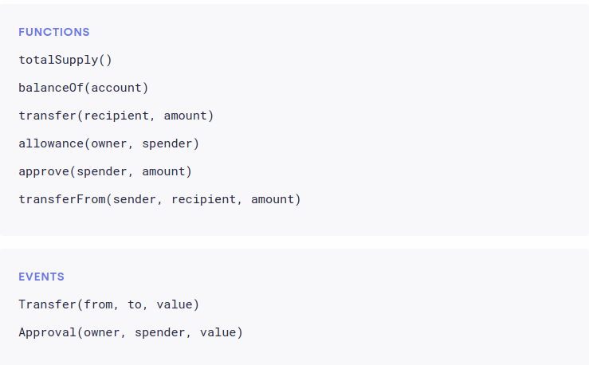

# راهنمای رویدادها و استانداردهای توکن در Solidity

## رویدادها در Solidity

رویدادها در وب۳ برای خروجی گرفتن مقادیر برگشتی و نمایش تغییرات ایجاد شده در قرارداد هوشمند استفاده می‌شوند. این‌ها مانند دستورات لاگ عمل می‌کنند و در لاگ تراکنش بلاک‌چین ذخیره می‌شوند.

### تعریف رویدادها

رویدادها خارج از توابع تعریف می‌شوند:

event myEvent(type1, type2, ... );

رویدادها داخل توابع صادر (emit) می‌شوند:

emit myEvent(param1, param2, ... );

### مثال: ثبت تغییر مقدار امتیاز

بیایید یک رویداد بسازیم تا امتیاز جدید تنظیم شده را نمایش دهد. این رویداد در تابع `setScore()` بعد از به‌روزرسانی امتیاز صادر می‌شود.

~~~~solidity
event Score_set(uint);

function setScore(uint new_score) public onlyOwner {
    score = new_score;
    emit Score_set(new_score);
}
~~~~

### استفاده از `indexed`

می‌توانید در تعریف رویداد از کلیدواژه `indexed` استفاده کنید تا پارامترها در وب۳ قابل جستجو باشند:

event Score_set(uint indexed);

### نکاتی درباره رویدادها

- رویدادها می‌توانند در هر نوع تابعی (`public`، `private`، `internal`، `external`) استفاده شوند.
- رویدادها فقط **خارج از قرارداد** قابل مشاهده‌اند؛ در داخل کد Solidity قابل خواندن نیستند.
- تابعی نمی‌تواند رویداد صادر شده توسط تابع دیگر را بخواند.

### درک لاگ‌های رویداد

زمانی که در Solidity رویدادی صادر می‌کنید، آرگومان‌ها در لاگ تراکنش ذخیره می‌شوند — ساختار داده خاصی در بلاک‌چین اتریوم. این لاگ‌ها:

- با آدرس قرارداد مرتبط هستند  
- به صورت دائمی در بلاک‌چین ذخیره می‌شوند (تا زمانی که بلاک در دسترس باشد)

---

# استانداردهای توکن در اتریوم

استانداردهای توکن در اتریوم مشخص می‌کنند توکن‌ها چگونه رفتار کرده و در اکوسیستم تعامل می‌کنند. این استانداردها برای اطمینان از تعامل‌پذیری بین قراردادهای هوشمند، کیف‌پول‌ها، صرافی‌ها و اپلیکیشن‌های غیرمتمرکز ضروری هستند.

## استانداردهای توکن چیست؟

از مستندات OpenZeppelin:

> "اگرچه مفهوم توکن ساده است، اما در پیاده‌سازی پیچیدگی‌های متنوعی دارد. چون همه چیز در اتریوم فقط یک قرارداد هوشمند است و قوانین مشخصی درباره عملکرد قراردادها وجود ندارد، جامعه استانداردهای متنوعی (که به آن‌ها EIP یا ERC گفته می‌شود) برای تعیین نحوه تعامل قراردادها با یکدیگر توسعه داده است."

این استانداردها که به نام‌های **Ethereum Improvement Proposals (EIPs)** یا **Ethereum Request for Comments (ERCs)** شناخته می‌شوند، رابط‌های مشترک و رفتارهای مورد انتظار برای توکن‌ها را تعریف می‌کنند.

---

## استانداردهای رایج توکن در اتریوم

### استانداردهای رایج توکن

- **ERC20**: رایج‌ترین استاندارد توکن برای دارایی‌های قابل تعویض (fungible). ساده و گسترده استفاده شده.  
- **ERC721**: برای توکن‌های غیرقابل تعویض (NFTها). معمولاً در بازی‌ها و کلکسیون‌ها کاربرد دارد.  
- **ERC777**: با ERC20 سازگار است و ویژگی‌هایی مثل hookهای ارسال/دریافت و اپراتورها (افراد مجاز) را اضافه می‌کند.  
- **ERC1155**: استاندارد چندتوکنی. یک قرارداد می‌تواند توکن‌های قابل تعویض، غیرقابل تعویض یا نیمه‌قابل تعویض را مدیریت کند.

---

### ERC20 — توکن‌های قابل تعویض (Fungible Tokens)

#### مقدمه

**ERC20** نمونه‌ای از **توکن قابل تعویض** است — یعنی هر توکن قابل جایگزینی با توکن دیگر با همان ارزش است. این استاندارد توسط توسعه‌دهندگان، صرافی‌ها و ارائه‌دهندگان کیف‌پول به‌طور گسترده پذیرفته شده است.

برای داشتن توکن ERC20، قرارداد هوشمند شما باید توابع و رویدادهای مشخصی را طبق اینترفیس رسمی پیاده‌سازی کند. مرجع پرکاربرد OpenZeppelin است.

#### توابع و رویدادهای مورد نیاز

برای انطباق با استاندارد ERC20، قرارداد باید موارد زیر را پیاده‌سازی کند:

#### توابع

1. `totalSupply()`: مجموع کل توکن‌ها را برمی‌گرداند.  
2. `balanceOf(address account)`: موجودی توکن آدرس مشخص شده را برمی‌گرداند.  
3. `transfer(address to, uint256 amount)`: انتقال توکن‌ها به آدرس دیگر.  
4. `approve(address spender, uint256 amount)`: اجازه می‌دهد آدرس دیگری توکن‌ها را به نمایندگی شما خرج کند.  
5. `allowance(address owner, address spender)`: مقدار باقی‌مانده‌ای که spender می‌تواند از طرف owner خرج کند را نشان می‌دهد.  
6. `transferFrom(address from, address to, uint256 amount)`: انتقال توکن‌ها از یک آدرس به آدرس دیگر با استفاده از اجازه قبلی.

#### رویدادها

- `Transfer(address indexed from, address indexed to, uint256 value)`  
- `Approval(address indexed owner, address indexed spender, uint256 value)`  

برای پیاده‌سازی کامل و امن، توصیه می‌شود از [اینترفیس ERC20 در OpenZeppelin](https://docs.openzeppelin.com/contracts/latest/api/token/erc20) استفاده کنید.

---

#### نکات مهم در طراحی ERC20

طراحی یک توکن ERC20 نیازمند ملاحظات مهمی برای تضمین امنیت، کارایی و پایداری در اکوسیستم است.

###### 1. همکاری با کارشناس اقتصاد توکن

توکنومیکس برای موفقیت هر سیستم توکنی بسیار مهم است. با کسی کار کنید که با موارد زیر آشنا باشد:

- مکانیزم عرضه و تقاضا  
- ساختارهای انگیزشی  
- مدل‌های تورم و ضدتورم  
- برنامه‌های آزادسازی (vesting)  
- کاربردهای توکن (حاکمیت، کاربردی، استیکینگ و غیره)

###### 2. برنامه‌ریزی تغییرات عرضه توکن در طول زمان

مکانیزم‌های عرضه توکن باید با دقت برنامه‌ریزی شوند:

- **عرضه ثابت**: بعد از تولید اولیه توکن جدیدی ساخته نمی‌شود.  
- **عرضه تورمی**: توکن‌های جدید به مرور زمان ساخته می‌شوند تا مشارکت‌کنندگان را پاداش دهند.  
- **عرضه ضدتورمی**: توکن‌ها سوزانده می‌شوند یا از گردش حذف می‌شوند.  
- **کنترل ضرب توکن**: تصمیم بگیرید چه کسی و تحت چه شرایطی می‌تواند توکن جدید ضرب کند.

مثال تابع mint با دسترسی محدود:

~~~~solidity
function mint(address to, uint256 amount) public onlyOwner {
    _mint(to, amount);
}
~~~~

###### 3. آیا قرارداد شما شبیه به «rug pull» است؟

برای جلوگیری از ظاهر شدن به عنوان کلاهبرداری یا «rug pull» شفافیت و امنیت را رعایت کنید. نشانه‌های خطر عبارتند از:

- تخصیص‌های بزرگ به کیف‌پول تیم بدون برنامه آزادسازی  
- توابعی که به توسعه‌دهندگان اجازه می‌دهد پول را تخلیه یا توکن بی‌نهایت ضرب کنند  
- نبود ممیزی عمومی یا مستندات  
- درهای پشتی مخفی یا غیرشفاف  

مثال تابع پرخطر برای اجتناب:

~~~~solidity
function rugPull() public {
    payable(owner).transfer(address(this).balance);
}
~~~~

برای جلب اعتماد:

- کد قرارداد هوشمند خود را منتشر کنید  
- قرارداد را ممیزی کنید  
- هدف و منطق توکن را به وضوح مستندسازی کنید

###### 4. آیا به قابلیت‌های پیشرفته‌تر ERC777 / ERC1155 نیاز دارید؟

بررسی کنید که آیا ERC20 برای کاربرد شما کافی است یا خیر. گزینه‌ها:

- **ERC777**: استاندارد پیشرفته با ویژگی‌هایی مثل hookهای ارسال/دریافت و ارسال توسط اپراتورها.  
- **ERC1155**: پشتیبانی از چندین نوع توکن (قابل تعویض و غیرقابل تعویض) در یک قرارداد، معمولاً برای بازی‌ها و NFTها.

انتخاب بر اساس:

- پیچیدگی کاربرد  
- نیاز به انتقال دسته‌ای یا تعاملات پیشرفته‌تر  
- سازگاری با اپ‌ها و کیف‌پول‌های موجود

---

### ERC721 — توکن‌های غیرقابل تعویض (NFTها)

- استاندارد برای توکن‌های **غیرقابل تعویض**.  
- هر توکن شناسه یکتا دارد و قابل تمایز است.  
- کاربرد معمول در:  
  - هنر دیجیتال  
  - آیتم‌های بازی  
  - کلکسیون‌ها  

**نمونه کاربرد:** CryptoKitties، Bored Ape Yacht Club.

---

### ERC777 — توکن‌های پیشرفته قابل تعویض

- **سازگار با ERC20**.  
- ویژگی‌های پیشرفته مانند:  
  - **hookهای ارسال/دریافت**: تماس‌های بازگشتی هنگام ارسال یا دریافت توکن‌ها.  
  - **اپراتورها**: اشخاصی که می‌توانند به نمایندگی از دیگران توکن‌ها را منتقل کنند.  
- رابط قدرتمندتر توکن با حفظ سازگاری با ابزارهای ERC20.

**مناسب برای:** برنامه‌هایی که نیاز به کنترل دقیق‌تر و قابلیت گسترش توکن دارند.

---

### ERC1155 — استاندارد چندتوکنی

- اجازه می‌دهد یک قرارداد هوشمند مدیریت کند:  
  - **توکن‌های قابل تعویض**  
  - **توکن‌های غیرقابل تعویض**  
  - **توکن‌های نیمه‌قابل تعویض**  
- با کاهش هزینه گس و امکان انجام عملیات دسته‌ای، کارایی بیشتری نسبت به ERC20 و ERC721 دارد.

**مناسب برای:** بازی‌ها، بازارها و اپ‌هایی که نیاز به انواع مختلف توکن در یک قرارداد دارند.

---

## خلاصه

| استاندارد | نوع توکن       | ویژگی‌ها                                                    | موارد استفاده                     |
|-----------|----------------|-------------------------------------------------------------|----------------------------------|
| ERC20     | قابل تعویض    | رابط ساده برای توکن‌های پایه                               | ارزها، استیکینگ، حاکمیت         |
| ERC721    | غیرقابل تعویض | شناسه یکتا، متادیتا                                         | NFTها، کلکسیون‌ها، آیتم‌های بازی |
| ERC777    | قابل تعویض    | hookها، اپراتورها، سازگار با ERC20                         | کنترل توکن، منطق قابل گسترش    |
| ERC1155   | ترکیبی         | پشتیبانی چندتوکنی در یک قرارداد                            | بازی‌ها، انتقال‌های دسته‌ای، NFTها |

---

