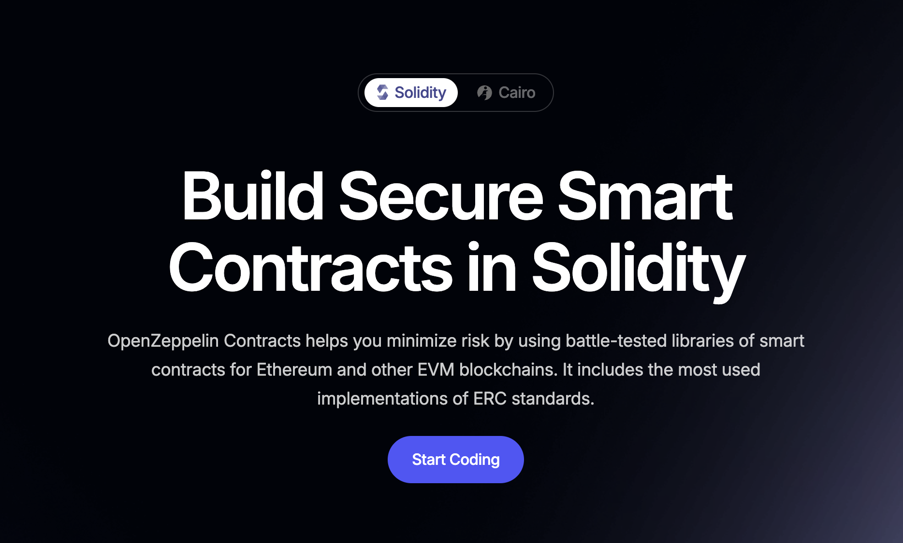

# افزودن قراردادها و کتابخانه‌های دیگر

وقتی به تعامل با قراردادها یا کتابخانه‌های دیگر فکر می‌کنید، مفید است که بین آنچه در **زمان کامپایل** اتفاق می‌افتد و آنچه در **زمان اجرا** رخ می‌دهد تفاوت قائل شوید.

---

## زمان کامپایل

اگر قرارداد شما به قرارداد یا کتابخانه دیگری ارجاع می‌دهد — چه از طریق ارث‌بری یا برای فراخوانی تابع خارجی — کامپایلر نیاز دارد به کد مرتبط دسترسی داشته باشد.

- از دستور `import` برای وارد کردن کد به واحد کامپایل استفاده کنید.  
- یا می‌توانید کد را مستقیماً در فایل خود کپی کنید؛ هر دو روش همان نتیجه را دارند.  
- در برخی موارد، مانند هنگام تأیید قرارداد در Etherscan، باید تمام کد قراردادها را در یک فایل جمع‌آوری کنید. این فرایند را **فلت‌کردن (flattening)** می‌نامند.  
  - ابزارهایی مانند Remix و Truffle پلاگین‌هایی برای اتوماسیون فلت‌کردن ارائه می‌دهند.

### ارث‌بری

اگر از قرارداد دیگری ارث‌بری کنید (مثلاً `Ownable` از OpenZeppelin)، در هنگام کامپایل:

- همه توابع و متغیرها (به جز آن‌هایی که با `private` مشخص شده‌اند) از قرارداد والد وارد قرارداد شما می‌شوند.  
- بایت‌کد نهایی شامل همه چیز از هر دو قرارداد است.  
- بعد از کامپایل، منبع این توابع برای EVM اهمیت ندارد.

---

## زمان اجرا

در زمان اجرا، قرارداد شما می‌تواند به دو روش اصلی با بایت‌کدهای مستقر شده دیگر تعامل داشته باشد:

### فراخوانی‌های خارجی

قرارداد شما می‌تواند توابع قرارداد دیگری که مستقر شده است را فراخوانی کند. این نیازمند:

1. در دسترس بودن امضای تابع در زمان کامپایل.  
2. در دسترس بودن آدرس قرارداد هدف در زمان اجرا.

#### مثال

~~~~solidity
pragma solidity ^0.8.0;

contract InfoFeed {
    uint256 price;

    function info() public view returns (uint256 ret_) { 
        return price;
    }

    // توابع دیگر    
}

contract Consumer {
    InfoFeed feed;

    constructor(InfoFeed _feed){
        feed = _feed;
    }

    function callFeed() public view returns (uint256) { 
        return feed.info(); 
    }
}
~~~~

---

## استفاده از کتابخانه‌ها

**کتابخانه** نوع خاصی از قرارداد هوشمند است که **حالت (state) ندارد**. به جای آن، توابع آن در زمینه قرارداد شما اجرا می‌شوند.

- کتابخانه‌ها می‌توانند به کاهش اندازه قرارداد و تشویق به بازاستفاده کد کمک کنند.  
- نمونه آن، [کتابخانه Math از OpenZeppelin](https://github.com/OpenZeppelin/openzeppelin-contracts/blob/master/contracts/utils/math/Math.sol) است.

### مثال: استفاده از کتابخانه Math

~~~~bash
برای مثال می‌توانیم کتابخانه Math از OpenZeppelin را استفاده کنیم  
https://github.com/OpenZeppelin/openzeppelin-contracts/blob/master/contracts/utils/math/Math.sol

آن را وارد می‌کنیم تا کامپایلر به کد دسترسی داشته باشد
~~~~

~~~~solidity
pragma solidity ^0.8.0;
import "https://github.com/OpenZeppelin/openzeppelin-contracts/contracts/utils/math/Math.sol";

contract Test {
    using Math for uint256;

    function bigger(uint256 _a, uint256 _b) public pure returns(uint256){
        uint256 big = _a.max(_b);
        return big;
    }
}
~~~~

- کلیدواژه `using` نوع داده را به یک کتابخانه متصل می‌کند.  
- پس از آن، می‌توانید توابع کتابخانه را با علامت نقطه روی متغیرهای آن نوع استفاده کنید.

~~~~solidity
uint256 big = _a.max(_b);
~~~~

### لینک‌دهی هنگام استقرار

- می‌توانید به **کتابخانه‌های قبلاً مستقر شده** ارجاع دهید.  
- هنگام استقرار، یک فرایند **لینک‌دهی** آدرس کتابخانه را به قرارداد شما اختصاص می‌دهد.  
- اگر توابع کتابخانه:  
  - **خارجی/عمومی (External/Public)** باشند: قرارداد مستقر شده باید هنگام استقرار به کتابخانه لینک شود.  
  - **داخلی (Internal)** باشند: توابع هنگام کامپایل در قرارداد شما **قرار می‌گیرند (inlined)**.

با درک تفاوت رفتار در زمان کامپایل و اجرا و نحوه تعامل قراردادها از طریق ارث‌بری، فراخوانی‌های خارجی و کتابخانه‌ها، می‌توانید قراردادهای هوشمند مدولارتر، قابل نگهداری‌تر و امن‌تری بنویسید.

---
# راهنمای OpenZeppelin

## درباره OpenZeppelin

OpenZeppelin یک سازمان بسیار معتبر در جامعه اتریوم است. آن‌ها مجموعه‌ای جامع از **قراردادهای هوشمند و کتابخانه‌های حسابرسی شده** را ارائه می‌دهند که به استاندارد صنعتی تبدیل شده‌اند.

- ارث‌بری از قراردادهای OpenZeppelin امنیت و استحکام بیشتری فراهم می‌کند.  
- برای مبتدیان و توسعه‌دهندگان با تجربه توصیه می‌شود.  
- مستندات رسمی: [OpenZeppelin Contracts](https://docs.openzeppelin.com/contracts/4.x/)

---

## قراردادهای توکن OpenZeppelin

OpenZeppelin کتابخانه‌هایی برای استانداردهای رایج توکن‌های اتریوم ارائه می‌دهد:

- **ERC20**: توکن‌های قابل تعویض (fungible)  
- **ERC721**: توکن‌های غیرقابل تعویض (NFT)  
- **ERC777**: توکن‌های قابل تعویض پیشرفته  
- **ERC1155**: استاندارد چندتوکنی (پشتیبانی از توکن‌های قابل تعویض و غیرقابل تعویض)

هر کتابخانه شامل پیاده‌سازی‌هایی است که پوشش‌دهنده رایج‌ترین موارد استفاده بوده و نیاز به منطق سفارشی و مستعد خطا را کاهش می‌دهد.

### توابع امن

توابعی مانند `safeTransferFrom()` معرفی شده‌اند تا از ارسال توکن‌ها به قراردادهایی که نمی‌توانند آن‌ها را مدیریت کنند جلوگیری شود — و مانع "گیر کردن" توکن‌ها شوند.

---

## قراردادهای کنترل دسترسی و امنیت OpenZeppelin

این قراردادها به مدیریت مجوزها و امن‌سازی منطق قرارداد کمک می‌کنند:

- **Ownable**: الگوی مالکیت ساده برای کنترل دسترسی  
- **AccessControl**: مدیریت دسترسی مبتنی بر نقش  
- **TimeLockController**: تایم‌لاک برای اجرای زمان‌بندی شده عملیات حساس  
- **Pausable**: الگوی قطع‌کننده مدار برای توقف عملیات قرارداد  
- **ReentrancyGuard**: جلوگیری از حملات دوباره‌ورودی  
- **PullPayment**: الگوی امن برای مدیریت پرداخت‌ها

---

## قراردادهای حاکمیت OpenZeppelin

OpenZeppelin ماژول‌های حاکمیتی نیز ارائه می‌دهد:

- پیاده‌سازی پروتکل‌های رأی‌گیری درون زنجیره‌ای مشابه **Governor Alpha & Bravo در Compound**  
- مفید برای DAO‌ها و حاکمیت پروژه‌های غیرمتمرکز

---

## قراردادهای رمزنگاری OpenZeppelin

این کتابخانه‌ها برای عملیات رمزنگاری مفید هستند:

- **ECDSA**: برای تأیید امضا  
- **MerkleProof**: برای اثبات عضویت در درخت مرکل

---

## قراردادهای بررسی در زمان اجرا OpenZeppelin

قراردادهایی که امکان بررسی رابط کاربری در زمان اجرا را می‌دهند:

- تعیین می‌کنند آیا یک قرارداد از یک رابط خاص پشتیبانی می‌کند یا خیر (مثلاً با استفاده از ERC165)

---

## قراردادهای ریاضی OpenZeppelin

- **SafeMath**: جلوگیری از سرریز/زیرریز عدد صحیح (اکثر اوقات در Solidity ≥0.8.0 به دلیل بررسی‌های داخلی لازم نیست)

---

## قراردادهای پرداخت OpenZeppelin

- **PaymentSplitter**: توزیع پرداخت‌ها بین گروهی از دریافت‌کنندگان  
- **Escrow**: مدیریت انتقال‌های مشروط وجوه

---

### قراردادهای مجموعه‌ای OpenZeppelin

- **EnumerableSet**: ساختار داده مجموعه با قابلیت شمارش  
- **EnumerableMap**: نگاشت با قابلیت شمارش

---

## قراردادهای متفرقه OpenZeppelin

- **Address**: توابع کمکی برای نوع آدرس  
- **Multicall**: دسته‌بندی چندین فراخوانی در یک تراکنش واحد

---

## قراردادهای ارتقاپذیری OpenZeppelin

- **Proxy**: برای استقرار قراردادهای هوشمند قابل ارتقا با الگوی پراکسی

---

# وارد کردن از گیت‌هاب در Remix

می‌توانید قراردادهای OpenZeppelin را مستقیماً در Remix وارد کنید:

~~~~solidity
import "https://github.com/OpenZeppelin/openzeppelin-contracts/contracts/access/Ownable.sol";
~~~~

یا با وارد کردن به سبک npm (پشتیبانی شده در Hardhat، Foundry و غیره):

~~~~solidity
import "@openzeppelin/contracts@4.2.0/token/ERC20/ERC20.sol";
~~~~

---

## مراجع و منابع

- [مستندات Solidity](https://docs.soliditylang.org/)  
- [مستندات OpenZeppelin Contracts](https://docs.openzeppelin.com/contracts)  
- [مخزن GitHub OpenZeppelin](https://github.com/OpenZeppelin/openzeppelin-contracts)  
- مفاهیم مفید:  
  - **متغیرهای سراسری** در Solidity  
  - کتابخانه‌های ماژولار و امن OpenZeppelin برای قراردادهای هوشمند در سطح تولید

---

استفاده از کتابخانه‌های حسابرسی شده OpenZeppelin بهترین شیوه‌های امنیتی را تضمین کرده و با بهره‌گیری از کدهای تست شده، زمان توسعه را کاهش می‌دهد.

# استفاده از قراردادهای OpenZeppelin

## مرور کلی

قراردادهای OpenZeppelin یک **کتابخانه برای توسعه امن قراردادهای هوشمند** است. این کتابخانه بر پایه کد حسابرسی شده توسط جامعه ساخته شده و در توسعه اتریوم بسیار پذیرفته شده است.

ویژگی‌های کلیدی شامل:

- پیاده‌سازی استانداردهای توکن مانند **ERC20**، **ERC721**، **ERC777** و غیره  
- یک طرح انعطاف‌پذیر مجوزدهی مبتنی بر نقش  
- کامپوننت‌های قابل استفاده مجدد Solidity برای ساخت قراردادهای سفارشی و سیستم‌های غیرمتمرکز پیچیده  
- پشتیبانی از پیاده‌سازی دستی و همچنین یک **جادوگر قرارداد** برای تولید خودکار کد قرارداد  
- ادغام مستقیم با **Remix** برای تست و استقرار سریع

مخزن رسمی: [OpenZeppelin GitHub](https://github.com/OpenZeppelin/openzeppelin-contracts)

---

## باز کردن در Remix

می‌توانید قراردادها را در Remix مستقیماً با وارد کردن از مخزن گیت‌هاب یا با سینتکس npm باز کنید:

~~~~solidity
import "@openzeppelin/contracts/token/ERC20/ERC20.sol";
~~~~

این امکان را می‌دهد که بدون راه‌اندازی محیط محلی کامل، قراردادها را با استفاده از کامپوننت‌های پیش‌ساخته OpenZeppelin بنویسید و مستقر کنید.

---

## ساخت قرارداد توکن ERC-20

با استفاده از قراردادهای OpenZeppelin می‌توان به سادگی یک توکن ERC-20 ساخت. در ادامه نمونه‌ای از یک قرارداد توکن سفارشی برای ارز بازی به نام **Gold (GLD)** آمده است.

~~~~solidity
// contracts/GLDToken.sol
// SPDX-License-Identifier: MIT
pragma solidity ^0.8.20;

import {ERC20} from "@openzeppelin/contracts/token/ERC20/ERC20.sol";

contract GLDToken is ERC20 {
    constructor(uint256 initialSupply) ERC20("Gold", "GLD") {
        _mint(msg.sender, initialSupply);
    }
}
~~~~

### توضیح

- این قرارداد از قرارداد پایه OpenZeppelin `ERC20` ارث‌بری می‌کند.  
- کانستراکتور نام **توکن** ("Gold") و **نماد** ("GLD") را به کانستراکتور پایه ERC20 می‌دهد.  
- با `_mint` مقدار اولیه توکن‌ها ساخته شده و به آدرس مستقرکننده اختصاص داده می‌شود.

این روش به شما:  

- توکنی مطابق استاندارد ERC-20  
- متادیتای اختیاری (نام، نماد، اعشار)  
- توابع ارث‌بری شده مانند `transfer`، `approve`، `allowance` و `balanceOf`  
را ارائه می‌دهد.

---

## اعشار توکن‌ها

قرارداد ERC20 به طور پیش‌فرض **۱۸ اعشار** دارد، مشابه اتریوم که ۱۸ رقم اعشار دارد. می‌توانید مقدار پیش‌فرض را با پیاده‌سازی تابع `decimals()` بازنویسی کنید.

~~~~solidity
function decimals() public view virtual override returns (uint8) {
  return 16;
}
~~~~

### نمونه استفاده

برای ارسال ۵ توکن با قرارداد توکنی که ۱۸ اعشار دارد، باید فراخوانی کنید:

~~~~solidity
transfer(recipient, 5 * (10 ** 18));
~~~~

اگر اعشار سفارشی شما ۱۶ باشد، همین منطق برقرار است:

~~~~solidity
transfer(recipient, 5 * (10 ** 16));
~~~~

---

با استفاده از کتابخانه قراردادهای OpenZeppelin، از مزایای امنیت، مدولار بودن و استانداردهای صنعتی بهره‌مند شده و زمان توسعه را سرعت می‌بخشید.

---

## منابع بیشتر

- [مستندات OpenZeppelin](https://docs.openzeppelin.com/contracts)  
- [استانداردهای ERC در EIP](https://eips.ethereum.org/)  
- [مستندات Solidity](https://docs.soliditylang.org/)  
- [محیط توسعه Remix](https://remix.ethereum.org/)

