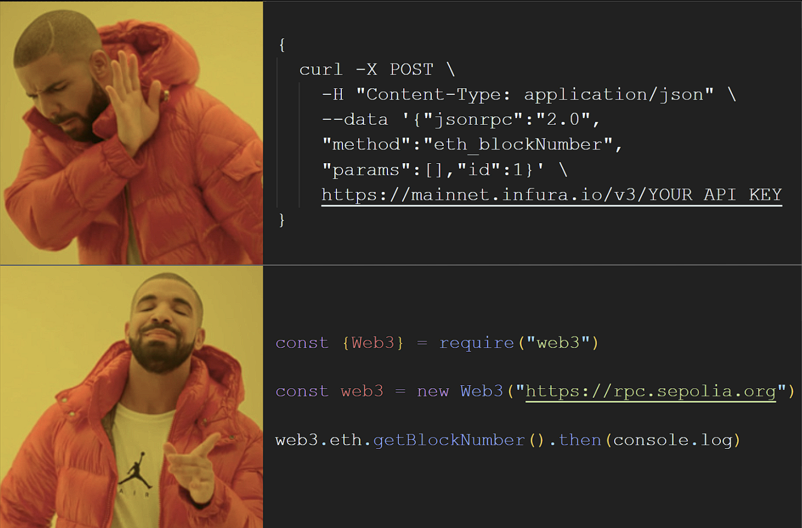
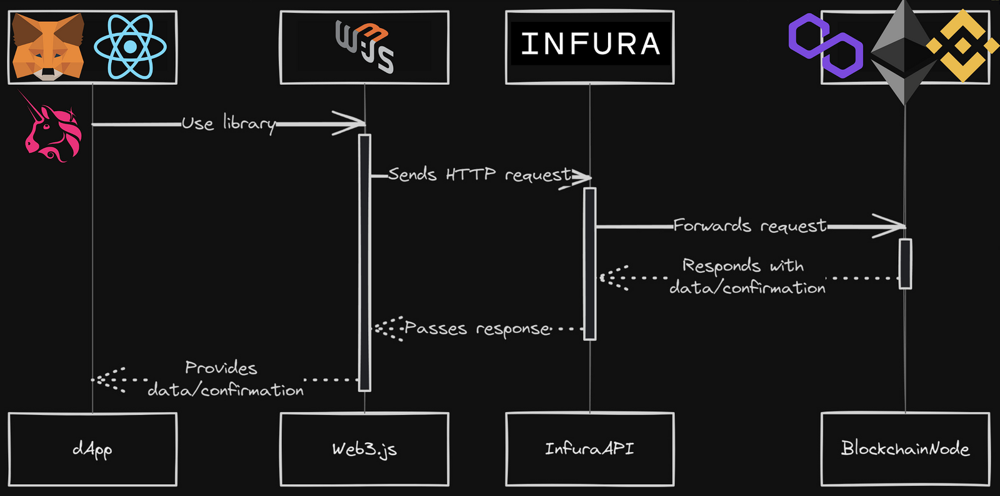
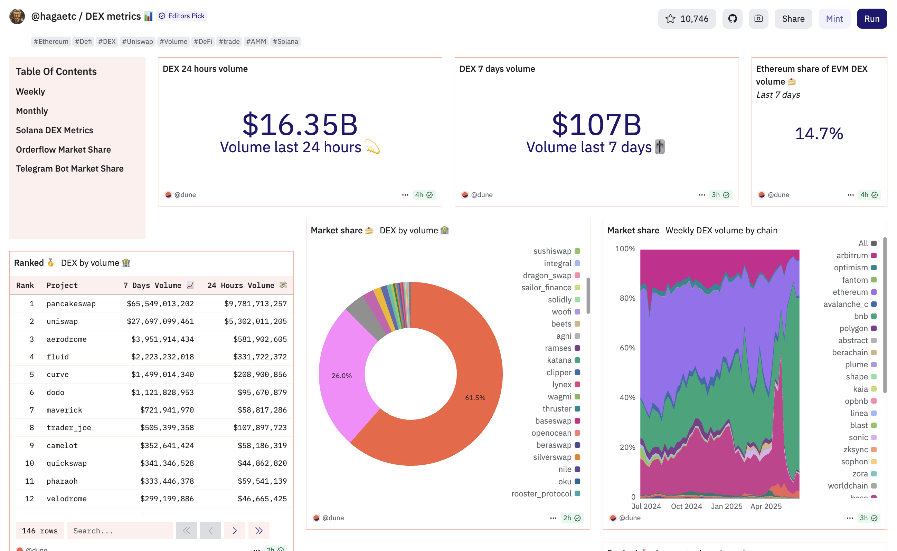
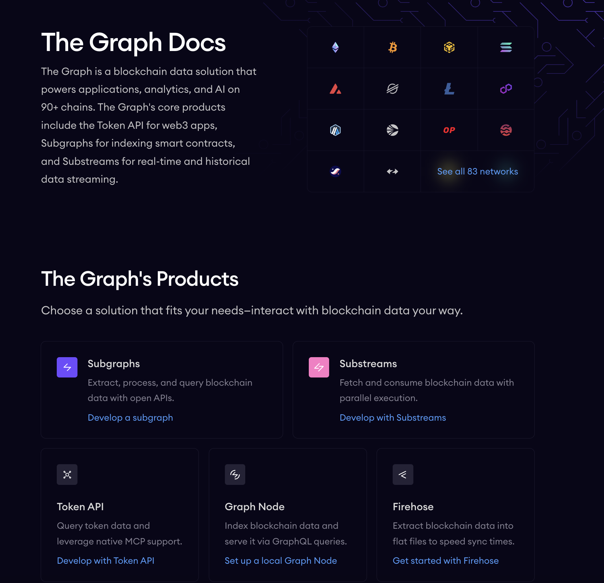

# مقدمه‌ای بر تعامل با قراردادهای هوشمند اتریوم

این راهنما توضیح می‌دهد که چگونه توسعه‌دهندگان با استفاده از کتابخانه‌های Web3 مانند Web3.js و Ethers.js با قراردادهای هوشمند اتریوم تعامل دارند. همچنین اجزای مهمی مانند نودهای اتریوم و رابط دودویی برنامه (ABI) را پوشش می‌دهد.

---

## نقش کتابخانه‌های Web3 (Web3.js و Ethers.js)

کتابخانه‌های Web3 ابزارهایی ضروری برای توسعه‌دهندگانی هستند که برنامه‌های غیرمتمرکز (dApp) می‌سازند و می‌خواهند از محیط‌های وب با بلاکچین اتریوم تعامل کنند.

### هدف و عملکرد

- به‌عنوان **پل ارتباطی** بین برنامه‌های وب و شبکه اتریوم عمل می‌کنند.
- امکان انجام عملیات کلیدی مانند:
  - ارسال و دریافت رمزارز
  - استقرار قراردادهای هوشمند جدید
  - تعامل با قراردادهای موجود (خواندن/نوشتن داده)
- ارتباط سطح پایین با نودهای اتریوم (JSON-RPC) را انتزاع می‌کنند.
- تعامل با بلاکچین را برای توسعه‌دهندگان سنتی وب ساده می‌کنند.

### اهمیت

- کاهش موانع فنی
- تسریع نوآوری
- تسهیل پذیرش گسترده فناوری‌های غیرمتمرکز

---

## درک کتابخانه‌های Web3

توسعه‌دهندگان اتریوم معمولاً بین دو کتابخانه جاوااسکریپت انتخاب می‌کنند: **Web3.js** و **Ethers.js**

### Web3.js: درگاه قدیمی

- ابزار باسابقه در توسعه اتریوم
- ارائه مجموعه قابلیت‌های جامع (مانند چاقوی سوئیسی)
- پشتیبانی‌شده توسط جامعه‌ای گسترده
- امکان اتصال به شبکه‌های مختلف بلاکچینی (نه فقط اتریوم)
- استفاده از API مبتنی بر **callback** که ممکن است منجر به کدهای تودرتوی پیچیده شود
- تبدیل خودکار اعداد بزرگ به انواع عددی جاوااسکریپت که ممکن است باعث **از دست دادن دقت** شود

### Ethers.js: جایگزین مدرن

- طراحی‌شده برای **سادگی و دقت**
- استفاده از API مبتنی بر **Promise** که کدی تمیزتر و قابل‌خواندن‌تر ایجاد می‌کند
- دارای پیاده‌سازی سفارشی از **BigNumber** برای مدیریت صحیح اعداد بزرگ
- پشتیبانی بهتر از کیف‌پول‌ها و فرآیندهای احراز هویت
- ماژولار و سبک؛ مناسب برای سازگاری چند زنجیره‌ای
- در حال محبوب شدن در بین توسعه‌دهندگان جدید اتریوم

### Web3.js در برابر Ethers.js: مقایسه ویژگی‌ها

| ویژگی                    | Web3.js                                         | Ethers.js                                       |
|--------------------------|--------------------------------------------------|--------------------------------------------------|
| فلسفه طراحی              | جامع و چندمنظوره                                | سبک و کاربرپسند                                 |
| طراحی API                | مبتنی بر callback (ریسک پیچیدگی بالا)          | مبتنی بر Promise (کدی تمیز و قابل‌خواندن)       |
| مدیریت اعداد بزرگ        | تبدیل به اعداد جاوااسکریپت (ریسک کاهش دقت)     | استفاده از BigNumber سفارشی با دقت بالا         |
| پشتیبانی جامعه           | بزرگ و باسابقه                                  | فعال و رو به رشد                                 |
| اندازه باندل             | بزرگ‌تر                                         | کوچک‌تر و بهینه‌تر                               |
| پشتیبانی از کیف‌پول      | گسترده و چندشبکه‌ای                            | ادغام بهتر با احراز هویت و کیف‌پول‌ها            |
| بلوغ                     | قدیمی و آزموده‌شده                              | مدرن و در حال پذیرش                              |
| سازگاری چند زنجیره‌ای    | متمرکز بر اتریوم ولی منعطف                      | طراحی ماژولار برای پشتیبانی بهتر از چند زنجیره  |

**نتیجه‌گیری:**  
Web3.js بلوغ و گستردگی دارد، در حالی که Ethers.js دقت، ماژولار بودن، و تجربه کاربری مدرن‌تری ارائه می‌دهد. انتخاب بین این دو به نیاز پروژه و ترجیح توسعه‌دهنده بستگی دارد.

---

## اجزای ضروری برای تعامل با قرارداد هوشمند

تعامل موفق با قراردادهای هوشمند نیازمند درک دو مؤلفه پایه‌ای است: **نودهای اتریوم** و **ABI**

### نودهای اتریوم: ستون فقرات شبکه

اتریوم بر اساس شبکه‌ای همتابه‌همتا (P2P) از **نودها** بنا شده که کلاینت‌های اتریوم را اجرا می‌کنند.

#### وظایف نودها

- ذخیره نسخه کامل یا جزئی از بلاکچین اتریوم
- اعتبارسنجی بلاک‌ها و تراکنش‌ها بر اساس پروتکل
- انتشار داده‌های شبکه (بلاک‌ها، تراکنش‌ها) به همتایان
- اجرای قراردادهای هوشمند و بررسی نتایج آن‌ها
- مشارکت در اجماع (مانند اثبات سهام)

کتابخانه‌های Web3 به این نودها متصل می‌شوند — یا به‌صورت:

- **محلی** (اجرای نود شخصی)، یا
- **راه‌دور** (استفاده از سرویس‌هایی مانند Infura، Alchemy یا QuickNode)

**بدون نودها، شبکه اتریوم و dAppها کار نخواهند کرد.**

---

### رابط دودویی برنامه (ABI): زبان قرارداد

**ABI** روشی ساختاریافته برای درک و تعامل برنامه با قرارداد هوشمند است.

#### مرور کلی ABI

- ساختاری با فرمت **JSON** که شامل:
  - توابع قرارداد و نام آن‌ها
  - نوع ورودی‌ها و خروجی‌ها
  - قابلیت تغییر وضعیت (مثلاً `view` یا `payable`)
  - تعریف رخدادها

- هنگام کامپایل قرارداد (مثلاً از Solidity یا Vyper) تولید می‌شود.

- استفاده در کتابخانه‌های Web3 برای:
  - رمزگذاری فراخوانی توابع
  - رمزگشایی داده‌های برگشتی
  - گوش‌دادن به رویدادها

#### فیلدهای کلیدی ABI

هر ورودی ABI شامل موارد زیر است:

- `name`: نام تابع یا رویداد
- `inputs`: نوع و نام پارامترهای ورودی
- `outputs`: نوع و نام داده‌های خروجی
- `stateMutability`: آیا تابع وضعیت را تغییر می‌دهد؟ (مثل `view`، `payable`)
- `type`: مشخص‌کننده نوع (تابع، سازنده، بازگشتی، رویداد)

#### چرا ABI مهم است؟

- امکان تعامل **استاندارد** و **قابل همکاری** با قرارداد را فراهم می‌کند.
- به dAppها اجازه می‌دهد بدون نیاز به کد منبع، با قرارداد کار کنند.
- رمزگذاری و رمزگشایی داده‌ها را دقیق و امن می‌سازد.

#### خلاصه

تعامل با قراردادهای هوشمند در اتریوم وابسته است به:

1. **کتابخانه‌های Web3** (Web3.js یا Ethers.js):  
   - اتصال بین فرانت‌اند و بلاکچین را ممکن می‌سازد.  
   - APIهایی مناسب توسعه‌دهندگان فراهم می‌کنند.

2. **نودهای اتریوم**:  
   - قراردادها را اجرا و اعتبارسنجی می‌کنند.  
   - داده‌های بلاکچین را ذخیره و منتشر می‌کنند.

3. **رابط دودویی برنامه (ABI)**:  
   - بین توابع قابل‌خواندن انسانی و بایت‌کد بلاکچین ترجمه می‌کند.

این سه مؤلفه، پایه توسعه برنامه‌های غیرمتمرکز روی اتریوم هستند.

---

#### مثال ساده

~~~~solidity
[ { "inputs": [], "name": "retrieve", "outputs": [ { "internalType": "uint256", "name": "", "type": "uint256" } ], "stateMutability": "view", "type": "function" }, 
{ "inputs": [ { "internalType": "uint256", "name": "num", "type": "uint256" } ], "name": "store", "outputs": [], "stateMutability": "nonpayable", "type": "function" } ]
~~~~

---

# فرآیند تعامل: نمایی کلی

تعامل با قرارداد هوشمند اتریوم از طریق یک برنامه وب، شامل مراحل ساختارمند زیر است:

## اتصال به یک نود اتریوم (Providers)

- اولین مرحله، برقراری ارتباط با یک نود اتریوم است.

- این ارتباط معمولاً از طریق **Provider** برقرار می‌شود که ارتباط بین برنامه و بلاکچین را ممکن می‌سازد.
- Providerها دسترسی **فقط‌خواندنی** به داده‌ها و وضعیت زنجیره ارائه می‌دهند.
- Providerهای رایج شامل نقاط دسترسی RPC عمومی از سرویس‌هایی مانند: **Infura**، **Alchemy**، **QuickNode**، یا بلاکچین‌های محلی مثل **Ganache** هستند.
- یک **کتابخانه Web3** (مانند Web3.js یا Ethers.js) با این provider مقداردهی اولیه می‌شود تا درخواست‌ها را به شبکه اتریوم ارسال کند.

- این اتصال اجازه می‌دهد برنامه بتواند: **اطلاعات شبکه را دریافت کند**، **تراکنش ارسال کند**، **با قرارداد تعامل کند**

---

## نمونه‌سازی قرارداد هوشمند

- پس از اتصال به نود اتریوم، یک نسخه جاوااسکریپتی از قرارداد را در برنامه خود می‌سازید.

- این کار با استفاده از تابع نمونه‌سازی قرارداد در کتابخانه Web3 انجام می‌شود: `web3.eth.Contract()` در Web3.js و `new ethers.Contract()` در Ethers.js

- این تابع معمولاً به دو اطلاعات کلیدی نیاز دارد:
  1. **ABI قرارداد**: نقشه تعامل با قرارداد.
  2. **آدرس قرارداد**: شناسه منحصربه‌فرد قرارداد مستقرشده روی بلاکچین.

- پس از نمونه‌سازی، این **شیء قرارداد** به عنوان رابط اصلی برای فراخوانی توابع قرارداد عمل می‌کند.

---

## فراخوانی توابع خواندنی (بدون تراکنش)

- تعامل با توابع **فقط‌خواندنی** ساده است و نیاز به ارسال تراکنش ندارد.

- این توابع (که معمولاً با `view` یا `pure` در Solidity مشخص می‌شوند) داده‌ها را بازیابی یا محاسبه می‌کنند **بدون تغییر وضعیت بلاکچین**
- برای فراخوانی:
  - از `methods` شیء قرارداد استفاده کن
  - نام تابع را فراخوانی کن
  - از متد `.call()` استفاده کن

- مثال‌ها:
  - بازیابی کل عرضه یک توکن  
  - بررسی موجودی توکن یک حساب

- این فراخوانی‌ها: **نیاز به گس ندارند**، **رایگان هستند**، **برای نمایش داده‌های زنده ایده‌آل‌اند**

---

## فراخوانی توابع نوشتنی (نیاز به تراکنش و گس)

- فراخوانی توابعی که وضعیت بلاکچین را **تغییر می‌دهند** (مثلاً انتقال توکن) نیاز به:
  - ساختن **تراکنش**
  - پرداخت **کارمزد گس**

- روند کلی:
  1. **ساخت شیء تراکنش**:
     - شامل:
       - `nonce`
       - `gasLimit`
       - `gasPrice`
       - `to` (آدرس قرارداد)
       - `data` (فراخوانی تابع رمزگذاری‌شده با آرگومان‌ها)

  2. **امضای تراکنش**:
     - با **کلید خصوصی فرستنده** امضا می‌شود
     - مالکیت و صحت تراکنش را تضمین می‌کند
     - کیف‌پول‌هایی مثل **MetaMask** معمولاً این مرحله را انجام می‌دهند

  3. **ارسال تراکنش امضاشده**:
     - از طریق کتابخانه Web3 به شبکه ارسال می‌شود
     - سپس به اعتبارسنج‌ها یا ماینرها ارسال می‌شود تا وارد بلاک شود

---

## امضای دیجیتال و ارسال تراکنش

- **امضای دیجیتال** پایه رمزنگاری امنیت در اتریوم است.

### مفاهیم کلیدی:

- هر حساب خارجی (EOA) دارای:
  - یک **کلید خصوصی** (مخفی)
  - یک **کلید عمومی** (برای تولید آدرس اتریوم)

- هنگام آغاز تراکنش:
  - **کلید خصوصی** فرستنده یک **امضای دیجیتال یکتا** تولید می‌کند
  - معمولاً با الگوریتم **ECDSA** (منحنی بیضوی)

### ویژگی‌های امضا:

- **احراز هویت** فرستنده
- تضمین **صحت داده**
- ایجاد **غیرقابل‌انکار بودن** (فرستنده نمی‌تواند انکار کند)

### فرآیند تأیید:

- تراکنش امضاشده به شبکه اتریوم **ارسال** می‌شود
- اعتبارسنج‌ها امضا را با آدرس عمومی فرستنده **بررسی** می‌کنند
- اگر معتبر باشد، تراکنش **وارد بلاکچین** می‌شود

این سازوکار تضمین می‌کند که:

- فقط مالک واقعی می‌تواند تراکنش ارسال کند
- همه عملیات‌ها **ایمن**، **قابل‌تأیید** و **دست‌نخورده** هستند

---

# نمایه‌سازی تراکنش‌ها

## مقدمه

**سرویس‌های نمایه‌سازی تراکنش‌ها** داده‌های خام بلاکچین اتریوم را به قالب‌های ساخت‌یافته و قابل جست‌وجو تبدیل می‌کنند، که این داده‌ها را برای برنامه‌های غیرمتمرکز (dApps) قابل استفاده و دسترسی می‌سازند.

دسترسی مستقیم به داده‌های بلاکچین به دلایل زیر دشوار است:

- حجم عظیم داده‌ها  
- ذخیره‌سازی سطح پایین و ترتیبی داده‌ها  
- منابع زیاد مورد نیاز برای اجرای یک نود کامل اتریوم  

نمایه‌سازی این مشکلات را از طریق موارد زیر حل می‌کند:

- کاهش زمان بازیابی داده  
- افزایش مقیاس‌پذیری برای dApps  
- فرمت‌های داده کاربرپسند برای توسعه‌دهندگان  
- بهبود تجربه کاربری  
- افزایش شفافیت  

با این حال، راحتی **سرویس‌های نمایه‌سازی متمرکز** باعث پذیرش گسترده آن‌ها شده که ریسک‌های تمرکز را به طور پنهان وارد اکوسیستم Web3 می‌کند.

**قابلیت‌های پیشرفته نمایه‌سازی** امکان ساخت برنامه‌های پیچیده‌تر و غنی‌تر از نظر داده را فراهم می‌کنند و فضای طراحی را برای توسعه‌دهندگان Web3 گسترش می‌دهند.

---

## وضعیت فعلی خدمات نمایه‌سازی اتریوم

### ارائه‌دهندگان API متمرکز

#### Infura

- دسترسی با توان بالا به شبکه‌های اتریوم و لایه دوم  
- ویژگی‌ها: API گس، دسترسی به نود آرشیو  
- قیمت‌گذاری: مدل مبتنی بر اعتبار  

#### Alchemy

- زیرساخت مقیاس‌پذیر با APIهای پیشرفته:  
  - ساخت  
  - پایش  
  - اعلان  
- پشتیبانی از چندین شبکه  
- قیمت‌گذاری: مدل "واحد محاسباتی"

#### Etherscan

- عمدتاً یک مرورگر بلاکچین  
- ارائه API برای:  
  - رویدادهای انتقال توکن  
  - موجودی حساب  
  - وضعیت تراکنش‌ها  
- محدودیت‌هایی در تعداد رکوردهای پرس‌وجو

#### QuickNode

- دسترسی سریع به API JSON-RPC در شبکه‌های متعدد  
- ابزارها:  
  - WebHooks  
  - APIهای NFT و ERC20  

#### Space and Time (SXT)

- نمایه‌سازی اتریوم از بلوک پیدایش  
- پشتیبانی از:  
  - SQL استاندارد  
  - پرس‌وجوهای زبان طبیعی  
  - داده‌های اثبات‌شده با ZK برای قابلیت تأیید  

#### Dune

- ارائه SQL برای پرس‌وجو و داده‌های لحظه‌ای  

## Dune

### عملکرد اصلی

**Dune** به کاربران اجازه می‌دهد پرس‌وجوهای SQL بنویسند تا داده‌های خاصی از بلاکچین استخراج کرده و به داشبوردهای تصویری تبدیل کنند.

موارد استفاده شامل:

- پیگیری حجم تراکنش‌ها  
- پایش فعالیت کیف پول  
- تحلیل عملکرد پروتکل‌ها  

### ویژگی‌های کلیدی

- **پرس‌وجوی SQL**: ویرایشگر پیشرفته برای تحلیل دقیق  
- **داشبوردها**: داشبوردهای اختصاصی و اشتراکی  
- **داده لحظه‌ای**: داده به‌روزرسانی‌شده برای تحلیل  
- **قابلیت‌های هوش مصنوعی**:  
  - Dune AI  
  - دستیار AI برای کمک در پرس‌وجو (ممکن است خطا داشته باشد)  
- **بارگذاری داده‌ها**: ادغام مجموعه داده‌های دلخواه  
- **رمزگشایی قرارداد**: ابزارهایی برای تحلیل قراردادهای هوشمند  

### فناوری زیرساختی

- موتور پرس‌وجو از پرس‌وجوهای تعاملی روی داده‌هایی از گیگابایت تا پتابایت پشتیبانی می‌کند  
- مبتنی بر **DuneSQL**، نسخه اصلاح‌شده‌ای از **TrinoSQL** برای تحلیل بلاکچین  

### نوع داده‌های پشتیبانی‌شده در DuneSQL

- `VARBINARY`: مناسب برای آدرس‌ها، هش‌ها، calldata، لاگ‌ها  
- `UINT256` و `INT256`: برای داده‌های عددی بزرگ بلاکچینی  
- انواع استاندارد SQL:  
  - `BOOLEAN`, `TINYINT`, `SMALLINT`, `INTEGER`, `BIGINT`  
  - `DECIMAL`, `VARCHAR`, `TIMESTAMP`, `DATE`, `TIME`, `INTERVAL`  

### موارد استفاده

- **تحلیل سرمایه‌گذاری**: پیگیری پورتفولیو، قیمت‌های تاریخی  
- **تحقیقات بازار**: روندهای تراکنش و رفتار کاربران  
- **ارزیابی پروژه**: معیارهای عملکرد dApp  
- **درگیرسازی جامعه**: توزیع توکن، تحلیل کاربران  

### جنبه تمرکز

اگرچه Dune با داشبوردها و پرس‌وجوهای تولیدشده توسط کاربران قدرت تحلیل غیرمتمرکز را فراهم می‌کند، اما پلتفرم اصلی در پردازش و ورودی داده **متمرکز** باقی می‌ماند، یعنی:

- زیرساخت به‌صورت متمرکز مدیریت می‌شود  
- کاربران به بک‌اند Dune برای در دسترس بودن و صحت داده‌ها وابسته‌اند  

## مزایا

- پرس‌وجوهای پرسرعت  
- زیرساخت کاملاً مدیریت‌شده  
- سربار عملیاتی کم  
- آپ‌تایم بالا  
- ابزارهای قدرتمند بصری و تحلیلی  

## محدودیت‌ها

- نقاط شکست احتمالی  
- نگرانی از سانسور  
- محدودیت نرخ در پلن‌های رایگان/پایین  
- هزینه بالا در مقیاس وسیع  

---

## پروتکل‌های نمایه‌سازی غیرمتمرکز

### The Graph

- سازماندهی داده‌های بلاکچین در قالب **ساب‌گراف**  
- قابل پرس‌وجو با **GraphQL**  
- نقش‌های اکوسیستم:  
  - **ایندکسرها**  
  - **منتخب‌کنندگان (Curators)**  
  - **واگذارکنندگان (Delegators)**  
- استفاده از توکن **GRT** برای سهام‌گذاری و مشوق اقتصادی  

### SubQuery Network

- پروتکل نمایه‌سازی غیرمتمرکز Web3  
- پشتیبانی از تقریباً **۳۰۰ بلاکچین**  
- API داده یکپارچه Web3  
- طراحی شده برای **سرعت**، **انعطاف‌پذیری** و **سازگاری چندزنجیره‌ای**  

### TrueBlocks

- رویکرد نمایه‌سازی **اول محلی**  
- نمایه‌ساز به طور کامل قابل کش کردن در دستگاه محلی  
- مزایا:  
  - حفظ حریم خصوصی بیشتر  
  - دسترسی سریع  
  - پشتیبانی چندزنجیره‌ای  
  - بدون محدودیت نرخ یا هزینه اشتراک  

## مزایای نمایه‌سازی غیرمتمرکز

- هیچ نهاد واحدی کنترل دسترسی به داده ندارد  
- شفافیت و مقاومت در برابر سانسور بیشتر  
- رشد و نوآوری مبتنی بر جامعه  
- پتانسیل هزینه کمتر در بلندمدت  

## چالش‌های نمایه‌سازی غیرمتمرکز

- نیاز به پیکربندی و تنظیمات پیچیده‌تر  
- اغلب فاقد ابزارهای توسعه‌دهنده و سادگی موجود در پلتفرم‌های متمرکز  
- عملکرد و قابلیت اطمینان وابسته به مدل‌های اقتصادی مبتنی بر توکن  

---

## مقایسه: نمایه‌سازی متمرکز در برابر غیرمتمرکز

| ویژگی                        | ارائه‌دهندگان متمرکز        | پروتکل‌های غیرمتمرکز       |
|-----------------------------|------------------------------|-----------------------------|
| **سرعت و راحتی**            | ✅ بالا                      | ⚠️ متغیر                     |
| **سهولت یکپارچه‌سازی**      | ✅ بسیار آسان               | ⚠️ نیاز به راه‌اندازی فنی   |
| **مقاومت در برابر سانسور**  | ⚠️ محدود                    | ✅ قوی                      |
| **شفافیت**                  | ⚠️ محدود                    | ✅ کامل                    |
| **یکپارچگی داده**           | ⚠️ وابسته به ارائه‌دهنده   | ✅ قابل تأیید               |
| **هزینه در بلندمدت**        | ⚠️ احتمالاً بالا             | ✅ معمولاً پایدارتر         |

---

## رویکردهای ترکیبی

برخی پلتفرم‌ها در حال بررسی **مدل‌های ترکیبی نمایه‌سازی** هستند که مزایای سیستم‌های متمرکز و غیرمتمرکز را با هم ترکیب می‌کنند.

- **مثال**: شبکه زیرساخت غیرمتمرکز Infura (DIN)  
- **هدف**: ارائه دسترسی‌پذیری بالا و عملکرد خوب همراه با تضمین‌های تمرکززدایی  

---

## افکار پایانی

نمایه‌سازی برای آزادسازی پتانسیل کامل برنامه‌های مبتنی بر بلاکچین ضروری است. در حالی که سرویس‌های متمرکز راحتی و سرعت را ارائه می‌دهند، پروتکل‌های نمایه‌سازی غیرمتمرکز بیشتر با ارزش‌های Web3 همچون **شفافیت**، **تاب‌آوری** و **دسترسی بدون نیاز به مجوز** هم‌راستا هستند.

برای توسعه حرفه‌ای Web3، درک و انتخاب راه‌حل مناسب نمایه‌سازی — متمرکز، غیرمتمرکز، یا ترکیبی — بسیار حیاتی است.

---

# مقدمه‌ای بر The Graph

The Graph یک پروتکل نمایه‌سازی برای پرس‌وجوی شبکه‌هایی مانند اتریوم و IPFS است. هر کسی می‌تواند APIهای باز با نام **ساب‌گراف** بسازد و منتشر کند تا داده‌ها به‌راحتی در دسترس باشند.

🔗 ببین [The Graph Academy](https://thegraph.academy)

---

## Graph Explorer

راهی ساده برای کاوش داده‌ها  
**ببین [Explorer](https://thegraph.com/explorer)**

---

## مقایسه

- **ارائه‌دهندگان متمرکز**  
  - ✅ راحتی و سرعت  
  - ✅ مناسب برای نمونه‌سازی سریع  
  - ❌ شفافیت محدود  
  - ❌ ریسک سانسور یا قطعی  

- **پروتکل‌های غیرمتمرکز**  
  - ✅ اولویت با مقاومت در برابر سانسور  
  - ✅ شفاف و قابل تأیید  
  - ✅ ایده‌آل برای dAppهایی با نیاز به یکپارچگی داده  
  - ❌ ممکن است عملکرد کندتری نسبت به سیستم‌های متمرکز داشته باشند  

- **مدل‌های ترکیبی**  
  - هدف ترکیب مزایای سیستم‌های متمرکز و غیرمتمرکز  
  - مثال: شبکه زیرساخت غیرمتمرکز Infura (DIN)  

---

# تعامل با خدمات نمایه‌سازی اتریوم

## درک لاگ‌های رویداد

- قراردادهای هوشمند **رویدادها** را به عنوان لاگ‌های تغییرناپذیر صادر می‌کنند تا اقدامات مهم در زنجیره را ثبت کنند. این لاگ‌ها شامل موارد زیر هستند:  
  - **نام رویداد**  
  - **آدرس قرارداد**  
  - **داده‌های ایندکس‌شده و نشده**  
- تا **۳ پارامتر ایندکس‌شده** برای رویدادهای غیر ناشناس مجاز است. این فیلدهای ایندکس‌شده **هش** شده و در **فیلتر بلوم (Bloom Filter)** گنجانده می‌شوند تا نودها و کلاینت‌ها به‌طور مؤثر فیلتر کنند.  
- **نوع‌های پویا** (مثل رشته‌ها یا آرایه‌ها) در هنگام ایندکس شدن هش می‌شوند، بنابراین مقدار خوانا از بین می‌رود. برای حفظ خوانایی:  
  - آن‌ها را **به‌صورت پارامترهای غیر ایندکس‌شده** دوباره درج کنید  
  - این درج دوگانه، هم **بازده فیلتر کردن** و هم **وضوح داده** را حفظ می‌کند  

---

# پرس‌وجو با Ethers.js

کتابخانه Ethers.js عملیات‌های فقط‌خواندنی (با استفاده از `Provider`) را از عملیات‌های نوشتنی (با استفاده از `Signer`) جدا می‌کند. برای پرس‌وجوی داده‌های رویدادی تاریخی از بلاکچین، از `JsonRpcProvider` استفاده کنید تا به یک نود (محلی یا سرویس‌هایی مانند Infura) متصل شوید.

می‌توانید از متد `contract.queryFilter()` به همراه فیلترهای رویداد استفاده کنید تا لاگ‌های خاصی را بازیابی کنید.

---

# پرس‌وجو با Web3.js

Web3.js یکی دیگر از کتابخانه‌های محبوب توسعه dApp است که امکانات مشابهی برای پرس‌وجوی رویدادهای گذشته فراهم می‌کند.

می‌توانید از یکی از این دو استفاده کنید:  
- `web3.eth.getPastLogs()` — برای داده‌های خام لاگ  
- `contract.getPastEvents()` — برای داده‌های رمزگشایی‌شده رویداد  

این متدها امکان فیلتر کردن بر اساس تاپیک‌ها یا پارامترهای ایندکس‌شده را فراهم می‌کنند.

---

## استفاده از GraphQL در The Graph

**The Graph** داده‌های بلاکچین را در قالب **ساب‌گراف‌ها** نمایه‌سازی و ساختاردهی می‌کند، که با **GraphQL** قابل پرس‌وجو هستند.

### مراحل کاری:

1. تعریف **entityها** (مدل‌های داده) در یک schema GraphQL  
2. ساخت **handlerهای نگاشت** در AssemblyScript برای واکنش به رویدادهای قرارداد  
3. استقرار در **Subgraph Studio**  
4. انتشار اختیاری در **شبکه غیرمتمرکز Graph** (نیاز به سهام‌گذاری GRT)  

---

## سرویس‌های مبتنی بر SQL

پلتفرم‌هایی مانند **Space and Time (SxT)** و **Dune Analytics** واسط‌های **SQL** برای داده‌های بلاکچین ارائه می‌دهند.

### مزایا:

- روش پرس‌وجوی آشنا برای تحلیل‌گران داده و توسعه‌دهندگان  
- پشتیبانی از **نوع داده‌های خاص بلاکچین**:  
  - `UINT256`, `VARBINARY`, و غیره  
- مناسب برای:  
  - تحلیل تاریخی  
  - تجمیع داده  
  - نمایش روندها  

### چالش‌های لایه انتزاع

اگرچه خدمات نمایه‌سازی دسترسی به داده‌های پیچیده زنجیره‌ای را ساده می‌کنند، اما **لایه‌های انتزاعی جدیدی** نیز معرفی می‌کنند:

- توسعه‌دهندگان باید با موارد خاص هر پلتفرم آشنا شوند:  
  - **schemaهای GraphQL** (در The Graph)  
  - **گویش‌های SQL و نوع داده‌ها** (در Dune، SxT)  
  - **SDKها و مدل‌های پرس‌وجو**  

این نیازمند یادگیری و ابزارهای اضافی است.

### نگاشت نوع داده

نگاشت صحیح **نوع داده‌های Solidity** به معادل‌های سرویس‌های نمایه‌سازی برای جلوگیری از تفسیر اشتباه بسیار **حیاتی** است.

#### مثال‌های رایج:

| نوع Solidity  | نوع در The Graph         | نوع در Dune             |
|---------------|---------------------------|--------------------------|
| `uint256`     | `BigInt`                  | `UINT256`                |
| `address`     | `Bytes`                   | `VARBINARY(20)`          |
| `bool`        | `Boolean`                 | `BOOLEAN`                |
| `string`      | `String`                  | `VARCHAR`                |

عدم نگاشت دقیق می‌تواند منجر به موارد زیر شود:

- خطاهای پرس‌وجو  
- مشکلات تبدیل نوع داده  
- نتایج گمراه‌کننده در تحلیل‌ها  

