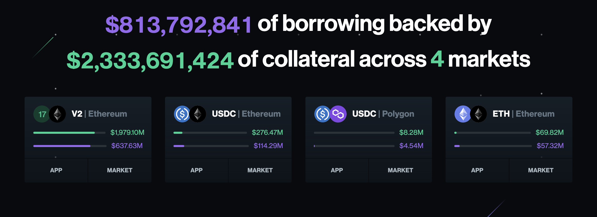

# دیفای: یک مقدمه کامل

## نمای کلی

**مالی غیرمتمرکز (DeFi)** یک اکوسیستم مالی است که بر پایه فناوری‌های بلاک‌چین (در درجه اول اتریوم) ساخته شده و جایگزینی بی‌نیاز از مجوز، شفاف و بدون نیاز به اعتماد برای خدمات مالی سنتی ارائه می‌دهد.

### حوزه‌های اصلی DeFi

- **صرافی‌ها**
- **مدیریت دارایی**
- **استیبل‌کوین‌ها**
- **وام‌دهی / وام‌گیری**
- **انتقال وجه**

---

## صرافی‌های غیرمتمرکز (DEXها)

**صرافی‌های غیرمتمرکز** به کاربران امکان می‌دهند توکن‌ها را بدون تکیه بر پلتفرم‌های متمرکز معامله کنند. این سیستم‌ها نیاز به نگهداری واسطه‌ای را حذف می‌کنند و تضمین می‌کنند که کاربران همیشه کنترل دارایی‌های خود را حفظ کنند.

### مزایا

- لیست شدن توکن‌ها بدون نیاز به مجوز
- شفافیت و کنترل بیشتر
- کاهش ریسک تمرکز

---

## تاریخچه صرافی‌های غیرمتمرکز

### صرافی‌های اولیه – پروتکل 0x

**پروتکل 0x** انتقال سفارش‌ها به‌صورت خارج از زنجیره و تسویه حساب روی زنجیره را معرفی کرد.

#### فرایند:

1. سازنده (Maker) اجازه دسترسی به توکن A را به قرارداد DEX می‌دهد.
2. سازنده سفارشی برای مبادله توکن A با توکن B ایجاد و امضا می‌کند.
3. سفارش امضا شده از طریق هر رسانه‌ای منتشر می‌شود (مثلاً یک دفتر سفارش عمومی).
4. گیرنده (Taker) سفارش را پیدا کرده و تصمیم می‌گیرد آن را اجرا کند.
5. گیرنده اجازه استفاده از توکن B را به قرارداد DEX می‌دهد.
6. گیرنده سفارش امضا شده را به قرارداد DEX ارسال می‌کند.
7. قرارداد:
   - امضای سازنده را تأیید می‌کند
   - اعتبار سفارش را بررسی می‌کند (منقضی نشده یا پر نشده)
   - مبادله توکن‌ها را با نرخ توافق‌شده انجام می‌دهد

### یونی‌سواپ

- برگرفته از ایده‌های **ویتالیک بوترین**، **نیک جانسون** و **مارتین کوپلمن** در سال ۲۰۱۶  
- توسط **هیدن آدامز** در **نوامبر ۲۰۱۸** پیاده‌سازی و راه‌اندازی شد  
- معرفی **بازارسازهای خودکار (AMM)** برای حل مشکل انگیزه نقدینگی  

---

## بازارسازهای خودکار (AMM)

AMMها قراردادهای هوشمندی هستند که تبادل توکن‌ها را از طریق استخرهای نقدینگی به جای دفاتر سفارش انجام می‌دهند.

### نحوه عملکرد

- کاربران جفت توکن‌ها (مثلاً ETH و USDT) را به یک **استخر نقدینگی** واریز می‌کنند
- این استخرها امکان تبادل، وام‌دهی یا وام‌گیری توکن‌ها را فراهم می‌کنند
- معامله‌گران **کارمزد** پرداخت می‌کنند که بین **تأمین‌کنندگان نقدینگی (LPها)** تقسیم می‌شود

### بازارسازهای تابع ثابت (CFMM)

- معاملات باید حاصل ضرب موجودی توکن‌ها را ثابت نگه دارند:

  `X * Y = K`

  که در آن:
  - `X` = موجودی توکن A  
  - `Y` = موجودی توکن B  
  - `K` = عدد ثابت

این مدل که به **مدل XYK** معروف است، نسبت بین دو توکن در استخر را حفظ می‌کند. با هر مبادله، مقادیر `X` و `Y` تغییر می‌کنند، اما حاصل ضرب آن‌ها (`K`) ثابت می‌ماند، و این‌گونه قیمت به‌صورت الگوریتمی تعیین می‌شود.

---

## توکن‌های LP

وقتی کاربران نقدینگی فراهم می‌کنند:

- توکن‌هایی به نام **توکن‌های LP** دریافت می‌کنند که نشان‌دهنده سهم آن‌ها از استخر است  
- آن‌ها می‌توانند این توکن‌ها را برای دریافت توکن‌های اصلی به‌علاوه کارمزدهای کسب‌شده بازخرید کنند

### نکات درباره توکن‌های LP

- **Uniswap نسخه 1 و 2**: توکن‌های LP از نوع استاندارد ERC-20 هستند  
- **Uniswap نسخه 3**: موقعیت‌های LP به‌صورت NFT ارائه می‌شوند چون شامل بازه‌های قیمتی سفارشی هستند

---

## تأثیر قیمت، اسلیپیج و ضرر ناپایدار

### تأثیر قیمت

هر معامله روی قیمت توکن‌ها در استخر تأثیر می‌گذارد. معاملات بزرگ می‌توانند قیمت‌ها را به‌طور قابل توجهی تغییر دهند.

### اسلیپیج (Slippage)

تفاوت بین قیمت مورد انتظار و قیمت نهایی اجرا. عوامل آن:

- نوسانات بازار  
- رقابت سایر سفارش‌ها در زمان اجرا  

## ضرر ناپایدار (Impermanent Loss)

**ضرر ناپایدار** زمانی رخ می‌دهد که ارزش نسبی سهم شما از یک استخر نقدینگی **در زمان برداشت کمتر باشد** از ارزش توکن‌هایی که در ابتدا وارد استخر کردید، در صورتی که آن توکن‌ها را صرفاً نگه می‌داشتید.

یعنی هزینه فرصت ارائه نقدینگی به جای نگهداری ساده دارایی‌ها.

---

### سناریوی مثالی

- شما مقادیر برابر از توکن A و B را در یک استخر ۵۰/۵۰ واریز می‌کنید  
- قیمت توکن A به‌شدت افزایش می‌یابد، اما توکن B ثابت می‌ماند  
- الگوریتم استخر نسبت توکن‌ها را برای حفظ تعادل تغییر می‌دهد  
- هنگام برداشت، سهم شما شامل مقدار کمتری از توکن A و مقدار بیشتری از توکن B است  
- اگر توکن‌ها را نگه می‌داشتید، ارزش بیشتری داشتند  

این اختلاف همان **ضرر ناپایدار** است.

---

### راهکارهای کاهش ضرر ناپایدار

1. **استفاده از جفت‌های استیبل‌کوین**  
   - استخرهایی مثل USDC/DAI نوسان قیمتی کمتری دارند

2. **استفاده از Yield Farming**  
   - پاداش‌های دریافتی می‌تواند ضرر را جبران کند

3. **استفاده از نسبت‌های غیر ۵۰/۵۰ در استخرها**  
   - برخی AMMها (مثل Balancer) اجازه نسبت‌های سفارشی مثل ۸۰/۲۰ یا ۹۵/۵ را می‌دهند که می‌تواند ریسک ضرر را کاهش دهد

---

## ترکیب‌پذیری (Composability)

پروتکل‌های DeFi **ماژولار** و قابل تعامل‌اند — مثل "لگوهای مالی"

### مزایای کلیدی

- توسعه‌دهندگان می‌توانند با ترکیب پروتکل‌ها، محصولات پیچیده بسازند  
- تمام اپلیکیشن‌ها از ETH و توکن‌های ERC-20 پشتیبانی می‌کنند  
- نیاز به واسطه‌های ثالث وجود ندارد

### ریسک‌ها

- **ترکیب‌پذیری ریسک ترکیبی ایجاد می‌کند**: قراردادهای امن ممکن است در ترکیب با سایرین آسیب‌پذیر شوند  
- مثال: در **۱۲ مارس ۲۰۲۰**، قیمت ETH سقوط کرد، کارمزدها افزایش یافت و اوراکل‌های قیمتی عقب افتادند — باعث تصفیه گسترده و زنجیره‌ای در DeFi شدند

---

## وام‌دهی و وام‌گیری

### پروتکل Compound

**کامپاند نسخه ۳** یک پروتکل وام‌دهی سازگار با EVM است.

- کاربران می‌توانند **رمزارز خود را به‌عنوان وثیقه** ارائه دهند تا دارایی پایه وام بگیرند  
- یا می‌توانند **دارایی پایه** (مثلاً USDC) را عرضه کنند تا سود دریافت کنند  
- ابتدا بر روی **اتریوم** با **USDC** به‌عنوان دارایی پایه راه‌اندازی شد  

---

## Yield Farming

**ییلد فارمینگ** یعنی واریز توکن‌ها برای کسب پاداش یا سود.

### ویژگی‌ها

- کاربران نقدینگی فراهم می‌کنند و پاداش توکنی دریافت می‌کنند  
- استراتژی‌های پیشرفته برای بیشینه‌سازی سود بین پروتکل‌ها استفاده می‌شود  

### تاریخچه

- توسط **کامپاند** و **yearn.finance** معرفی شد  
- **ژوئن ۲۰۲۰**: معرفی توکن BAT ییلد فارمینگ را محبوب کرد  

---

## فلش‌لون‌ها (Flash Loans)

فلش‌لون‌ها اجازه می‌دهند **بدون وثیقه وام بگیرید**، مشروط بر اینکه:

- وام **در همان بلاک تراکنش بازپرداخت شود**  
- عدم بازپرداخت باعث بازگشت کل تراکنش می‌شود

### ویژگی‌های کلیدی

- **کارمزد پایین** (مثلاً ۰.۰۹٪)
- امکان **آربیتراژ**، **تعویض وثیقه**، **تأمین مالی مجدد**
- قدرتمند اما **فنی و گاهی آسیب‌پذیر**

### تشبیه

> تصور کنید در خط ۲ یک قرارداد هوشمند، موجودی شما ۵ واحد افزایش می‌یابد… اما اگر تا خط ۱۰ آن را برنگردانید، همه‌چیز لغو می‌شود.

---

# تجمیع‌کننده‌های DEX

## معرفی

**تجمیع‌کننده‌های DEX** پروتکل‌هایی هستند که نقدینگی را از چندین **صرافی غیرمتمرکز** تأمین می‌کنند تا بهترین قیمت ممکن برای کاربر را فراهم کنند.

آن‌ها به جای اتکا به یک استخر یا DEX واحد، چند منبع را اسکن می‌کنند تا مبادله را بهینه انجام دهند.

---

## نحوه عملکرد تجمیع‌کننده‌های DEX

تجمیع‌کننده‌ها از مکانیزمی به نام **مسیر‌یابی هوشمند سفارش (Smart Order Routing)** استفاده می‌کنند.

### مسیر‌یابی هوشمند سفارش

- **تقسیم سفارش**: یک معامله به چند معامله کوچک‌تر تقسیم می‌شود  
- **مسیرهای مختلف**: هر بخش به DEX یا استخر متفاوتی ارسال می‌شود  
- **بهینه‌سازی قیمت**: بهترین مسیر برای کمترین اسلیپیج و بیشترین خروجی محاسبه می‌شود

### مثال

1. کاربر درخواستی ثبت می‌کند (مثلاً ۱۰۰۰ USDC در ازای ETH)
2. تجمیع‌کننده قیمت‌ها را در چند DEX بررسی می‌کند (مثلاً Uniswap، SushiSwap، Balancer)
3. سفارش را این‌گونه تقسیم می‌کند:
   - ۴۰۰ USDC به Uniswap  
   - ۳۰۰ USDC به SushiSwap  
   - ۳۰۰ USDC به Balancer  
4. همه معاملات را هم‌زمان با قرارداد هوشمند اجرا می‌کند  
5. نتیجه ترکیبی (ETH) را با **بهترین نرخ ممکن** به کاربر بازمی‌گرداند

## مزایای تجمیع‌کننده‌های DEX

- **قیمت بهتر**: با دسترسی به چند منبع نقدینگی  
- **اسلیپیج کمتر**: به‌ویژه برای معاملات بزرگ  
- **صرفه‌جویی در زمان**: نیازی به بررسی دستی قیمت‌ها نیست  
- **کاهش هزینه گس**: برخی تراکنش‌ها را به‌صورت دسته‌ای انجام می‌دهند

## تجمیع‌کننده‌های معروف DEX

- **1inch**  
- **Matcha**  
- **Paraswap**  
- **CowSwap**  
- **OpenOcean**

## نتیجه‌گیری

تجمیع‌کننده‌های DEX ابزارهای ضروری برای حداکثرسازی کارایی معاملات در اکوسیستم DeFi هستند. با مسیر‌یابی هوشمند و استفاده از چند منبع نقدینگی، آن‌ها بهترین قیمت، کمترین اسلیپیج و تجربه کاربری روان‌تری را بدون نیاز به تعامل مستقیم با چند صرافی ارائه می‌دهند.

---

# تأثیر هوش مصنوعی بر DeFi و NFTها

هوش مصنوعی (AI) در آستانه متحول کردن اکوسیستم‌های مالی غیرمتمرکز (DeFi) و توکن‌های غیرقابل تعویض (NFT) است. با بهبود تصمیم‌گیری، خودکارسازی عملیات و ارتقای تجربه کاربر، AI قابلیت‌های قدرتمند جدیدی را به فناوری‌های Web3 می‌افزاید.

---

## هوش مصنوعی در دیفای (DeFi)

### کاربردهای کلیدی

1. **پیش‌بینی‌های پیشرفته بازار**  
   - هوش مصنوعی مقدار زیادی از داده‌های تاریخی و لحظه‌ای را برای پیش‌بینی روند بازار و رفتار کاربران تحلیل می‌کند.  
   - این کار به تصمیم‌گیری‌های سرمایه‌گذاری آگاهانه‌تر و بازدهی بالقوه بیشتر کمک می‌کند.

2. **خودکارسازی تصمیمات معاملاتی**  
   - ربات‌های معاملاتی مبتنی بر هوش مصنوعی می‌توانند به‌صورت ۲۴ ساعته معاملات انجام دهند.  
   - این ربات‌ها سریع‌تر از انسان به تغییرات بازار واکنش نشان می‌دهند، که احتمال سوددهی را افزایش می‌دهد.

3. **ارزیابی هوشمند ریسک**  
   - هوش مصنوعی با تحلیل عملکرد پروتکل‌ها، الگوهای کاربران و نوسانات بازار می‌تواند ریسک‌ها را ارزیابی کند.  
   - این کار به کاهش ضرر و محافظت از سرمایه‌گذاران کمک می‌کند.

4. **بهبود تجربه کاربری**  
   - هوش مصنوعی خدمات را با ارائه موارد زیر شخصی‌سازی می‌کند:  
     - مشاوره مالی متناسب با هر کاربر  
     - پشتیبانی خودکار  
     - رابط‌های ساده برای عملیات پیچیده دیفای  
   - این ویژگی‌ها دسترسی را برای کاربران غیر فنی گسترش می‌دهد.

5. **تسهیل تطابق با مقررات**  
   - هوش مصنوعی می‌تواند:  
     - تراکنش‌های مشکوک را شناسایی کند  
     - بررسی‌های آنی تطابق با قوانین انجام دهد  
     - تغییرات مقررات را ردیابی کند  
   - این امر اعتماد کاربران و نهادهای نظارتی را افزایش می‌دهد.

---

### پروژه‌های استفاده‌کننده از هوش مصنوعی در دیفای

- **Numerai**  
  از هوش مصنوعی برای تجمیع مدل‌های مالی جمع‌سپاری شده جهت استراتژی‌های صندوق‌های پوشش ریسک استفاده می‌کند.

- **Set Protocol**  
  مدیریت دارایی خودکار را از طریق استراتژی‌های سرمایه‌گذاری مبتنی بر هوش مصنوعی ممکن می‌سازد.

- **Autonio Foundation**  
  معاملات الگوریتمی را با ابزارها و تحلیل‌های مبتنی بر هوش مصنوعی برای عموم دموکراتیک می‌کند.

- **ChainGPT**  
  یک چت‌بات مبتنی بر هوش مصنوعی که قادر است:  
  - قرارداد هوشمند بنویسد و منتشر کند  
  - در معاملات الگوریتمی کمک کند  
  - NFT تولید کند

- **KAVAAI**  
  مشابه ChainGPT است و ابزارهای زیر را ارائه می‌دهد:  
  - توسعه قرارداد هوشمند  
  - خودکارسازی معاملات  
  - آموزش و کمک در دیفای

- **Uniswap**  
  از مدل‌های هوش مصنوعی برای شناسایی و جلوگیری از تراکنش‌های جعلی استفاده می‌کند تا امنیت پلتفرم را افزایش دهد.

---

## هوش مصنوعی در NFTها

### کاربردهای کلیدی

- **NFTهای تولیدشده توسط هوش مصنوعی**  
   - الگوریتم‌های هوش مصنوعی آثار هنری دیجیتال منحصربه‌فرد تولید می‌کنند که روش‌های سنتی خلق هنر را دگرگون کرده و امکانات خلاقانه را گسترش می‌دهند.

- **تجربه کاربری پیشرفته**  
   - هوش مصنوعی می‌تواند:  
     - NFT پیشنهاد دهد  
     - مجموعه‌های شخصی‌سازی‌شده بسازد  
     - دارایی‌های تعاملی با داستان ایجاد کند

- **NFTهای پیچیده و تکامل‌پذیر**  
   - هوش مصنوعی امکان ساخت NFTهایی را فراهم می‌کند که بر اساس مواردی مانند:  
     - رفتار کاربران  
     - شرایط بیرونی (مثل قیمت بازار یا رویدادهای واقعی)  
     تغییر می‌کنند.

- **امنیت و احراز هویت پیشرفته**  
   - هوش مصنوعی اصالت NFT را تأیید می‌کند  
   - تاریخچه مالکیت را دنبال می‌کند  
   - تقلب را شناسایی و جلوگیری می‌کند

- **تحلیل‌های مبتنی بر داده**  
   - هوش مصنوعی موارد زیر را تحلیل می‌کند:  
     - روند قیمت NFT  
     - تقاضای بازار  
     - رفتار کلکسیونرها  
   - این اطلاعات دیدگاه‌های استراتژیک را برای خالقان و سرمایه‌گذاران ارائه می‌دهد

---

### پروژه‌های استفاده‌کننده از هوش مصنوعی در NFTها

- **Alethea AI**  
  توسعه‌دهنده "NFTهای هوشمند" (iNFT) که می‌توانند گفت‌وگو کنند و شخصیت‌شان تکامل یابد.

- **Art AI**  
  از یادگیری ماشین برای خلق و مینت آثار هنری NFT منحصربه‌فرد استفاده می‌کند.

- **DeepArt.io** و **RunwayML**  
  ابزارهای طراحی مبتنی بر هوش مصنوعی برای هنرمندان دیجیتال جهت خلق و مینت محتوای NFT ارائه می‌دهند.

---

## چالش‌ها و ملاحظات

با اینکه هوش مصنوعی مزایای بسیاری دارد، تلفیق آن با اکوسیستم‌های DeFi و NFT با چالش‌هایی همراه است:

#### **حریم خصوصی و امنیت داده‌ها**
- سیستم‌های هوش مصنوعی به داده‌های حجیم نیاز دارند که می‌تواند باعث شود:
  - نگرانی‌های مربوط به حریم خصوصی ایجاد شود  
  - خطر استفاده غیرمجاز از داده‌ها بالا برود

#### **شفافیت و سوگیری**
- مدل‌های هوش مصنوعی اغلب مانند "جعبه سیاه" عمل می‌کنند، که موجب می‌شود:
  - تصمیمات آن‌ها به‌سختی قابل تفسیر باشد  
  - شناسایی یا کاهش سوگیری‌ها دشوار شود  
  - تضمین عدالت و مسئولیت‌پذیری مشکل باشد

#### **مقیاس‌پذیری و پایداری**
- ترکیب هوش مصنوعی با بلاک‌چین بار فنی زیادی دارد:  
  - نیاز زیاد به محاسبات  
  - مصرف بالای انرژی  
  - احتمال ازدحام در شبکه

---

# اصطلاحات دیفای

درک اصطلاحات کلیدی در اکوسیستم دیفای (مالی غیرمتمرکز) برای پیمایش در دنیای در حال تحول خدمات مالی مبتنی بر بلاک‌چین ضروری است. در ادامه مفاهیم پایه با تعاریف ساده و مثال آورده شده‌اند.

---

## استخرهای نقدینگی (Liquidity Pools)

**تعریف:**  
استخرهای نقدینگی مجموعه‌ای از توکن‌ها هستند که در یک قرارداد هوشمند قفل شده‌اند و امکان معاملات غیرمتمرکز را فراهم می‌کنند. این استخرها به کاربران اجازه می‌دهند بدون نیاز به دفتر سفارش سنتی، مستقیماً دارایی‌ها را مبادله کنند.

**ویژگی‌های کلیدی:**

- پشتیبان صرافی‌های غیرمتمرکز (DEXs)  
- امکان بازارسازی خودکار (AMM)  
- پشتیبانی از تبادل توکن، وام‌دهی، و ییلد فارمینگ

**مثال:**  
- **Uniswap**: یکی از اولین و محبوب‌ترین DEXهایی که از استخرهای نقدینگی استفاده می‌کند

---

## استیکینگ (Staking)

**تعریف:**  
استیکینگ به معنای قفل‌کردن رمزارز برای مشارکت در عملکرد و امنیت شبکه بلاک‌چین است. این فرایند بخش مهمی از الگوریتم‌های اجماع **اثبات سهام (PoS)** و **اثبات سهام نمایندگی‌شده (DPoS)** محسوب می‌شود. استیکرها معمولاً در ازای اعتبارسنجی تراکنش‌ها یا واگذاری سهام به اعتبارسنج‌ها پاداش دریافت می‌کنند.

**ویژگی‌های کلیدی:**

- کسب درآمد غیرفعال از طریق پاداش  
- حمایت از امنیت و اجماع شبکه  
- امکان جریمه برای رفتارهای غیرصادقانه (slashing)

**مثال:**  
- **Lido**: پلتفرم استیکینگ نقدشونده که به کاربران اجازه می‌دهد ETH را استیک کنند و در عین حال نقدینگی خود را از طریق توکن stETH حفظ کنند

---

## وام‌دهی (Lending)

**تعریف:**  
وام‌دهی در دیفای به کاربران اجازه می‌دهد دارایی‌های رمزارزی خود را از طریق قراردادهای هوشمند به دیگران وام دهند. این قراردادها به‌طور خودکار وثیقه، نرخ بهره، و بازپرداخت‌ها را مدیریت می‌کنند و نیازی به واسطه‌هایی مثل بانک‌ها نیست.

**ویژگی‌های کلیدی:**

- درآمد بهره برای وام‌دهندگان  
- وام‌گیری با وثیقه برای کاربران  
- مدیریت ریسک و نرخ بهره به‌صورت الگوریتمی

**مثال:**  
- **Aave**: یکی از پروتکل‌های پیشرو وام‌دهی در دیفای که از طیف گسترده‌ای از دارایی‌ها پشتیبانی می‌کند و ویژگی‌هایی مانند وام سریع و نرخ بهره ثابت/متغیر دارد

---

# انتزاع حساب (Account Abstraction) در اتریوم

## مقدمه

**انتزاع حساب (Account Abstraction یا AA)** ابتکاری مهم در اتریوم است که با هدف افزایش انعطاف‌پذیری، امنیت و قابلیت برنامه‌ریزی حساب‌های کاربری طراحی شده است. این رویکرد فراتر از حساب‌های سنتی تحت کنترل کلید خصوصی (EOA) می‌رود و حساب‌هایی مبتنی بر قرارداد هوشمند را معرفی می‌کند که رفتار قابل برنامه‌ریزی، طراحی ماژولار، و کنترل بیشتر برای کاربران و توسعه‌دهندگان ارائه می‌دهد.

---

## نظر ویتالیک بوترین درباره Account Abstraction

> *"حساب‌های EOA مبتنی بر MPC از اساس مشکل دارند، چون نمی‌توانند کلیدها را باطل کنند (و نه، بازتوزیع مجدد کلیدها کافی نیست؛ دارندگان قدیمی همچنان می‌توانند کلید را بازیابی کنند). تنها گزینه واقعی کیف‌پول‌های قرارداد هوشمند هستند."*  
— **ویتالیک بوترین**

این نقل‌قول بر محدودیت‌های ذاتی حساب‌های سنتی EOA حتی با رمزنگاری پیشرفته مانند MPC تأکید می‌کند. تنها **کیف‌پول‌های قرارداد هوشمند** می‌توانند امکاناتی مثل **ابطال کلید، بازیابی اجتماعی، و احراز هویت سفارشی** را فراهم کنند.

---

## انگیزه پشت Account Abstraction

### محدودیت‌های EOAها

- طرح امضای ثابت (ECDSA)  
- عدم پشتیبانی داخلی از چند امضایی  
- نداشتن انتزاع هزینه گس  
- روش‌های پیچیده و پرریسک برای بازیابی حساب

### مزایای Account Abstraction

- **احراز هویت سفارشی:** جایگزینی ECDSA با بیومتریک، MPC، کیف‌پول سخت‌افزاری یا بازیابی اجتماعی  
- **انتزاع هزینه گس:** پرداخت گس با توکن ERC-20 یا اسپانسری توسط شخص ثالث  
- **متاتراکنش‌ها:** امضای پیام توسط کاربر و ارسال آن توسط دیگران  
- **تراکنش‌های دسته‌ای:** اجرای چند عملیات در یک تراکنش اتمیک  
- **کلیدهای موقتی:** برای dApp خاص یا مدت‌زمان محدود

---

## چشم‌انداز پروژه‌های AA

تعدادی از پروژه‌های اتریومی در حال توسعه حول ایده انتزاع حساب هستند. این پروژه‌ها استانداردها و ابزارهای متفاوتی را برای تسهیل گذار از EOAها به کیف‌پول‌های هوشمند ارائه می‌کنند.

### استانداردهای کلیدی

- **ERC-4337 (EntryPoint):** فعال‌سازی حساب‌های هوشمند بدون نیاز به تغییر در لایه اجماع اتریوم. از "bundler" برای ارسال تراکنش‌ها استفاده می‌کند.  
- **EIP-3074:** پیشنهاد معرفی اپ‌کدهای جدید برای واگذاری کنترل موقت توسط EOAها  
- **EIP-5003:** روشی ساده‌تر برای ارتقاء EOA به کیف‌پول قرارداد هوشمند

---

### پروژه‌ها و پروتکل‌های برجسته

| پروژه               | توضیح |
|---------------------|--------|
| **Safe (قبلاً Gnosis Safe)** | کیف‌پول چندامضایی پرکاربرد با قابلیت‌هایی مشابه انتزاع حساب |
| **Stackup**          | زیرساخت ساخت و بهره‌برداری از کیف‌پول‌های قرارداد هوشمند (ERC-4337) |
| **ZeroDev**          | SDK آماده برای ساخت کیف‌پول‌های ERC-4337 |
| **Biconomy**         | ارائه SDK و Paymaster برای اسپانسری گس |
| **Alchemy AA SDK**   | ابزارهای توسعه‌دهنده و زیرساخت bundler |
| **Candide**          | حساب‌های هوشمند سبک برای تجربه کاربری بهتر در وب۳ |
| **Rhinestone**       | ابزارهای آماده برای اپ‌های مبتنی بر AA |
| **Skandha**          | کیف‌پول AA ماژولار با اکوسیستم کامل |

---

## منابع بیشتر

### مقالات Extropy

تیم Extropy مقالاتی دقیق درباره انتزاع حساب منتشر کرده است:

- **[تحلیل انتزاع حساب در اتریوم – بخش ۱](https://www.extropy.io/articles/account-abstraction-part-1)**  
  بررسی مفاهیم پایه EOAs و حساب‌های هوشمند، و تاریخچه پیشنهادهای AA

- **[انتزاع حساب – بخش ۲](https://www.extropy.io/articles/account-abstraction-part-2)**  
  بررسی عمیق ERC-4337، bundlerها، عملیات کاربران و کاربردهای عملی

---

# مقدمه‌ای بر انتزاع حساب (EIP-4337)

پارادایم حساب‌های کاربری در بلاک‌چین‌های سازگار با EVM در حال تحول بنیادین است، با پیاده‌سازی **انتزاع حساب (AA)**.

این تحول، فراتر از محدودیت‌های ذاتی حساب‌های کنترل‌شونده با کلید خصوصی (EOA) می‌رود و امکان ساخت حساب‌های مبتنی بر قرارداد هوشمند را فراهم می‌کند.

این تکامل، حساب‌ها را قادر می‌سازد که منطق سفارشی برای تأیید، اجرای تراکنش و پرداخت گس پیاده‌سازی کنند — مشابه انعطاف‌پذیری قراردادهای هوشمند.

هدف اصلی Account Abstraction این است که تجربه کاربری در وب۳ را تا حد وب۲ ساده و روان کند. این هدف شامل انتزاع پیچیدگی‌هایی مانند:

- مدیریت عبارت بازیابی (seed phrase)  
- کلیدهای خصوصی  
- نیاز به نگه‌داری توکن بومی صرفاً برای پرداخت گس  

است. این پیشرفت‌ها برای پذیرش گسترده توسط کاربران غیر فنی بسیار حیاتی هستند و دامنه استفاده از اپلیکیشن‌های غیرمتمرکز را گسترش می‌دهند.

---

## تفاوت بین EOAها و حساب‌های هوشمند

| ویژگی                         | حساب‌های EOA (کنترل‌شده با کلید خصوصی)         | حساب‌های هوشمند (کیف‌پول قرارداد هوشمند)           |
|-------------------------------|--------------------------------------------------|------------------------------------------------------|
| مکانیزم کنترل                 | کلید خصوصی منفرد                                 | منطق برنامه‌نویسی‌شده در قرارداد هوشمند            |
| تأیید امضا                    | فقط از طرح ECDSA استفاده می‌کند                   | منطق سفارشی برای احراز هویت                        |
| قوانین تراکنش                 | شمارنده نانس به‌صورت متوالی                     | اجرای و اعتبارسنجی دلخواه                          |
| پرداخت گس                     | فقط با ارز بومی (ETH)                            | می‌تواند از روش‌های جایگزین استفاده کند (مثلاً توکن ERC-20) |
| انعطاف‌پذیری                 | محدود                                            | بالا (چند امضایی، بازیابی اجتماعی، قوانین سفارشی) |

---

## چرا EIP-4337؟ رفع محدودیت‌های حساب‌های EOA بدون تغییرات در اجماع

در گذشته، افزودن مفهوم "انتزاع حساب" (Account Abstraction) به اتریوم نیازمند **تغییرات در لایه اجماع پروتکل** (مانند اضافه شدن اپ‌کدهای جدید یا انواع تراکنش جدید) بود که:

- اجرای آن در سراسر اکوسیستم اتریوم کند و دشوار است
- به دلیل نیاز به اجماع شبکه‌ای، بسیار پیچیده است

**EIP-4337** به‌صورت نوآورانه‌ای این چالش‌ها را با معرفی یک **شی شبه‌تراکنش در لایه بالاتر** به نام **UserOperation**، به همراه یک مم‌پول جداگانه و بازیگران خارج از زنجیره، بدون نیاز به هیچ‌گونه تغییر در قوانین اجماع اتریوم دور زده است.

---

## نوآوری‌های معماری در EIP-4337

- **شی UserOperation:** نوع جدیدی از داده ساخت‌یافته که نیت کاربر را نمایش می‌دهد.
- **مم‌پول جایگزین:** جدا از مم‌پول استاندارد اتریوم، مختص UserOperationها.
- **باندلرها:** بازیگرانی خارج از زنجیره که UserOperationها را جمع‌آوری، اعتبارسنجی و به صورت تراکنش‌های معمول اتریوم به زنجیره ارسال می‌کنند.
- **قرارداد EntryPoint:** قرارداد هوشمندی در زنجیره که وظیفه بررسی و اجرای مجموعه‌های UserOperation را دارد.

این زیرساخت موازی به حساب‌های هوشمند اجازه می‌دهد بدون تغییر در پروتکل اصلی یا منطق اجماع EVM فعالیت کنند.

---

## اجزای اصلی EIP-4337

### 1. UserOperation

- یک شبه‌تراکنش که اقدام مدنظر کاربر را در خود جای می‌دهد.
- تراکنش بومی اتریوم نیست، اما بسیار به آن شباهت دارد.
- شامل فیلدهایی مانند:

  - `sender`: آدرس حساب قرارداد هوشمند
  - `nonce`: پارامتری برای جلوگیری از بازپخش و ایجاد قطعی
  - `initCode`: کد بایت اختیاری برای راه‌اندازی اگر حساب هنوز مستقر نشده باشد
  - `callData`: داده اجرایی که به حساب هوشمند ارسال می‌شود
  - `callGasLimit`: محدودیت گاز برای مرحله اجرا
  - `verificationGasLimit`: محدودیت گاز برای مرحله اعتبارسنجی
  - `preVerificationGas`: گازی برای جبران هزینه کار باندلر خارج از زنجیره
  - `maxFeePerGas`, `maxPriorityFeePerGas`: پارامترهای قیمت گاز (مانند EIP-1559)
  - `paymasterAndData`: داده‌های اختیاری برای حمایت از هزینه گاز
  - `signature`: داده امضای تعریف‌شده توسط UserAccount برای اعتبارسنجی

- به **مم‌پول جایگزین** ارسال می‌شود که توسط باندلرها پایش می‌شود، نه مم‌پول عمومی.

---

### 2. باندلرها

- موجودیت‌های خارج از زنجیره (نودها یا سرویس‌ها) که:

  - مم‌پول UserOperation را پایش می‌کنند
  - درستی اولیه UserOperationها را بررسی می‌کنند
  - چند UserOperation را در یک تراکنش اتریوم ترکیب می‌کنند
  - این تراکنش را به قرارداد **EntryPoint** در زنجیره ارسال می‌کنند

- هزینه گاز لایه اول را ابتدا پرداخت کرده و سپس از UserOperationهای باندل‌شده جبران می‌گیرند.
- **کاملاً قابل‌اعتماد نیستند**؛ اعتبارسنجی در زنجیره توسط EntryPoint امنیت را تضمین می‌کند.

---

### 3. قرارداد EntryPoint

- قرارداد یکتای درون زنجیره‌ای که در آدرسی مشخص در شبکه‌های EVM مستقر شده است.
- هماهنگ‌کننده مرکزی برای پردازش باندل‌های UserOperation.
- پردازش دو مرحله‌ای برای هر UserOperation انجام می‌دهد:

  1. فراخوانی `validateUserOp` در هر حساب هوشمند برای اعتبارسنجی
  2. فراخوانی `execute` برای اجرای منطق تراکنش

- تحت بررسی‌های امنیتی دقیق و تأیید رسمی قرار می‌گیرد.

---

### 4. قرارداد حساب هوشمند

- کیف پول قابل برنامه‌ریزی تحت کنترل کاربر که **رابط IAccount** را پیاده‌سازی می‌کند.
- باید موارد زیر را پیاده‌سازی کند:

  - `validateUserOp`: بررسی امضا، nonce و پیش‌پرداخت گاز
  - `execute`: اجرای منطق تراکنش مورد نظر

- از ویژگی‌های پیشرفته‌ای مانند:

  - کیف پول چندامضایی
  - بازیابی اجتماعی
  - طرح‌های امضای سفارشی (مثلاً BLS، Schnorr)
  - محدودیت‌های هزینه و لیست سفید

  پشتیبانی می‌کند.

---

### 5. قرارداد کارخانه حساب

- مسئول استقرار قراردادهای حساب هوشمند است.
- از **اپ‌کد CREATE2** برای ایجاد آدرس‌های قطعی استفاده می‌کند.
- امکان داشتن آدرس ثابت برای حساب **پیش از** استقرار را فراهم می‌سازد، بنابراین کاربر می‌تواند پیش از ایجاد قرارداد در زنجیره، وجوه دریافت کند.

---

### 6. قرارداد Paymaster

- قرارداد هوشمند اختیاری برای حمایت از هزینه گاز.
- امکان پرداخت هزینه گاز با توکن‌های ERC-20 یا پرداخت توسط اشخاص ثالث را فراهم می‌کند.
- نیاز به توکن بومی برای گاز را حذف می‌کند و تجربه کاربری را بهبود می‌بخشد.
- از سیاست‌های پیچیده حمایت هزینه گاز پشتیبانی می‌کند.

---

### 7. Aggregator (استاندارد ERC-7766)

- قرارداد کمکی اختیاری برای **تجمیع امضاها**.
- امکان ترکیب چند امضا در یکی برای صرفه‌جویی در گاز.
- برای طرح‌های امضایی که از اعتبارسنجی دسته‌ای پشتیبانی می‌کنند (مثلاً BLS) مفید است.
- باندلرها UserOperationها را بر اساس Aggregator مرتب می‌کنند و `aggregateSignatures()` را فراخوانی می‌کنند.
- قرارداد EntryPoint برای سازگاری بدون تغییر باقی می‌ماند.
- Aggregatorها مورد اعتماد بالایی هستند و می‌توانند چند تراکنش را تأیید یا رد کنند.

---

## جدول خلاصه اجزای اصلی

| مولفه                    | نقش                                                                                       |
|--------------------------|-------------------------------------------------------------------------------------------|
| **UserOperation**        | شی شبه‌تراکنشی که نیت کاربر را نمایش می‌دهد؛ به مم‌پول جایگزین ارسال می‌شود             |
| **Bundler**              | بازیگر خارج از زنجیره که UserOperationها را باندل کرده و تراکنش استاندارد به EntryPoint ارسال می‌کند |
| **EntryPoint Contract**  | هماهنگ‌کننده در زنجیره که باندل‌های UserOperation را بررسی و اجرا می‌کند                |
| **Smart Account Contract**| کیف پول قابل برنامه‌ریزی که منطق اعتبارسنجی و اجرا را پیاده‌سازی می‌کند                 |
| **Account Factory Contract** | استقرار حساب‌های هوشمند با آدرس‌های قطعی با استفاده از CREATE2                       |
| **Paymaster Contract**   | قرارداد اختیاری برای حمایت از گاز، با امکان پرداخت با ERC-20 یا پرداخت توسط شخص ثالث   |
| **Aggregator (ERC-7766)**| قرارداد اختیاری برای تجمیع کارآمد چند امضا جهت کاهش هزینه گاز                          |

---

# جریان تراکنش در EIP-4337

EIP-4337 یک مدل جدید جریان تراکنش برای کیف پول‌های قرارداد هوشمند (که به آن‌ها "حساب‌های هوشمند" نیز گفته می‌شود) معرفی می‌کند. برخلاف تراکنش‌های سنتی اتریوم که توسط حساب‌های متعلق به کاربر (EOA) شروع می‌شوند، این جریان فرآیند اعتبارسنجی امضا و اجرای تراکنش را از هم جدا می‌کند و قابلیت‌های پیشرفته‌تری را بدون نیاز به تغییر در پروتکل اصلی اتریوم فراهم می‌سازد.

---

## فرآیند ساده‌شده

1. **ایجاد UserOperation توسط کاربر**  
   کاربر یک شی `UserOperation` می‌سازد. این شامل جزئیات تراکنش بوده و با روشی سفارشی امضا می‌شود (مثلاً چندامضایی، بیومتریک، کیف پول سخت‌افزاری).

2. **ارسال UserOperation به EntryPoint**  
   `UserOperation` امضاشده به قرارداد تخصصی به نام `EntryPoint` ارسال می‌شود.

3. **اعتبارسنجی و ارسال توسط EntryPoint**  
   `EntryPoint` بررسی امضا و منطق اعتبارسنجی تراکنش را انجام می‌دهد. در صورت معتبر بودن، ادامه می‌دهد.

4. **Paymaster (اختیاری)**  
   اگر از Paymaster استفاده شود، هزینه گاز را پوشش می‌دهد و بررسی اختصاصی خود را پیش از نهایی‌سازی انجام می‌دهد.

5. **پردازش تراکنش توسط شبکه اتریوم**  
   پس از ارسال و اعتبارسنجی، شبکه تراکنش را اجرا کرده و تغییرات را در زنجیره ثبت می‌کند.

     
   

---
# فرآیند گام‌به‌گام

## چرخه حیات UserOperation

1. چرخه حیات یک `UserOperation` زمانی آغاز می‌شود که کاربر با حساب هوشمند خود تعامل می‌کند و یک شیء `UserOperation` ایجاد می‌کند که نشان‌دهنده عمل مورد نظر است.

2. این `UserOperation` به یک **مِمپول اختصاصی و جایگزین** ارسال می‌شود که جدا از ممپول استاندارد اتریوم است.

3. **باندلرها** (عامل‌های خارج از زنجیره) به‌طور مداوم این ممپول جایگزین را رصد می‌کنند.

4. باندلرها:
   - مجموعه‌ای از `UserOperation`ها را انتخاب می‌کنند
   - بررسی اولیه اعتبار آن‌ها را انجام می‌دهند
   - آن‌ها را در یک تراکنش استاندارد اتریوم تجمیع می‌کنند

5. تراکنش **باندل‌شده** توسط باندلر به قرارداد **EntryPoint** درون زنجیره ارسال می‌شود.

---

## اجرای دو مرحله‌ای توسط EntryPoint

پس از دریافت تراکنش باندل‌شده، EntryPoint هر `UserOperation` را در دو مرحله متمایز پردازش می‌کند:

### مرحله تأیید (Verification Phase)

- EntryPoint تابع `validateUserOp` را در حساب هوشمند مربوطه فراخوانی می‌کند.
- در این مرحله:
  - حساب هوشمند **امضای دیجیتال را بررسی** می‌کند
  - **nonce را بررسی** می‌کند (برای جلوگیری از حملات تکرار)
  - **بررسی می‌کند که هزینه گس کافی موجود است** یا پیش‌پرداخت شده باشد
  - اگر **Paymaster** استفاده شده باشد:
    - تابع `validatePaymasterUserOp` برای تأیید اسپانسر گس فراخوانی می‌شود

### مرحله اجرا (Execution Phase)

- اگر تأیید با موفقیت انجام شود:
  - EntryPoint تابع `execute` را در حساب هوشمند فراخوانی می‌کند
  - حساب هوشمند منطق **تراکنش مورد نظر** را اجرا می‌کند، که ممکن است شامل موارد زیر باشد:
    - انتقال توکن‌ها
    - تعامل با dApp
    - اجرای کد دلخواه

- پس از اجرا:
  - **هزینه گس مصرف‌نشده** به حساب هوشمند بازگردانده می‌شود
  - اگر Paymaster استفاده شده باشد:
    - تابعی **پس از اجرا** در قرارداد Paymaster فراخوانی می‌شود
    - تسویه نهایی انجام می‌شود و ممکن است وجوه از کاربر بازیابی شود

---

# توضیح مراحل (تأیید در برابر اجرا)

جدا کردن چرخه حیات UserOperation به دو مرحله **تأیید** و **اجرا** یکی از اجزای کلیدی **EIP-4337** است.

## فیلدهای محدودیت گس در UserOperation

- `verificationGasLimit`:
  - مقدار گس مورد استفاده در فراخوانی `validateUserOp` را کنترل می‌کند
- `callGasLimit`:
  - برای فراخوانی `execute` اعمال می‌شود

این تفکیک امکان کنترل دقیق‌تری بر میزان گس اختصاص‌یافته به هر مرحله را فراهم می‌کند و امنیت و کارایی را افزایش می‌دهد.

## محافظت در برابر DoS برای باندلرها

- **باندلرها** خارج از زنجیره عمل می‌کنند و ممپول جایگزین را پایش می‌کنند.
- بدون محدودیت گس، یک `UserOperation` مخرب می‌تواند:
  - محاسبات زیادی مصرف کند
  - حلقه‌های نامحدود اجرا کند
  - حملات **رد خدمت (DoS)** علیه باندلرها انجام دهد

## استراتژی مقابله

- EntryPoint اعمال می‌کند:
  - محدودیت‌های سخت‌گیرانه گس
  - محدودیت‌های اعتبارسنجی در **مرحله تأیید**
- این باعث می‌شود:
  - باندلرها در معرض هزینه‌های سنگین تأیید نباشند
  - فقط `UserOperation`‌های معتبر و **از نظر اقتصادی مقرون‌به‌صرفه** به مرحله اجرا برسند

## نقش EntryPoint

EntryPoint نقش **دروازه‌بان** را ایفا می‌کند:

- اطمینان از اینکه منطق تأیید جدا شده است
- اعمال قوانین اعتبارسنجی
- تأیید فقط `UserOperation`‌های ایمن و قابل اجرا

این طراحی از **زیرساخت خارج‌از‌زنجیره شبکه** محافظت می‌کند و بهره‌وری عملیات را تضمین می‌نماید.

---

# مزایا و موارد استفاده برای توسعه‌دهندگان Solidity: انتزاع حساب (EIP-4337)

انتزاع حساب (AA) به‌ویژه از طریق EIP-4337، پارادایم جدیدی و قدرتمند برای تعامل با اتریوم و سایر بلاکچین‌های سازگار با EVM معرفی می‌کند. این ویژگی نحوه عملکرد حساب‌ها را تغییر می‌دهد و امکان تجربه کاربری بهتر، امنیت بیشتر و کیف پول‌های برنامه‌پذیر را فراهم می‌سازد. توسعه‌دهندگان Solidity از این قابلیت‌ها به‌شدت بهره‌مند می‌شوند.

---

## تجربه کاربری بهبود‌یافته

### انتزاع گس

- **Paymaster**ها به کاربران اجازه می‌دهند هزینه گس را با **توکن‌های ERC-20** پرداخت کنند به‌جای ETH بومی.
- dAppها یا کیف پول‌های شخص ثالث می‌توانند تراکنش‌ها را به‌طور کامل **اسپانسر** کنند.
- حذف موانع ورود کاربران بدون نیاز به ETH.
- امکان تجربه‌های شبیه به Web2، مانند:
  - بدون نیاز به ETH برای گس در ابتدا
  - استفاده آسان از کیف پول
  - ورود از طریق رابط‌های آشنا

### ورود به سبک Web2

- **ورود اجتماعی** (از طریق OAuth، WebAuthn و غیره)
- **کیف پول‌های بدون کلید** با مدیریت انتزاع‌شده عبارات بازیابی
- تجربه کاربری یکپارچه شبیه برنامه‌های سنتی وب

---

## امنیت و بازیابی بهبود‌یافته

### پشتیبانی بومی چند امضایی

- پیاده‌سازی به‌صورت بومی در حساب‌های هوشمند.
- نیاز به تأیید توسط چند شخص یا دستگاه.
- ضروری برای:
  - خزانه‌های DAO
  - وجوه شرکت‌ها
  - کیف پول‌های شخصی امن

### بازیابی اجتماعی

- در صورت از دست دادن دسترسی، **نگهبان‌ها** (افراد یا دستگاه‌های مورد اعتماد) می‌توانند کنترل را بازیابی کنند.
- مقاوم‌تر از عبارات بازیابی سنتی.

### مکانیسم‌های امضاکننده انعطاف‌پذیر

- اجازه می‌دهد تراکنش‌ها توسط موارد زیر امضا شوند:
  - EOA‌ها
  - کیف پول‌های سخت‌افزاری
  - متولیان
  - محاسبه چندجانبه (MPC)
  - سیستم‌های بیومتریک

---

## قابلیت‌های کیف پول برنامه‌پذیر

حساب‌های هوشمند **برنامه‌پذیری** را فراهم می‌کنند که با EOA ممکن نیست.

### تجمیع تراکنش‌ها (Multi-Call)

- چندین تراکنش را در یک فراخوانی زنجیره‌ای تجمیع می‌کند.
- تجربه کاربری را بهبود می‌دهد و هزینه گس را کاهش می‌دهد.
- کاربردها:
  - تأیید توکن + معاوضه
  - ادعا + استیک + انتقال

### کلیدهای نشست

- کلیدهای دسترسی موقت با:
  - مدت زمان محدود
  - تعداد استفاده محدود
  - مجوزهای مشخص
- کاهش ریسک در معرض بودن کلیدها (مثلاً در بازی‌ها یا بازارهای NFT)

### فهرست سفید قرارداد/آدرس

- حساب‌های هوشمند می‌توانند تعامل را به **آدرس‌های از پیش تأیید‌شده** محدود کنند.
- جلوگیری از تعاملات یا انتقالات غیرمجاز

### دسترسی سلسله‌مراتبی و محدودیت‌های هزینه

- اختصاص نقش‌ها:
  - مدیر
  - کاربر
  - حسابرس
- کنترل:
  - حداکثر هزینه هر تراکنش
  - فرکانس هزینه
  - محدودیت خاص برای dApp

### طرح‌های امضای سفارشی

- پشتیبانی از:
  - **BLS** (تجمیع کارآمد)
  - **Schnorr**
  - امضاهای **مقاوم در برابر کوانتوم**
- امکان:
  - احراز هویت بیومتریک
  - یکپارچگی با محیط امن موبایل

### مالکیت قابل انتقال حساب

- برخلاف EOA‌ها، مالکیت حساب هوشمند قابل انتقال است.
- کاربران به یک دستگاه یا کلید خاص محدود نمی‌شوند.

---

## وضعیت کنونی و پذیرش در زنجیره‌های EVM

EIP-4337 از **پیشنهاد به پیاده‌سازی فعال** منتقل شده است.

### پشتیبانی‌شده در زنجیره‌های اصلی:

- **شبکه اصلی اتریوم**
- **Polygon**
- **Arbitrum**
- **Optimism**
- **Base**

همچنین در **تست‌نت‌های مربوطه** برای توسعه و آزمایش در دسترس است.

---

## خلاصه موارد استفاده برای توسعه‌دهندگان Solidity

| ویژگی                     | توضیح                                                   | مزیت برای توسعه‌دهندگان                         |
|--------------------------|----------------------------------------------------------|--------------------------------------------------|
| انتزاع گس                 | پرداخت با ERC-20 یا از طریق اسپانسر                    | UX بهتر، بدون نیاز به ETH برای کاربران          |
| پشتیبانی چند امضایی      | تعبیه‌شده در منطق کیف پول                              | طراحی حساب مناسب برای DAO                      |
| بازیابی اجتماعی          | بازیابی حساب از طریق نگهبان‌ها                         | امنیت کاربرپسند                                 |
| تجمیع / Multi-Call        | ترکیب چند عمل در یک تراکنش                              | صرفه‌جویی در گس و کاهش اصطکاک                   |
| کلیدهای نشست             | دسترسی موقت با دامنه محدود                            | ادغام امن‌تر با dAppها                          |
| فهرست سفید                | تعامل فقط با قراردادهای مجاز                          | جلوگیری از سوءاستفاده و اکسپلویت                |
| دسترسی مبتنی بر نقش       | کنترل دقیق سطح دسترسی                                 | معماری سطح شرکتی برای کیف پول                   |
| مالکیت قابل انتقال        | تغییر منطق مالکیت حساب                                | انعطاف در بازیابی و مهاجرت                      |
| امضاهای سفارشی            | BLS، Schnorr، بیومتریک                                | گزینه‌های احراز هویت بهتر، پشتیبانی از موبایل  |

---

## منابع برای توسعه‌دهندگان

برای اطلاعات بیشتر از منابع زیر استفاده کنید:

-  **تماس جامعه اتریوم**: [مسیر به سوی Account Abstraction](https://www.youtube.com/watch?v=some_link)
-  **بررسی اجمالی Braavos**: [کیف پول Braavos](https://www.braavos.app/)
-  **وضعیت ERC-4337**: [سایت EIPs](https://eips.ethereum.org/EIPS/eip-4337)
-  **مقدمه‌ای از Alchemy**: [مستندات Alchemy](https://www.alchemy.com/account-abstraction)
-  **سری مقالات مقدماتی**: [راهنمای دیگر](https://www.someguide.com/account-abstraction)
-  **مقدمه Starkware بر AA**: [مستندات Starknet](https://docs.starknet.io/documentation/architecture/AA/)

