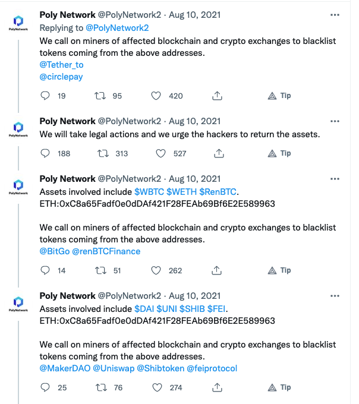
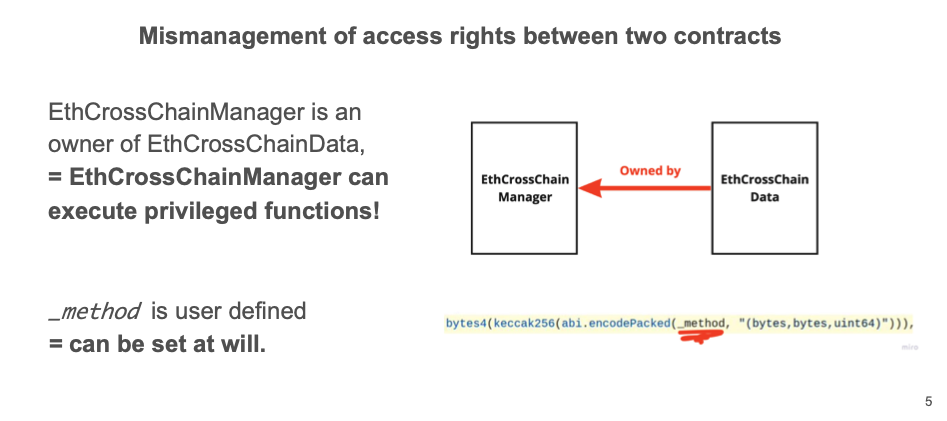

# امنیت پایه  
## اکوسیستم  

  

---  

# بهترین شیوه‌های قرارداد هوشمند ConsenSys  

## فهرست مطالب  

- [عمومی](#general)  
  - [آماده شدن برای خطا](#prepare-for-failure)  
  - [به‌روز ماندن](#stay-up-to-date)  
  - [سادگی را حفظ کن](#keep-it-simple)  
  - [پیاده‌سازی تدریجی](#rolling-out)  
  - [ویژگی‌های بلاکچین](#blockchain-properties)  
  - [سادگی در مقابل پیچیدگی](#simplicity-vs-complexity)  
- [احتیاط‌ها](#precautions)  
  - [قابلیت ارتقا](#upgradeability)  
  - [قطع‌کننده‌های مدار](#circuit-breakers)  
  - [موانع سرعت](#speed-bumps)  
  - [محدودیت نرخ](#rate-limiting)  
  - [استقرار](#deployment)  
  - [پناهگاه امن](#safe-haven)  
- [ویژه Solidity](#solidity-specific)  
  - [Assert، Require، Revert](#assert-require-revert)  
  - [مودیفایرها به عنوان نگهبان](#modifiers-as-guards)  
  - [تقسیم صحیح اعداد صحیح](#integer-division)  
  - [انتزاعی در مقابل اینترفیس‌ها](#abstract-vs-interfaces)  
  - [توابع fallback](#fallback-functions)  
  - [قابلیت پرداخت](#payability)  
  - [قابلیت مشاهده](#visibility)  
  - [قفل کردن پرگماها](#locking-pragmas)  
  - [نظارت بر رویدادها](#event-monitoring)  
  - [سایه‌زنی](#shadowing)  
  - [tx.origin](#txorigin)  
  - [وابستگی به زمان](#timestamp-dependence)  
  - [ارث‌بری پیچیده](#complex-inheritance)  
  - [نوع اینترفیس](#interface-types)  
  - [بررسی EXTCODESIZE](#extcodesize-checks)  
- [ویژه توکن](#token-specific)  
  - [استانداردسازی](#standardization)  
  - [جلوگیری از فرنترانینگ](#frontrunning)  
  - [آدرس صفر](#zero-address)  
  - [آدرس قرارداد](#contract-address)  
- [مستندسازی](#documentation)  
  - [مشخصات](#specification)  
  - [وضعیت](#status)  
  - [رویه‌ها](#procedures)  
  - [مشکلات شناخته شده](#known-issues)  
  - [تاریخچه](#history)  
  - [تماس](#contact)  
- [حملات](#attacks)  
  - [بازوران‌گرایی](#reentrancy)  
  - [دستکاری اوراکل](#oracle-manipulation)  
  - [فرنترانینگ](#frontrunning-1)  
  - [وابستگی به زمان](#timestamp-dependence-1)  
  - [حساب‌های ناامن](#insecure-arithmetic)  
  - [انکار سرویس](#denial-of-service)  
  - [ایجاد مزاحمت](#griefing)  
  - [اجبار به دریافت](#force-feeding)  

---  

## عمومی  

### آماده شدن برای خطا  

انتظار باگ داشته باشید، راهکارهای ایمنی داشته باشید، فرآیند بازیابی تعریف کنید.  

### به‌روز ماندن  

با تغییرات کامپایلر، نسخه‌های Solidity و به‌روزرسانی کتابخانه‌ها هماهنگ باشید.  

### سادگی را حفظ کن  

اندازه و پیچیدگی قرارداد را به حداقل برسانید.  

### پیاده‌سازی تدریجی  

از پیاده‌سازی مرحله‌ای استفاده کنید، رفتار درون زنجیره‌ای را قبل از انتشار کامل نظارت کنید.  

### ویژگی‌های بلاکچین  

غیرقابل تغییر، شفاف و فقط قابل الحاق — کد پس از استقرار قابل تغییر نیست.  

### سادگی در مقابل پیچیدگی  

منطق قابل فهم و نگهداری را بر راه‌حل‌های بیش از حد پیچیده ترجیح دهید.  

---  

## احتیاط‌ها  

### قابلیت ارتقا  

از الگوهای پراکسی برای قراردادهای قابل ارتقا استفاده کنید.  

### قطع‌کننده‌های مدار  

مکانیسم توقف اضطراری اضافه کنید:  

~~~solidity  
bool public stopped = false;

modifier stopInEmergency { require(!stopped); _; }

function toggleContractActive() external onlyOwner {
    stopped = !stopped;
}
~~~  

### موانع سرعت  

عملیات را به تعویق بیندازید تا زمان کافی برای شناسایی ناهنجاری‌ها فراهم شود.  

### محدودیت نرخ  

فرکانس عملیات حساس را محدود کنید:  

~~~solidity  
mapping(address => uint256) public lastAccess;

modifier rateLimited() {
    require(block.timestamp > lastAccess[msg.sender] + 1 minutes);
    _;
    lastAccess[msg.sender] = block.timestamp;
}
~~~  

### استقرار  

منطق سازنده و تنظیمات مالکیت را دو بار بررسی کنید.  

### پناهگاه امن  

اطمینان حاصل کنید که راهی برای بازیابی کنترل یا توقف فعالیت در مواقع اضطراری وجود دارد.  

---  

## ویژه Solidity  

### Assert، Require، Revert  

برای اعتبارسنجی ورودی‌ها از `require`، برای قوانین ثابت از `assert` و برای خطاهای سفارشی از `revert` استفاده کنید.  

### مودیفایرها به عنوان نگهبان  

برای کنترل دسترسی و اعتبارسنجی استفاده کنید.  

~~~solidity  
modifier onlyOwner() {
    require(msg.sender == owner, "Not owner");
    _;
}
~~~  

### تقسیم صحیح اعداد صحیح  

آگاه باشید که Solidity نتایج تقسیم را قطع می‌کند.  

### انتزاعی در مقابل اینترفیس‌ها  

از اینترفیس‌ها برای تعریف رفتار قراردادهای خارجی استفاده کنید.  

### توابع fallback  

برای انتقال ETH از `receive()` استفاده کنید، fallback فقط برای فراخوانی‌های بدون داده.  

### قابلیت پرداخت  

از `payable` برای پذیرش ETH استفاده کنید.  

### قابلیت مشاهده  

قابلیت مشاهده را به‌صورت صریح تنظیم کنید: `public`، `external`، `internal`، `private`.  

### قفل کردن پرگماها  

از نسخه‌های ثابت پرگما برای جلوگیری از ناسازگاری کامپایلر استفاده کنید.  

~~~solidity  
pragma solidity ^0.8.20;
~~~  

### نظارت بر رویدادها  

برای عملیات حساس رویدادها را منتشر کنید.  

~~~solidity  
event Transfer(address indexed from, address indexed to, uint256 value);
~~~  

### سایه‌زنی  

از استفاده مجدد نام متغیرها در حوزه‌های تو در تو اجتناب کنید.  

### tx.origin  

از `tx.origin` برای احراز هویت استفاده نکنید.  

### وابستگی به زمان  

از منطق مبتنی بر `block.timestamp` برای تصمیمات حیاتی اجتناب کنید.  

### ارث‌بری پیچیده  

هرگاه ممکن است سلسله‌مراتب قراردادها را صاف کنید تا از ابهام جلوگیری شود.  

### نوع اینترفیس  

برای تعامل با قراردادهای دیگر از اینترفیس‌های خارجی صحیح استفاده کنید.  

### بررسی EXTCODESIZE  

فقط به `extcodesize` برای تشخیص نوع قرارداد اعتماد نکنید.  

---  

## ویژه توکن  

### استانداردسازی  

استانداردهای ERC (ERC20، ERC721 و غیره) را دنبال کنید و بررسی‌های انتقال ایمن را اضافه کنید.  

### جلوگیری از فرنترانینگ  

معاملات را به گونه‌ای طراحی کنید که بردارهای MEV/فرنترانینگ به حداقل برسند.  

### آدرس صفر  

انتقال به `address(0)` را رد کنید.  

### آدرس قرارداد  

وقتی مناسب است بررسی کنید که گیرنده قرارداد است یا خیر:  

~~~solidity  
function isContract(address _addr) internal view returns (bool) {
    uint32 size;
    assembly { size := extcodesize(_addr) }
    return (size > 0);
}
~~~  

---  

## مستندسازی  

### مشخصات  

شامل مشخصات واضح اینترفیس و رفتار.  

### وضعیت  

پوشش حسابرسی و تست را مستند کنید.  

### رویه‌ها  

روش‌های ارتقا، مهاجرت و توقف را تعریف کنید.  

### مشکلات شناخته شده  

باگ‌ها، محدودیت‌ها و راه‌حل‌ها را پیگیری کنید.  

### تاریخچه  

پیگیری استقرارها، نسخه‌ها و تغییرات.  

### تماس  

نقاط تماس برای پاسخ به حوادث را درج کنید.  

---  

## حملات  

### بازوران‌گرایی  

الگوی `checks-effects-interactions` و محافظت در برابر بازوران‌گرایی را استفاده کنید.  

~~~solidity  
bool internal locked;

modifier noReentrancy() {
    require(!locked, "No reentrancy");
    locked = true;
    _;
    locked = false;
}
~~~  

### دستکاری اوراکل  

از TWAPها یا قیمت‌های میانه برای کاهش دستکاری استفاده کنید.  

### فرنترانینگ  

معاملات را به صورت دسته‌ای یا تعهد-افشایی طراحی کنید تا MEV کاهش یابد.  

### وابستگی به زمان  

از استفاده از زمان بلاک برای قرعه‌کشی یا تصادفی‌سازی اجتناب کنید.  

### حساب‌های ناامن  

از SafeMath (قبل از 0.8) یا بررسی‌های سرریز داخلی (0.8 به بعد) استفاده کنید.  

### انکار سرویس  

از حلقه‌های بدون حد و callback‌های کنترل شده توسط کاربر اجتناب کنید.  

### ایجاد مزاحمت  

جلوگیری از سوء استفاده مهاجمان از گس یا منطق کنترل برای آسیب رساندن به دیگران.  

### اجبار به دریافت  

فرض نکنید قراردادها فقط از طریق `receive()` یا `fallback()` ETH دریافت می‌کنند. ETH می‌تواند از طریق `selfdestruct` نیز ارسال شود.  

---  

# کنترل دسترسی در Solidity  

## مقدمه  

کنترل دسترسی مکانیزمی است برای محدود کردن اینکه چه کسانی می‌توانند توابع خاصی را در قراردادهای هوشمند اجرا کنند. این تعیین می‌کند کدام آدرس‌ها می‌توانند متدهای خاصی را فراخوانی کنند یا وضعیت قرارداد را تغییر دهند. این موضوع برای جلوگیری از انجام عملیات دارای امتیاز توسط کاربران غیرمجاز حیاتی است.  

---  

## چرا کنترل دسترسی برای امنیت حیاتی است  

### جلوگیری از برداشت غیرمجاز وجوه  
- جلوگیری از تخلیه موجودی قرارداد توسط افراد مخرب.  
- حفاظت از سپرده‌های کاربران و ذخایر پروتکل.  

### حفظ یکپارچگی قرارداد  
- اطمینان از اینکه فقط افراد مجاز می‌توانند پارامترهای حیاتی را تغییر دهند.  
- جلوگیری از دستکاری منطق قرارداد یا متغیرهای وضعیت.  

### محافظت در برابر افزایش امتیاز  
- جلوگیری از دسترسی کاربران عادی به حقوق مدیریتی.  
- حفظ جداسازی مناسب نقش‌ها و مسئولیت‌ها.  

### کاهش سطح حمله  
- محدود کردن دسترسی به عملکردهای حساس.  
- کمینه کردن توابع قابل دسترسی برای بازیگران خارجی.  

---  

## الگوهای رایج کنترل دسترسی  

### دسترسی فقط برای مالک  
- یک آدرس با امتیازات مدیریتی.  
- رویکرد ساده اما متمرکز.  
- استفاده از الگوی مودیفایر `onlyOwner`.  

~~~solidity  
contract Owned {
    address public owner;

    constructor() {
        owner = msg.sender;
    }

    modifier onlyOwner() {
        require(msg.sender == owner, "Not the owner");
        _;
    }

    function withdraw() public onlyOwner {
        // عملیات دارای امتیاز
    }
}
~~~  

### کنترل دسترسی مبتنی بر نقش (RBAC)  
- چندین نقش با سطوح دسترسی مختلف.  
- انعطاف‌پذیرتر از روش مالک واحد.  
- امکان مدیریت دقیق‌تر دسترسی‌ها.  

~~~solidity  
contract RBAC {
    mapping(address => bool) public admins;

    modifier onlyAdmin() {
        require(admins[msg.sender], "Not admin");
        _;
    }

    function addAdmin(address _admin) public {
        admins[_admin] = true;
    }

    function restrictedAction() public onlyAdmin {
        // منطق مدیر
    }
}
~~~  

### الزامات چند امضایی  
- نیاز به تأییدهای متعدد برای عملیات حیاتی.  
- کاهش نقطه شکست واحد.  

~~~solidity  
// کد نمونه - برای تولید مناسب نیست  
mapping(address => bool) public signers;
uint256 public approvals;

function execute() public {
    require(signers[msg.sender], "Not signer");
    approvals++;
    if (approvals >= 2) {
        // اجرای عملیات
        approvals = 0;
    }
}
~~~  

### محدودیت‌های زمانی  
- توابع فقط در بازه‌های زمانی مشخص قابل فراخوانی هستند.  
- مناسب برای ICO، رأی‌گیری یا پنجره‌های نگهداری.  

~~~solidity  
uint256 public startTime;
uint256 public endTime;

modifier onlyDuringSale() {
    require(block.timestamp >= startTime && block.timestamp <= endTime, "Not in sale window");
    _;
}
~~~  

---  

## تکنیک‌های پیاده‌سازی  

### مودیفایرها  
- منطق قابل استفاده مجدد برای کنترل دسترسی.  
- کد تمیز و ساختاریافته.  

~~~solidity  
modifier onlyOwner() {
    require(msg.sender == owner, "Access denied");
    _;
}
~~~  

### دستورات require  
- بررسی شرطی مستقیم درون توابع.  
- بازگشت با پیام خطای واضح.  

~~~solidity  
function secure() public {
    require(msg.sender == owner, "Not authorized");
}
~~~  

### دسترسی مبتنی بر مپینگ  
- ردیابی آدرس‌های مجاز با استفاده از مپینگ‌ها.  
- کارآمد برای مجموعه‌های بزرگ دسترسی.  

~~~solidity  
mapping(address => bool) public whitelist;

function access() public {
    require(whitelist[msg.sender], "Not whitelisted");
}
~~~  

---  

## بهترین شیوه‌های امنیتی  

### اصل حداقل امتیاز  
- تنها حداقل دسترسی‌های لازم داده شود.  
- دسترسی‌ها به طور منظم بازبینی شود.  

### اعتبارسنجی ورودی‌ها  
- پارامترهایی مثل آدرس و مقدار را اعتبارسنجی کنید.  
- قبل از اجرا، وضعیت درست را تضمین کنید.  

### ثبت رویدادها  
- برای تغییر نقش‌ها و عملیات حساس رویداد منتشر کنید.  
- به کمک ممیزی و نظارت می‌آید.  

~~~solidity  
event RoleGranted(address indexed user);

function grantRole(address _user) public onlyOwner {
    whitelist[_user] = true;
    emit RoleGranted(_user);
}
~~~  

### کنترل‌های اضطراری  
- افزودن توابع `pause()` و `unpause()` برای مدیریت بحران.  

~~~solidity  
bool public paused = false;

modifier whenNotPaused() {
    require(!paused, "Paused");
    _;
}
~~~  

---  

## آسیب‌پذیری‌های رایج  

### کنترل‌های دسترسی مفقود  
- توابع عمومی بدون محدودیت رها شده‌اند.  
- اغلب منجر به هک کامل قرارداد می‌شود.  

### منطق نادرست مجوز  
- شرط‌های نادرست در بررسی دسترسی.  
- استفاده ناسازگار از مودیفایرها.  

### خطرات تمرکز  
- تکیه بر یک کلید برای عملیات حیاتی.  
- عدم وجود پشتیبان در صورت از دست دادن کلید.  

### حملات فرنترانینگ  
- ترتیب تراکنش‌ها برای دسترسی غیرمجاز.  
- مربوط به مالکیت یا انتقال نقش‌ها.  

---  

## تست و ممیزی  

### تست‌های واحد جامع  
- سناریوهای دسترسی صحیح و نادرست را تست کنید.  
- شامل موارد مرزی باشد.  

### تست‌های یکپارچه  
- جریان دسترسی بین قراردادهای تعامل‌پذیر را بررسی کنید.  
- از افزایش امتیاز از طریق زنجیره جلوگیری کنید.  

### ممیزی‌های امنیتی حرفه‌ای  
- همکاری با ممیزان معتبر.  
- استفاده از ابزارهای خودکار برای کشف مشکلات دسترسی.  

---  

**کنترل دسترسی پایه امنیت قرارداد هوشمند است. اعمال ساختارهای دسترسی چندلایه، تست شده و واضح به محافظت از کاربران و حفظ یکپارچگی پروتکل کمک می‌کند.**  

---  

# هک Poly Network: رمزگذاری ABI و انتخاب‌کننده‌های تابع  

## مقدمه  

هک Poly Network یکی از بزرگ‌ترین سوءاستفاده‌های DeFi در تاریخ بود که منجر به سرقت بیش از 600 میلیون دلار شد. درک اینکه چگونه چنین سوءاستفاده‌هایی امکان‌پذیر است نیازمند فهم مکانیک‌های سطح پایین اتریوم مانند **انتخاب‌کننده‌های تابع** و **رمزگذاری ABI** است.  

این راهنما توضیح گام به گام رمزگذاری توابع Solidity برای اجرا را با استفاده از یک قرارداد واقعی و مثال `baz(uint32,bool)` از هک Poly ارائه می‌دهد.  

---  

## مرور انتخاب‌کننده‌های تابع  

در Solidity، هر تابع یک **انتخاب‌کننده** دارد که از امضای آن استخراج می‌شود. این انتخاب‌کننده یک شناسه 4 بایتی است که توسط ماشین مجازی اتریوم (EVM) برای تعیین اینکه کدام تابع فراخوانی شود استفاده می‌شود.  

### نحوه محاسبه  

1. امضای تابع را به صورت رشته بنویسید:  
   `baz(uint32,bool)`  

2. آن را با Keccak-256 هش کنید:  
   `keccak256("baz(uint32,bool") = 0xcdcd77c0...`  

3. 4 بایت اول انتخاب‌کننده تابع است:  
   `0xcdcd77c0`  

---  

## رمزگذاری امضا و پارامترهای تابع  

هنگام فراخوانی تابع روی قرارداد هوشمند، داده ارسال شده شامل:  

- 4 بایت: **انتخاب‌کننده تابع**  
- 32 بایت برای هر پارامتر: **مقادیر ورودی رمزگذاری شده به صورت ABI**  

این‌ها برای ساخت payload نهایی تراکنش به هم پیوسته‌اند.  

---  

## مثال Solidity  

~~~solidity  
pragma solidity ^0.8.0;

contract MyContract {
    
  Foo otherContract;
  
  function callOtherContract() public view returns (bool) {
      bool answer = otherContract.baz(69, true);
      return answer;
  }
}

contract Foo {
    function bar(bytes3[2] memory) public pure {}
    
    function baz(uint32 x, bool y) public pure returns (bool r) {
        r = x > 32 || y; 
    }

    function sam(bytes memory, bool, uint[] memory) public pure {}
}
~~~  

## تجزیه و تحلیل داده‌های رمزگذاری شده تماس  
برای فراخوانی `baz(69, true)` از طریق تماس سطح پایین EVM:  

### مرحله 1: انتخاب‌کننده تابع  
امضا: `baz(uint32,bool)`  

هش Keccak-256: **0xcdcd77c0...**  

انتخاب‌کننده: **0xcdcd77c0**  

### مرحله 2: پارامتر 1 - uint32 (69)  
69 در هگز: `0x45`  

با پر شدن از چپ تا 32 بایت:  
**0x0000000000000000000000000000000000000000000000000000000000000045**  

### مرحله 3: پارامتر 2 - bool (true)  
true در هگز: `0x01`  

با پر شدن از چپ تا 32 بایت:  

**0x0000000000000000000000000000000000000000000000000000000000000001**  

---  

## نمودار بصری ABI  

| افست  | طول    | توضیحات                        |  
|-------|--------|--------------------------------|  
| 0x00  | 4 بایت | انتخاب‌کننده تابع (0xcdcd77c0) |  
| 0x04  | 32 بایت| مقدار uint32 برابر 69          |  
| 0x24  | 32 بایت| مقدار bool برابر true          |  

---  

## فراخوان نهایی رمزگذاری شده ABI:  
**0xcdcd77c0000000000000000000000000000000000000000000000000000000000000450000000000000000000000000000000000000000000000000000000000000001**  
طول کل: `68 بایت`  

---  

## جزئیات سوءاستفاده هک Poly Network  
**600 میلیون دلار سرقت شده**  
هک Poly Network با سوء استفاده از منطق قرارداد هوشمند بین زنجیره‌ای از طریق دستکاری امضاها و ورودی‌های معتبر رخ داد.  

  
  

## اصل سوءاستفاده  
مهاجم به دنبال یافتن مقداری X بود که:  
~~~Solidity
Hash(X, bytes, bytes, uint64) = Hash(putCurEpochConPubKeyBytes, bytes)
~~~  
هش حاصل باید با یک مقدار ثابت از پیش تعریف شده مطابقت داشته باشد:  

**هش مورد انتظار: 0x41973cd9**  
با تلاش بی‌وقفه مقدار درست X را یافت:  
**X = f1121318093**  
این اجازه داد اعتبارسنجی امضا دور زده شده و انتقال غیرمجاز وجوه انجام شود.  

  
  
  

## خلاصه  
- انتخاب‌کننده‌های تابع شناسه‌های 4 بایتی استخراج شده از امضاهای تابع با Keccak-256 هستند.  

- رمزگذاری ABI هر پارامتر را تا 32 بایت پر می‌کند.  

- درک این رمزگذاری امکان دستکاری سطح پایین قراردادهای هوشمند را فراهم می‌کند.  

- در هک Poly Network، این دانش به مهاجم اجازه داد پیام‌های معتبر جعلی بسازد و بیش از 600 میلیون دلار از چندین زنجیره استخراج کند.  

