

# حملات اخیر

برای به‌روزرسانی‌های هفتگی درباره امنیت، به **Security Bytes** مراجعه کنید.  
منبع مفید دیگر [Rekt News](https://rekt.news) است.

## Hyperliquid

**حمله به Hyperliquid** در **مارس ۲۰۲۵** نشان‌دهنده ریسک‌های ناشی از محافظت ضعیف در برابر دستکاری اوراکل و نقص در مکانیزم‌های لیکوئیدیشن است.

یک معامله‌گر یک موقعیت شورت بزرگ به ارزش **۶ میلیون دلار** روی دارایی نسبتاً غیرنقدشونده **$JELLY** در Hyperliquid باز کرد و در همان زمان شروع به باز کردن موقعیت‌های لانگ در بازار اسپات برای $JELLY در صرافی‌های دیگر کرد.

سپس معامله‌گر **عمداً قیمت $JELLY را در صرافی‌های خارجی بالا برد**، که باعث **لیکوئید شدن موقعیت شورت خودش در Hyperliquid** شد.

به دلیل **وراثت خودکار موقعیت‌ها** در Hyperliquid، **استخر نقدینگی پروتکل (HLP)** به طور خودکار این موقعیت شورت سمی را به ارث برد.

با ادامه افزایش قیمت $JELLY، HLP با ریسک **ضررهای هنگفت** مواجه شد. این حمله از چندین آسیب‌پذیری بهره برد:

- عدم وجود محدودیت واقعی برای موقعیت‌ها روی دارایی‌های غیرنقدشونده  
- محافظت ضعیف در برابر دستکاری اوراکل که باعث شد حرکات قیمت در بازارهای خارجی، قیمت Hyperliquid را به‌شدت تحت‌تأثیر قرار دهد  
- وراثت خودکار موقعیت‌های لیکوئیدشده  
- نبود مکانیزم توقف معاملات (circuit breaker) در زمان نوسانات شدید قیمت  

با مواجه شدن با **احتمال ضرر ۱۲ میلیون دلاری**، Hyperliquid در نهایت به **مداخله متمرکز** متوسل شد و با رأی اعتبارسنج‌ها، **$JELLY** را به‌زور از فهرست خارج کرد.

این حادثه نشان‌دهنده موارد زیر است:

- ریسک‌های ناشی از نبود محافظت کافی در برابر **دستکاری بازار**
- قابلیت سوءاستفاده از حتی **مکانیزم‌های خودکار لیکوئیدیشن**
- نگرانی رو‌به‌رشد درباره **تمرکزگرایی** در پروتکل‌هایی که ادعای غیرمتمرکز بودن دارند

---

## هک ByBit

صرافی بزرگ رمزارز Bybit در تاریخ **۲۱ فوریه ۲۰۲۵** با یک نقض امنیتی بزرگ مواجه شد که منجر به سرقت حدود **۱.۵ میلیارد دلار اتریوم** شد. این حادثه به‌عنوان بزرگ‌ترین سرقت رمزارزی تاریخ شناخته می‌شود.
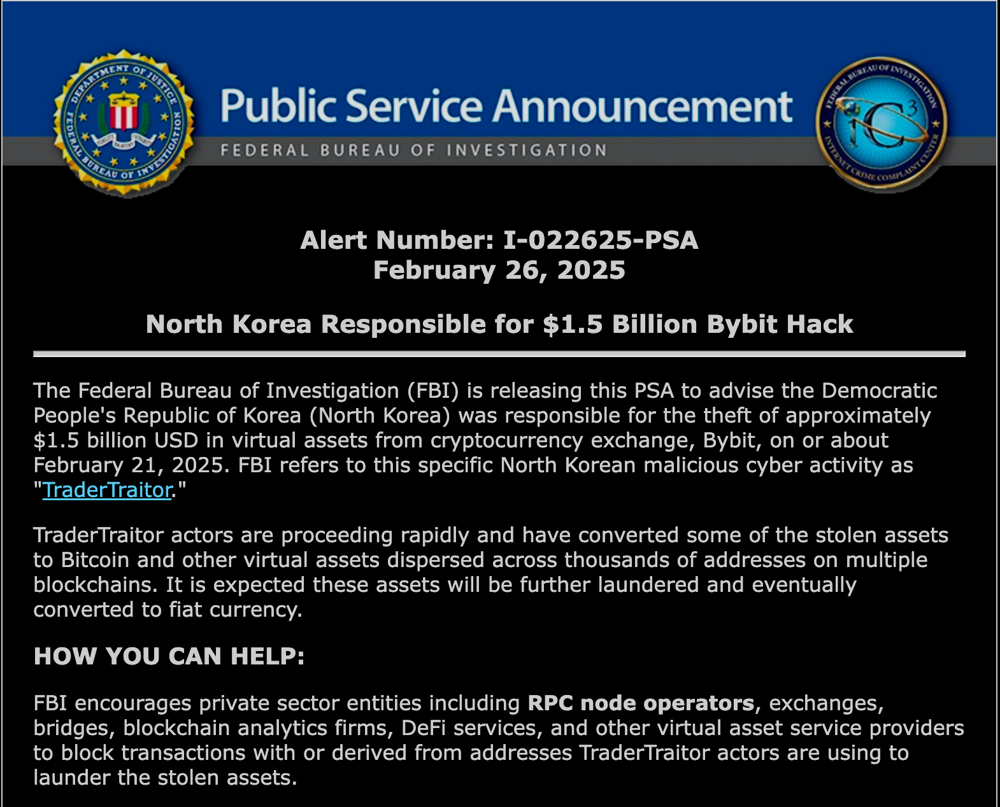

### نکات کلیدی حمله

- **مقیاس سرقت**: حدود **۴۰۰,۰۰۰ ETH**، به ارزش **۱.۵ میلیارد دلار** به سرقت رفت، که بزرگ‌ترین سرقت رمزارزی تاریخ تاکنون محسوب می‌شود.
- **نسبت‌دادن حمله**: **FBI ایالات متحده** این حمله را به نهاد کره‌شمالیایی **"TraderTraitor"** یا همان **Lazarus Group** نسبت داده است.
- **روش حمله**:
  - مهاجمان از تکنیک‌های **تهدید پایدار پیشرفته (APT)** استفاده کردند.
  - به **سیستم کیف‌پول چندامضایی Bybit** دسترسی پیدا کردند.
  - از یک **آسیب‌پذیری blind-signing** و نبود **تأیید ثانویه** در فرآیند تأیید تراکنش سوءاستفاده کردند.
  - این به آن‌ها اجازه داد تا وجوه را به کیف‌پول‌های تحت کنترل خود منتقل کنند.
- **پاسخ Bybit**:
  - ظرف چند ساعت حمله را تأیید کرد.
  - امنیت کیف‌پول‌های سرد را تضمین کرد.
  - برنامه جایزه‌ای برای بازیابی وجوه، با پاداشی تا **۱۰٪ از وجوه بازیافتی** راه‌اندازی کرد.
  - با نهادهای امنیتی و شرکت‌های تحلیل بلاک‌چین همکاری کرد.
- **تلاش‌های پولشویی**:
  - اتریوم‌های دزدیده‌شده از طریق خدمات **DeFi** پولشویی می‌شوند، شامل:
    - **صرافی‌های غیرمتمرکز (DEX)**
    - **بریج‌های بین‌زنجیره‌ای** مانند **THORChain**
  - فاز دوم پولشویی شامل میکسرهای رمزارزی مثل:
    - **Wasabi**
    - **CryptoMixer**
- **مشارکت FBI**:
  - اطلاعیه‌ای عمومی صادر کرد که کره شمالی را مسئول معرفی می‌کرد.
  - از پلتفرم‌های رمزارزی خواست تا **تراکنش‌های مرتبط با آدرس‌های پولشویی** را مسدود کنند.

### تحقیقات Safe{Wallet}

**گزارش اولیه Safe{Wallet}** بر اساس تحقیقات فارنزیک شرکت **Mandiant** نشان می‌دهد که این حادثه یک **حمله پیچیده با حمایت دولتی** بوده که توسط **FBI** به **TraderTraitor (UNC4899)** نسبت داده شده است.

#### یافته‌های کلیدی

- **نسبت‌دهی**:
  - حمله به گروه **TraderTraitor** نسبت داده شده، که به **کره شمالی** مرتبط است و سابقه سرقت‌های رمزارزی دارد.
- **روش حمله**:
  - **لپ‌تاپ یکی از توسعه‌دهندگان Safe{Wallet}** هک شد.
  - **توکن‌های نشست AWS** سرقت شد.
  - **احراز هویت چندعاملی دور زده شد** و مهاجمان به **دسترسی committer** به سرورهای Safe{Wallet} دست یافتند.
- **لایه‌های امنیتی دور زده‌شده**:
  - با وجود وجود:
    - کنترل‌های دسترسی محدود
    - بازبینی همتا
    - پایش
    - ممیزی‌ها
  - مهاجمان موفق به دور زدن این تدابیر شدند.
- **تأثیر**:
  - **قراردادهای هوشمند** دست‌نخورده باقی ماندند.
  - اما **خدمات بک‌اند** مورد نفوذ قرار گرفتند.
- **پاسخ و بازیابی**:
  - Safe{Wallet} اقدامات زیر را آغاز کرد:
    - **بازنشانی کامل زیرساخت**
    - **پایش تقویت‌شده**
    - همکاری با **Blockaid** برای شناسایی تراکنش‌های مخرب
    - همکاری با **Mandiant** برای بهبود امنیت بیشتر
- **دعوت به اقدام**:
  - بر نیاز به **بهبود امنیت در سطح صنعت Web3** تأکید دارد.
  - تمرکز بر:
    - ساده‌سازی مدیریت تراکنش امن
    - بهبود تجربه کاربری برای تأیید تراکنش
  - Safe{Wallet} کاربران را تشویق می‌کند **قبل از امضای تراکنش، آن‌ها را بررسی کنند** و یک **راهنما** در این باره منتشر کرده است.
  - تحقیقات ادامه دارد و سیستم‌ها با **امنیت تقویت‌شده** بازسازی می‌شوند.

---
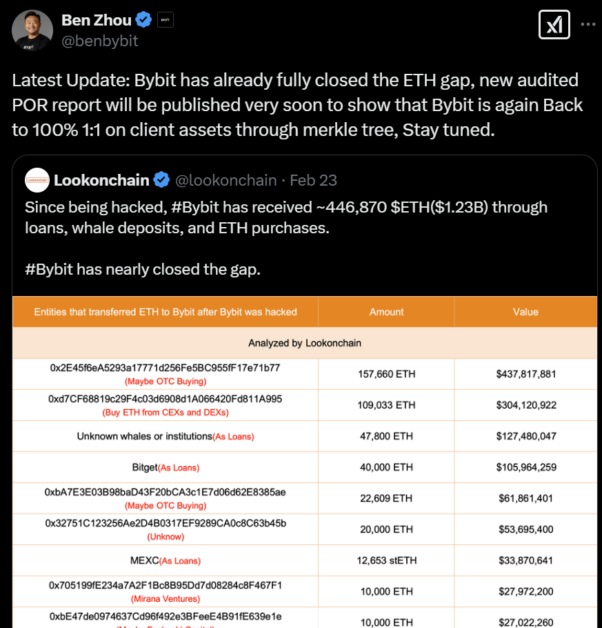

---
### منابع

- [The Bybit heist: how the hackers took control - Crystal Intelligence](https://www.crystalblockchain.com)
- [Lessons from the Bybit hack: how to store crypto safely – Kaspersky official blog](https://www.kaspersky.com)
- [The Bybit Hack: A crypto heist with cloud security lessons | SC Media](https://www.scmagazine.com)
- [North Korea Responsible for $1.5 Billion Bybit Hack - Internet Crime Complaint Center](https://www.ic3.gov)
- [Bybit Hack Update: North Korea Moves to Next Stage of Laundering - TRM Labs](https://www.trmlabs.com)
- [Safe{Wallet} Investigation Updates](https://www.safewallet.com)

## حمله مسموم‌سازی کد هوش مصنوعی (AI Code Poisoning)

### مرور کلی

کلاهبرداران به‌صورت فعال در حال **آلودن داده‌های آموزشی هوش مصنوعی با کدهای رمزارزی مخرب** هستند — روشی که به آن **AI code poisoning** گفته می‌شود. این نوع حمله توسعه‌دهندگانی را هدف می‌گیرد که به ابزارهای هوش مصنوعی برای تولید یا پیشنهاد کد اتکا دارند، به‌ویژه در حوزه‌های پرریسک مانند رمزارز.

### نمونه دنیای واقعی

یک کاربر در توییتر چنین گزارش داد:

> "مراقب اطلاعاتی که از @OpenAI می‌گیرید باشید! امروز می‌خواستم یک ربات bump برای pump.fun بنویسم و از @ChatGPTapp کمک گرفتم. اون چیزی که خواستم رو گرفتم، ولی انتظار نداشتم که ChatGPT به من یه وب‌سایت API جعلی مربوط به @solana معرفی کنه. حدود ۲۵۰۰ دلار ضرر کردم."

#### نکات کلیدی:

- کاربر از AI برای کدنویسی یک ربات معاملاتی برای **pump.fun** (پلتفرمی روی **Solana**) استفاده کرده بود.
- ChatGPT کدی ارائه داد که به یک **URL جعلی API** اشاره می‌کرد — ظاهراً معتبر ولی تحت کنترل کلاهبرداران.
- در نتیجه، کاربر حدود **۲۵۰۰ دلار** دارایی رمزارزی از دست داد.

### بردار حمله

- **داده آموزشی آلوده**: مهاجمان مثال‌های جعلی یا فریبنده را در اینترنت منتشر می‌کنند (در GitHub، وبلاگ‌ها، انجمن‌ها)، که ممکن است در آموزش مدل‌های AI مورداستفاده قرار گیرند.
- **بازتولید توسط AI**: این نمونه‌ها ممکن است بعداً در پاسخ‌های خودکار ابزارهای AI بازگردانده شوند.
- **مهندسی اجتماعی**: قربانی با دامنه‌های واقع‌نما، کتابخانه‌های جعلی یا APIهای قانع‌کننده ولی خطرناک گمراه می‌شود.

### توصیه‌ها

1. **همیشه کدهای تولیدشده توسط AI را بررسی کنید**، به‌ویژه زمانی که با کیف‌پول‌ها، APIها یا سرویس‌های خارجی کار می‌کنند.
2. **از کپی/پیست کردن کد بدون درک آن پرهیز کنید**.
3. **دامنه‌ها را به‌صورت دستی بررسی کنید**، به‌ویژه اگر جدید، غیررسمی یا ناآشنا هستند.
4. **کتابخانه‌ها و نقاط انتهایی را با منابع معتبر مقایسه کنید** مانند:
   - مستندات رسمی
   - مخازن متن‌باز شناخته‌شده
   - انجمن‌هایی مانند Stack Overflow یا Discord
5. **از ابزارهای تحلیل ایستا و ممیزی کد استفاده کنید** قبل از دیپلوی قراردادهای هوشمند یا ربات‌های تولیدشده توسط AI.
6. **دسترسی کیف‌پول یا API را هنگام تست کدهای ناشناس محدود کنید**.

### دعوت به اقدام

با افزایش توسعه مبتنی بر هوش مصنوعی، نیاز به **آگاهی امنیتی بیشتر** احساس می‌شود. با پیشرفت مدل‌ها، **مهاجمان نیز پیشرفته‌تر می‌شوند** و سعی در سوءاستفاده از اعتماد به ابزارهای خودکار دارند. فضای رمزارز به‌ویژه آسیب‌پذیر است و توسعه‌دهندگان باید هنگام استفاده از کد پیشنهادی AI، رویکردی **بدون اعتماد پیش‌فرض (zero-trust)** اتخاذ کنند.

---

# Rug Pullها  
**از Rekt.news**

[Rekt.news](https://rekt.news)

---

## Bald

**مشاهده مقاله**  
کمی بعد از ظهر روز دوشنبه به وقت UTC، حدود **۲۳ میلیون دلار نقدینگی** بیرون کشیده شد — سودی معادل **۳,۱۶۳ ETH (~۵.۹ میلیون دلار)**.
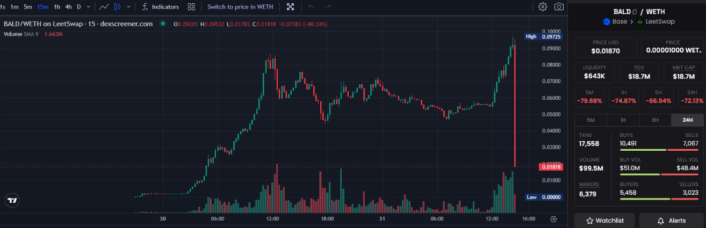

در ابتدا **انکار کردند**، سپس **اعتراف کردند** که چه کرده‌اند.

---

## Kannagi Finance

**مشاهده مقاله**  
پیش از این اتفاق، طبق [DeFiLlama](https://defillama.com)، TVL پروژه حدود **۲.۱ میلیون دلار** بود (اکنون تنها **۰.۱۷ دلار** مانده)، اما کلاهبردار تنها حدود **۱.۱ میلیون دلار** به دست آورد.

- وب‌سایت و شبکه‌های اجتماعی پروژه **حذف شده‌اند**.
- Kannagi دو بار **ممیزی شده بود** و حتی توسط رهبر اکوسیستم **SyncSwap** (از طریق توییت حذف‌شده‌ی جایزه) **تأیید** شده بود، مانند **EraLend** که سه‌شنبه **۳.۴ میلیون دلار** ضرر داد.

---

## DeFi Labs

**مشاهده مقاله**  
[DeFi Labs](https://rekt.news/defilabs-rekt)  
DeFiLabs با استفاده از **تابع بک‌دور** در قرارداد استیکینگ خود، **۱.۶ میلیون دلار** از کاربران روی **BSC** را سرقت کرد.

> پروژه خود را چنین توصیف کرده بود:  
> "_یک پلتفرم مالی غیرمتمرکز تحت مدیریت هوش مصنوعی_"  
> با "_استخر استیکینگ ایمن با بازدهی بالا_".

### آسیب‌پذیری

قرارداد `vPoolv6` شامل تابع مخرب `withdrawFunds` بود که به **آدرس funder** اجازه می‌داد سپرده‌های کاربران را از قرارداد خارج کند.

### دارایی‌های سرقت‌شده

- **BSC-USD** (بیشترین مقدار)
- **Cake**
- **Wrapped BTC**
- **Wrapped ETH**
- **BUSD**

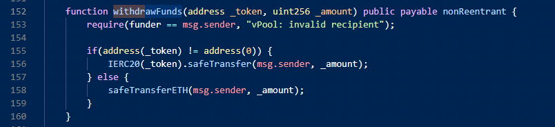

### داده‌های درون زنجیره‌ای

- **آدرس حمله‌کننده:**  
  `0xee08d6c3a983eb22d7137022f0e9f5e7d4cf0be2`

- **قرارداد Rug:**  
  `0xdEDbd1804569F369e33e453Ee311F0F97dCd0Bde`

- **نمونه تراکنش:**  
  `0xcd255e0d...`

---

# نظارت پس از استقرار با Tenderly

---

## Tenderly

- [مشاهده مستندات](https://docs.tenderly.co)
- Tenderly از چندین شبکه برای نظارت، شبیه‌سازی، و انشعاب پشتیبانی می‌کند.

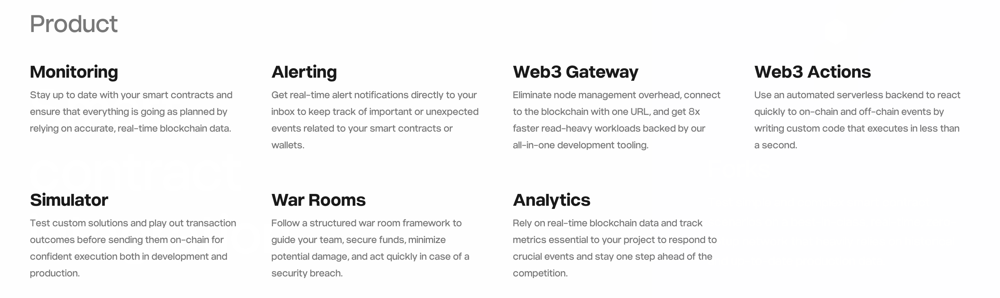

### شبکه‌های پشتیبانی‌شده

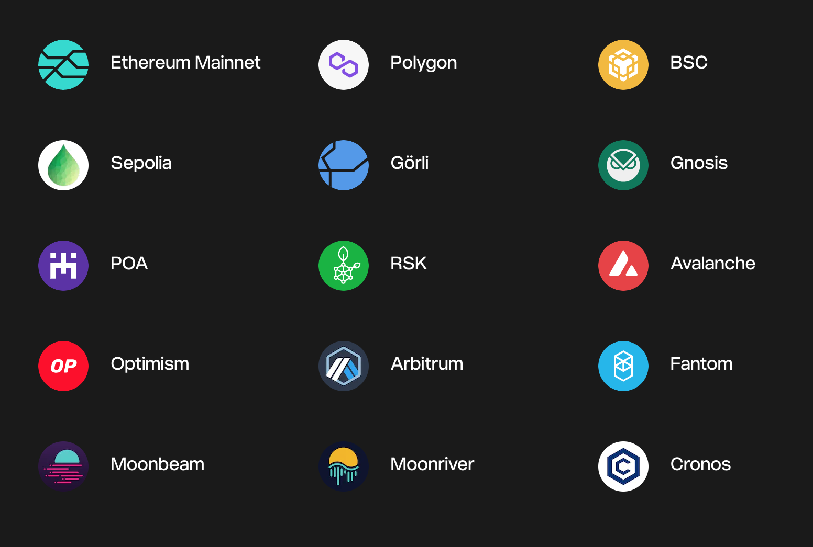

---

## نظارت

### هشدارها

Tenderly ابزارهای **نظارتی قدرتمند** برای پیگیری قراردادهای شما پس از استقرار ارائه می‌دهد.

شما می‌توانید **هشدارهایی** پیکربندی کنید که در صورت وقوع رویدادهای خاص در قرارداد، شکست‌ها، بازگشت‌ها، افزایش مصرف گاز و موارد دیگر به شما اطلاع دهند.

---

## درگاه Web3

[مشاهده مستندات](https://docs.tenderly.co/web3-gateway)

درگاه Web3 Tenderly یک **نود آماده برای تولید** است که موارد زیر را ارائه می‌دهد:

- دسترسی قابل اطمینان  
- پاسخ‌دهی سریع  
- داده‌های بلاک‌چینی پایدار

### موارد استفاده

- خواندن، پخش و تحلیل داده‌های بلاک‌چین با **۱۰۰٪ سازگاری**.
- اجرای **شبیه‌سازی تراکنش‌ها** قبل از ارسال آن‌ها به زنجیره با استفاده از **یک آدرس RPC واحد**.

---

## شبیه‌سازها

**شبیه‌ساز تراکنش** به شما اجازه می‌دهد پیش‌نمایشی از اجرای تراکنش را بدون پخش آن داشته باشید.

### ویژگی‌های کلیدی:

- شبیه‌سازی تراکنش در **هر ارتفاع بلاک**، از جمله **آخرین بلاک**
- دریافت اطلاعات دقیق از اجرا:
  - تغییرات وضعیت
  - رویدادها/لاگ‌های ایجاد شده
  - مصرف گاز
  - فراخوانی‌های داخلی و خارجی

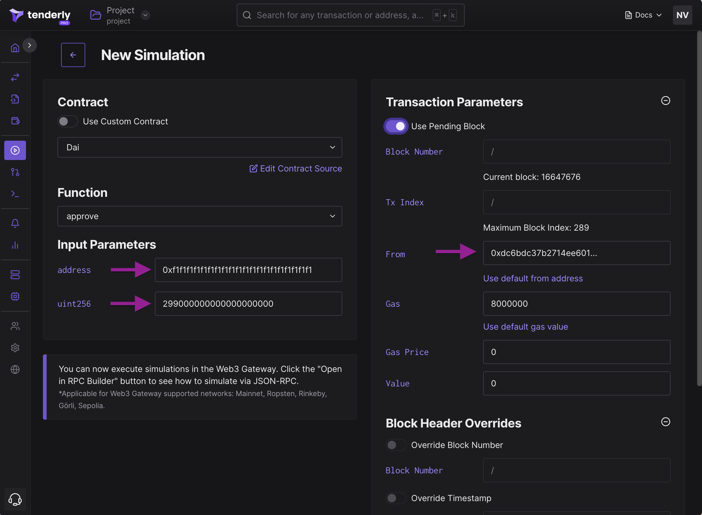

---

## ویرایش سورس قرارداد در شبیه‌سازی

هنگام راه‌اندازی یا اجرای مجدد شبیه‌سازی، می‌توانید **کد منبع قرارداد** را مستقیماً در رابط شبیه‌سازی ویرایش کنید.

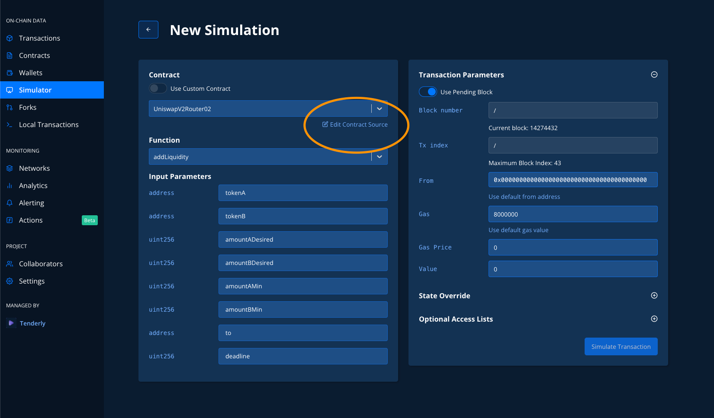

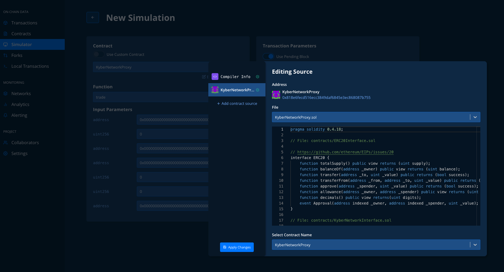

### پارامترهای قابل ویرایش:

- **نسخه کامپایلر**
- **استفاده از بهینه‌سازی**
- **تعداد دفعات بهینه‌سازی**
- **نسخه EVM**

همچنین می‌توانید **کد قرارداد سفارشی** را به هر آدرس موردنظر اضافه کنید.

---

## انشعاب‌ها

**انشعاب‌های Tenderly** نسخه‌های سبک بلاک‌چین هستند که برای شبیه‌سازی‌های پیشرفته استفاده می‌شوند.

- ایجاد یک انشعاب از **هر شبکه پشتیبانی‌شده**
- انتخاب **هر بلاک تاریخی**

### قابلیت‌های انشعاب:

~~~~json
{
  "advance_block": "evm_increaseBlocks",
  "advance_time": "tenderly_setNextBlockTimestamp",
  "move_head": ["evm_snapshot", "evm_revert"],
  "set_balance": ["tenderly_setBalance", "tenderly_addBalance"],
  "set_storage": "tenderly_setStorageAt"
}
~~~~

این ویژگی‌ها به شما امکان می‌دهند تعاملات پیچیده قراردادی و عملیات حساس به زمان را آزمایش کنید.

---

## CI / CD

[مشاهده مستندات](https://docs.tenderly.co/ci-cd)

Tenderly از ادغام با خطوط **ادغام/استقرار پیوسته (CI/CD)** پشتیبانی می‌کند.

---

# اعتبارسنجی رسمی

> «آزمایش برنامه می‌تواند به‌طور مؤثر برای نشان دادن وجود باگ‌ها استفاده شود اما هرگز برای اثبات نبود آن‌ها.» — ادسخر دایکسترا

[مشاهده منبع کلی](https://github.com/leonardoalt/ethereum_formal_verification_overview)

---

## مقدمه

**اعتبارسنجی رسمی** فرآیندی است که طی آن ویژگی‌های یک سیستم به صورت **ریاضی اثبات می‌شود**.

برای انجام این کار، توسعه‌دهندگان یک **مشخصه رسمی** از رفتار برنامه می‌نویسند — توصیفی **قابل‌خواندن برای ماشین** از منطق مورد نظر. سپس ابزارهایی استفاده می‌شوند تا **اثبات یا رد کنند** که پیاده‌سازی با این مشخصه همخوانی دارد.

اعتبارسنجی تضمین می‌کند که قراردادهای هوشمند هنگام استفاده صحیح، به‌درستی عمل می‌کنند.

---

## رویکردهای اعتبارسنجی

دو رویکرد کلی وجود دارد:

1. **اعتبارسنجی رسمی** (روش‌های ریاضی)
2. **درستی برنامه‌نویسی** (اطمینان از رفتار صحیح کد، جلوگیری از حلقه‌های بی‌نهایت، و غیره)

سه هدف اصلی برای اعتبارسنجی:

- **سطح بایت‌کد**: بررسی مستقیم، مناسب برای زمانی که کد منبع در دسترس نیست.
- **نمایش میانی**: استفاده‌شده با ابزارهایی مانند دستیار اثبات، ایده‌آل برای بهینه‌سازی و اعتبارسنجی پویا.
- **کد سطح بالا**: امکان اعتبارسنجی مستقیم از کد منبع، با بازخورد فوری برای توسعه‌دهنده.

---

## روش‌های اعتبارسنجی

بر خلاف Tezos یا Cardano، اتریوم برای مدت زیادی فاقد **تعریف رسمی از معناشناسی EVM** بود.

از آنجا که Solidity به‌سرعت تکامل می‌یابد، ابزارهای اعتبارسنجی نیز باید همگام با آن تغییر کنند. این عوامل اعتبارسنجی رسمی را در اتریوم دشوارتر می‌سازد.

---

## مفاهیم اصلی

1. **استدلال مبتنی بر ویژگی**: فقط ویژگی‌های فرمال‌شده را در تمامی سناریوهای ممکن اعتبارسنجی می‌کنیم.
2. **چارچوب منطقی قابل اعتماد**: برای اطمینان از اعتبارسنجی، کل فرآیند — از مشخصه تا بایت‌کد — باید در یک چارچوب مورد اعتماد قرار گیرد.

---

## مثال‌هایی از مشخصات ERC-20

### 1. ویژگی‌های عملکردی

- تابع `transfer` باید موجودی فرستنده را کاهش و موجودی گیرنده را به همان اندازه افزایش دهد.
- فرستنده باید تعداد کافی توکن داشته باشد.

### 2. ویژگی‌های ثابت (Invariant)

- مجموع همه موجودی‌ها همیشه باید برابر با `totalSupply` باشد.

### 3. ویژگی‌های زمانی

- `totalSupply` نباید افزایش یابد مگر اینکه تابع `mint` فراخوانی شود.

---

## مزایا و معایب

### مزایا

- به کامپایلرها وابسته نیست → خطاهایی را که هنگام کامپایل به وجود می‌آیند شناسایی می‌کند.
- مستقل از زبان (Solidity، Vyper و غیره)
- مانند یک مستند خودکار عمل می‌کند.

### معایب

- نیاز به محیط اجرای خاص اتریوم دارد.
- مشخصه‌های رسمی پیچیده و زمان‌بر هستند.
- مشخصه‌های اشتباه منجر به باگ‌های کشف‌نشده می‌شوند.
- نیاز به تفکیک وظایف دارد (نویسنده مشخصه ≠ توسعه‌دهنده)

---

## اعتبارسنجی رسمی در برابر اجرای نمادین

### اجرای نمادین (Symbolic Execution)

- **تکنیک تحلیل پویا**
- استفاده از ورودی‌های نمادین
- کشف مسیرهای اجرا و جمع‌آوری محدودیت‌ها
- کمک به یافتن باگ و تولید تست

### اعتبارسنجی رسمی

- **اثبات ریاضی**
- نیاز به مدل رسمی و منطق دارد
- از اثبات قضیه، بررسی مدل یا تفسیر انتزاعی استفاده می‌کند
- تضمین‌های قوی‌تری برای درستی ارائه می‌دهد

---

## اعتبارسنجی رسمی در برابر تست واحد

- **تست واحد**: ارزان‌تر، سریع‌تر، و همزمان با توسعه کد.
- بازتاب مشخصات غیررسمی، مناسب برای شناسایی باگ‌های رایج.
- ممکن است **موارد مرزی** و آسیب‌پذیری‌های غیرمنتظره را شناسایی نکند.
- تست کامل ≠ صحت کامل.

---

## اعتبارسنجی رسمی در برابر حسابرسی کد

- **اعتبارسنجی رسمی گلوله جادویی نیست**.
- حسابرسی باید هم کد و هم مشخصات را شامل شود.
- مشخصه‌های معیوب = ویژگی‌های تأییدنشده = باگ‌های کشف‌نشده.
- بهترین نتایج از ترکیب حسابرسی کد + اعتبارسنجی رسمی حاصل می‌شود.

---

## اعتبارسنجی رسمی در برابر ابزارهای تحلیل ایستا

- **تحلیل‌گرهای ایستا** کد منبع یا بایت‌کد را برای مشکلات شناخته‌شده اسکن می‌کنند (مثلاً سرریز، حمله reentrancy).
- از یک روش **کلی و عمومی** استفاده می‌کنند.
- مشخصات رسمی سفارشی > تحلیل ایستا
- تحلیل ایستا مفید است، اما از نظر عمق محدودیت دارد.

---

# ابزارهای اعتبارسنجی رسمی

## solc-verify

**solc-verify** ابزاری برای اعتبارسنجی رسمی در سطح کد منبع برای قراردادهای هوشمند Solidity است که با همکاری SRI International توسعه یافته است. این ابزار با استفاده از تحلیل برنامه مدولار و حل‌کننده‌های SMT، شرایط اعتبارسنجی را برای قراردادهای نوشته‌شده در Solidity بررسی می‌کند. بر پایه کامپایلر Solidity ساخته شده و در سطح کد منبع قرارداد استدلال می‌کند. این قابلیت باعث می‌شود بتواند به‌طور مؤثر ویژگی‌های عملکردی سطح بالا را بررسی کرده و در عین حال معناشناسی سطح پایین زبان را (مانند مدل حافظه) دقیق مدل‌سازی کند.

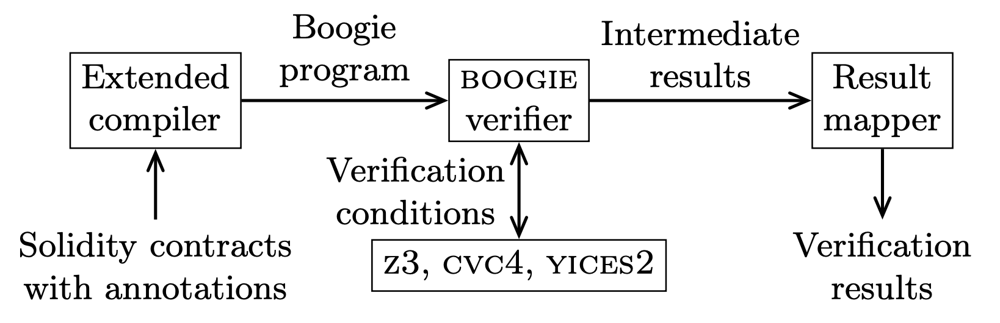

### نمای کلی ماژول‌های solc-verify

کامپایلر توسعه‌یافته، برنامه‌ای Boogie از قرارداد Solidity تولید می‌کند، که با استفاده از حل‌کننده SMT بررسی شده و در نهایت نتایج به سطح کد Solidity بازگردانده می‌شود.

---

## VeriSol

**VeriSol (اعتبارسنج برای Solidity)** پروژه‌ای تحقیقاتی از مایکروسافت است برای نمونه‌سازی یک سیستم اعتبارسنجی رسمی و تحلیل قراردادهای هوشمند نوشته‌شده به زبان Solidity. این ابزار برنامه‌های Solidity را به زبان میانی Boogie ترجمه کرده و سپس با استفاده از زنجیره ابزار Boogie اعتبارسنجی را انجام می‌دهد.

این ابزار تلاش می‌کند اثبات کند که قرارداد، مجموعه‌ای از ویژگی‌ها را رعایت می‌کند یا مجموعه‌ای از تراکنش‌هایی را ارائه دهد که آن ویژگی‌ها را نقض می‌کند.

توابع `assert` و `require` را به‌صورت مستقیم درک می‌کند و همچنین از مفهومی به نام Code Contracts نیز پشتیبانی می‌کند.

تابع `transfer` به‌شکل زیر تجهیز شده است:

~~~~solidity
function transfer(address recipient, uint256 amount) public returns (bool) {
  _transfer(msg.sender, recipient, amount);
  assert (VeriSol.Old(_balances[msg.sender] + _balances[recipient]) == _balances[msg.sender] + _balances[recipient]);
  assert (msg.sender == recipient || ( _balances[msg.sender] == VeriSol.Old(_balances[msg.sender] - amount));
  return true;
}
~~~~

مشخصه ساده است. انتظار داریم موجودی گیرنده به اندازه `amount` افزایش یابد و به همان اندازه از موجودی `msg.sender` کم شود.

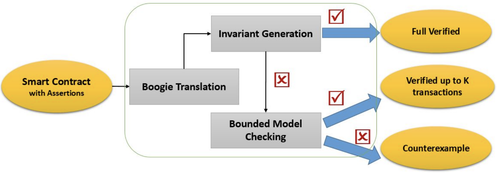

---

## چارچوب K

**چارچوب K** یکی از قدرتمندترین و کامل‌ترین چارچوب‌های تعریف زبان‌های برنامه‌نویسی است. این چارچوب به شما اجازه می‌دهد زبان برنامه‌نویسی خودتان را تعریف کرده و مجموعه‌ای از ابزارها از جمله مدل اجرایی و ابزارهای بررسی صحت برنامه برای آن زبان فراهم می‌کند.

چارچوب K یک زبان متا (meta-language) مدولار، کاربرپسند و دقیق از نظر ریاضی برای تعریف زبان‌های برنامه‌نویسی، سیستم‌های نوع‌دهی و ابزارهای تحلیل ارائه می‌دهد. چارچوب K شامل مشخصات رسمی برای زبان‌های C، Java، JavaScript، PHP، Python و Rust است. همچنین، این چارچوب امکان بررسی صحت قراردادهای هوشمند را فراهم می‌کند.

چارچوب K از ۸ مؤلفه اصلی تشکیل شده که در تصویر زیر نمایش داده شده‌اند:

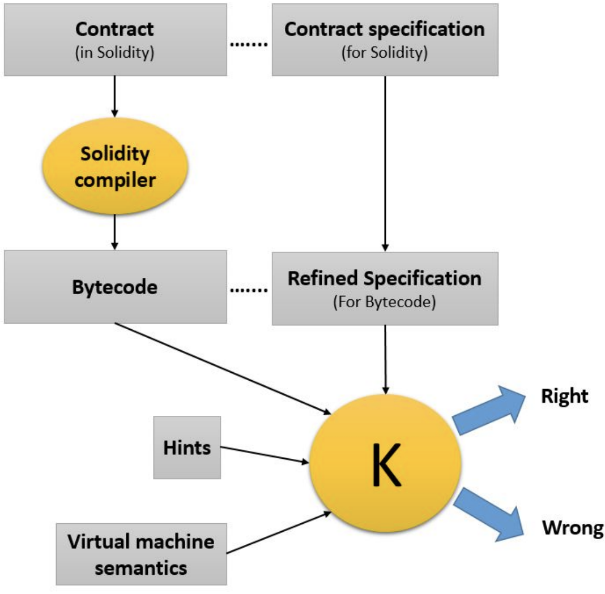

**KEVM** اولین پیاده‌سازی اجرایی ماشین‌پذیر، خوانا برای انسان و کامل از لحاظ ریاضی برای معنای رسمی EVM است. KEVM هم محیط اجرای مبتنی بر پشته (stack-based) و هم وضعیت شبکه، شبیه‌سازی گاز و جنبه‌های سطح بالا مانند داده‌های فراخوانی ABI را پیاده‌سازی می‌کند.

اگر مشخصات رسمی یک زبان تعریف شده باشد، چارچوب K می‌تواند ابزارهایی مانند مفسر و کامپایلر را به‌صورت خودکار تولید کند. با این حال، این چارچوب نیازمند تلاش زیاد و ترجمه‌های دستی فراوانی است که مستعد خطا بوده و همچنان دارای نقص‌هایی است.

### منابع

- آموزش K [k tutorial](https://www.youtube.com/watch?v=9PLnQStkiUo)
- مشخصات ERC20 با استفاده از KEVM

---

## بررسی SMT در Solidity

**SMTChecker** یک ماژول است که به‌طور خودکار تلاش می‌کند ثابت کند کد، مشخصات تعیین‌شده توسط دستورات `require` و `assert` را رعایت می‌کند. به این صورت که دستورات `require` را به‌عنوان فرض در نظر گرفته و سعی می‌کند نشان دهد شرایط داخل `assert` همیشه برقرار هستند.

### بررسی‌هایی که انجام می‌شود:

- سرریز و کم‌ریزی محاسباتی (overflow/underflow)
- تقسیم بر صفر
- شرایط پیش پا افتاده و کد غیرقابل دستیابی
- خالی کردن آرایه خالی
- دسترسی خارج از محدوده به اندیس‌ها
- نبود وجوه کافی برای انتقال

### فعال‌سازی SMTChecker

از طریق خط فرمان:

~~~~bash
solc overflow.sol \
    --model-checker-targets "underflow,overflow" \
    --model-checker-engine all
~~~~

در Remix (منسوخ‌شده):

~~~~solidity
pragma experimental SMTChecker;
~~~~

---

## SMT در Foundry

### مثال در Foundry

قرارداد:

~~~~solidity
contract ERC20 {
    address immutable owner;
    mapping(address => uint256) public balanceOf;

    constructor() {
        owner = msg.sender;
    }

    function mint(address user, uint256 amount) external {
        require(msg.sender == owner, "Only owner can mint");
        balanceOf[user] += amount;
    }

    function transfer(address to, uint amount) external {
        balanceOf[msg.sender] -= amount;
        balanceOf[to] += amount;
    }
}
~~~~

نوشتن تست:

~~~~solidity
contract ERC20Test is Test {
    ERC20 token;
    address Alice = makeAddr("Alice");
    address Bob = makeAddr("Bob");
    address Eve = makeAddr("Eve");

    function setUp() public {
        token = new ERC20();
        token.mint(Alice, 10 ether);
        token.mint(Bob, 20 ether);
        token.mint(Eve, 30 ether);
    }

    function testTransfer(address from, address to, uint256 amount) public {
        vm.assume(token.balanceOf(from) >= amount);

        uint256 preBalanceFrom = token.balanceOf(from);
        uint256 preBalanceTo = token.balanceOf(to);

        vm.prank(from);
        token.transfer(to, amount);

        if(from == to) {
            assertEq(token.balanceOf(from), preBalanceFrom);
            assertEq(token.balanceOf(to), preBalanceTo);
        } else {
            assertEq(token.balanceOf(from), preBalanceFrom - amount);
            assertEq(token.balanceOf(to), preBalanceTo + amount);
        }
    }
}
~~~~

افزودن پیکربندی به فایل `foundry.toml`:

~~~~bash
[profile.default.model_checker]
contracts = {'../src/ERC20.sol' = ['ERC20']}
engine = 'all'
timeout = 10000
targets = ['assert']
~~~~

---

## Echidna

**Echidna** یک ابزار تست مبتنی بر fuzzing و ویژگی (property-based testing) مبتنی بر Haskell برای قراردادهای هوشمند اتریوم است. این ابزار ورودی‌هایی تولید می‌کند که با ABI قرارداد مطابقت دارند و بررسی می‌کند آیا پیش‌شرط‌ها یا ادعاهای تعریف‌شده توسط کاربر نقض شده‌اند یا خیر.

### ویژگی‌ها
- تولید ورودی متناسب با کد واقعی شما
- جمع‌آوری مجموعه نمونه، جهش و راهنمایی پوشش برای یافتن خطاهای عمیق‌تر
- استفاده از Slither برای استخراج اطلاعات مفید پیش از fuzzing
- یکپارچگی با کد برای بررسی خطوط تحت پوشش پس از تست
- رابط کاربری مبتنی بر curses، خروجی متنی یا JSON
- کوچک‌سازی خودکار نمونه‌های تست برای تحلیل سریع
- یکپارچگی ساده با جریان توسعه
- گزارش مصرف حداکثر گاز در طول تست
- پشتیبانی از مقداردهی اولیه پیچیده قرارداد با Etheno و Truffle

### راهنمای اجرای تست Echidna

**Echidna** تست‌های مبتنی بر ویژگی را که به زبان Solidity نوشته شده‌اند اجرا می‌کند. فایل اجرایی اصلی `echidna-test` نام دارد. این ابزار یک قرارداد و لیستی از ناورداها (invariants) را می‌گیرد، توالی تصادفی‌ای از فراخوانی‌ها را ایجاد می‌کند و بررسی می‌کند آیا این ناورداها همچنان برقرار هستند یا نه.

اگر توالی‌ای پیدا کند که ناوردایی را نقض کند، آن توالی را چاپ می‌کند؛ در غیر این‌ صورت، اطمینان نسبی می‌دهد که قرارداد تحت شرایط تست‌شده درست عمل می‌کند.

---

#### نصب

برای نصب Echidna، اطمینان حاصل کنید که [Haskell Stack](https://docs.haskellstack.org/en/stable/README/) نصب است، سپس:

~~~~bash
$ git clone https://github.com/crytic/echidna.git
$ cd echidna
$ stack install
~~~~

---

#### نوشتن ناورداها

ناورداها به صورت **توابع Solidity** نوشته می‌شوند:

- باید با `echidna_` شروع شوند
- باید مقدار `bool` بازگردانند
- نباید آرگومان بگیرند

##### مثال

اگر تراز حساب در قراردادتان نباید زیر ۲۰ برود، بنویسید:

~~~~solidity
function echidna_check_balance() public returns (bool) {
    return(balance >= 20);
}
~~~~

---

#### اجرای Echidna

برای اجرای تست روی قرارداد:

~~~~bash
$ echidna-test MyContract.sol
~~~~

Echidna سعی می‌کند ورودی‌هایی را پیدا کند که ناورداها را نقض کنند.

---

#### مثال قرارداد

~~~~solidity
// SPDX-License-Identifier: MIT
pragma solidity ^0.8.0;

contract BalanceCheck {
    uint256 public balance = 100;

    function withdraw(uint256 amount) public {
        balance -= amount;
    }

    function echidna_check_balance() public view returns (bool) {
        return (balance >= 20);
    }
}
~~~~

---

## ConsenSys Scribble

**Scribble** یک ابزار بررسی در زمان اجرا (runtime verification) است که یادداشت‌ها (annotations) را به دستورات `assert` تبدیل کرده و امکان تست با fuzzing و اجرای نمادین (symbolic execution) را فراهم می‌سازد.

### نصب

~~~~bash
npm install -g eth-scribble
~~~~

افزودن ناورداها به صورت زیر:

~~~~solidity
import "Base.sol";

contract Foo is Base {
    
    /// #if_succeeds {:msg "P1"} y == x + 1;
    
    function inc(uint x) public pure returns (uint y) {
        return x+1;
    }

}
~~~~

Scribble یک فایل قرارداد اصلاح‌شده تولید می‌کند که می‌توان آن را با MythX یا Mythril تست کرد.

---

## Foundry

Foundry به توسعه ابزارهای بررسی صحت رسمی مانند SMTChecker، فریمورک‌های تست و اجرای نمادین ادامه می‌دهد.

---

## Certora

**Certora Prover** با استفاده از SMT Solverها ویژگی‌هایی که در **زبان بررسی Certora (CVL)** تعریف شده‌اند را در قراردادهای هوشمند بررسی می‌کند.

### مثال یک قانون

~~~~solidity
rule withdraw_succeeds {
  env e;
  bool success = withdraw(e);
  assert success, "withdraw must succeed";
}
~~~~

مشخصات به‌گونه‌ای نوشته می‌شوند که همه ورودی‌های ممکن را از طریق اجرای نمادین و بررسی قواعد پوشش دهند.

---

## بررسی در زمان اجرا (Runtime Verification)

از **چارچوب K** و **KEVM** برای ارائه مشخصات اجرایی رسمی استفاده می‌کند.

# منابع
- [معنای زبان در چارچوب K](https://github.com/kframework/evm-semantics#readme)
- [آموزش چارچوب K](https://kframework.org/k-distribution/pl-tutorial/)
- [نمای کلی چارچوب K](https://runtimeverification.com/blog/k-framework-an-overview/)
- [مقاله بررسی صحت رسمی](https://medium.com/@teamtech/formal-verification-of-smart-contracts-trust-in-the-making-2745a60ce9db)
- [بررسی صحت قراردادهای هوشمند: یک مرور](https://www.sciencedirect.com/science/article/abs/pii/S1574119220300821)
- [بررسی صحت رسمی قراردادهای هوشمند با چارچوب K](https://www.apriorit.com/dev-blog/592-formal-verification-with-k-framework)
- [Solc-verify، ابزار بررسی صحت سطح کد برای قراردادهای Solidity](https://www.youtube.com/watch?v=1q2gSm3NuQA)

