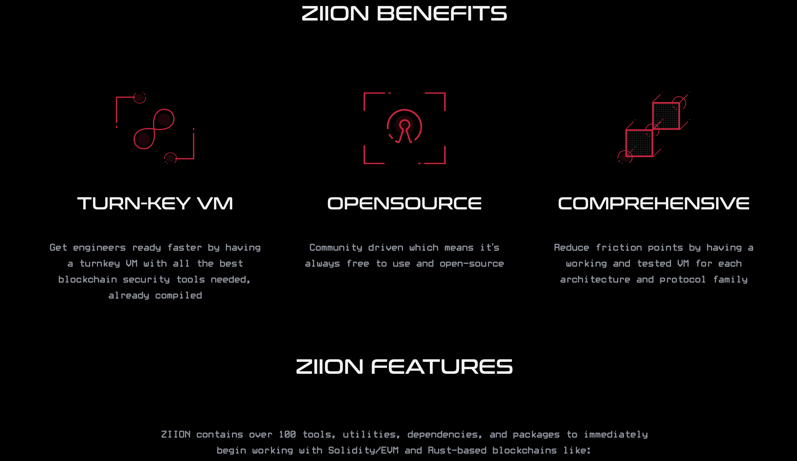

# فرآیند حسابرسی و گزارش‌دهی

## نمای کلی

فرآیند حسابرسی بین شرکت‌ها و افراد مختلف تفاوت زیادی دارد، چرا که هنوز استاندارد صنعتی پذیرفته‌شده‌ای وجود ندارد.

حسابرسی قراردادهای هوشمند یک سرویس امنیت اطلاعات تخصصی و خاص است که بر اساس نیاز به وجود آمده است.

هدف حسابرسی قراردادهای هوشمند، جلوگیری از دردسرهایی است که کارآفرینان، توسعه‌دهندگان و کاربران هنگام هک شدن یا شکست قراردادهای اتریوم تجربه می‌کنند. تغییرناپذیری به این معناست که اصلاح ممکن است دشوار و پرهزینه یا غیرممکن باشد. همچنین، تغییرناپذیری مستلزم آن است که نسخه‌های اولیه تولیدی بدون نقص باشند، اما با ورود توسعه‌دهندگان جدید، اشتباهات و سهل‌انگاری‌ها همچنان رایج خواهد بود. ماشین مجازی اتریوم (EVM) بستری ناآشنا است، بلاکچین در ابتدا پارادایمی ناآشنا است و سالیدیتی نیز زبانی تازه است. انتظار کمال از توسعه‌دهندگان جدید منطقی نیست.

مشاهده نابودی پروژه‌ها به‌دلیل مشکلات قابل‌پیشگیری، آگاهی عمومی را از اهمیت تضمین کیفیت پیشگیرانه افزایش داد. دو رویکرد شکل‌دهنده صنعت امنیت کد در اکوسیستم اتریوم بودند.

## باگ بانتی‌ها

اولین مورد، **باگ بانتی**‌ها هستند. باگ بانتی‌ها روشی آزمایش‌شده برای تقویت امنیت اطلاعات هستند. سازمان‌هایی مانند **HackerOne** برنامه‌های باگ بانتی را برای مشتریان سازمانی اجرا می‌کنند. باگ بانتی‌ها راهی برای جذب تعداد زیادی از توسعه‌دهندگان واجد شرایط جهت شناسایی مشکلات بحرانی هستند.

## بررسی صوری (Formal Verification)

**بررسی صوری** فرآیندی است که در آن خواص یک سیستم به صورت ریاضی اثبات می‌شود. برای این کار، یک **مشخصات صوری** از رفتار برنامه نوشته می‌شود. این مشخصات شبیه به بیانیه‌ای از رفتار مورد انتظار است، اما به زبان قابل خواندن برای ماشین نوشته می‌شود. سپس این مشخصات با استفاده از ابزارهای موجود، اثبات یا رد می‌شوند.

## حسابرسی چیست؟

حسابرسی عبارت است از:

- ارزیابی فرآیند توسعه امن شما  
- بهترین گزینه برای شناسایی آسیب‌پذیری‌های پنهان  
- روشی سیستماتیک برای بررسی کیفیت و امنیت کد  

فرصتی برای:

- یادگیری از متخصصان  
- شناسایی خلأهای موجود در فرآیند توسعه  
- شناسایی بخش‌های ناقص‌مشخص شده سیستم  

اما حسابرسی نمی‌تواند:

- جایگزین تضمین کیفیت داخلی شود  
- بر پیچیدگی بیش از حد یا معماری ضعیف غلبه کند  
- تضمین‌کننده نبود هیچ باگ یا آسیب‌پذیری نباشد  

# شرکت‌های حسابرسی

- OpenZeppelin  
- CertiK  
- PeckShield  
- Extropy  

برای انتخاب شرکت، می‌توانید به **تابلوی رتبه‌بندی Rekt News** مراجعه کنید.

# فرآیند حسابرسی

حسابرسی یک قرارداد هوشمند شامل بررسی سیستماتیک کد منبع مشخص‌شده در دامنه است، به‌منظور ارائه اطمینان منطقی از اینکه کد طبق انتظار رفتار می‌کند و هیچ آسیب‌پذیری ندارد.

**اطمینان منطقی** مهم است، زیرا تضمین نبود باگ در یک کد غیرممکن است. هنگام نگارش گزارش، از این نکته آگاه باشید. اعلام اینکه یک کد بدون باگ است، بی‌مسئولیتی است و می‌تواند منجر به مشکلات حقوقی شود.

شرکت حسابرسی **در برابر مسئولیت‌های احتمالی محافظت می‌شود**. حسابرس **ریسک شهرت** را می‌پذیرد.

برای تأکید، حسابرسان باید در تمام اشکال ارتباط دقت کنند تا در ظاهر، به‌طور ناخواسته **مسئولیت پروژه را برعهده نگیرند**.

# چگونه همه این روش‌ها با هم ترکیب می‌شوند؟

بهترین فرآیندها، **ترکیبی از چند رویکرد** هستند تا احتمال شناسایی باگ افزایش یابد.

مثال اخیر: مجموعه قراردادهای هوشمند **Multi Collateral DAI** از MakerDAO. بیشتر قراردادها به‌صورت صوری بررسی شده بودند و یک حسابرسی هم انجام شد. این شروع فرآیندی عالی بود.

با این حال، یک **باگ بحرانی به ارزش ۵۰٬۰۰۰ دلار آمریکا** از طریق **برنامه باگ بانتی** آن‌ها شناسایی شد که نشان‌دهنده ارزش باگ بانتی حتی پس از حسابرسی و بررسی صوری است.

فرآیند پیشنهادی ما:

1. یک یا چند **حسابرسی**
2. سپس یک **برنامه باگ بانتی پرهزینه**
3. ویژگی‌های برنامه بانتی:
   - **مدت‌زمان کافی** برای جلب اطمینان
   - **پاداش‌های قابل‌توجه** برای باگ‌های بحرانی

---

# برآورد و قیمت‌گذاری حسابرسی قراردادهای هوشمند

## هدف از برآورد

هدف از برآورد، ارزیابی کارآمد عوامل کلیدی تأثیرگذار بر زمان و تلاش واقعی است.  
در اینجا، "کارآمد" به معنای بررسی سطحی کدی است که زمان زیادی نمی‌برد.  
نکته کلیدی، دانستن این است که به دنبال چه چیزی باید بود.

> بسیاری از شرکت‌ها براساس خطوط کد قیمت می‌دهند.  
> اما تجربه ما نشان می‌دهد که **تعداد خطوط کد** شاخص ضعیفی است.  
> **پیچیدگی** شاخص بهتری برای مدت‌زمان واقعی لازم برای حسابرسی است.  
> یک قرارداد هوشمند بسیار بزرگ و یکپارچه، معمولاً آسان‌تر از چند قرارداد کوچک و درهم‌تنیده حسابرسی می‌شود.

---

## شاخص‌های مفید

### ۱. تعداد تماس‌های خارجی

- تعداد تماس‌های خارجی شاخصی قوی از پیچیدگی است.
- تماس‌های خارجی بر بخش‌های مختلفی از کد تأثیر می‌گذارند.
- مثال: حتی پیاده‌سازی‌های ساده مانند توکن‌های ERC20 می‌توانند رفتار غیرمنتظره داشته باشند.
  - توکن‌های **USDT** و **OMG** برای انتقال موفق، مقدار `true` برنمی‌گردانند.
  - تماس با **قراردادهای غیرقابل‌اعتماد** باید از نظر رفتار مخرب بررسی شود.
  - در **هک SpankChain**، مهاجم از یک توکن ERC20 مخرب استفاده کرد که در تابع `transfer` مجدداً وارد قرارداد SpankChain شد.

### ۲. تعداد توابع public / external

- این‌ها **نقاط ورود** برای اجرا هستند.
- تعیین‌کننده تعداد مسیرهای اجرایی و تعاملات هستند.

### ۳. استفاده از اسمبلی سالیدیتی

- اسمبلی سخت‌تر خوانده و درک می‌شود.
- اپکدهای بیشتری در دسترس است و محافظت‌های سالیدیتی اعمال نمی‌شوند.
- حسابرسی چنین کدی زمان بیشتری می‌برد.

### ۴. بوی بد کد (Code Smell)

- به دنبال نشانه‌هایی از:
  - راه‌حل‌های بیش از حد هوشمندانه
  - رویکردهای جدید یا آزمایشی
  - هر چیزی که با شیوه‌های استاندارد سالیدیتی **ناسازگار** باشد

---

## زمانی که مشتری دامنه را مشخص می‌کند

### ۱. حسابرسی فقط برخی فایل‌ها

- مشتریان ممکن است بخواهند فقط برخی فایل‌ها را در یک پایگاه کد بزرگ‌تر بررسی کنید.
- **قانون مهم**: همه **قراردادهای خارج از دامنه را غیرقابل‌اعتماد فرض کنید**.
  - حتی اگر مشتری آن‌ها را معتبر بداند، **شما بررسی نکرده‌اید**.
  - به‌ویژه تماس‌های بین قراردادهای داخل دامنه و خارج از دامنه را بررسی کنید.

### ۲. حسابرسی نسخه اصلاح‌شده قبلاً حسابرسی‌شده

- به عنوان یک **حسابرسی کامل** با آن برخورد کنید.
- حتی اگر فقط "چند خط تغییر کرده"، منطق کلی را دوباره بررسی کنید.
- شما مسئول **اعتبار تیم خودتان** هستید، نه تیم‌های قبلی.

---

## مسئولیت حسابرس

- مشتری را راهنمایی کنید تا **ریسک‌های حذف بخش‌هایی از کد** را درک کند.
- به او نشان دهید که هر تعامل بین قراردادهای در دامنه و خارج از دامنه ممکن است **آسیب‌پذیری ایجاد کند**.
- در گزارش نهایی، **به‌وضوح مشخص کنید** کدام کد در دامنه بوده و کدام نبوده است.
- مشتری و خوانندگان گزارش **به شما تکیه دارند** تا نگرانی‌ها را مطرح کرده و از سلامت کد محافظت کنید.

---

# راهنمای فرآیند حسابرسی

## فرآیند

Extropy از فرآیندی بسیار خاص برای حسابرسی قراردادهای هوشمند استفاده می‌کند.

- **ترکیب تیم**: همه حسابرسی‌ها شامل **سه حسابرس** هستند، مگر در حسابرسی‌های بسیار ساده که ممکن است با دو نفر انجام شوند.
- **جلسه بررسی نهایی**: نزدیک به تاریخ تحویل برنامه‌ریزی می‌شود.
  - برخی آسیب‌پذیری‌ها فقط توسط برخی حسابرسان کشف می‌شوند.
  - این فرآیند لایه‌ای از تجربه و گردش کارهای متنوع بهره می‌برد.
- **روش‌شناسی حسابرسی**:
  - حسابرسان ملزم به پیروی از فرآیند خاصی نیستند.
  - حسابرسان از ابزارها و روش‌هایی که به آن اعتماد دارند استفاده می‌کنند.
  - در جلسه نهایی، گزارش‌های فردی به **گزارش نهایی Extropy** ادغام می‌شود.

## دوره اصلاح

پس از تحویل گزارش:

1. مشتری می‌تواند **اصلاحات** را ارائه دهد.
2. تیم حسابرسی **تأثیر اصلاحات را بررسی و مستندسازی** می‌کند.
3. تغییرات در کامیت‌های مشخص ذکر می‌شوند.
4. نسخه‌ای که آخرین بار بررسی شده در خلاصه گزارش ثبت می‌شود.

> بسته به ترجیح مشتری، گزارش‌ها می‌توانند عمومی شوند.

## پس از حسابرسی

به مشتریان توصیه می‌شود:

- یک **برنامه باگ بانتی پرپاداش** راه‌اندازی کنند.

مزایا:

- شکارچیان باگ معمولاً به دنبال باگ‌های بحرانی هستند، اما باگ‌های دیگر را هم گزارش می‌دهند.
- آن‌ها روی **بخش‌های پرریسک** تمرکز می‌کنند که مکمل حسابرسی است.
- در ترکیب با حسابرسی، **کل پایگاه کد امن می‌شود**:
  - حسابرسی کل کد را پوشش می‌دهد.
  - باگ بانتی نگاه‌های اضافی بر بخش‌های پرریسک اضافه می‌کند.

## گزارش حسابرسی

**گزارش حسابرسی** محصول نهایی است.

### بخش‌های استاندارد

- **مشخصات مشتری**
- **تاریخ**
- **دامنه** (فهرست فایل‌ها)
- **هش کامیت و مخزن کد**
- **باگ‌ها**
- **روش‌شناسی حسابرسی**
- **نتیجه‌گیری**

### نکات

- ذکر کنید **چه کسی حسابرسی را درخواست کرده**. اگر ناشناس است، به‌صراحت بگویید.
- شامل موارد زیر باشید:
  - تاریخ انتشار
  - فایل‌های بررسی‌شده
  - باگ‌ها و نگرانی‌ها
  - نتیجه‌گیری کلی از سلامت کد

### مخاطب گزارش

- گزارش ممکن است توسط ذی‌نفعان غیرتخصصی (مثل سرمایه‌گذاران خطرپذیر) خوانده شود.
- لحن و محتوای گزارش را متناسب تنظیم کنید.
- برای مخاطب فنی:
  - مختصر بنویسید.
  - باگ‌ها را برای توسعه‌دهندگان و کاربران آشنا با اتریوم قابل‌درک کنید.

> **تأثیر احتمالی** را به‌روشنی توضیح دهید.  
> **توضیحات فنی دقیق** برای توسعه‌دهندگان را تضمین کنید.

## گزارش باگ

گزارش باگ، محصول اصلی حسابرسی‌ها و برنامه‌های باگ بانتی است.

### ویژگی‌های کلیدی

- **شفافیت**: گزارش باید باعث **درک** شود.
- **مخاطب**: اغلب کسانی هستند که کد را نوشته یا حسابرسی کرده‌اند.
- **لحن**: واقع‌گرایانه، بدون سرزنش.
- **پشتیبانی**: اطلاعات کافی برای پشتیبانی از ادعاها ارائه دهید.

### گزارش باگ باید شامل باشد:

1. **توصیف مشکل**
2. **عواقب**
3. **مراحل بازتولید**
4. **تأثیر**
5. **شدت**
6. **(اختیاری)** پیشنهاد رفع

> باگ‌ها ذهنی هستند و قابل بحث.

مثال‌هایی از باگ‌های پنهان:

- آسیب‌پذیری نظری اما نادر با **پیامدهای شدید**
- ناهنجاری رایج بدون **تأثیر جدی**

### مثال: حمله تاییدیه ERC20

اگرچه فرمت غیرمعمول بود، اما شامل:

- **زمینه**
- **مراحل سوءاستفاده**
- **تحلیل**
- **راهکار احتمالی**

### مثال: خالی بودن fallback در CryptoKitties

توسط **نیک جانسون** کشف شد.

- از فرمت معمول گزارش باگ بانتی پیروی می‌کند.
- شامل:
  - توضیح مختصر
  - پیامدها

---

# دسته‌بندی شدت

رتبه‌بندی ریسک و فرایندهای طبقه‌بندی بین سازمان‌ها تفاوت زیادی دارد. حتی با وجود دسته‌های رایج مانند **بحرانی**، **مهم** و **جزئی**، تعاریف ممکن است متفاوت باشند.

این نشان‌دهنده نبود استاندارد واحد در این فضا است. هنگام یافتن یک باگ، طبقه‌بندی آن طبق استانداردهای **تیم حسابرسی محلی** یا **برنامه باگ بانتی** اهمیت دارد.

آماده باشید که **از طبقه‌بندی خود دفاع کنید** و **باگ را به‌وضوح توصیف کنید**.

## استانداردهای صنعتی

دو استاندارد شناخته‌شده در صنعت امنیت:

- **OWASP** (پروژه امنیتی اپلیکیشن‌های وب باز) — مورد استفاده بنیاد اتریوم
- **CVSS** (سیستم امتیازدهی آسیب‌پذیری‌های رایج)

---

# طبقه‌بندی ریسک OWASP

**فرمول:**  
`ریسک = احتمال × تأثیر`

ریسک حاصل ضرب این دو است:

- **احتمال** بهره‌برداری از باگ
- **تأثیر** زمانی که باگ مورد بهره‌برداری قرار می‌گیرد

OWASP چارچوبی برای کمّی‌سازی هر دو بُعد ارائه می‌دهد.

---

## احتمال

احتمال به دو دسته عامل تقسیم می‌شود:

### عوامل عامل تهدید (Threat Agent)

برآورد می‌کند که چقدر احتمال دارد یک مهاجم از آسیب‌پذیری سوءاستفاده کند.

- **مهارت‌ها**: مهاجم چقدر مهارت فنی دارد؟
- **انگیزه**: چقدر انگیزه برای بهره‌برداری دارد؟
- **فرصت**: آیا دسترسی/منابع لازم را دارد؟
- **تعداد**: چند مهاجم ممکن است وجود داشته باشند؟

### عوامل آسیب‌پذیری

برآورد می‌کند که چقدر احتمال دارد آسیب‌پذیری کشف و استفاده شود.

- **سهولت کشف**: چقدر آسان است پیدا کردن آن؟
- **سهولت بهره‌برداری**: چقدر آسان است بهره‌برداری؟
- **شناخت عمومی**: آیا این آسیب‌پذیری شناخته‌شده است؟
- **کشف نفوذ**: آیا می‌توان بهره‌برداری را تشخیص داد؟

---

## تأثیر

تأثیر از بُعد فنی و کسب‌وکار تخمین زده می‌شود.

### عوامل تأثیر فنی

باگ چگونه جنبه‌های سنتی امنیت را تحت تأثیر قرار می‌دهد؟

- **از دست رفتن محرمانگی**
- **از دست رفتن یکپارچگی**
- **از دست رفتن در دسترس بودن**
- **از دست رفتن قابلیت پیگیری**

### عوامل تأثیر کسب‌وکار

بسیار وابسته به سازمان هستند:

- **خسارت مالی**
- **آسیب به شهرت**
- **عدم انطباق با قوانین**
- **نقض حریم خصوصی**

OWASP یک فایل اکسل برای کمک به این ارزیابی‌ها فراهم می‌کند.

---

# مدل ساده‌شده شدت برای قراردادهای هوشمند

این مدل معمولاً در برنامه‌های باگ بانتی اتریوم استفاده می‌شود:

- **بحرانی**: دزدی یا فریز شدن وجوه کاربران.
- **شدید**: کاربر مزیت ناعادلانه‌ای کسب می‌کند.
- **جزئی**: بدون خطر مالی، اما موجب اصطکاک یا اشکال در UI.
- **اطلاعاتی**: پیشنهادهای بهبود یا نکات غیر بحرانی.

---

# تکنیک‌های ممیزی به‌صورت دقیق‌تر

این‌ها اصول کلی ممیزی هستند—نه قوانین سخت‌گیرانه. هر ممیز با تجربه سبک خاص خود را توسعه می‌دهد.

---

## درک سطح بالا

در ابتدا، هدف ساخت یک **مدل ذهنی** از سیستم است:

1. **مرور سریع** همه فایل‌ها  
2. خواندن **نام‌ها و امضاهای توابع**  
3. توجه به **طرح‌های ارث‌بری**

در ابتدا زیاد روی باگ‌ها تمرکز نکنید—درک کنید که اجزاء چگونه با هم در ارتباط‌اند.

---

## خواندن مشخصات… یا نه؟

برخی ممیزها ابتدا مشخصات (spec) را می‌خوانند تا رفتار مورد انتظار را بفهمند.

برخی دیگر استدلال می‌کنند این باعث **سوگیری تأییدی** می‌شود چون مشخصات معمولاً توسط توسعه‌دهندگان نوشته شده‌اند.

براساس سبک خود تصمیم بگیرید.

---

## بررسی دقیق

شما می‌توانید:

- **فایل به فایل** جلو بروید، یا
- یک **کارکرد خاص** مثل واریز یا برداشت را دنبال کنید و جریان کامل آن را بررسی کنید.

هر روش بینش متفاوتی می‌دهد، پس ترجیحاً از هر دو استفاده کنید.

### نکات

- **کد را اجرا کنید**:
  - آن را کامپایل کنید
  - تست‌های موجود را اجرا کنید
  - آن را در **Remix** بارگذاری و با آن تعامل داشته باشید
- این مراحل کمک می‌کنند با کد آشنا شوید.

---

# ممیزی – از نگاه مشتری

## آماده‌سازی برای ممیزی

رعایت این مراحل به شما کمک می‌کند بهترین نتیجه را از ممیزی بگیرید.

- مستندسازی  
- کد تمیز  
- تست  
- تحلیل خودکار  
- فریز کردن کد  
- استفاده از چک‌لیست  

ما زمان محدودی برای بررسی کد شما داریم.  
آماده‌سازی شما، به ما کمک می‌کند بهترین ارزش را ارائه دهیم.  
ما ابتدا باید کد شما را درک کنیم تا آسیب‌پذیری‌های ظریف را شناسایی کنیم.  
فرض کنید ما یک توسعه‌دهنده جدید هستیم که به تیم شما ملحق شده‌ایم، ولی فقط چند روز برای درک کد زمان داریم.

---

## 1. مستندسازی

هرچه زمان کمتری برای درک سیستم شما صرف کنیم، سریع‌تر وارد کد شده و زمان بیشتری برای پیدا کردن باگ خواهیم داشت.  
پس مهم‌ترین کاری که می‌توانید برای بهبود کیفیت ممیزی انجام دهید، **ارائه مستندات خوب** است.

مستندات خوب با توضیح انگلیسی ساده از اینکه چه چیزی می‌سازید و چرا می‌سازید، شروع می‌شود—برای کل سیستم و هر قرارداد منحصربه‌فرد در آن.

ویژگی دیگر مستندات خوب، ارائه مشخصات عملکرد مورد انتظار سیستم است.  
برای هر قرارداد، باید ویژگی‌ها یا رفتارهای مهمی که باید حفظ شوند، و مواردی که نباید ممکن باشند را توضیح دهد.

یکی از بهترین نمونه‌ها، مستندات پروتکل 0xProject است. استفاده آن‌ها از فلوچارت‌ها به‌خوبی نشان می‌دهد که سیستم چگونه به هم متصل است.

نوشتن مستندات خوب نیازمند تلاش زیاد است. حتی برای ممیزها مفید است که خودشان رفتار کد را مستندسازی کنند. این کار می‌تواند باعث کشف آسیب‌پذیری‌ها و موارد لبه‌ای غیرمنتظره شود.

در مورد مشخصات شبه‌کد چطور؟  
ما بیشتر روی “انگلیسی ساده” تأکید می‌کنیم، چون بهتر بیان می‌کند که واقعاً کد باید چه کند. در حالی که کد و شبه‌کد معمولاً آنقدر شبیه‌اند که تشخیص اشتباه در هر دو سخت است.

شبه‌کد برای ریاضیات پیچیده مفید است، اما باید با توضیح انگلیسی از هدف آن ریاضی همراه باشد.

> هرچه کمتر برای درک سیستم وقت بگذاریم، بیشتر برای یافتن باگ وقت داریم.

### چک‌لیست مستندات خوب:

- توصیف سیستم کلی و اهداف آن  
- توصیف چیزهایی که نباید ممکن باشند  
- لیستی از قراردادهایی که ایجاد/مشتق شده‌اند و تعامل آن‌ها  

مستندسازی به بهبود کد نیز کمک می‌کند.

**نمونه‌های مستندات خوب:**
- مشخصات پروتکل 0x
- نمونه از Polymath

---

## 2. تمیز کردن کد

کدی که مرتب و خوب قالب‌بندی شده باشد، راحت‌تر خوانده می‌شود و تمرکز ما را روی یافتن باگ بیشتر می‌کند.

### روش‌های پیشنهادی:

- اجرای linter روی کد. تمام خطاها/هشدارها را رفع کنید مگر اینکه دلیل موجهی داشته باشید.
  - برای Solidity از `Ethlint` یا linter موجود در Remix استفاده کنید.
  - `Solidity Template` ابزارهای مفیدی را در یکجا جمع کرده.
- رفع هشدارهای کامپایلر.
- حذف نظرات `TODO` یا `FIXME` (به‌ویژه در مرحله نهایی).
- حذف کدهای بدون استفاده یا کامنت شده.
- اضافه کردن کامنت‌های مفید برای توضیح نیت کد.

### کامنت‌های NatSpec

از کامنت‌های NatSpec برای توصیف رفتار و انتظارات هر تابع استفاده کنید.

---

## 3. تست

تست بنویسید! هدف خوب: دستیابی به **پوشش ۱۰۰٪ کد**.

### مواردی که باید بررسی شوند:

- مرور لیست تست‌ها برای شناسایی کاستی‌ها  
- فقط مسیر موفقیت‌آمیز را تست نکنید. تست‌هایی بنویسید که:
  - اقدامات نامطلوب را مسدود کنند
  - مطمئن شوند قرارداد در حالت نامطلوب گیر نمی‌کند

**مهم:**  
فایل `README.md` باید دستورالعمل واضحی برای اجرای تست‌ها ارائه دهد.

- اگر وابستگی‌ها (مثلاً Truffle) همراه کد نیستند، آن‌ها و نسخه دقیق‌شان را لیست کنید.

---

## 4. تحلیل خودکار

اتریوم ابزارهای امنیتی خوبی برای تحلیل خودکار دارد. ما در ممیزی از آن‌ها استفاده می‌کنیم، و شما هم می‌توانید از قبل اجرا کنید.

### ابزارهای پیشنهادی:

- **MythX**: مجموعه‌ای از تحلیل‌ها با قابلیت اجرا از طریق:
  - ابزار CLI (جاوااسکریپت، پایتون)
  - افزونه‌های Remix و Truffle
- **افزونه‌های VSCode**:
  - Solidity Metrics
  - MythX for Remix
- **ابزار UML برای Solidity** برای تجسم ساختار کد

> توجه: شاید هشدارهای اشتباه دریافت کنید، اما همچنان مفید است.

ابزارهای بیشتر در: [Smart Contract Best Practices](https://consensys.github.io/smart-contract-best-practices/)

---

## 5. فریز کردن کد

**ما نمی‌توانیم کدی را ممیزی کنیم که در حال تغییر است.**

ممیزی سرمایه‌گذاری در امنیت سیستم قرارداد هوشمند شماست. برای بهره‌وری بیشتر:

- در شروع ممیزی تأیید کنید که "کد فریز شده" است (توسعه متوقف شده).
- یک **commit hash** خاص از Git ارائه دهید که هدف ممیزی است.

اگر در طول ممیزی تغییری انجام شود:

- ممیزها زمان را روی کد منسوخ تلف می‌کنند.
- باید تغییر را در نظر بگیرند که کل مدل تهدید را تحت تأثیر قرار می‌دهد.

**اگر کد تا زمان شروع ممیزی آماده نیست:**  
بهتر است **ممیزی را به تعویق بیندازید** تا اینکه با کد ناقص جلو بروید.

---

## 6. استفاده از چک‌لیست

از چک‌لیست زیر برای آماده‌سازی ممیزی استفاده کنید.

### چک‌لیست آماده‌سازی ممیزی

## ✅ مستندسازی

- [ ] ارائه توضیح انگلیسی ساده از چی و چرا.
- [ ] مشخص کردن اقدامات و وضعیت‌های مطلوب.
- [ ] مشخص کردن اقدامات و وضعیت‌های ممنوع.
- [ ] شامل مستندات برای:
  - [ ] سیستم کلی
  - [ ] هر قرارداد منحصربه‌فرد

## ✅ کد تمیز

- [ ] اجرای linter مثل **EthLint**
- [ ] رفع همه هشدارهای کامپایلر
- [ ] حذف کامنت‌های `TODO` و `FIXME`
- [ ] حذف کدهای بدون استفاده یا کامنت‌شده

## ✅ تست

- [ ] وجود راهنمای اجرای تست در `README.md`
- [ ] اطمینان از اینکه وابستگی‌های تست:
  - [ ] همراه کد هستند، **یا**
  - [ ] در مستندات با نسخه دقیق لیست شده‌اند

## ✅ تحلیل خودکار

- [ ] اجرای ابزارهای تحلیل ایستا:
  - [ ] **MythX**
  - [ ] سایر ابزارها یا افزونه‌ها (مثل Remix، VSCode، Truffle)

## ✅ کد فریز شده

- [ ] توقف توسعه کد در زمان ممیزی
- [ ] ارائه یک **commit hash** خاص برای ممیزی

---

# ابزارهای تحلیل ایستا و تجسم

## تجسم

- **EVM Lab**  
- **Surya**  
  
- **Piet**  
- **Solidity Metrics**  
- **Solidity 2 UML Tool**  

## تحلیل ایستا و پویا

- [MythX](https://mythx.io/) - همچنین به عنوان افزونه Remix موجود است  
- **Slither**  
  - **فهرست آشکارسازها**  
- **Echidna**  
- **Vertigo** - چارچوب تست جهش  
- **Manticore**  

---

## معرفی Slither

مستندات کامل در مخزن موجود است.

**Slither** تحلیل ایستا روی کد منبع Solidity انجام می‌دهد و با استفاده از "آشکارسازها" آسیب‌پذیری‌ها و الگوهای شناخته شده را شناسایی می‌کند. همچنین ابزارهایی برای تجسم و درک قراردادها و جریان‌های برنامه دارد.

### ویژگی‌ها

- شناسایی کد آسیب‌پذیر Solidity با نرخ خطای پایین (فهرست جوایز را ببینید)  
- شناسایی محل وقوع شرایط خطا در کد منبع  
- ادغام آسان در خطوط CI و ساخت‌های Truffle  
- "چاپگرهای" داخلی برای گزارش سریع اطلاعات مهم قرارداد  
- API آشکارساز برای نوشتن تحلیل‌های سفارشی با پایتون  
- پشتیبانی از Solidity نسخه 0.4 به بالا  
- نمایش میانی (SlithIR) برای تحلیل دقیق  
- تجزیه ۹۹.۹٪ از کل کدهای عمومی Solidity  
- زمان اجرا متوسط کمتر از ۱ ثانیه برای هر قرارداد  

### قابلیت‌ها

Slither می‌تواند:

- گزارش‌های Markdown تولید کند  
- سلسله مراتب وراثت را نمایش دهد  
- گراف تماس (Call Graph) تولید کند  
- متغیرهای قابل به‌روزرسانی و مجوزهای تابع را نمایش دهد  
- قابلیت به‌روزرسانی را بررسی کند  
- کد را فلت (یک‌لایه) کند  
- ذخیره قرارداد را بخواند  

### نصب

~~~bash
pip3 install slither-analyzer
~~~

---

## چک‌لیست‌ها

- **SWC Registry**  
- **SCSVS** (استاندارد بررسی امنیت قرارداد هوشمند): چک‌لیست ۱۴ قسمتی برای استانداردسازی امنیت قراردادها  
- **مثال چک‌لیست توکن**  

### مثال چک‌لیست توکن

#### رفتار انتقال

- مقدار `bool` پس از `transfer()` برمی‌گرداند.  
- انتقال توکن‌ها به آدرس `0x0` ممنوع است.  
- انتقال توکن‌ها به آدرس قرارداد ممنوع است.  
- هوک `_beforeTokenTransfer` بازنویسی شود، شامل بررسی برای جلوگیری از انتقال توکن به خود قرارداد (`address(this)`).  
  مستندات برای نمونه پیاده‌سازی را ببینید.

#### توقف‌پذیری

- توکن‌های قابل توقف: ویژگی توقف تحت کنترل ادمین، کاربران را در برابر مالک مخرب یا به خطر افتاده توکن آسیب‌پذیر می‌کند.

#### فراخوانی‌های بازگشتی

- تماس‌های بازگشتی (ERC777): اطمینان حاصل شود که توکن **ERC777 نیست** و در `transfer` و `transferFrom` هیچ فراخوانی خارجی وجود ندارد.  
  فراخوانی‌های خارجی در توابع انتقال می‌توانند منجر به بازگشتی‌ها شوند.

#### کارمزدهای انتقال

- کارمزد در انتقال: `transfer` و `transferFrom` **نباید** کارمزد دریافت کنند.  
  توکن‌های کاهشی ممکن است رفتار غیرمنتظره ایجاد کنند.

#### تغییرات موجودی خارج از انتقال

- تغییرات موجودی خارج از انتقال (مثل rebasing / airdrops):  
  سود احتمالی توکن در نظر گرفته می‌شود.  
  برخی توکن‌ها سود را به دارندگان توکن توزیع می‌کنند.  
  این سود ممکن است اگر به درستی مدیریت نشود، در قرارداد محبوس شود.

#### قابلیت ارتقا

- توکن‌های قابل ارتقا: تغییر در معنای توکن می‌تواند قراردادهای هوشمند متکی به رفتار گذشته را بشکند.

#### ضرب آنی (Flash Minting)

- توکن‌های قابل ضرب آنی: پیامدها و احتمال سوءاستفاده‌های ناشی از مکانیک ضرب/سوزاندن فوری را در نظر بگیرید.

#### فهرست‌های مسدودسازی (Blocklists)

- توکن‌های دارای فهرست مسدودسازی: مالک مخرب یا به خطر افتاده می‌تواند با افزودن آدرس قرارداد به فهرست مسدود، وجوه را محبوس کند.

#### محافظت در برابر رقابت در تاییدیه‌ها

- محافظت در برابر رقابت در تاییدیه‌ها:  
  برخی توکن‌ها مانند USDT اجازه نمی‌دهند مبلغی `M > 0` وقتی مقدار موجود `N > 0` تایید شده باشد، تایید شود.  
  این [PR](https://github.com/d-xo/weird-erc20s/pull/1) برخی مشکلات واقعی ناشی از این موضوع را نشان می‌دهد.  
  برای جلوگیری:  
  - کلاینت‌ها **باید** رابط کاربری داشته باشند که ابتدا میزان مجاز را به ۰ برساند و سپس مقدار جدید را تنظیم کند.  
  - **اما** خود قرارداد نباید این را اجباری کند تا سازگاری با نسخه‌های قبلی حفظ شود.

#### انتقال‌های مقدار صفر

- برگشت در انتقال مقدار صفر:  
  برخی توکن‌ها (مثلاً LEND) در انتقال مقدار صفر برگشت می‌کنند.  
- هوک `_beforeTokenTransfer` بازنویسی شود تا از انتقال مقدار صفر جلوگیری شود.

#### دقت اعشار

- اعشار کم: ممکن است منجر به از دست رفتن دقت بیشتر از حد انتظار شود.  
- اعشار زیاد: ممکن است منجر به برگشت غیرمنتظره به دلیل سرریز شود و **ریسک زنده بودن** ایجاد کند.  
- مقدار `decimals` باید از نوع `uint8` باشد.

#### رفتار TransferFrom

- `transferFrom` وقتی `src == msg.sender`:  
  برخی پیاده‌سازی‌ها (مثل OpenZeppelin، Uniswap-v2) تلاش می‌کنند اجازه تماس‌گیرنده را حتی وقتی خود فرستنده است، کاهش دهند.  
  این باعث می‌شود `transfer(dst, amt)` و `transferFrom(address(this), dst, amt)` رفتار متفاوتی داشته باشند.

#### قالب متادیتا

- متادیتای غیررشته‌ای:  
  برخی توکن‌ها (مثلاً MKR) فیلدهای متادیتا (`name`، `symbol`) را به صورت `bytes32` کدگذاری می‌کنند نه رشته `string` طبق ERC20.

#### سوزاندن توکن‌ها

- برگشت در انتقال به آدرس صفر:  
  ممکن است سیستم‌هایی که انتظار دارند توکن را با انتقال به `address(0)` بسوزانند را مختل کند.

#### رفتار برگشتی

- برگشت در هنگام شکست:  
  قراردادها باید در هنگام شکست برگشت دهند، نه فقط مقدار `false` برگردانند.

- برگشت در تاییدیه‌ها و انتقال‌های بزرگ.

#### حملات تزریق

- تزریق کد از طریق نام توکن:  
  متادیتا باید به درستی اعتبارسنجی شود تا از حملات تزریق کد یا مشکلات قالب‌بندی جلوگیری شود.

#### سادگی

- اجتناب از پیچیدگی غیرضروری:  
  - توکن باید قرارداد ساده باشد.  
  - کد پیچیده نیازمند بررسی دقیق‌تر است.  
  - از چاپگر `human-summary` در Slither برای شناسایی منطق پیچیده استفاده کنید.

#### توابع غیرمرتبط با توکن

- حداقل نگه داشتن:  
  - قرارداد باید تنها چند تابع غیرمرتبط با توکن داشته باشد.  
  - از چاپگر `contract-summary` Slither برای ممیزی منطق غیرتوکنی استفاده کنید.

#### آدرس‌های توکن

- توکن فقط یک آدرس دارد:  
  - برخی توکن‌های پراکسی‌شده (مثل TUSD) چندین آدرس دارند.  
  - چند نقطه ورود برای به‌روزرسانی موجودی می‌تواند حسابداری داخلی را مختل کند:

    ~~~solidity
    balances[token_address][msg.sender] ممکن است منعکس‌کننده موجودی واقعی نباشد
    ~~~

#### توزیع

- هیچ کاربری مالک بیشتر عرضه نیست:  
  - تعداد کمی از کاربران که بخش عمده توکن‌ها را دارند، می‌توانند عملیات یا حکمرانی توکن را تحت تأثیر قرار دهند.

---

#### حملات شناخته‌شده ConsenSys

- بازگشتی  
- دستکاری اوراکل  
- پیش‌دستی  
- وابستگی به زمان  
- ریاضیات ناامن  
- حمله انکار سرویس  
- اذیت و آزار (Griefing)  
- تغذیه اجباری

---

## جعبه‌ابزار امنیت اتریوم (Trail of Bits)

شامل:

- **Echidna**: تست‌کننده مبتنی بر خواص  
- **Etheno**: ابزار یکپارچه‌سازی و تست تفاضلی  
- **Manticore**: تحلیلگر نمادین و تاییدکننده رسمی قرارداد  
- **Slither**: ابزار تحلیل ایستا  
- **Rattle**: تبدیل‌کننده کد EVM  
- مخزن **Not So Smart Contracts**

### نصب با داکر

~~~bash
docker pull trailofbits/eth-security-toolbox
docker run -it trailofbits/eth-security-toolbox
~~~

---

## ZIION از Halborn

- مستندات: [Docs](https://docs.ziion.org/)  
- قابل دانلود  

### بلاکچین‌های هدف

- اتریوم (EVM)  
- بیت‌کوین  
- سولانا  
- پالیگان  
- BSC  
- ساب‌استریت  
- Near  

---

## Solodit

مشکلات یافته شده در پلتفرم‌های **Code4rena** و **Sherlock** را فهرست می‌کند.

---

## zkPoEX

مخزن را ببینید.

**zkPoEX** (اثبات دانش صفر برای بهره‌برداری) نمونه‌ای آزمایشی است که در هکاتون ETHDenver توسعه یافته. این امکان را به هکرهای کلاه سفید می‌دهد تا آسیب‌پذیری‌های زنده در قراردادهای DeFi را با استفاده از اثبات‌های دانش صفر به صورت امن افشا کنند و محرمانگی بهره‌برداری را حفظ کنند.

---

## مسابقات ممیزی

می‌توانید کد خود را در پلتفرم‌هایی مانند:

- **Code Arena**  
- **Sherlock**  
  - مستندات را ببینید  

ارسال کنید یا مهارت‌های ممیزی خود را در مسابقات آن‌ها تمرین کنید.

---

## نمونه ممیزی‌ها

### حمله تایید ERC20  
[حمله تایید ERC20](https://docs.google.com/document/d/1YLPtQxZu1UAvO9cZ1O2RPXBbT0mooh4DYKjA_jp-RLM/edit)  
حمله اصلی تایید ERC20 را شرح می‌دهد. اگرچه قالب غیرمعمول است، شامل:  

- زمینه  
- مراحل بهره‌برداری  
- تحلیل کوتاه  
- راهکار ممکن  

### فاک بک خالی CryptoKitties  
[فاک بک خالی CryptoKitties](https://github.com/dapperlabs/cryptokitties-bounty/issues/3)  
توسط **Nick Johnson** در باگ بانتی اولیه CryptoKitties پیدا شده است. این مثال از قالب مختصر که در گزارش‌های باگ بانتی و ممیزی رایج است استفاده می‌کند، شرح:  

- توضیح  
- مراحل بهره‌برداری  
- پیامدها  

---

## پروژه‌های ذکر شده

- **Freeverse** [Freeverse](https://blog.openzeppelin.com/freeverse-audit)  
- **Celo** [Celo](https://blog.openzeppelin.com/celo-contracts-audit-release-6/)  
- **1Inch** [1Inch](https://blog.openzeppelin.com/1inch-fixed-rate-swap-audit)  

