<div dir="rtl">

# بررسی حادثه حمله Reentrancy در GMX V1 - ۹ جولای

## خلاصه

در **۹ جولای**، پروتکل مالی غیرمتمرکز (DeFi) **GMX V1** در شبکه **Arbitrum** دچار یک حمله‌ی فاجعه‌بار شد. حدود **۴۲ میلیون دلار** از **استخر نقدینگی GLP** تخلیه شد.

آسیب‌پذیری مورد سوءاستفاده، یک مشکل کلاسیک **بازگشت متقابل بین قراردادها (cross-contract reentrancy)** بود — اشکالی که **بیش از دو سال** در پروتکل وجود داشت، علی‌رغم شهرت بالای آن و ممیزی‌های قبلی.

---

## مکانیزم حمله

این حمله از یک آسیب‌پذیری در تابع **`executeDecreaseOrder()`** سوءاستفاده کرد؛ تابعی که معمولاً توسط "نگهدارنده‌ی سفارش" خودکار استفاده می‌شد.

### ۱. **فریب دادن نگهدارنده‌ی سفارش**
مهاجم یک **آدرس قرارداد مخرب** به تابع `executeDecreaseOrder()` ارسال کرد. این کار به او اجازه داد تا **جریان اجرای پروتکل را به دست بگیرد**.

### ۲. **ورود مجدد به قرارداد**
هنگامی که نگهدارنده این تابع را فراخوانی کرد، یک **بازگشت (callback) به قرارداد مهاجم** رخ داد. این امکان را به مهاجم داد تا **ورود مجدد (reentrancy)** انجام دهد — یعنی قبل از کامل شدن فراخوان اصلی، دوباره وارد قراردادهای **Vault** و **Reward Router** در GMX شود.

### ۳. **دست‌کاری قیمت‌ها**
با ورود مجدد و باز کردن **پوزیشن‌های فروش کلان (short)**، مهاجم توانست موارد زیر را دست‌کاری کند:
- `globalShortAveragePrices`
- ارزش **دارایی‌های تحت مدیریت (AUM)**

او سیستم را فریب داد تا قیمت فروش BTC را از **۱۰۹٬۰۰۰ دلار** به **۱٬۹۰۰ دلار** گزارش کند و در نتیجه:

- قیمت توکن **GLP** را به صورت مصنوعی از **۱.۴۵ دلار** به بیش از **۲۷ دلار** افزایش دهد.

### ۴. **تخلیه نقدینگی**
با استفاده از قیمت متورم‌شده‌ی توکن GLP، مهاجم توکن‌ها را **ضرب (mint)** و **بازخرید (redeem)** کرد — و میلیون‌ها دلار از **دارایی‌های واقعی** را از استخر نقدینگی خارج کرد.

---

## علت اصلی و شکست‌های سیستمی

### وصله معیوب (۲۰۲۲)
جالب است که این آسیب‌پذیری **در طراحی اولیه وجود نداشت** — بلکه در سال **۲۰۲۲** طی یک وصله برای اشکال دیگر (که بابت آن **۱ میلیون دلار جایزه** پرداخت شد) وارد شد.  
**خود وصله** شرایط را برای حمله‌ی reentrancy فراهم کرد.

### ممیزی‌های قدیمی و ناکافی
- ممیزی سال ۲۰۲۱ فقط نسخه‌ای **پیش از GMX** را پوشش داد.
- ممیزی سال ۲۰۲۲ **تعاملات حیاتی را نادیده گرفت** و **پیش از تغییرات عمده** در توابع آسیب‌پذیر انجام شد.

این مسئله بازتاب‌دهنده‌ی یک **تصور اشتباه** است که ممیزی‌ها **ضمانت‌های یک‌باره** هستند، در حالی که باید بخشی از یک **چرخه‌ی امنیتی مداوم** باشند.

### واکنش کند و متمرکز
- صادرکننده‌ی استیبل‌کوین **Circle** در مسدود کردن **۹ میلیون دلار USDC** که مهاجم به اتریوم پل کرده بود، کند عمل کرد.
- این تأخیر مورد انتقاد جامعه قرار گرفت و خطرات **کنترل دارایی متمرکز** را برجسته کرد.

---

## پیچش داستان: نجات توسط هکر کلاه‌سفید

### حقیقت آشکار شد
دو روز بعد، GMX اعلام کرد که این رویداد **حمله‌ی مخرب نبوده**، بلکه یک **عملیات امنیتی توسط هکر کلاه‌سفید** بوده است.

مهاجم:
- آسیب‌پذیری را کشف کرده بود.
- برای جلوگیری از سوءاستفاده دیگران، از آن برای تخلیه وجوه استفاده کرد.
- مبلغ **۳۷ میلیون دلار** را به **چندامضایی امنیتی GMX** بازگرداند.

### پرداخت جایزه
- به این هکر کلاه‌سفید بابت افشای مسئولانه و اقدام محافظتی، **۵ میلیون دلار جایزه** پرداخت شد.

---

## نکات کلیدی

- **امنیت یک فرایند پیوسته است**: ممیزی‌های یک‌باره کافی نیستند.
- **تغییرات کد = ریسک‌های جدید**: حتی وصله‌ها ممکن است آسیب‌پذیری ایجاد کنند.
- **بازگشت‌پذیری همچنان خطرناک است**، حتی در پروتکل‌های معتبر و شناخته‌شده.
- **اقدامات کلاه‌سفیدها** می‌توانند از نتایج فاجعه‌بارتر جلوگیری کنند.
- **تعامل بین قراردادها** باید با نهایت احتیاط انجام شود.

---

## خلاصه‌ی حمله

| مؤلفه                      | جزئیات                                |
|----------------------------|----------------------------------------|
| **تاریخ**                  | ۹ جولای ۲۰۲۵                           |
| **پروتکل**                 | GMX V1                                 |
| **شبکه**                   | Arbitrum                               |
| **نوع حمله**              | بازگشت متقابل بین قراردادها           |
| **میزان وجوه در معرض خطر** | ۴۲ میلیون دلار                         |
| **مبلغ بازگردانده‌شده**   | ۳۷ میلیون دلار                         |
| **جایزه پرداخت‌شده**       | ۵ میلیون دلار                          |
| **توکن تحت تأثیر**         | GLP (افزایش مصنوعی از ۱.۴۵ دلار به ۲۷ دلار) |
| **علت اصلی**               | بازگشت‌پذیری ناشی از وصله‌ی معیوب ۲۰۲۲ |

---

## منابع

- [مقاله REKT درباره حادثه GMX](https://rekt.news/gmx-rekt/)
- [بیانیه توییتری GMX](https://twitter.com/GMX_IO)
- [گزارش تراکنش‌ها در Etherscan](https://etherscan.io)

---

# استیبل‌کوین‌ها

**استیبل‌کوین** نوعی ارز دیجیتال است که طراحی شده تا **ارزش پایداری** داشته باشد، معمولاً به یک **دارایی واقعی** مانند **دلار آمریکا**، **یورو** یا **طلا** متصل است.

**هدف**: کاهش نوسانات نسبت به ارزهای دیجیتال معمولی مانند بیت‌کوین یا اتریوم.

**انواع:**

- **پشتوانه فیات**: مانند USDT، USDC (پوشش ۱:۱ با دلار واقعی در بانک)

- **پشتوانه کریپتو**: مانند DAI (پوشش داده‌شده با ارز دیجیتال، بیش‌ازحد وثیقه‌گذاری‌شده)

- **الگوریتمی**: مانند UST شکست‌خورده (از قراردادهای هوشمند و عرضه/تقاضا برای حفظ قیمت استفاده می‌کند)

**موارد استفاده**: معاملات، پرداخت‌ها، وام‌دهی/وام‌گیری در DeFi، انتقالات فرامرزی

**به‌طور خلاصه: استیبل‌کوین‌ها ثبات ارزهای سنتی را با کارایی بلاک‌چین ترکیب می‌کنند.**
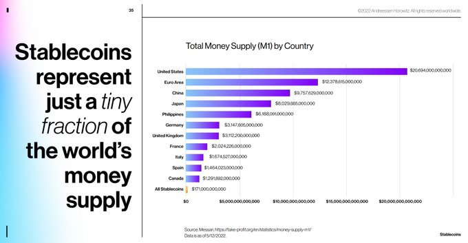

**این تصویر از تاریخ ۱۲ مه نشان می‌دهد که مشکل حفظ ارزش (peg) در استیبل‌کوین‌ها بسیار شایع است.**

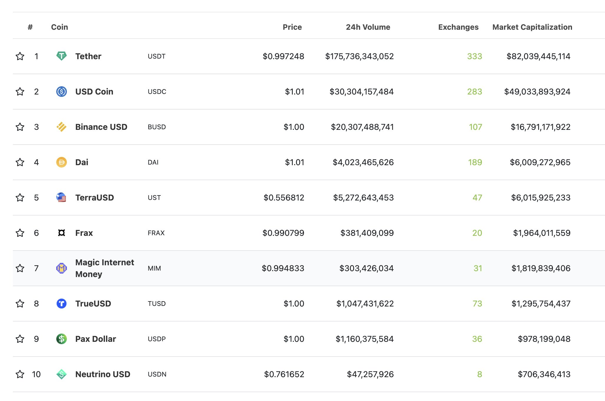
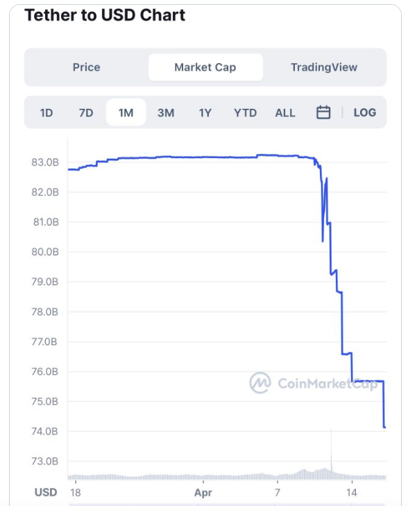

## عکس فوری از سقوط UST
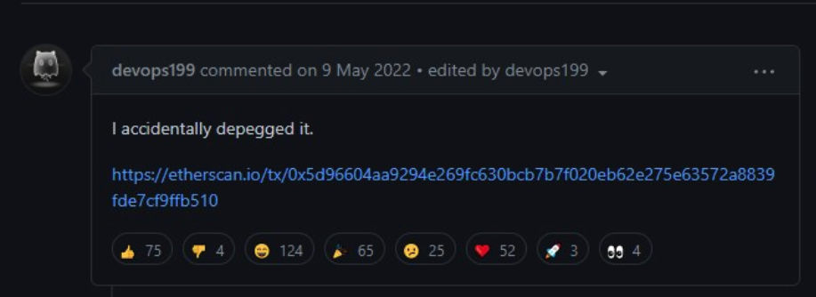

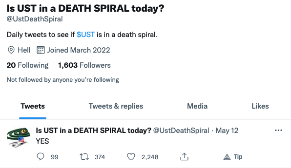
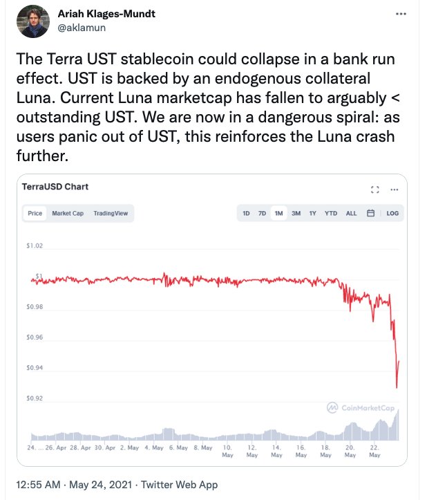
از مقاله Decrypt: لونا (LUNA) که قبلاً یکی از ۱۰ ارز برتر از نظر ارزش بازار بود، ۱۰۰٪ سقوط کرد و به کسری از یک سنت رسید، و UST که باید قیمت آن روی ۱ دلار می‌ماند، به ۰.۱۳ دلار سقوط کرد.

### پیش از سقوط
- ۱۸ آوریل: UST از Binance USD پیشی گرفت و به سومین استیبل‌کوین بزرگ از نظر ارزش بازار تبدیل شد.
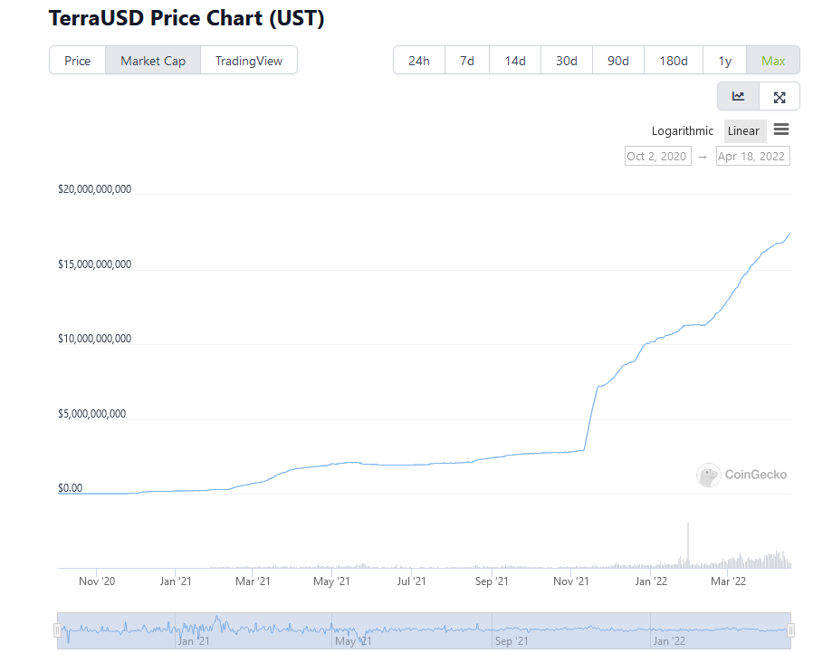
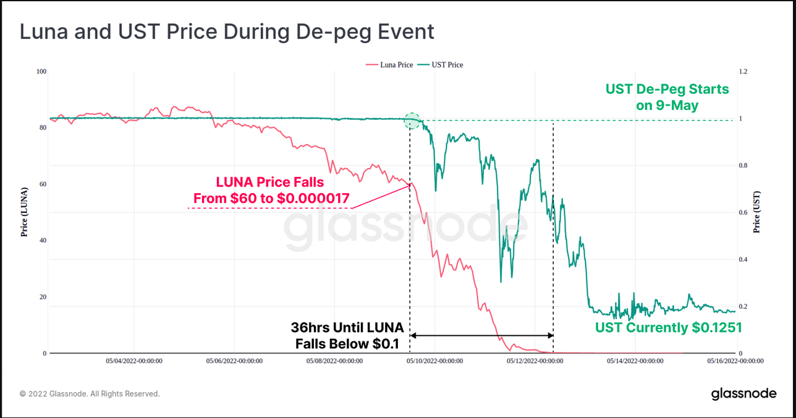

## پیش‌زمینه
UST یک استیبل‌کوین کاملاً الگوریتمی بود که قصد داشت از طریق مکانیزم ضرب-بازخرید ۱:۱ با لونا (LUNA) قیمت خود را حفظ کند:

- **ضرب UST**: سوزاندن لونا (۱ دلار لونا = ۱ UST)
- **بازخرید UST**: ضرب لونا (۱ UST = ۱ دلار لونا)

### مکانیزم نگه‌داشتن قیمت (Peg)
- وقتی UST > ۱ دلار: سوزاندن لونا → ضرب UST → افزایش عرضه UST → کاهش قیمت
- وقتی UST < ۱ دلار: سوزاندن UST → ضرب لونا → کاهش عرضه UST → افزایش قیمت

## پروتکل Anchor
- ۷ مه: TVL برابر ۱۶.۷ میلیارد دلار
- ارائه‌ی سود ۱۹.۴۶٪ سالانه برای سپرده‌گذاری UST
- بیش از ۷۲٪ از کل UST در Anchor سپرده‌گذاری شده بود

از نوامبر تا آوریل:
- ارزش بازار UST: از ۲.۷۳ میلیارد → به ۱۷.۸ میلیارد دلار
- قیمت لونا: ~۵۰ دلار → دو برابر شد

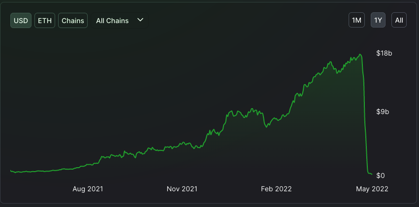

### سیاست نرخ بهره
- اگر تعداد وام‌دهندگان از وام‌گیرندگان بیشتر باشد، نرخ بهره هر ماه ۱.۵٪ کاهش می‌یابد
- ۶ تا ۸ مه: دارایی در Anchor از ۱۴ میلیارد → به ۱۱.۷ میلیارد دلار کاهش یافت (خروج UST)

## گزینه‌های خروج از UST
### ۱. سوزاندن و ضرب
- تبدیل ۱ UST به ۱ دلار لونا → سوزاندن UST
- آربیتراژ زمانی که UST < ۱ دلار → سود از ضرب لونا

### ۲. استخر استیبل‌کوین در Curve Finance
- تبدیل UST به DAI/USDT/USDC در Curve
- معامله‌گران آربیتراژ با معاملات خود قیمت را به تعادل بازمی‌گردانند

## پیامدهای دنیای واقعی
### اثرات جانبی سوزاندن و ضرب
- ضرب بیشتر لونا عرضه را رقیق می‌کند
- با سقوط قیمت لونا، برای بازخرید ۱ دلار به توکن‌های بیشتری نیاز است → ابرتورم

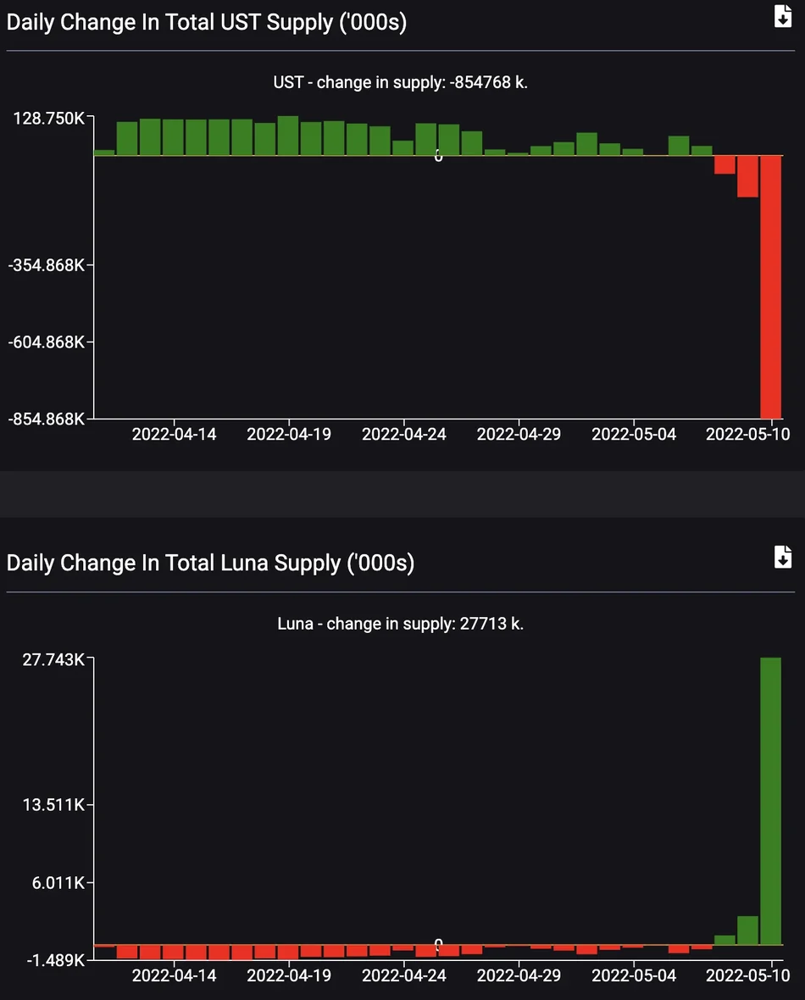

---


# فروپاشی UST با استفاده از Curve

## چه اتفاقی افتاد؟

UST (TerraUSD)، یک استیبل‌کوین الگوریتمی، در یک استخر **Curve Finance** با DAI، USDT و USDC جفت شده بود که با نام **UST + 3Crv pool** شناخته می‌شد.

---

## اولین جدا شدن از قیمت ثابت (Depeg)

- در آخر هفته، UST حدود **۰.۰۲ دلار** از قیمت ثابت خود جدا شد.
- کاربران با ترک پروتکل Anchor، به سرعت **UST را با استیبل‌کوین‌هایی مانند USDT و USDC** در Curve معاوضه کردند.
- این معاملات باعث **برهم خوردن تعادل استخر** شد و استخر پر از **UST بیش از حد** شد.

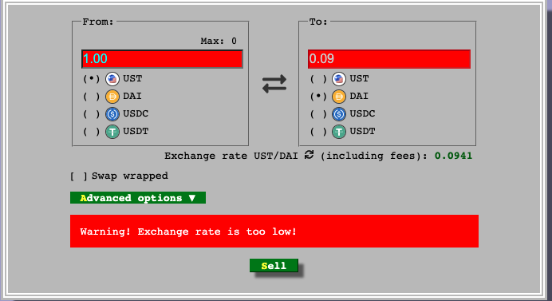

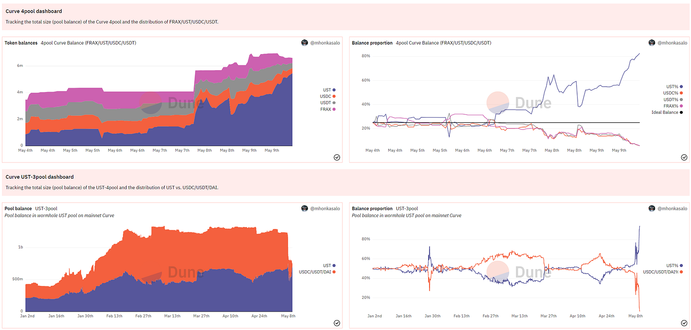

---

## عملکرد Curve چگونه است؟

- Curve تعادل را تشویق می‌کند.
- اگر یک دارایی (مثل UST) استخر را پر کند، Curve آن را **با تخفیف** ارائه می‌دهد تا **آربیتراژکننده‌ها** آن را بخرند و استخر را متعادل کنند.
- **اما هیچ‌کس UST نمی‌خواست**، حتی با تخفیف — جذابیت Anchor از بین رفته بود.

---

## فروش بزرگ نهنگ و آغاز مارپیچ

- یک نهنگ **۸۵ میلیون UST را با ۸۴.۵ میلیون USDC** تعویض کرد.
- این فشار بیشتری بر حفظ قیمت UST وارد کرد.
- Curve تخفیف‌های بیشتری ارائه داد، اما **هیچ آربیتراژکننده‌ای وارد نشد**.
- تا روز سه‌شنبه، UST به **۰.۳۲ دلار** سقوط کرد.
- قیمت LUNA از **۶۴ دلار به کمتر از ۳۰ دلار** رسید.

---

## فعال شدن مارپیچ مرگ

- وقتی ارزش بازار UST به LUNA نزدیک شد، سیستم در آستانه فروپاشی قرار گرفت.
- **Luna Foundation Guard (LFG)** مداخله کرد:
  - **۲۱۶ میلیون دلار استیبل‌کوین** از Jump Crypto به Curve تزریق کرد.
  - تلاش کرد ذخایر **BTC** را به بازارگردان‌ها بدهد تا قیمت UST را حفظ کند.
- UST به طور موقت به **۰.۹۳ دلار** برگشت، اما **نقدینگی به سرعت تمام شد**.

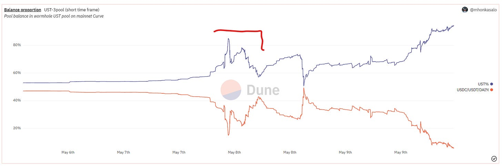

---

## فاز دوم فروپاشی

- معاملات مداوم حدود **۳۰۰ هزار دلاری** دوباره نقدینگی را تخلیه کردند.
- دارندگان LUNA شروع به فروش کردند و وحشت گسترش یافت.
- عرضه LUNA منفجر شد:
  - ۸ می: **۳۴۳ میلیون**
  - ۱۲ می: **۳۲.۳ میلیارد**

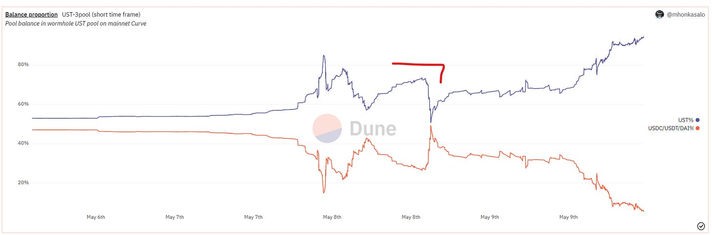

---

## اقدامات نهایی ناامیدانه

- جامعه Terra تلاش کرد با اقدامات اضطراری وضعیت را کنترل کند:
  1. **سوزاندن UST**
  2. **جلوگیری از تولید بیشتر LUNA**
- خیلی دیر شده بود.
- در نهایت بلاک‌چین برای جلوگیری از حملات حاکمیتی **متوقف شد**.

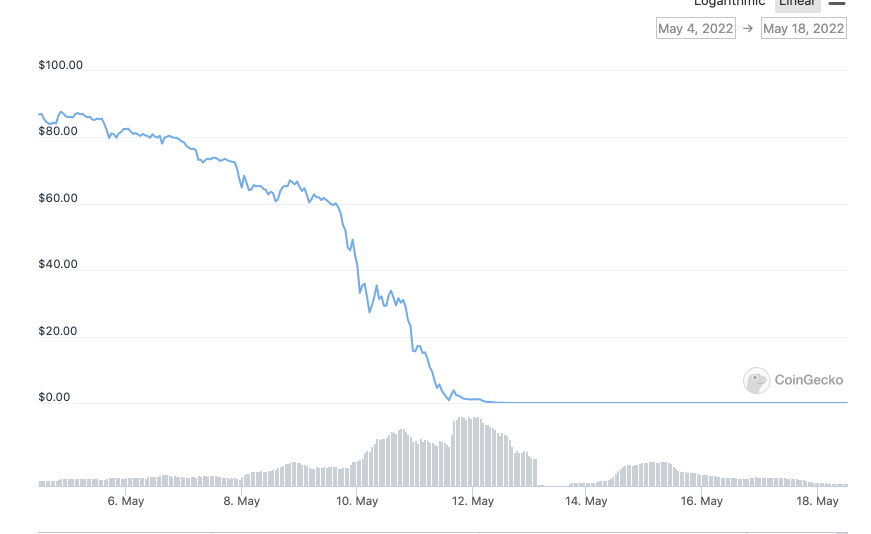

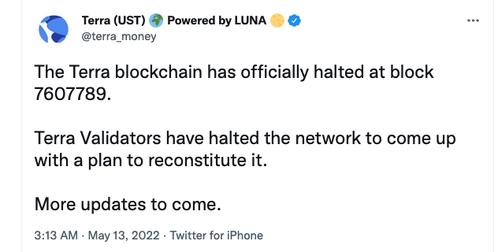

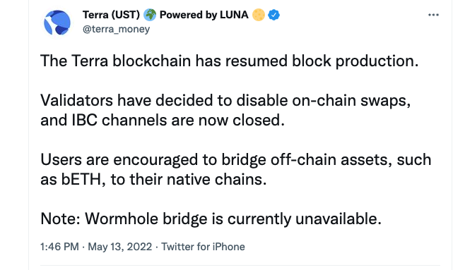

---

## پیامدها

- بیش از **۲۰۰ میلیارد دلار** ارزش رمزارزها در **۲۴ ساعت** از بین رفت.
- این رویداد به یکی از **فاجعه‌بارترین سقوط‌ها در دنیای رمزارزها** تبدیل شد.

---

## درس‌های کلیدی

- **استیبل‌کوین‌های الگوریتمی** به **از دست رفتن اعتماد** بسیار حساس هستند.
- **مکانیسم Curve** کار می‌کند — **اگر تقاضای بازار وجود داشته باشد**.
- بدون اعتماد، **هیچ فرصت آربیتراژی امن نیست**.
- نقدینگی به تنهایی نمی‌تواند **قیمت از دست رفته را حفظ کند**.

---

# پیش‌زمینه قابلیت ارتقا (Upgradability)

## چرا قابلیت ارتقا اهمیت دارد؟

مزیت بزرگ قراردادهای هوشمند این است که **تغییرناپذیر هستند** — هیچ‌کس نمی‌تواند آن‌ها را پس از استقرار تغییر دهد یا هک کند.

عیب بزرگ قراردادهای هوشمند نیز این است که **تغییرناپذیر هستند** — شما نمی‌توانید آن‌ها را پس از استقرار اصلاح کنید.

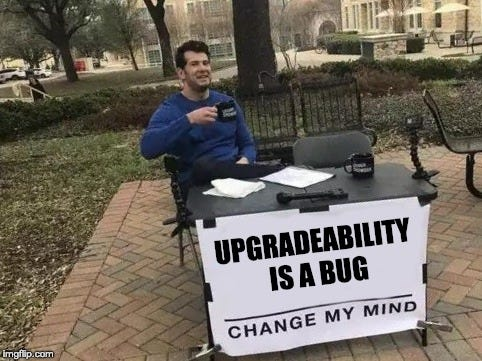

---

## مشکلاتی که باید حل شوند

- چگونه **عملکرد قرارداد را تغییر دهیم**؟
- چگونه **داده‌ها را در صورت نیاز مهاجرت دهیم**؟

ما به بررسی الگوهایی می‌پردازیم که برای امکان ارتقا به کار می‌روند. نمونه‌ها از منابع مختلف هستند و در محیط‌های **Truffle** یا **Hardhat** کاربرد دارند.

---

## مقدمه‌ای بر پیام‌ها (Message Calls)

قراردادها می‌توانند از طریق **پیام** یکدیگر را فراخوانی کنند.

- یک پیام شامل موارد زیر است:
  - منبع: این قرارداد
  - هدف: قرارداد دیگر
  - داده‌ها
  - اتر (اختیاری)
  - گاز
  - داده بازگشتی

قرارداد هدف در یک **زمینه جدید** با **ذخیره‌سازی جداگانه** اجرا می‌شود.

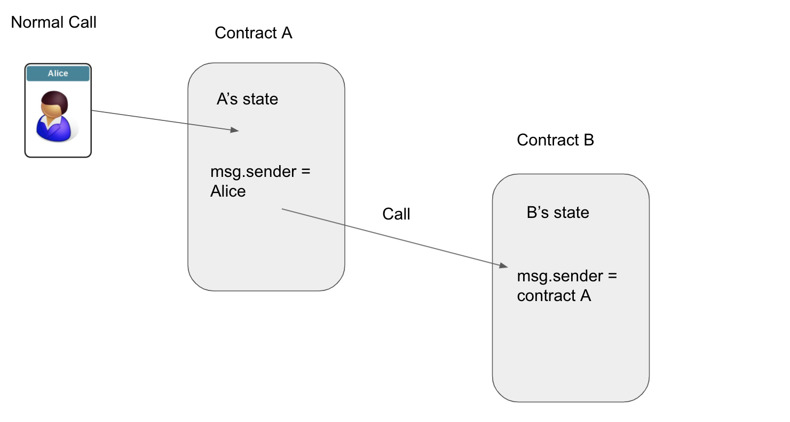

---

## Delegate Call

نوع خاصی از تماس پیام وجود دارد: `delegatecall`

- `delegatecall` **کد قرارداد دیگر** را اجرا می‌کند، اما:
  - **ذخیره‌سازی، فرستنده و مقدار** از قرارداد فراخوانی‌کننده استفاده می‌شود.
  - **زمینه اجرایی جدید نیست** — از ذخیره‌سازی فراخوانی‌کننده استفاده می‌کند.

این پایه‌ی اصلی الگوهای **پراکسی** است.

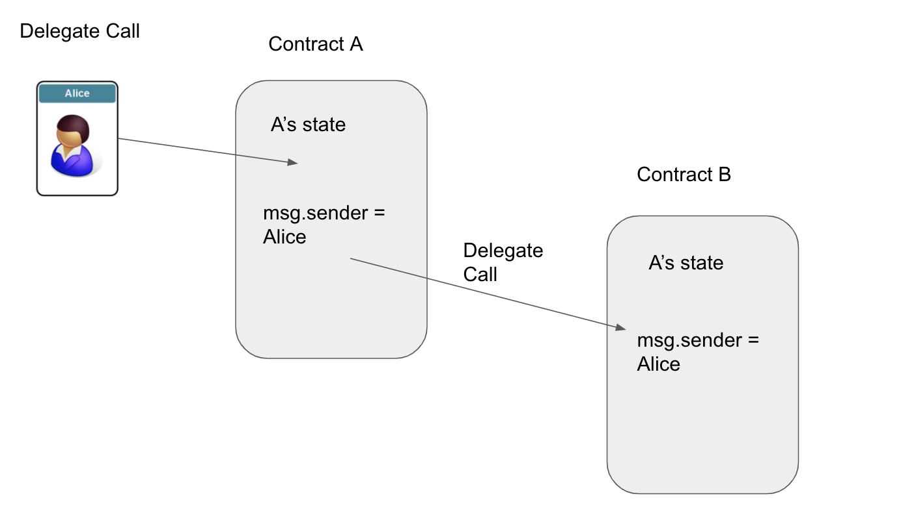

---

## الگوهای پراکسی (Proxy Patterns)

ببینید: [EIP-897](https://eips.ethereum.org/EIPS/eip-897)

یک قرارداد **پراکسی** تماس‌ها را به یک قرارداد **پیاده‌سازی** هدایت می‌کند.

- کاربران فقط با قرارداد **پراکسی** تعامل دارند.
- پراکسی می‌تواند منطق را به پیاده‌سازی منتقل کند.
- پیاده‌سازی می‌تواند برای ارتقا **جایگزین شود**.
- چند پراکسی می‌توانند از یک پیاده‌سازی مشترک استفاده کنند. (ببینید: [EIP-1167](https://eips.ethereum.org/EIPS/eip-1167))

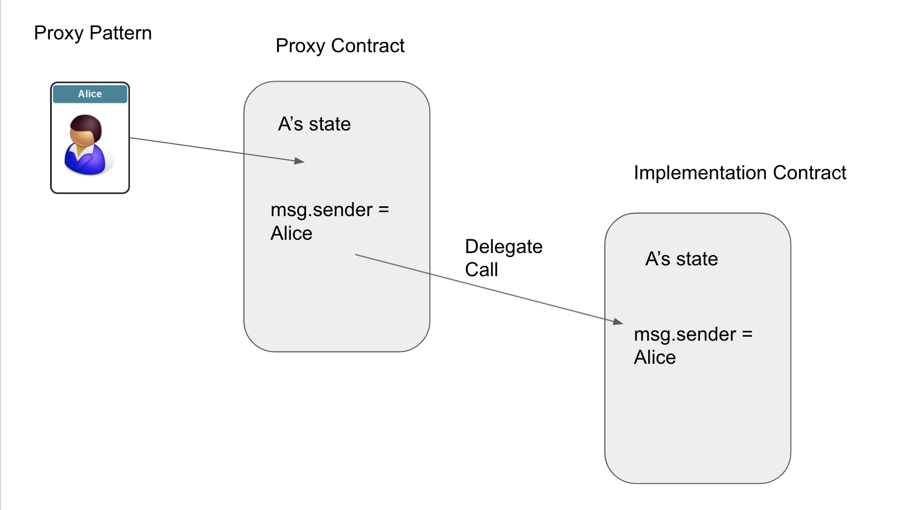

---

## کتابخانه Clones از OpenZeppelin

ما می‌توانیم قراردادها را با استفاده از کتابخانه Clones از OpenZeppelin **ارزان و سبک‌وزن کپی کنیم**.

این روش زمانی مفید است که بخواهیم پراکسی‌های سبک متعددی را که به یک پیاده‌سازی اشاره می‌کنند، مستقر کنیم.

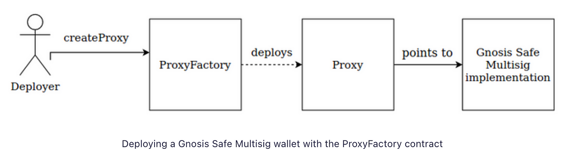

## خلاصه

| مفهوم           | توضیحات                                                       |
|----------------|----------------------------------------------------------------|
| تغییرناپذیری    | قراردادهای هوشمند پس از استقرار قابل تغییر نیستند.            |
| تماس پیام       | تماس عادی بین قراردادها با ذخیره‌سازی جداگانه.                |
| Delegate Call  | اجرای کد قرارداد دیگر با استفاده از ذخیره‌سازی قرارداد فراخوانی‌کننده. |
| الگوی پراکسی    | پراکسی تماس‌ها را هدایت می‌کند؛ اجازه ارتقا می‌دهد.           |
| Clones         | پراکسی‌های سبک برای استقرارهای کارآمد.                        |

---

# روش‌های ارتقاپذیری

## ارتقا دادن یک ضدالگو است - این کار را نکنید

برای این دیدگاه استدلال وجود دارد؛ این دیدگاه تمرکز بر **غیرمتمرکزسازی** دارد. ببینید: [Upgradability is a bug](https://mirror.xyz/trustlessness.eth/fXGZVbmYbBQC9UbS77Y9AbAe3j6fC6GVFEfV4fMJsew)

قراردادهای هوشمند ارزشمند هستند چون بدون نیاز به اعتماد کار می‌کنند.  
تغییرناپذیری ویژگی حیاتی برای تحقق این بی‌اعتمادی است.  
ارتقاپذیری، این تغییرناپذیری را زیر سؤال می‌برد.  
بنابراین، **ارتقاپذیری یک باگ است**.

> از مقاله:
>
> "ما به شدت استفاده از این الگوها برای قراردادهای ارتقاپذیر را توصیه نمی‌کنیم.  
> هر دو روش پتانسیل خطا دارند، پیچیدگی را زیاد کرده و باگ‌هایی معرفی می‌کنند،  
> و در نهایت اعتماد به قرارداد را کاهش می‌دهند.  
> تلاش کنید قراردادهایی ساده، تغییرناپذیر و امن بسازید."

ممکن است کافی باشد که **قرارداد خود را پارامترگذاری کنید** و به‌جای ارتقا، فقط آن پارامترها را تنظیم کنید.  
برای مثال:
- نرخ پایداری در MakerDAO
- نرخ پاداش فارمینگ که می‌تواند توسط مدیر (یا DAO یا مکانیزم حاکمیتی) تنظیم شود

---

## مهاجرت دستی داده‌ها

قرارداد نسخه V2 خود را مستقر کنید و **داده‌های موجود را به صورت دستی مهاجرت دهید**.

### مزایا

- از نظر مفهومی ساده است.
- بدون نیاز به کتابخانه.

### معایب

- در عمل ممکن است سخت و پرهزینه (از نظر گاز و زمان) باشد.
- اگر داده زیاد باشد، ممکن است به محدودیت گاز برخورد کند.

**مثال:**

~~~~solidity
contract V1 {
    mapping(address => uint256) public balances;

    function store(uint256 amount) public {
        balances[msg.sender] = amount;
    }
}

contract V2 {
    mapping(address => uint256) public balances;

    function store(uint256 amount) public {
        balances[msg.sender] = amount;
    }

    function migrateFromV1(address user, address oldContract) public {
        uint256 oldBalance = V1(oldContract).balances(user);
        balances[user] = oldBalance;
    }
}
~~~~

---

## استفاده از قرارداد ثبت (Registry)

یک **رجیستری** (مشابه ENS) آدرس آخرین نسخه قرارداد را نگه می‌دارد.  
برنامه‌های غیرمتمرکز باید این رجیستری را بخوانند تا آدرس صحیح را دریافت کنند.

### مزایا

- پیاده‌سازی ساده.

### معایب

- به کد برنامه اعتماد می‌شود تا قرارداد درست را انتخاب کند.
- به توسعه‌دهندگان برای جایگزین نکردن قرارداد با نسخه بد اعتماد می‌شود.

> "در نظر داشته باشید که کاربران قرارداد شما به شما اعتماد ندارند، به همین دلیل است که قرارداد هوشمند نوشته‌اید."

- این روش **مشکل مهاجرت داده‌ها** را حل نمی‌کند.

**مثال:**

~~~~solidity
contract Registry {
    address public latest;

    function update(address _new) public {
        latest = _new;
    }

    function getLatest() external view returns (address) {
        return latest;
    }
}
~~~~

~~~~solidity
contract MyContractV1 {
    function doSomething() public pure returns (string memory) {
        return "V1";
    }
}

contract MyContractV2 {
    function doSomething() public pure returns (string memory) {
        return "V2";
    }
}
~~~~

در رابط کاربری:

~~~~javascript
const registry = new ethers.Contract(registryAddress, registryAbi, provider);
const latestAddress = await registry.getLatest();
const contract = new ethers.Contract(latestAddress, myContractAbi, signer);
~~~~

---

# انتخاب تابع در زمان اجرا در قراردادها یا کتابخانه‌های دیگر

این روش به سمت الگوهای پراکسی و الگوی الماسی (Diamond pattern) می‌رود.  
در اصل، این **الگوی استراتژی** است. Compound از این رویکرد برای مدل نرخ بهره استفاده می‌کند.  
یک نسخه از این روش استفاده از **ماژول‌های قابل افزوده** است، مانند Gnosis Safe.  
روش ماژولی افزایشی است — اگر در کد اصلی باگی باشد، این روش آن را اصلاح نمی‌کند.

---
# استفاده از قراردادهای پراکسی برای ارتقاء

## فرآیند ارتقاء

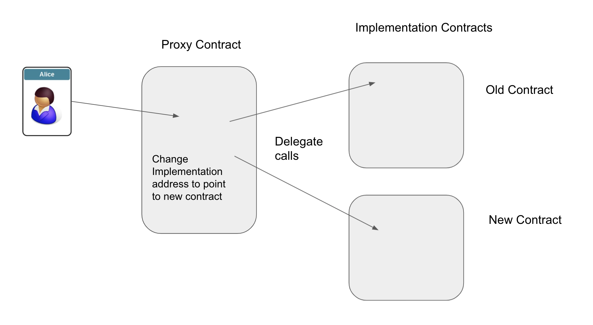

~~~~solidity
contract AdminUpgradeableProxy {
    address implementation;
    address admin;

    fallback() external payable {
        // delegate here
    }

    function upgrade(address newImplementation) external {
        require(msg.sender == admin);
        implementation = newImplementation;
    }
}
~~~~

این می‌تواند دارای آسیب‌پذیری‌هایی باشد. در عوض می‌توان از **قرارداد پراکسی شفاف** استفاده کرد:

~~~~solidity
contract TransparentAdminUpgradeableProxy {
    address implementation;
    address admin;

    fallback() external payable {
        require(msg.sender != admin);
        // delegate here
    }

    function upgrade(address newImplementation) external {
        if (msg.sender != admin) fallback();
        implementation = newImplementation;
    }
}
~~~~

این الگو به طور گسترده‌ای استفاده می‌شود، اما هزینه‌ای دارد چون نیاز به جستجوی اضافی برای آدرس implementation و admin دارد.

---

# استاندارد جهانی پراکسی‌های قابل ارتقاء (UUPS)

جایگزینی ارزان‌تر و جدیدتر **پراکسی UUPS** است.  
در این الگو، منطق ارتقاء در خود قرارداد پیاده‌سازی قرار می‌گیرد.

~~~~solidity
contract UUPSProxy {
    address implementation;

    fallback() external payable {
        // delegate here
    }
}
~~~~

~~~~solidity
abstract contract UUPSProxiable {
    address implementation;
    address admin;

    function upgrade(address newImplementation) external {
        require(msg.sender == admin);
        implementation = newImplementation;
    }
}
~~~~

---

## مقایسه هزینه

---

# بازنویسی داده‌ها

### آیا احتمال بازنویسی داده‌ها در قرارداد پراکسی به‌صورت ناخواسته وجود دارد؟

---

## چیدمان متغیرها در فضای ذخیره‌سازی

از مستندات Solidity:

> متغیرهای حالت قراردادها به صورت فشرده در storage ذخیره می‌شوند، به طوری که گاهی چند مقدار از یک slot استفاده می‌کنند.  
> به جز آرایه‌های پویا و mapping‌ها، داده‌ها به صورت پیوسته یکی پس از دیگری ذخیره می‌شوند و از slot شماره 0 شروع می‌شوند.  
> برای هر متغیر، اندازه‌ای بر حسب بایت بر اساس نوع آن تعیین می‌شود.

---

## Mappingها و آرایه‌های پویا

به دلیل اندازه غیرقابل پیش‌بینی، mapping‌ها و آرایه‌های پویا نمی‌توانند "بین" متغیرهای حالت قبلی و بعدی ذخیره شوند.  
در عوض، فقط ۳۲ بایت را در نظر می‌گیرند و عناصرشان در یک slot متفاوت که با استفاده از هش **Keccak-256** محاسبه می‌شود، ذخیره می‌شوند.

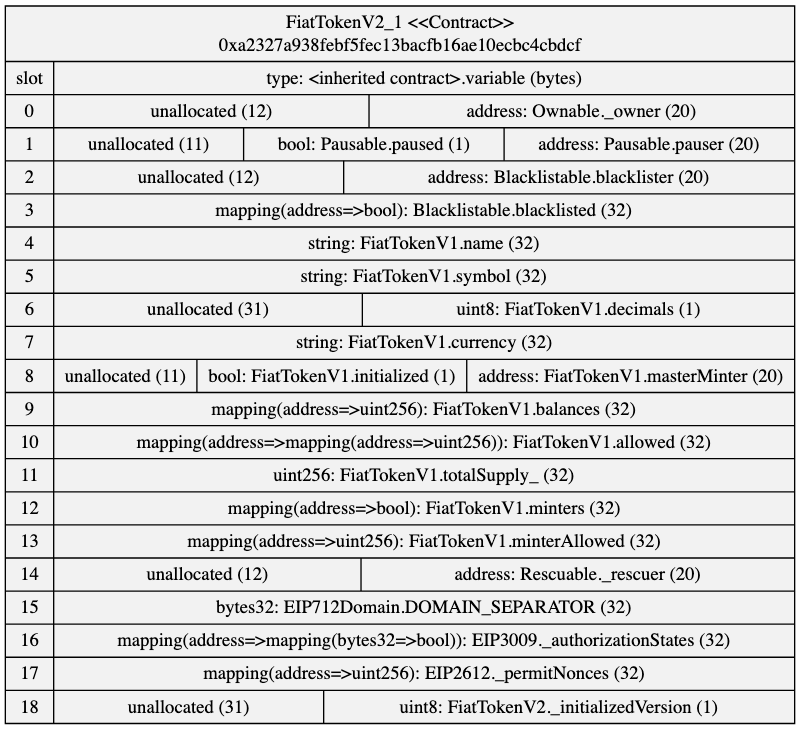

---

## مثال مشکل

اگر پراکسی و پیاده‌سازی ما به این صورت باشند:

~~~~solidity
contract UUPSProxy {
    address implementation;

    fallback() external payable {
       // delegate here
    }
}
~~~~

~~~~solidity
abstract contract UUPSProxiable {
    uint256 counter;
    address implementation;
    address admin;

    function foo() public {
        counter++;
    }

    function upgrade(address newImplementation) external {
        require(msg.sender == admin);
        implementation = newImplementation;
    }
}
~~~~

اگر قرارداد پیاده‌سازی به slot مربوط به `counter` بنویسد، در واقع `implementation` را بازنویسی می‌کند.

---

# ذخیره‌سازی بدون ساختار (Unstructured Storage)

برای جلوگیری از این مشکل، از **ذخیره‌سازی بدون ساختار** استفاده می‌کنیم.  
OpenZeppelin آدرس implementation را در یک آدرس 'تصادفی' در storage قرار می‌دهد:

~~~~solidity
bytes32 private constant implementationPosition = bytes32(
    uint256(keccak256("eip1967.proxy.implementation")) - 1
);
~~~~

این مشکل متغیر `implementation` را حل می‌کند، اما برای **سایر مقادیر موجود در storage** چطور؟

---

## برخورد در فضای ذخیره‌سازی (Storage Collision)

فرض کنید نسخه‌های پیاده‌سازی ما به این صورت باشند:

| Implementation_v0       | Implementation_v1       |
|-------------------------|-------------------------|
| address owner           | address lastContributor |
| mapping balances        | address owner           |
| uint256 supply          | mapping balances        |
| ...                     | uint256 supply          |
| ...                     | ...                     |

در این صورت هنگام نوشتن در `lastContributor` برخورد ایجاد می‌شود.

---

## روش صحیح ارتقاء

روش صحیح این است که هنگام ارتقاء فقط **به انتهای storage اضافه کنیم**:

| Implementation_v0       | Implementation_v1       |
|-------------------------|-------------------------|
| address owner           | address owner           |
| mapping balances        | mapping balances        |
| uint256 supply          | uint256 supply          |
| ...                     | address lastContributor |
| ...                     | ...                     |

---

# سازنده در قرارداد پیاده‌سازی؟

برای قراردادهای قابل ارتقاء، به جای سازنده از **تابع مقداردهی اولیه (initializer)** استفاده می‌کنیم.

---

# ذخیره‌سازی ابدی (Eternal Storage)

یک جایگزین برای روش بالا این است که **نوع داده‌ها را جدا کرده و در mapping‌ها ذخیره کنیم**.

**کد نمونه، برای استفاده در تولید توصیه نمی‌شود!**

~~~~solidity
contract EternalStorage {
    mapping(bytes32 => uint256) internal uintStorage;
    mapping(bytes32 => string) internal stringStorage;
    mapping(bytes32 => address) internal addressStorage;
    mapping(bytes32 => bytes) internal bytesStorage;
    mapping(bytes32 => bool) internal boolStorage;
    mapping(bytes32 => int256) internal intStorage;
}

contract Box is EternalStorage {
    function setValue(uint256 newValue) public {
        uintStorage["value"] = newValue;
    }
}
~~~~

این روش فقط برای تکمیل ارائه شده ولی **توصیه نمی‌شود**.

---

# استفاده از پلاگین UUPS

## عملکرد پلاگین‌ها

هر دو پلاگین توابع اصلی `deployProxy` و `upgradeProxy` را فراهم می‌کنند که فرآیند استقرار قراردادهای قابل ارتقاء را مدیریت می‌کنند.

### `deployProxy` کارهای زیر را انجام می‌دهد:

- بررسی ایمنی ارتقاء در پیاده‌سازی
- استقرار یک proxy admin برای پروژه
- استقرار قرارداد پیاده‌سازی
- ایجاد و مقداردهی اولیه قرارداد پراکسی

### `upgradeProxy` کارهای زیر را انجام می‌دهد:

- بررسی ایمنی ارتقاء و سازگاری با نسخه قبلی
- بررسی وجود پیاده‌سازی با bytecode مشابه و در غیر این صورت استقرار آن
- ارتقاء پراکسی برای استفاده از نسخه جدید پیاده‌سازی

---

## نوشتن قرارداد شما

نیاز دارید که یک تابع مقداردهی اولیه بنویسید و فقط یک بار فراخوانی شود. OpenZeppelin یک قرارداد پایه برای این کار فراهم کرده که کافیست از آن ارث‌بری کنید.

~~~~solidity
// contracts/MyContract.sol
// SPDX-License-Identifier: MIT
pragma solidity ^0.6.0;

import "@openzeppelin/contracts-upgradeable/proxy/utils/Initializable.sol";

contract MyContract is Initializable, UUPSUpgradeable {
    uint256 public x;

    function initialize(uint256 _x) public initializer {
        x = _x;
    }
}
~~~~

از آنجا که این تابع سازنده نیست، سازنده‌های قراردادهای پدر فراخوانی نخواهند شد—باید این کار را به صورت دستی انجام دهید.

این مورد برای مقادیر اولیه متغیرها نیز صادق است (اما `constant` مشکلی ندارد)، مثلاً:

~~~~solidity
contract MyContract {
    uint256 public hasInitialValue = 42; 
    // معادل مقداردهی اولیه در سازنده
}
~~~~

اگر از کتابخانه‌های استاندارد OpenZeppelin استفاده می‌کنید، باید نسخه‌های قابل ارتقاء آن‌ها را جایگزین نمایید. توصیه می‌شود نسخه جدید قرارداد پیاده‌سازی از نسخه قبلی ارث‌بری کند.

---

## استفاده از پلاگین‌ها برای استقرار و ارتقاء

### Hardhat

~~~~js
// در پیکربندی Hardhat
require('@openzeppelin/hardhat-upgrades');
~~~~

~~~~js
// scripts/create-box.js
const { ethers, upgrades } = require("hardhat");

async function main() {
  const Box = await ethers.getContractFactory("Box");
  const box = await upgrades.deployProxy(Box, [42]);
  await box.deployed();
  console.log("Box deployed to:", box.address);
}

main();
~~~~

تابع `deployProxy` دارای گزینه‌های مختلفی است:

~~~~ts
async function deployProxy(
  Contract: ContractClass,
  args: unknown[] = [],
  opts: {
    deployer: Deployer,
    initializer: string | false,
    unsafeAllow: ValidationError[],
    kind: 'uups' | 'transparent',
  } = {},
): Promise<ContractInstance>
~~~~

---

## انجام ارتقاء

به مستندات مراجعه کنید:

~~~~js
const { upgradeProxy } = require('@openzeppelin/truffle-upgrades');

const Box = artifacts.require('Box');
const BoxV2 = artifacts.require('BoxV2');

module.exports = async function (deployer) {
  const existing = await Box.deployed();
  const instance = await upgradeProxy(existing.address, BoxV2, { kind: 'uups' });
  console.log("Upgraded", instance.address);
};
~~~~

---

## تست فرآیند ارتقاء

می‌توانید فرآیند ارتقاء را به عنوان یک تست واحد بنویسید.

~~~~js
const { deployProxy, upgradeProxy } = require('@openzeppelin/truffle-upgrades');

const Box = artifacts.require('Box');
const BoxV2 = artifacts.require('BoxV2');

describe('upgrades', () => {
  it('works', async () => {
    const box = await deployProxy(Box, [42], { kind: 'uups' });
    const box2 = await upgradeProxy(box.address, BoxV2);

    const value = await box2.value();
    assert.equal(value.toString(), '42');
  });
});
~~~~

---

## توابع دیگر

### `prepareUpgrade`

برای بررسی ایمنی ارتقاء قراردادها و استقرار پیاده‌سازی جدید استفاده می‌شود.

### `admin.changeAdminForProxy`

برای تغییر مدیر قرارداد پراکسی استفاده می‌شود.

---

## ملاحظات امنیتی

- حتماً قرارداد خود را مقداردهی اولیه کنید.
- از استفاده از `selfdestruct` یا `delegatecall` در قراردادهای پیاده‌سازی خودداری کنید.

---

## پشتیبانی Foundry

مقاله مفیدی از Rare Skills وجود دارد. به مخزن مراجعه کنید.

پلاگین می‌تواند الگوهای UUPS، Transparent، Beacon و همچنین Diamond را پشتیبانی کند.

### وارد کردن پلاگین

~~~~solidity
import { Upgrades } from "openzeppelin-foundry-upgrades/Upgrades.sol";
~~~~

### نصب کتابخانه‌های قابل ارتقاء OpenZeppelin

~~~~bash
forge install OpenZeppelin/openzeppelin-contracts-upgradeable --no-commit
forge install OpenZeppelin/openzeppelin-foundry-upgrades --no-commit
~~~~

---

## فرآیند کاری

### استقرار پراکسی UUPS

~~~~solidity
address proxy = Upgrades.deployUUPSProxy(
    "MyContract.sol",
    abi.encodeCall(MyContract.initialize, ("arguments for the initialize function"))
);
~~~~

پس از استقرار می‌توانید توابع قرارداد را به صورت عادی فراخوانی کنید:

~~~~solidity
MyContract instance = MyContract(proxy);
instance.myFunction();
~~~~

### ارتقاء قرارداد

~~~~solidity
Upgrades.upgradeProxy(
    transparentProxy,
    "MyContractV2.sol",
    abi.encodeCall(MyContractV2.foo, ("arguments for foo"))
);
~~~~

---

## الگوی الماس (Diamond Pattern)

### بر پایه EIP 2535

از Aavegotchi: https://docs.aavegotchi.com/overview/diamond-standard

الگوی الماس قراردادی است که از تابع fallback برای فراخوانی توابع در قراردادهای متعدد به نام facets استفاده می‌کند.

یک الماس:

- چهار تابع استاندارد (loupe) برای گزارش توابع و facets دارد.
- رویداد DiamondCut برای تمام ارتقاءها دارد.
- ارتقاء دقیق و جزئی را فراهم می‌کند.
- تنها یک آدرس اتریوم برای عملکردهای زیاد فراهم می‌کند.
- متغیرهای حالت را بین facets به اشتراک می‌گذارد.
- از محدودیت اندازه ۲۴KB قرارداد جلوگیری می‌کند.

Facets می‌توانند یک بار مستقر شده و توسط هر تعداد الماس استفاده شوند.

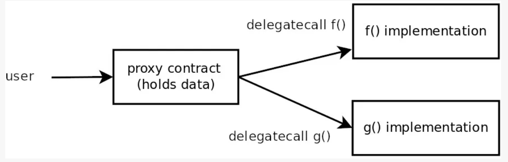

### مثال از گزارش Trail of Bits

~~~~solidity
bytes32 constant POSITION = keccak256("some_string");

struct MyStruct {
    uint var1;
    uint var2;
}

function get_struct() internal pure returns(MyStruct storage ds) {
    bytes32 position = POSITION;
    assembly { ds.slot := position }
}
~~~~

> پسوند `_slot` آدرس ذخیره‌سازی را مشخص می‌کند.

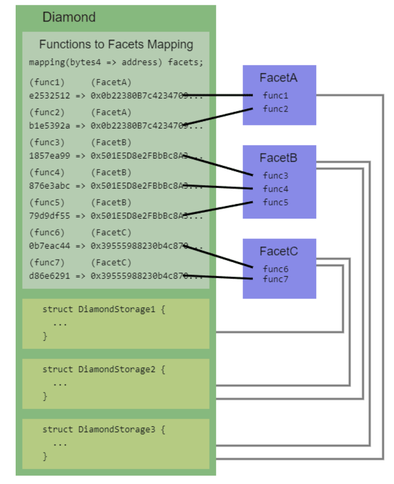

### گزارش Trail of Bits

- وبلاگ: https://blog.trailofbits.com/2020/10/30/good-idea-bad-design-how-the-diamond-standard-falls-short/
- نتیجه: «کد بیش از حد مهندسی شده، با پیچیدگی‌های غیرضروری، و در حال حاضر قابل توصیه نیست.»

### اما پروژه‌ها از آن استفاده می‌کنند

> «AavegotchiDiamond یک آدرس اتریوم برای عملکردهای Aavegotchi فراهم می‌کند.»

از مقاله Nick Mudge، الگوی الماس مشکلات زیر را حل می‌کند:

- محدودیت اندازه قرارداد.
- درهم‌ریختگی کد در سیستم‌های بزرگ.
- محدودیت‌های ارتقاء یکجا.
- سادگی یکپارچه‌سازی.

---

## سوال: این چه تفاوتی با استفاده از کتابخانه دارد؟

---

## قراردادهای متامورفیک

### `CREATE` و `CREATE2` و `selfdestruct`

#### `CREATE`

```text
keccak256(rlp.encode(deployingAddress, nonce))[12:]
```

#### `CREATE2`

معرفی‌شده در فوریه ۲۰۱۹:

```text
keccak256(0xff + deployingAddr + salt + keccak256(bytecode))[12:]
```

قراردادها می‌توانند با فراخوانی `selfdestruct` از بلاک‌چین حذف شوند.

`selfdestruct` تمام اتر باقیمانده در قرارداد را به آدرس مشخصی ارسال می‌کند.

از این می‌توان برای حفظ آدرس قرارداد در طول ارتقاء استفاده کرد، اما نه وضعیت آن.  
این روش متکی به `selfdestruct` و سپس استقرار مجدد از طریق `CREATE2` است.

برخی آن را "یک پدیده ناهنجار" می‌نامند.  
مراجعه شود به:

- [قراردادهای متامورفیک](https://fravoll.github.io/solidity-patterns/metamorphic/)
- [سوءاستفاده از CREATE2](https://hackmd.io/@gnidan/SyU2JjzO8)
- [ذخیره‌سازی کارآمد](https://medium.com/@rbkhmrcr/precompiles-soliditys-dark-magic-63d4fda0efeb)


</div>
